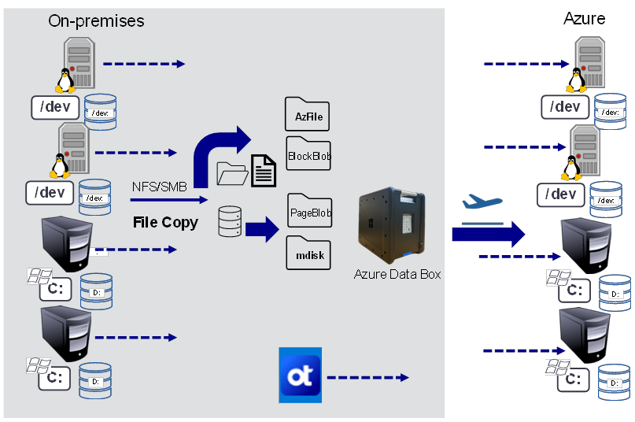
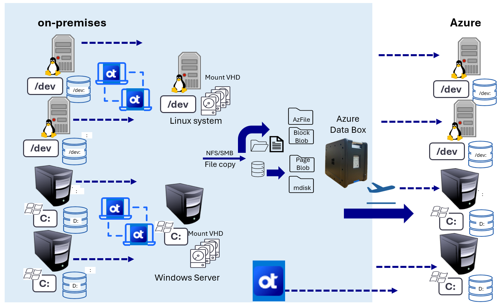

<!--
Initial score: 78 (1088/28)
Curremnt score: 98 (1141/1 false-positive)
-->

# Data migration simplified with OpenText and Azure Data Box

Bandwidth and throughput are often the largest constraint when migrating large amounts of data across networks. But by integrating OpenText Migrate and Availability with Azure Data Box, organizations can significantly reduce the time it takes to onboard their data to Azure. Azure Data Box provides the power and flexibility of offline transfer, and OpenText's capabilities provide post-migration sync and delta updates.

OpenText Migrate and Availability utilize the powerful Double-Take real-time replication engine and provide host-based file transfer solutions. This feature enables the movement and synchronization of data from one system or host to another without the need to write to the blob or file endpoint directly.

**Key benefits:**

- **Efficient data transfer**: The combination of OpenText solutions and Azure Data Box addresses the challenge of bulk network data movement, ensuring a streamlined initial data seed into Azure.
- **Faster time to value**: By reducing the time required for data seeding, organizations can realize the benefits of Azure more quickly. This reduction equates to accelerated deployment and enhanced operational efficiency.
- **Cost-effective solutions**: OpenText Migrate and Availability minimize the time and costs associated with traditional data seeding methods, making it a financially savvy choice for businesses.
- **Enhanced security**: Both OpenText Migrate and Availability include robust encryption protocols to secure data in transit, ensuring compliance and safeguarding sensitive information.
- **Optimized performance**: The integration of transmission level compression further enhances performance, allowing for faster data transfer without compromising quality.

By choosing OpenText Migrate and Availability powered by Double-Take and Azure Data Box, organizations can achieve a secure, efficient, and cost-effective data migration strategy that maximizes the potential of their Azure environment.

**Common scenarios**

Although every migration scenario has its own unique requirements, the following examples illustrate three common use cases in which OpenText and Azure Data Box are used in tandem.

## Hybrid universal offline seeding with OpenText Migrate

### Scenario details

This use case outlines a hybrid approach for offline data seeding to Azure using Data Box, followed by synchronization with OpenText Migrate for a seamless cutover. In this case, data stored on-premises in systems disks is transferred to virtual machine (VM) disks hosted in Azure.

### Solution flow overview

1. **Data seeding to Azure Data Box:** The process starts when you order one or more Data box devices based on your need. After it arrives on-premises, use one of the copy tools such as *azcopy*, *xcopy*, or *robocopy* to transfer your data from local servers, files, folders, and shares to the appropriate Data Box containers. When completed, ship the device to the Azure datacenter. The Data Box service imports all files and data to the appropriate storage account.
2. **Data transfer to Azure VM:** Use the same file copy tools to place the data into the designated locations within the Azure VM disks. This process ensures that the data structure remains intact and organized.
3. **Configuration of OpenText Migrate:** After the initial data copy is complete, a full server migration job is created, targeting the newly seeded Azure VM. The Double-Take Replication engine is activated to synchronize any new data from the source server to the Azure VM target.
4. **Efficient synchronization:** The replication engine minimizes data transfer by sending only the changes made since the initial data copy, significantly accelerating the cutover process.
5. **No downtime during replication:** Consistent data replication continues until the cutover is requested, allowing source applications to remain operational. Users can remain productive throughout the entire replication process, since there's no downtime until the cutover takes place.

### Considerations

- **Maintaining ACLs:** Extra care is needed to ensure that Access Control Lists (ACLs) on both files and folders are preserved during the copy process. Maintaining ACLs is crucial for ensuring that security and access permissions remain intact.
- **Protocol efficiency:** Utilizing Server Message Block (SMB) and Network File System (NFS) protocols can enhance copy speeds within the corporate network, making the data transfer process more speedy and efficient.
- **Handling exclusive locks:** Applications with exclusive locks (read-only) might impede local copying. To mitigate this obstacle, consider using open file manager tools or Volume Shadow Copy Service (VSS) writer logic.

### Benefits

- **Faster data transfer:** The use of local copy tools within the corporate network accelerates the initial seeding process.
- **Seamless transition:** The combination of offline seeding and real-time synchronization ensures a smooth cutover with minimal disruption.
- **Operational continuity:** Users remain online and productive, reducing any business operation interruptions during the migration process.

## Real-Time data seeding to Azure Data Box using OpenText Migrate

### Scenario details
This use case illustrates how organizations can utilize OpenText Migrate to seed the Azure Data Box directly with Virtual Hard Disks (VHDs), eliminating the need for traditional file copy tools. This approach enhances data capture and synchronization while simplifying the migration process.

### Solution flow overview

1. **Configure a shared target:** Deploy an  on-premises  Windows or Linux server to be used as a shared target for the VHDs. Define and mount a one-to-one VHD for each source workload, creating a dedicated landing zone for real-time data changes.
2. **Real-time data capture:** Utilize OpenText Migrate to continuously capture data changes from the source workload and write them directly to the mounted VHDs on the shared target.
3. **Seeding the Azure Data Box:** After the VHDs are populated with the latest data, they're ready to be transferred to an Azure Data Box device. Create an order for one or more Data box devices based on your need. After it arrives, configure them and copy the VHDs to the devices. This process ensures that the Azure Data Box receives a complete and up-to-date dataset, and is ready for deployment in Azure.
4. **Final synchronization:** After the Azure Data Box is sent to Azure data center, the VHDs are imported, Connect the VHDs to the necessary VMs. OpenText Migrate can be configured for the final synchronization to the Azure VM. The Double-Take Replication engine synchronizes any further changes, ensuring data consistency.

### Key Benefits

- **Elimination of complexity:** By using OpenText Migrate for seeding, there's no need for open file managers or VSS writers, simplifying the migration process.
- **Real-Time data capture:** This approach allows for real-time data capture, even when locked application files exist, ensuring that no data is missed during the migration.
- **Streamlined migration process:** Directly seeding the Azure Data Box with VHDs reduces the number of steps involved, making the overall migration more efficient.
- **Consistent data availability:** The use of VHDs ensures that data is consistently available and can be easily transferred to Azure, minimizing the risk of data loss.
- **Reduced Downtime:** Continuous synchronization means that source applications can remain operational throughout the migration process, reducing downtime and maintaining user productivity.

You can find more detailed information in the [Carbonite sheet](https://www.carbonite.com/resources/datasheet/carbonite-migrate/).

> [!NOTE]
> For complete, step by step guidance, refer to Commvault documentation or contact your OpenText representative.
