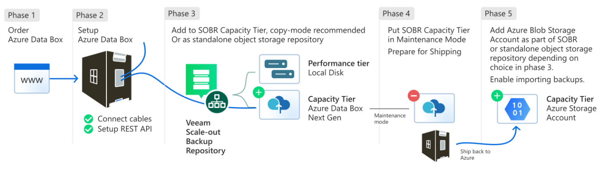

<!--
Initial score: 65 (404/20)
Curremnt score: 100 (448/0 false-positive)
-->

# Seed your data offline to Azure storage with Veeam and Azure Data Box next-gen

Although Azure Blob storage provides cost-effective data retention and recovery capabilities, neither product supports all features. Using Data Box and Veeam Backup and Replication solutions in tandem allows you to migrate on-premises backup and archive data in a reliable, secure, and timely manner. This article provides a high level overview of the steps required to migrate large amounts of data to Azure storage services using Azure Data Box and Veeam solutions.

You can find relevant, detailed, step-by-step instructions within the respective products' websites. You can learn more about using object storage with Veeam Products in the [Veeam product documentation](https://www.veeam.com/kb4241).

### Solution flow overview

1. Sign in to [Azure portal](https://portal.azure.com/) and order an appropriately sized Azure Data Box device. Step-by-step directions are available within the [Oder and Deploy a Data Box device](data-box-deploy-ordered.md) tutorial.

2. Configure the Data Box device as a Veeam Scale-out Backup Repository (SOBR) capacity tier.

    - After the device arrives, ensure that you connect the Azure Data Box to your on-premises network infrastructure. You can find detailed steps within the [Set up and deploy](data-box-deploy-set-up.md) article.

    - To allow Veeam Backup and Replication to communicate with Data Box, configure REST API access on the device. Instructions for completing this step can be found in the [setup REST API access](data-box-deploy-copy-data-via-rest.md) article.

    - Add the appliance to Veeam Backup and Replication. [Configure Azure Data Box as a Capacity Tier extent](https://helpcenter.veeam.com/docs/backup/hyperv/data_box_seeding.html) by following the steps in Veeam's article. Enable the `Copy backups to object storage as soon as they're created` option in your Scale-Out Backup Repository (SOBR). Take note that *Move mode* isn't recommended.

3. Back up your data to the Data Box appliance using the Veeam solution. The process relies on the Azure Blob REST API endpoint to write to the Data Box device.

4. After the backup data is copied to the device, you need to place the data box tier into maintenance mode within Veeam and prepare the device for shipping. For help with maintenance mode, see Veeam's [maintenance mode](https://helpcenter.veeam.com/docs/backup/hyperv/sobr_maintenance.html) documentation. Detailed information on shipping is available in the [shipping](https://helpcenter.veeam.com/docs/backup/hyperv/data_box_seeding.html) article.

5. After the device is shipped to the Azure datacenter, your data is imported into the storage account. Finally, add the destination Storage Account to Veeam Backup and Replication. Detailed instructions on data synchronization can be found in the [Data Box seeding](https://helpcenter.veeam.com/docs/backup/hyperv/data_box_seeding.html?ver=120) article.

You can learn about more solutions integration approaches with Veeam and Azure Blob storage in the [Azure Data Protection with Veeam](/azure/storage/solution-integration/validated-partners/backup-archive-disaster-recovery/veeam/veeam-solution-guide) solutions guide.

**More information:** [Veeam community blog](https://community.veeam.com/blogs-and-podcasts-57/seeding-data-with-veeam-and-azure-data-box-next-gen-10819).
