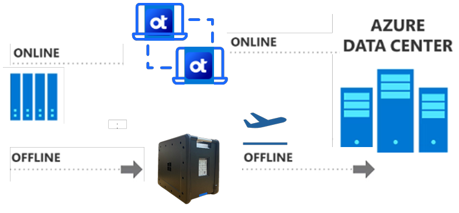
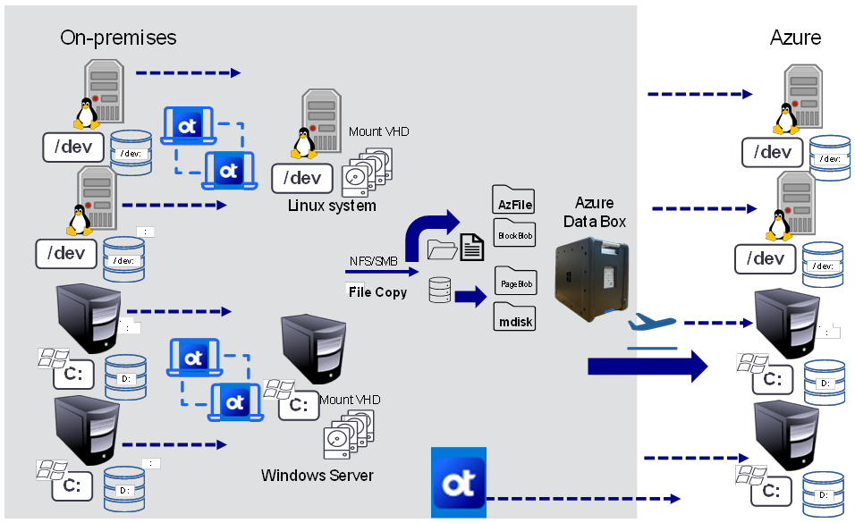

# Data migration simplified with OpenText and Azure Data Box

By integrating OpenText Migrate and Availability with Azure Data Box, organizations can significantly enhance their data onboarding process to Azure. While migrating a large data size and network is constrained, Data box provides the power and flexibility of offline transfer whereas OpenText brings the capability of post migration sync and delta updates. Both OpenText 

Migrate and Availability utilize the powerful Double-Take real-time replication engine and provides host-based file transfer solution. It lets you move data/sync data from one system or host to another one. It does not write to the blob, files end-point directly.

**Key Benefits:**

- **Efficient Data Transfer**: The combination of OpenText solutions and Azure Data Box addresses the challenge of bulk network data movement, ensuring a streamlined initial data seed into Azure.

- **Faster Time to Value**: By reducing the time required for data seeding, organizations can realize the benefits of Azure more quickly. This accelerates deployment and enhances operational efficiency.

- **Cost-Effective Solutions**: OpenText Migrate and Availability minimize the time and costs associated with traditional data seeding methods, making it a financially savvy choice for businesses.

- **Enhanced Security**: Both OpenText Migrate and Availability include robust encryption protocols to secure data in transit, ensuring compliance and safeguarding sensitive information.

- **Optimized Performance**: The integration of transmission level compression further enhances performance, allowing for faster data transfer without compromising quality.

By choosing OpenText Migrate and Availability powered by Double-Take and Azure Data Box, organizations can achieve a secure, efficient, and cost-effective data migration strategy that maximizes the potential of their Azure environment.

### Use Case 1: Hybrid Universal Offline Seeding with OpenText Migrate

#### Overview

This use case outlines a hybrid approach for offline data seeding to Azure using Data Box, followed by synchronization with OpenText Migrate for a seamless cutover. In this case data is transferred from one of the on-premises systems (stored in disks) to VM disks hosted in Azure.

#### Migration flow overview

1. **Data Seeding to Azure Data Box:** The process starts wherein you order one or more Data box devices based on your need. Once it arrives on-premises, you use one of the copy tools (e.g., azcopy, xcopy or robocopy) to transfer data from a local servers, files, folders, shares to the Azure Data Box appropriate containers. Once done, you ship the device to the Azure datacentre wherein the Data Box service imports all files and data to the appropriate storage account.

2. **Data Transfer to Azure VM:** You use same file copy tools to place the data into the designated location inside the Azure VM disks. This ensures that the data structure remains intact and organized.

3. **Configuration of OpenText Migrate:** After the initial data copy is complete, a full server migration job is created targeting the newly seeded Azure VM. The Double-Take Replication engine is then activated to synchronize any new data from the source server to the Azure target VM.

4. **Efficient Synchronization:** The replication engine minimizes data transfer by only sending changes made since the initial data copy, significantly speeding up the cutover process.  

5. **No Downtime During Replication:** Consistent data replication continues until the cutover is requested, allowing source applications to remain operational. Users can stay productive throughout the replication process, as there is no downtime until the actual cutover.

#### Considerations

- **Maintaining ACLs:** Extra care is needed to ensure that Access Control Lists (ACLs) on both files and folders are preserved during the copy process. This is crucial for maintaining security and access permissions.

- **Protocol Efficiency:** Utilizing SMB/NFS protocols can enhance copy speeds within the corporate network, making the data transfer process more efficient.

- **Handling Exclusive Locks:** Be aware that applications with exclusive locks (read-only) may impede local copying. To mitigate this, consider using open file manager tools or Volume Shadow Copy Service (VSS) writer logic.

#### Benefits of the Hybrid Approach:

- **Faster Data Transfer:** The use of local copy tools within the corporate network accelerates the initial seeding process.

- **Seamless Transition:** The combination of offline seeding and real-time synchronization ensures a smooth cutover with minimal disruption.

- **Operational Continuity:** Users remain online and productive, reducing the impact of migration on business operations.

### Use Case 2: Real-Time Data Seeding to Azure Data Box Using OpenText Migrate

**Overview:**
This usecase proposes leveraging OpenText Migrate to seed the Azure Data Box directly with Virtual Hard Disks (VHDs), eliminating the need for traditional file copy tools. This approach enhances data capture and synchronization while simplifying the migration process.

#### Migration flow overview:

1. **Setup of Shared Target:** Deploy a Windows or Linux server on-premises to act as a shared target for the VHDs. Define and mount a one-to-one VHD for each source workload, creating a dedicated landing zone for real-time data changes.

2. **Real-Time Data Capture:** Utilize OpenText Migrate to continuously capture data changes from the source workload and write them directly to the mounted VHDs on the shared target.

3. **Seeding the Azure Data Box:** Once the VHDs are populated with the latest data, they are ready to be transferred to the Azure Data Box. Create necessary order of one or more Data box devices based on your need. Once it arrives on-premises, you set them up and copy the VHDs to the data box. This process ensures that the Azure Data Box receives a complete and up-to-date dataset, ready for deployment in Azure.

4. **Final Synchronization:** After the Azure Data Box are sent to Azure data centre, the VHDs are imported, Connect the VHDs to the necessary VMs. OpenText Migrate can be configured for the final synchronization to the Azure VM. The Double-Take Replication engine will then synchronize any additional changes, ensuring data consistency.

#### Key Benefits

- **Elimination of Complexity:** By using OpenText Migrate for seeding, there is no need for open file managers or VSS writers, simplifying the migration process.

- **Real-Time Data Capture:** This approach allows for real-time data capture, even when applications have locked files, ensuring that no data is missed during the migration.

- **Streamlined Migration Process:** Directly seeding the Azure Data Box with VHDs reduces the number of steps involved, making the overall migration more efficient.

- **Consistent Data Availability:** The use of VHDs ensures that data is consistently available and can be easily transferred to Azure, minimizing the risk of data loss.

- **Reduced Downtime:** Continuous synchronization means that source applications can remain operational throughout the migration process, reducing downtime and maintaining user productivity.

 For further details and step by step implementation guide please contact your OpenText representative. You can find additional info [in this data sheet](https://www.carbonite.com/resources/datasheet/carbonite-migrate/).
