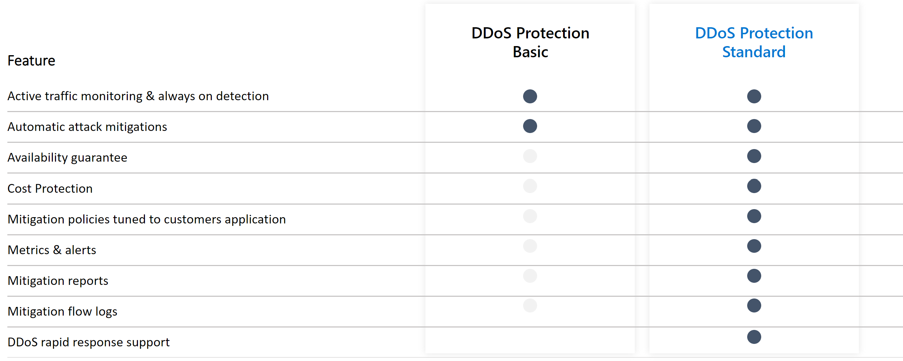

# Azure DDoS Protection Standard overview

Distributed denial of service (DDoS) attacks are some of the largest availability and security concerns facing customers that are moving their applications to the cloud. A DDoS attack attempts to exhaust an application's resources, making the application unavailable to legitimate users. DDoS attacks can be targeted at any endpoint that is publicly reachable through the internet.

Every property in Azure is protected by Azure's infrastructure DDoS (Basic) Protection at no additional cost. The scale and capacity of the globally deployed Azure network provides defense against common network-layer attacks through always-on traffic monitoring and real-time mitigation. DDoS Protection Basic requires no user configuration or application changes. DDoS Protection Basic helps protect all Azure services, including PaaS services like Azure DNS.

Azure DDoS Protection Standard, combined with application design best practices, provides enhanced DDoS mitigation features to defend against DDoS attacks. It is automatically tuned to help protect your specific Azure resources in a virtual network. Protection is simple to enable on any new or existing virtual network, and it requires no application or resource changes. It has several advantages over the basic service, including logging, alerting, and telemetry. 

Azure DDoS protection does not store customer data.

## Features

- **Native platform integration:** Natively integrated into Azure. Includes configuration through the Azure portal. DDoS Protection Standard understands your resources and resource configuration.
- **Turnkey protection:** Simplified configuration immediately protects all resources on a virtual network as soon as DDoS Protection Standard is enabled. No intervention or user definition is required. 
- **Always-on traffic monitoring:** Your application traffic patterns are monitored 24 hours a day, 7 days a week, looking for indicators of DDoS attacks. DDoS Protection Standard instantly and automatically mitigates the attack, once it is detected.
- **Adaptive tuning:** Intelligent traffic profiling learns your application's traffic over time, and selects and updates the profile that is the most suitable for your service. The profile adjusts as traffic changes over time.
- **Multi-Layered protection:** When deployed with a web application firewall (WAF), DDoS Protection Standard protects both at the network layer (Layer 3 and 4, offered by Azure DDoS Protection Standard) and at the application layer (Layer 7, offered by a WAF). WAF offerings include Azure [Application Gateway WAF SKU](../web-application-firewall/ag/ag-overview.md?toc=%2fazure%2fvirtual-network%2ftoc.json) as well as third-party web application firewall offerings available in the [Azure Marketplace](https://azuremarketplace.microsoft.com/marketplace/apps?page=1&search=web%20application%20firewall).
- **Extensive mitigation scale:** Over 60 different attack types can be mitigated, with global capacity, to protect against the largest known DDoS attacks.
- **Attack analytics:** Get detailed reports in five-minute increments during an attack, and a complete summary after the attack ends. Stream mitigation flow logs to [Azure Sentinel](../sentinel/connect-azure-ddos-protection.md) or an offline security information and event management (SIEM) system for near real-time monitoring during an attack.
- **Attack metrics:** Summarized metrics from each attack are accessible through Azure Monitor.
- **Attack alerting:** Alerts can be configured at the start and stop of an attack, and over the attack's duration, using built-in attack metrics. Alerts integrate into your operational software like Microsoft Azure Monitor logs, Splunk, Azure Storage, Email, and the Azure portal.
- **DDoS Rapid Response**: Engage the DDoS Protection Rapid Response (DRR) team for help with attack investigation and analysis. To learn more, see [DDoS Rapid Response](ddos-rapid-response.md).
- **Cost guarantee:** Receive data-transfer and application scale-out service credit for resource costs incurred as a result of documented DDoS attacks.

## Pricing

DDoS protection plans have a fixed monthly charge of $2,944 per month which covers up to 100 public IP addresses. Protection for additional resources will cost an additional $30 per resource per month.

Under a tenant, a single DDoS protection plan can be used across multiple subscriptions, so there is no need to create more than one DDoS protection plan.

To learn about Azure DDoS Protection Standard pricing, see [Azure DDoS Protection Standard pricing](https://azure.microsoft.com/pricing/details/ddos-protection/).

## Reference architectures

DDoS Protection Standard is designed for [services that are deployed in a virtual network](../virtual-network/virtual-network-for-azure-services.md). For other services, the default DDoS Protection Basic service applies. To learn more about supported architectures, see [DDoS Protection reference architectures](./ddos-protection-reference-architectures.md). 

## Next steps

> [!div class="nextstepaction"]
> [Create a DDoS Protection Plan](manage-ddos-protection.md)