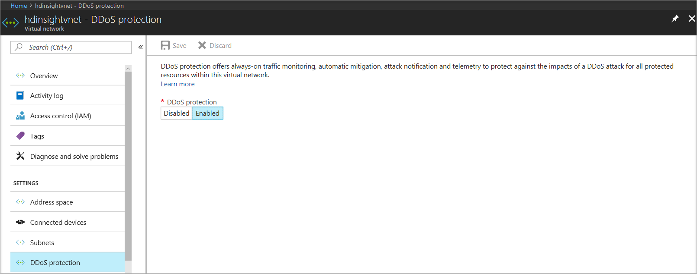

# Azure DDoS Protection reference architectures

Azure DDoS Protection is designed [for services that are deployed in a virtual network](../virtual-network/virtual-network-for-azure-services.md). The following reference architectures are arranged by scenarios, with architecture patterns grouped together.

> [!NOTE]
> Protected resources include public IPs attached to an IaaS VM (except for single VM running behind a public IP), Load Balancer (Classic & Standard Load Balancers), Application Gateway (including WAF) cluster, Firewall, Bastion, VPN Gateway, Service Fabric, IaaS based Network Virtual Appliance (NVA) or Azure API Management (Premium tier only), connected to a virtual network (VNet) in the external mode. Protection also covers public IP ranges brought to Azure via Custom IP Prefixes (BYOIPs). PaaS services (multi-tenant), which includes Azure App Service Environment for Power Apps, Azure API Management in deployment modes other than those supported above, or Azure Virtual WAN are not supported at present.

> [!NOTE]
> Protected resources that include public IPs created from public IP address prefix are not supported at present.

## Virtual machine (Windows/Linux) workloads

### Application running on load-balanced virtual machines

This reference architecture shows a set of proven practices for running multiple Windows virtual machines in a scale set behind a load balancer, to improve availability and scalability. This architecture can be used for any stateless workload, such as a web server.

In this architecture, a workload is distributed across multiple virtual machine instances. There's a single public IP address, and internet traffic is distributed to the virtual machine through a load balancer.

The load balancer distributes incoming internet requests to the VM instances. Virtual machine scale sets allow the number of VMs to be scaled in or out manually, or automatically based on predefined rules. This is important if the resource is under DDoS attack. For more information on this reference architecture, see
[Windows N-tier application on Azure](/azure/architecture/reference-architectures/virtual-machines-windows/multi-vm).
#### DDoS Network Protection virtual machine architecture

:::image type="content" source="./media/reference-architectures/ddos-network-protection-vm.png" alt-text="Diagram of the DDoS Network Protection reference architecture for an application running on load-balanced virtual machines.":::

 DDoS Network Protection is enabled on the virtual network of the Azure (internet) load balancer that has the public IP associated with it.

#### DDoS IP Protection virtual machine architecture

:::image type="content" source="./media/reference-architectures/ddos-ip-protection-virtual-machine.png" alt-text="Diagram of the DDoS IP Protection reference architecture for an application running on load-balanced virtual machines.":::

DDoS IP Protection is enabled on the frontend public IP address of a public load balancer.

### Application running on Windows N-tier

There are many ways to implement an N-tier architecture. The following diagrams show a typical three-tier web application. This architecture builds on the article [Run load-balanced VMs for scalability and availability](/azure/architecture/reference-architectures/virtual-machines-windows/multi-vm). The web and business tiers use load-balanced VMs.

#### DDoS Network Protection Windows N-tier architecture

:::image type="content" source="./media/reference-architectures/ddos-network-protection-n-tier.png" alt-text="Diagram of the DDoS Network Protection reference architecture for an application running on Windows N-tier." lightbox="./media/reference-architectures/ddos-network-protection-n-tier.png":::

 In this architecture diagram DDoS Network Protection is enabled on the virtual network. All public IPs in the virtual network get DDoS protection for Layer 3 and 4. For Layer 7 protection, deploy Application Gateway in the WAF SKU. For more information on this reference architecture, see
[Windows N-tier application on Azure](/azure/architecture/reference-architectures/virtual-machines-windows/n-tier).
#### DDoS IP Protection Windows N-tier architecture

:::image type="content" source="./media/reference-architectures/ddos-ip-protection-n-tier.png" alt-text="Diagram of the DDoS IP Protection reference architecture for an application running on Windows N-tier." lightbox="./media/reference-architectures/ddos-ip-protection-n-tier.png":::

 In this architecture diagram DDoS IP Protection is enabled on the public IP address.

> [!NOTE]
> Scenarios in which a single VM is running behind a public IP are not supported. DDoS mitigation may not initiate instantaneously when a DDoS attack is detected. As a result a single VM deployment that can’t scale out will go down in such cases.

### PaaS web application

This reference architecture shows running an Azure App Service application in a single region. This architecture shows a set of proven practices for a web application that uses [Azure App Service](../app-service/index.yml) and [Azure SQL Database](/azure/sql-database/).
A standby region is set up for failover scenarios.

Azure Traffic Manager routes incoming requests to Application Gateway in one of the regions. During normal operations, it routes requests to Application Gateway in the active region. If that region becomes unavailable, Traffic Manager fails over to Application Gateway in the standby region.

All traffic from the internet destined to the web application is routed to the [Application Gateway public IP address](../application-gateway/configure-web-app.md) via Traffic Manager. In this scenario, the app service (web app) itself isn't directly externally facing and is protected by Application Gateway.

We recommend that you configure the Application Gateway WAF SKU (prevent mode) to help protect against Layer 7 (HTTP/HTTPS/WebSocket) attacks. Additionally, web apps are configured to [accept only traffic from the Application Gateway](https://azure.microsoft.com/blog/ip-and-domain-restrictions-for-windows-azure-web-sites/) IP address.

For more information about this reference architecture, see [Highly available multi-region web application](/azure/architecture/reference-architectures/app-service-web-app/multi-region).

#### DDoS Network Protection with PaaS web application architecture

:::image type="content" source="./media/reference-architectures/ddos-network-protection-paas-web-app.png" alt-text="Diagram of DDoS Network Protection reference architecture for a PaaS web application." lightbox="./media/reference-architectures/ddos-network-protection-paas-web-app.png":::

 In this architecture diagram DDoS Network Protection is enabled on the web app gateway virtual network.

#### DDoS IP Protection with PaaS web application architecture

:::image type="content" source="./media/reference-architectures/ddos-ip-protection-paas-web-app.png" alt-text="Diagram of DDoS IP Protection reference architecture for a PaaS web application." lightbox="./media/reference-architectures/ddos-ip-protection-paas-web-app.png":::

 In this architecture diagram DDoS IP Protection is enabled on the public IP associated with the web application gateway.
## Mitigation for non-web PaaS services

### HDInsight on Azure

This reference architecture shows configuring DDoS Protection for an [Azure HDInsight cluster](../hdinsight/index.yml). Make sure that the HDInsight cluster is linked to a virtual network and that DDoS Protection is enabled on the virtual network.

In this architecture, traffic destined to the HDInsight cluster from the internet is routed to the public IP associated with the HDInsight gateway load balancer. The gateway load balancer then sends the traffic to the head nodes or the worker nodes directly. Because DDoS Protection is enabled on the HDInsight virtual network, all public IPs in the virtual network get DDoS protection for Layer 3 and 4. This reference architecture can be combined with the N-Tier and multi-region reference architectures.

For more information on this reference architecture, see the [Extend Azure HDInsight using an Azure Virtual Network](../hdinsight/hdinsight-plan-virtual-network-deployment.md?toc=/azure/virtual-network/toc.json)
documentation.

## Hub-and-spoke network topology with Azure Firewall and Azure Bastion

This reference architecture details a hub-and-spoke topology with Azure Firewall inside the hub as a DMZ for scenarios that require central control over security aspects. Azure Firewall is a managed firewall as a service and is placed in its own subnet. Azure Bastion is deployed and placed in its own subnet.

There are two spokes that are connected to the hub using VNet peering and there's no spoke-to-spoke connectivity. If you require spoke-to-spoke connectivity, then you need to create routes to forward traffic from one spoke to the firewall, which can then route it to the other spoke. All the Public IPs that are inside the hub are protected by DDoS Protection. In this scenario, the firewall in the hub helps control the ingress traffic from the internet, while the firewall's public IP is being protected. Azure DDoS Protection also protects the public IP of the bastion.

DDoS Protection is designed for services that are deployed in a virtual network. For more information, see [Deploy dedicated Azure service into virtual networks](../virtual-network/virtual-network-for-azure-services.md#services-that-can-be-deployed-into-a-virtual-network).

#### DDoS Network Protection hub-and-spoke network

:::image type="content" source="./media/reference-architectures/ddos-network-protection-azure-firewall-bastion.png" alt-text="Diagram showing DDoS Network Protection Hub-and-spoke architecture with firewall, bastion, and DDoS Protection." lightbox="./media/reference-architectures/ddos-network-protection-azure-firewall-bastion.png":::

 In this architecture diagram Azure DDoS Network Protection is enabled on the hub virtual network.

#### DDoS IP Protection hub-and-spoke network

:::image type="content" source="./media/reference-architectures/ddos-ip-protection-azure-firewall-bastion.png" alt-text="Diagram showing DDoS IP Protection Hub-and-spoke architecture with firewall, bastion, and DDoS Protection." lightbox="./media/reference-architectures/ddos-ip-protection-azure-firewall-bastion.png":::

In this architecture diagram Azure DDoS IP Protection is enabled on the public IP Address.

> [!NOTE]
> Azure DDoS Protection protects the Public IPs of Azure resource. DDoS infrastructure protection, which requires no configuration and is enabled by default, only protects the Azure underlying platform infrastructure (e.g. Azure DNS). For more information, see [Azure DDoS Protection overview](ddos-protection-overview.md).
For more information about hub-and-spoke topology, see [Hub-spoke network topology](/azure/architecture/reference-architectures/hybrid-networking/hub-spoke?tabs=cli).

## Next steps

- Learn how to [configure Network Protection](manage-ddos-protection.md).
