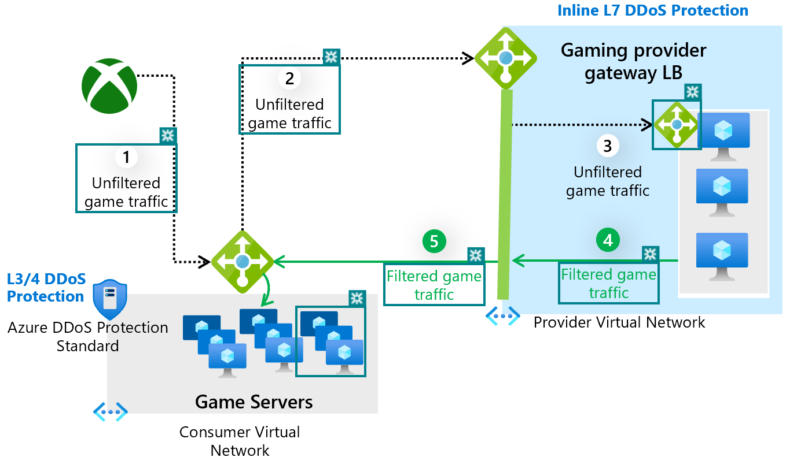

# Inline L7 DDoS Protection with Gateway Load Balancer and Partner NVAs

Azure DDoS Protection is always-on but not inline and takes 30-60 seconds from the time an attack is detected until it is mitigated. Azure DDoS Protection Standard also works at L3/4 (network layer) and does not inspect the packet payload i.e. application layer (L7).  

Workloads that are highly sensitive to latency and cannot tolerate 30-60 seconds of on-ramp time for DDoS protection to kick in requires inline protection. Inline protection entails that all the traffic always goes through the DDoS protection pipeline. Further, for scenarios such as web protection or gaming workload protection (UDP) it becomes crucial to inspect the packet payload to mitigate against extreme low volume attacks which exploit the vulnerability in the application layer (L7). 

Partner NVAs deployed with Gateway Load Balancer and integrated with Azure DDoS Protection Standard offers comprehensive inline L7 DDoS Protection for high performance and high availability scenarios. Inline L7 DDoS Protection combined with Azure DDoS Protection Standard provides comprehensive L3-L7 protection against volumetric as well as low-volume DDoS attacks. 

## What is a Gateway Load Balancer?
Gateway Load Balancer is a SKU of Azure Load Balancer catered specifically for high performance and high availability scenarios with third-party Network Virtual Appliances (NVAs).

With the capabilities of Gateway LB, you can deploy, scale, and manage NVAs with ease – chaining a Gateway LB to your public endpoint merely requires one click.  You can insert appliances for a variety of scenarios such as firewalls, advanced packet analytics, intrusion detection and prevention systems, or custom scenarios that suit your needs into the network path with Gateway LB. In scenarios with NVAs, it is especially important that flows are ‘symmetrical’ – this ensures sessions are maintained and symmetrical. Gateway LB maintains flow symmetry to a specific instance in the backend pool.

For more details on Gateway Load Balancer refer to the [Gateway LB](../load-balancer/gateway-overview.md) product and documentation. 

## Inline DDoS protection with Gateway LB and Partner NVAs

DDoS attacks on high latency sensitive workloads (e.g., gaming) can cause outage ranging from 2-10 seconds resulting in availability disruption. Gateway Load Balancer enables protection of such workloads by ensuring the relevant NVAs are injected into the ingress path of the internet traffic. Once chained to a Standard Public Load Balancer frontend or IP configuration on a virtual machine, no additional configuration is needed to ensure traffic to and from the application endpoint is sent to the Gateway LB. 

Inbound traffic is always inspected via the NVAs in the path and the clean traffic is returned to the backend infrastructure (gamer servers). 

Traffic flows from the consumer virtual network to the provider virtual network and then returns to the consumer virtual network. The consumer virtual network and provider virtual network can be in different subscriptions, tenants, or regions enabling greater flexibility and ease of management.

 
Enabling Azure DDoS Protection Standard on the VNet of the Standard Public Load Balancer frontend or VNet of the virtual machine will offer protection from L3/4 DDoS attacks. 
1.	Unfiltered game traffic from the internet is directed to the public IP of the game servers Load Balancer. 
2.	Unfiltered game traffic is redirected to the chained Gateway Load Balancer private IP. 
3.	The unfiltered game traffic is inspected for DDoS attacks in real time via the partner NVAs. 
4.	Filtered game traffic is sent back to the game servers for final processing.
5.	Azure DDoS Protection Standard on the gamer servers Load Balancer protects from L3/4 DDoS attacks and the DDoS protection policies are automatically tuned for game servers traffic profile and application scale. 

## Next steps
- Learn more about our launch partner [A10 Networks](https://www.a10networks.com/blog/introducing-l3-7-ddos-protection-for-microsoft-azure-tenants/)
- Learn more about [Azure DDoS Protection Standard](./ddos-protection-overview.md)
- Learn more about [Gateway Load Balancer](../load-balancer/gateway-overview.md)
