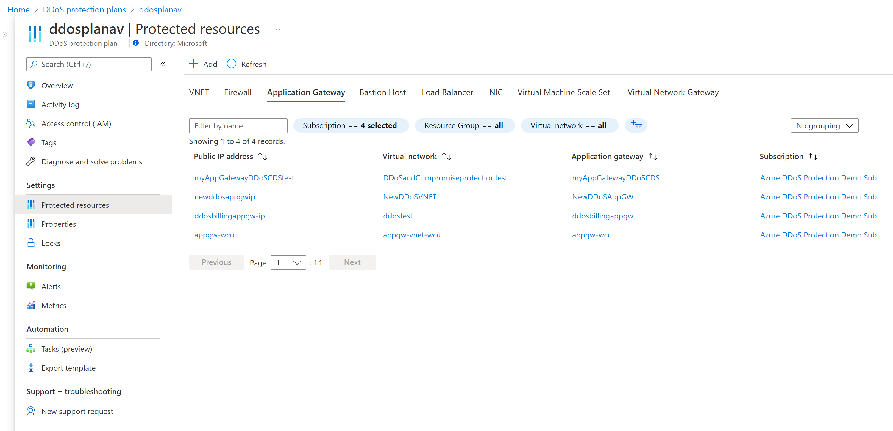

# Quickstart: Create and configure Azure DDoS Protection Standard

Get started with Azure DDoS Protection Standard by using the Azure portal. 

A DDoS protection plan defines a set of virtual networks that have DDoS protection standard enabled, across subscriptions. You can configure one DDoS protection plan for your organization and link virtual networks from multiple subscriptions to the same plan. 

In this quickstart, you'll create a DDoS protection plan and link it to a virtual network. 

## Prerequisites

- If you don't have an Azure subscription, create a [free account](https://azure.microsoft.com/free/?WT.mc_id=A261C142F) before you begin.
- Sign in to the Azure portal at https://portal.azure.com. Ensure that your account is assigned to the [network contributor](../role-based-access-control/built-in-roles.md?toc=%2fazure%2fvirtual-network%2ftoc.json#network-contributor) role or to a [custom role](../role-based-access-control/custom-roles.md?toc=%2fazure%2fvirtual-network%2ftoc.json) that is assigned the appropriate actions listed in the how-to guide on [Permissions](manage-permissions.md).

## Create a DDoS protection plan

1. Select **Create a resource** in the upper left corner of the Azure portal.
2. Search the term *DDoS*. When **DDoS protection plan** appears in the search results, select it.
3. Select **Create**.
4. Enter or select the following values, then select **Create**:

    |Setting        |Value                                              |
    |---------      |---------                                          |
    |Name           | Enter _MyDdosProtectionPlan_.                     |
    |Subscription   | Select your subscription.                         |
    |Resource group | Select **Create new** and enter _MyResourceGroup_.|
    |Location       | Enter _East US_.                                  |

## Enable DDoS protection for a virtual network

### Enable DDoS protection for a new virtual network

1. Select **Create a resource** in the upper left corner of the Azure portal.
2. Select **Networking**, and then select **Virtual network**.
3. Enter or select the following values, accept the remaining defaults, and then select **Create**:

    | Setting         | Value                                           |
    | ---------       | ---------                                       |
    | Name            | Enter _MyVnet_.                                 |
    | Subscription    | Select your subscription.                                    |
    | Resource group  | Select **Use existing**, and then select **MyResourceGroup** |
    | Location        | Enter _East US_                                                    |
    | DDoS Protection Standard | Select **Enable**. The plan you select can be in the same, or different subscription than the virtual network, but both subscriptions must be associated to the same Azure Active Directory tenant.|

You cannot move a virtual network to another resource group or subscription when DDoS Standard is enabled for the virtual network. If you need to move a virtual network with DDoS Standard enabled, disable DDoS Standard first, move the virtual network, and then enable DDoS standard. After the move, the auto-tuned policy thresholds for all the protected public IP addresses in the virtual network are reset.

### Enable DDoS protection for an existing virtual network

1. Create a DDoS protection plan by completing the steps in [Create a DDoS protection plan](#create-a-ddos-protection-plan), if you don't have an existing DDoS protection plan.
2. Select **Create a resource** in the upper left corner of the Azure portal.
3. Enter the name of the virtual network that you want to enable DDoS Protection Standard for in the **Search resources, services, and docs box** at the top of the portal. When the name of the virtual network appears in the search results, select it.
4. Select **DDoS protection**, under **SETTINGS**.
5. Select **Standard**. Under **DDoS protection plan**, select an existing DDoS protection plan, or the plan you created in step 1, and then select **Save**. The plan you select can be in the same, or different subscription than the virtual network, but both subscriptions must be associated to the same Azure Active Directory tenant.

### Enable DDoS protection for all virtual networks

This [policy](https://aka.ms/ddosvnetpolicy) will detect any virtual networks in a defined scope that do not have DDoS Protection Standard enabled, then optionally create a remediation task that will create the association to protect the VNet. For detailed step-by-step instructions on how to deploy this policy, see https://aka.ms/ddosvnetpolicy-techcommunity.

## Validate and test

First, check the details of your DDoS protection plan:

1. Select **All services** on the top, left of the portal.
2. Enter *DDoS* in the **Filter** box. When **DDoS protection plans** appear in the results, select it.
3. Select your DDoS protection plan from the list.

The _MyVnet_ virtual network should be listed. 

### View protected resources
Under **Protected resources**, you can view your protected virtual networks and public IP addresses, or add more virtual networks to your DDoS protection plan:

## Clean up resources

You can keep your resources for the next tutorial. If no longer needed, delete the _MyResourceGroup_ resource group. When you delete the resource group, you also delete the DDoS protection plan and all its related resources. If you don't intend to use this DDoS protection plan, you should remove resources to avoid unnecessary charges.

   >[!WARNING]
   >This action is irreversable.

1. In the Azure portal, search for and select **Resource groups**, or select **Resource groups** from the Azure portal menu.

2. Filter or scroll down to find the _MyResourceGroup_ resource group.

3. Select the resource group, then select **Delete resource group**.

4. Type the resource group name to verify, and then select **Delete**.

To disable DDoS protection for a virtual network: 

1. Enter the name of the virtual network you want to disable DDoS protection standard for in the **Search resources, services, and docs box** at the top of the portal. When the name of the virtual network appears in the search results, select it.
2. Under **DDoS Protection Standard**, select **Disable**.

If you want to delete a DDoS protection plan, you must first dissociate all virtual networks from it. 

## Next steps

To learn how to view and configure telemetry for your DDoS protection plan, continue to the tutorials.

> [!div class="nextstepaction"]
> [View and configure DDoS protection telemetry](telemetry.md)
