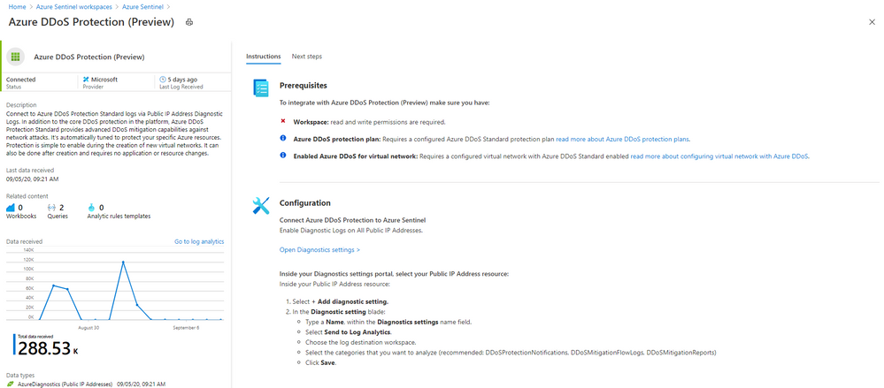
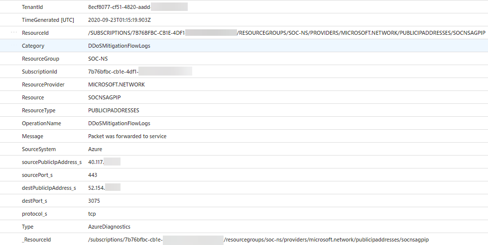
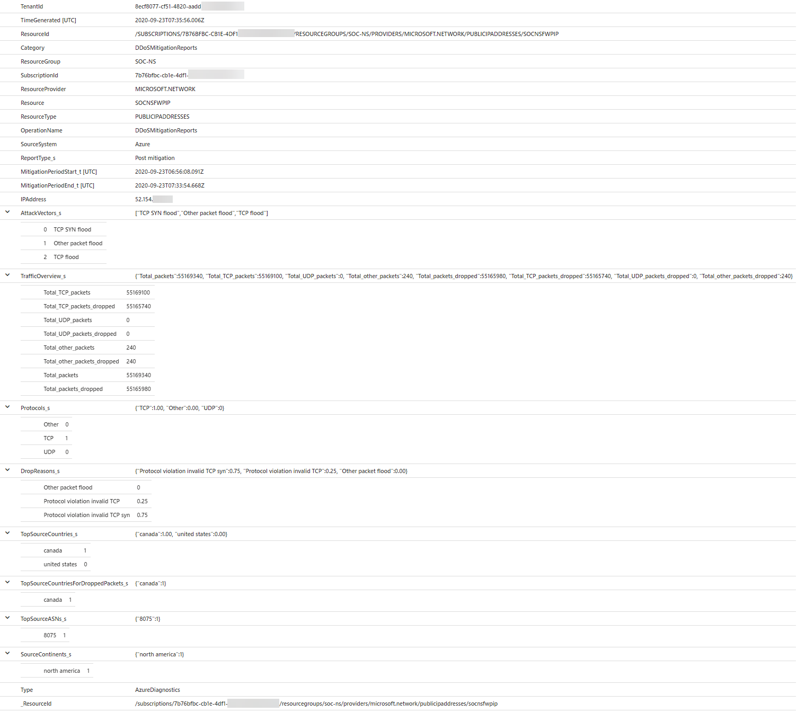

# Configure DDoS attack mitigation reports and flow logs 

Azure DDoS Protection standard provides detailed attack insights and visualization with DDoS Attack Analytics. Customers protecting their virtual networks against DDoS attacks have detailed visibility into attack traffic and actions taken to mitigate the attack via attack mitigation reports & mitigation flow logs. Rich telemetry is exposed via Azure Monitor including detailed metrics during the duration of a DDoS attack. Alerting can be configured for any of the Azure Monitor metrics exposed by DDoS Protection. Logging can be further integrated with [Azure Sentinel](https://docs.microsoft.com/azure/sentinel/connect-azure-ddos-protection), Splunk (Azure Event Hubs), OMS Log Analytics, and Azure Storage for advanced analysis via the Azure Monitor Diagnostics interface.

In this tutorial, you'll learn how to:

> [!div class="checklist"]
> * View and configure DDoS attack mitigation reports
> * View and configure DDoS attack mitigation flow logs

## Prerequisites

- If you don't have an Azure subscription, create a [free account](https://azure.microsoft.com/free/?WT.mc_id=A261C142F) before you begin.
- Before you can complete the steps in this tutorial, you must first create a [Azure DDoS Standard protection plan](manage-ddos-protection.md).

## View and configure DDoS attack mitigation reports

Attack mitigation reports uses the Netflow protocol data which is aggregated to provide detailed information about the attack on your resource. Anytime a public IP resource is under attack, the report generation will start as soon as the mitigation starts. There will be an incremental report generated every 5 mins and a post-mitigation report for the whole mitigation period. This is to ensure that in an event the DDoS attack continues for a longer duration of time, you will be able to view the most current snapshot of mitigation report every 5 minutes and a complete summary once the attack mitigation is over. 

1. Select **All services** on the top, left of the portal.
2. Enter *Monitor* in the **Filter** box. When **Monitor** appears in the results, select it.
3. Under **SETTINGS**, select **Diagnostic Settings**.
4. Select the **Subscription** and **Resource group** that contain the public IP address you want to log.
5. Select **Public IP Address** for **Resource type**, then select the specific public IP address you want to log metrics for.
6. Select **Turn on diagnostics to collect the DDoSMitigationReports log** and then select as many of the following options as you require:

    - **Archive to a storage account**: Data is written to an Azure Storage account. To learn more about this option, see [Archive resource logs](../azure-monitor/platform/archive-diagnostic-logs.md?toc=%2fazure%2fvirtual-network%2ftoc.json).
    - **Stream to an event hub**: Allows a log receiver to pick up logs using an Azure Event Hub. Event hubs enable integration with Splunk or other SIEM systems. To learn more about this option, see [Stream resource logs to an event hub](../azure-monitor/platform/resource-logs-stream-event-hubs.md?toc=%2fazure%2fvirtual-network%2ftoc.json).
    - **Send to Log Analytics**: Writes logs to the Azure Monitor service. To learn more about this option, see [Collect logs for use in Azure Monitor logs](../azure-monitor/platform/collect-azure-metrics-logs.md?toc=%2fazure%2fvirtual-network%2ftoc.json).

Both the incremental & post-attack mitigation reports include the following fields
- Attack vectors
- Traffic statistics
- Reason for dropped packets
- Protocols involved
- Top 10 source countries or regions
- Top 10 source ASNs

## View and configure DDoS attack mitigation flow logs
Attack mitigation flow logs allow you to review the dropped traffic, forwarded traffic and other interesting datapoints during an active DDoS attack in near-real time. You can ingest the constant stream of this data into Azure Sentinel or to your third-party SIEM systems via event hub for near-real time monitoring, take potential actions and address the need of your defense operations.

1. Select **All services** on the top, left of the portal.
2. Enter *Monitor* in the **Filter** box. When **Monitor** appears in the results, select it.
3. Under **SETTINGS**, select **Diagnostic Settings**.
4. Select the **Subscription** and **Resource group** that contain the public IP address you want to log.
5. Select **Public IP Address** for **Resource type**, then select the specific public IP address you want to log metrics for.
6. Select **Turn on diagnostics to collect the DDoSMitigationFlowLogs log** and then select as many of the following options as you require:

    - **Archive to a storage account**: Data is written to an Azure Storage account. To learn more about this option, see [Archive resource logs](../azure-monitor/platform/archive-diagnostic-logs.md?toc=%2fazure%2fvirtual-network%2ftoc.json).
    - **Stream to an event hub**: Allows a log receiver to pick up logs using an Azure Event Hub. Event hubs enable integration with Splunk or other SIEM systems. To learn more about this option, see [Stream resource logs to an event hub](../azure-monitor/platform/resource-logs-stream-event-hubs.md?toc=%2fazure%2fvirtual-network%2ftoc.json).
    - **Send to Log Analytics**: Writes logs to the Azure Monitor service. To learn more about this option, see [Collect logs for use in Azure Monitor logs](../azure-monitor/platform/collect-azure-metrics-logs.md?toc=%2fazure%2fvirtual-network%2ftoc.json).

### Azure Sentinel data connector

You can connect your to Azure Sentinel, view and analyze your data in workbooks, create custom alerts, and incorporate it into investigation processes. To connect to Azure Sentinel, see [Connect to Azure Sentinel](https://docs.microsoft.com/azure/sentinel/connect-azure-ddos-protection). 

### Azure DDoS Protection Workbook

To view the flow logs data in Azure analytics dashboard, you can import the sample dashboard from https://github.com/Azure/Azure-Network-Security/tree/master/Azure%20DDoS%20Protection/Azure%20DDoS%20Protection%20Workbook

Flow logs will have the following fields: 
- Source IP
- Destination IP
- Source Port 
- Destination port 
- Protocol type 
- Action taken during mitigation

Attack analytics will only work if DDoS Protection Standard is enabled on the virtual network of the public IP address. 

## Sample log outputs

The following screenshots are example log outputs:

### DDoSMitigationFlowLogs

### DDoSProtectionNotifications

### DDoSMitigationReports

## Next steps

In this tutorial, you learned how to:

- View and configure DDoS attack mitigation reports
- View and configure DDoS attack mitigation flow logs

To learn how to test and simulate a DDoS attack, see the simulation testing guide:

> [!div class="nextstepaction"]
> [Test through simulations](test-through-simulations.md)

