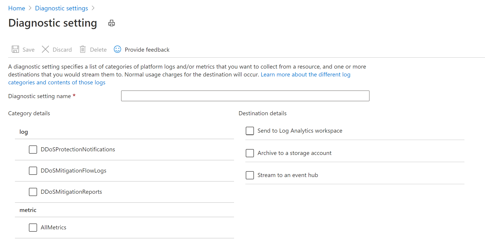

# Configure DDoS attack mitigation reports and flow logs 

Azure DDoS Protection standard provides detailed attack insights and visualization with DDoS Attack Analytics. Customers protecting their virtual networks against DDoS attacks have detailed visibility into attack traffic and actions taken to mitigate the attack via attack mitigation reports & mitigation flow logs. Rich telemetry is exposed via Azure Monitor including detailed metrics during the duration of a DDoS attack. Alerting can be configured for any of the Azure Monitor metrics exposed by DDoS Protection. Logging can be further integrated with [Azure Sentinel](../sentinel/connect-azure-ddos-protection.md), Splunk (Azure Event Hubs), OMS Log Analytics, and Azure Storage for advanced analysis via the Azure Monitor Diagnostics interface.

In this tutorial, you'll learn how to:

> [!div class="checklist"]
> * View and configure DDoS attack mitigation reports and flow logs, including DDoS Protection notifications, DDoS mitigation flow logs and DDoS mitigation reports. 

## Prerequisites

- If you don't have an Azure subscription, create a [free account](https://azure.microsoft.com/free/?WT.mc_id=A261C142F) before you begin.
- Before you can complete the steps in this tutorial, you must first create a [Azure DDoS Standard protection plan](manage-ddos-protection.md). DDoS Protection Standard must be enabled on the virtual network of the public IP address. 

## View and configure DDoS attack logs

1. Select **All services** on the top, left of the portal.
2. Enter *Monitor* in the **Filter** box. When **Monitor** appears in the results, select it.
3. Under **SETTINGS**, select **Diagnostic Settings**.
4. Select the **Subscription** and **Resource group** that contain the public IP address you want to log.
5. Select **Public IP Address** for **Resource type**, then select the specific public IP address you want to log metrics for.
6. Select **Add diagnostic setting**. Under **Category Details**, select as many of the following options you require:

    - **DDoSProtectionNotifications**
    - **DDoSMitigationFlowLogs**: Attack mitigation flow logs allow you to review the dropped traffic, forwarded traffic and other interesting datapoints during an active DDoS attack in near-real time. You can ingest the constant stream of this data into Azure Sentinel or to your third-party SIEM systems via event hub for near-real time monitoring, take potential actions and address the need of your defense operations.
    - **DDoSMitigationReports**: Attack mitigation reports uses the Netflow protocol data which is aggregated to provide detailed information about the attack on your resource. Anytime a public IP resource is under attack, the report generation will start as soon as the mitigation starts. There will be an incremental report generated every 5 mins and a post-mitigation report for the whole mitigation period. This is to ensure that in an event the DDoS attack continues for a longer duration of time, you will be able to view the most current snapshot of mitigation report every 5 minutes and a complete summary once the attack mitigation is over. 
    - **AllMetrics**
    

    

1. Under **Destination details**, select as many of the following options as you require:

    - **Archive to a storage account**: Data is written to an Azure Storage account. To learn more about this option, see [Archive resource logs](../azure-monitor/platform/resource-logs.md?toc=%2fazure%2fvirtual-network%2ftoc.json#send-to-azure-storage).
    - **Stream to an event hub**: Allows a log receiver to pick up logs using an Azure Event Hub. Event hubs enable integration with Splunk or other SIEM systems. To learn more about this option, see [Stream resource logs to an event hub](../azure-monitor/platform/resource-logs.md?toc=%2fazure%2fvirtual-network%2ftoc.json#send-to-azure-event-hubs).
    - **Send to Log Analytics**: Writes logs to the Azure Monitor service. To learn more about this option, see [Collect logs for use in Azure Monitor logs](../azure-monitor/platform/resource-logs.md?toc=%2fazure%2fvirtual-network%2ftoc.json#send-to-log-analytics-workspace).

This [template](https://github.com/Azure/Azure-Network-Security/tree/master/Azure%20DDoS%20Protection/Enable%20Diagnostic%20Logging/Azure%20Policy) creates an Azure Policy definition to enable diagnostic logging.

## Log schemas

The following table lists the field names and descriptions:

# [DDoSProtectionNotifications](#tab/DDoSProtectionNotifications)

| Field name | Description |
| --- | --- |
| **TimeGenerated** | The date and time in UTC when the notification was created. |
| **ResourceId** | The resource ID of your public IP address. |
| **Category** | For notifications, this will be `DDoSProtectionNotifications`.|
| **ResourceGroup** | The resource group that contains your public IP address and virtual network. |
| **SubscriptionId** | Your DDoS protection plan subscription ID. |
| **Resource** | The name of your public IP address. |
| **ResourceType** | This will always be `PUBLICIPADDRESS`. |
| **OperationName** | For notifications, this will be `DDoSProtectionNotifications`.  |
| **Message** | Details of the attack. |
| **Type** | Type of notification. Possible values include `MitigationStarted`. |
| **PublicIpAddress** | Your public IP address. |

# [DDoSMitigationFlowLogs](#tab/DDoSMitigationFlowLogs)

| Field name | Description |
| --- | --- |
| **TimeGenerated** | The date and time in UTC when the flow log was created. |
| **ResourceId** | The resource ID of your public IP address. |
| **Category** | For flow logs, this will be `DDoSMitigationFlowLogs`.|
| **ResourceGroup** | The resource group that contains your public IP address and virtual network. |
| **SubscriptionId** | Your DDoS protection plan subscription ID. |
| **Resource** | The name of your public IP address. |
| **ResourceType** | This will always be `PUBLICIPADDRESS`. |
| **OperationName** | For flow logs, this will be `DDoSMitigationFlowLogs`. |
| **Message** | Details of the attack. |
| **SourcePublicIpAddress** | The public IP address of the client generating the attack traffic to your public IP address. |
| **SourcePort** | The port number of the client generating the attack traffic to your public IP address. |
| **DestPublicIpAddress** | Your public IP address. |
| **DestPort** | The port number of your public IP address. |
| **Protocol** | Possible values include `tcp`, `udp` or `other`.|

# [DDoSMitigationReports](#tab/DDoSMitigationReports)

| Field name | Description |
| --- | --- |
| **TimeGenerated** | The date and time in UTC when the report was created. |
| **ResourceId** | The resource ID of your public IP address. |
| **Category** | For notifications, this will be `DDoSProtectionNotifications`.|
| **ResourceGroup** | The resource group that contains your public IP address and virtual network. |
| **SubscriptionId** | Your DDoS protection plan subscription ID. |
| **Resource** | The name of your public IP address. |
| **ResourceType** | This will always be `PUBLICIPADDRESS`. |
| **OperationName** | For mitigation reports, this will be `DDoSMitigationReports`. |
| **ReportType** | Possible values include `Incremental`, `PostMitigation`.|
| **MitigationPeriodStart** | The date and time in UTC when the mitigation started.  |
| **MitigationPeriodEnd** | The date and time in UTC when the mitigation ended. |
| **IPAddress** | Your public IP address. |
| **AttackVectors** |  Breakdown of attack types. Keys include `TCP SYN flood`, `TCP flood`, `UDP flood`, `UDP reflection`, `Other packet flood`.|
| **TrafficOverview** |  Breakdown of attack traffic. Keys include `Total packets`, `Total packets dropped`, `Total TCP packets`, `Total TCP packets dropped`, `Total UDP packets`, `Total UDP packets dropped`, `Total Other packets`, `Total Other packets dropped`. |
| **Protocols** | Keys include `TCP`, `UDP`, `Other`. |
| **DropReasons** | Keys include `Invalid TCP SYN`, `Invalid TCP`, `Invalid UDP`, `UDP reflection`, `TCP destination based rate limit`, `TCP source based rate limit`, `UDP destination based rate limit`, `UDP source based rate limit`.  |
| **TopSourceCountries** | Breakdown of top 10 source countries of incoming traffic. |
| **TopSourceCountriesForDroppedPackets** | Breakdown of top 10 source countries of attack traffic that is/was mitigated. |
| **TopSourceASNs** | Breakdown of top 10 source autonomous system numbers (ASN) of the incoming traffic.  |
| **SourceContinents** | Breakdown of the source continents of incoming traffic. |
***

### Azure Sentinel data connector

You can connect logs to Azure Sentinel, view and analyze your data in workbooks, create custom alerts, and incorporate it into investigation processes. To connect to Azure Sentinel, see [Connect to Azure Sentinel](../sentinel/connect-azure-ddos-protection.md). 

### Azure DDoS Protection Workbook

You can use this Azure Resource Manager (ARM) template to deploy an attack analytics workbook. This workbook allows you to visualize attack data across several filterable panels to easily understand what’s at stake. 

## Next steps

In this tutorial, you learned how to:

- View and configure DDoS attack mitigation reports
- View and configure DDoS attack mitigation flow logs

To learn how to test and simulate a DDoS attack, see the simulation testing guide:

> [!div class="nextstepaction"]
> [Test through simulations](test-through-simulations.md)