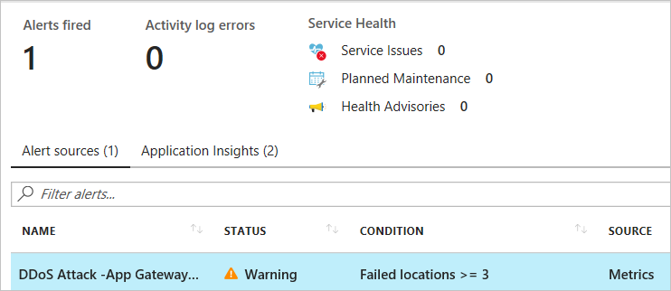
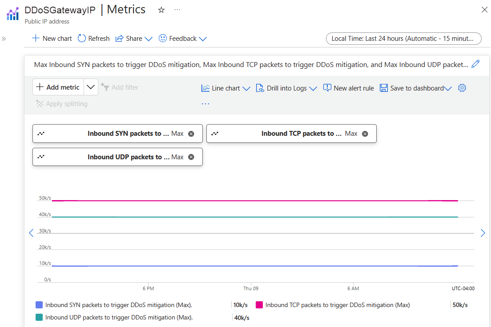

# View and configure DDoS protection telemetry

Azure DDoS Protection standard provides detailed attack insights and visualization with DDoS Attack Analytics. Customers protecting their virtual networks against DDoS attacks have detailed visibility into attack traffic and actions taken to mitigate the attack via attack mitigation reports & mitigation flow logs. Rich telemetry is exposed via Azure Monitor including detailed metrics during the duration of a DDoS attack. Alerting can be configured for any of the Azure Monitor metrics exposed by DDoS Protection. Logging can be further integrated with [Azure Sentinel](https://docs.microsoft.com/azure/sentinel/connect-azure-ddos-protection), Splunk (Azure Event Hubs), OMS Log Analytics, and Azure Storage for advanced analysis via the Azure Monitor Diagnostics interface.

In this tutorial, you'll learn how to:

> [!div class="checklist"]
> * Configure alerts for DDoS protection metrics
> * Use DDoS protection telemetry
> * View DDoS mitigation policies
> * View DDoS protection alerts in Azure Security Center

## Prerequisites

- If you don't have an Azure subscription, create a [free account](https://azure.microsoft.com/free/?WT.mc_id=A261C142F) before you begin.
- Before you can complete the steps in this tutorial, you must first create a [Azure DDoS Standard protection plan](manage-ddos-protection.md).

## Configure alerts for DDoS protection metrics

You can select any of the available DDoS protection metrics to alert you when there’s an active mitigation during an attack, using the Azure Monitor alert configuration. When the conditions are met, the address specified receives an alert email:

1. Select **All services** on the top, left of the portal.
2. Enter *Monitor* in the **Filter** box. When **Monitor** appears in the results, select it.
3. Select **Metrics** under **SHARED SERVICES**.
4. Enter, or select your own values, or enter the following example values, accept the remaining defaults, and then select **OK**:

    |Setting                  |Value                                                                                               |
    |---------                |---------                                                                                           |
    |Name                     | Enter _MyDdosAlert_.                                                                                |
    |Subscription             | Select the subscription that contains the public IP address you want to receive alerts for.        |
    |Resource group           | Select the resource group that contains the public IP address you want to receive alerts for.      |
    |Resource                 | Select the public IP address that contains the public IP address you want to receive alerts for. DDoS monitors public IP addresses assigned to resources within a virtual network. If you don't have any resources with public IP addresses in the virtual network, you must first create a resource with a public IP address. You can monitor the public IP address of all resources deployed through Resource Manager (not classic) listed in [Virtual network for Azure services](https://docs.microsoft.com/azure/virtual-network/virtual-network-for-azure-services#services-that-can-be-deployed-into-a-virtual-network), except for Azure App Service Environments and Azure VPN Gateway. To continue with this tutorial, you can quickly create a [Windows](../virtual-machines/windows/quick-create-portal.md?toc=%2fazure%2fvirtual-network%2ftoc.json) or [Linux](../virtual-machines/linux/quick-create-portal.md?toc=%2fazure%2fvirtual-network%2ftoc.json) virtual machine.                   |
    |Metric                   | Select **Under DDoS attack or not**.                                                                |
    |Threshold                | 1 - **1** means you are under attack. **0** means you are not under attack.                         |
    |Period                   | Select whatever value you choose.                                                                   |
    |Notify via Email         | Check the checkbox.                                                                                 |
    |Additional administrator | Enter your email address if you're not an email owner, contributor, or reader for the subscription. |

    Within a few minutes of attack detection, you receive an email from Azure Monitor metrics that looks similar to the following picture:

    

To simulate a DDoS attack to validate your alert, see [Validate DDoS detection](test-through-simulations.md).

You can also learn more about [configuring webhooks](../azure-monitor/platform/alerts-webhooks.md?toc=%2fazure%2fvirtual-network%2ftoc.json) and [logic apps](../logic-apps/logic-apps-overview.md?toc=%2fazure%2fvirtual-network%2ftoc.json) for creating alerts.

## Use DDoS protection telemetry

Telemetry for an attack is provided through Azure Monitor in real time. The telemetry is available only for the duration that a public IP address is under mitigation. You don't see telemetry before or after an attack is mitigated.

1. Select **All services** on the top, left of the portal.
2. Enter *Monitor* in the **Filter** box. When **Monitor** appears in the results, select it.
3. Select **Metrics**, under **SHARED SERVICES**.
4. Select the **Subscription** and **Resource group** that contain the public IP address that you want telemetry for.
5. Select **Public IP Address** for **Resource type**, then select the specific public IP address you want telemetry for.
6. A series of **Available Metrics** appear on the left side of the screen. These metrics, when selected, are graphed in the **Azure Monitor Metrics Chart** on the overview screen.
7. Select the **aggregation** type as **Max**

The metric names present different packet types, and bytes vs. packets, with a basic construct of tag names on each metric as follows:

- **Dropped tag name** (for example, **Inbound Packets Dropped DDoS**): The number of packets dropped/scrubbed by the DDoS protection system.
- **Forwarded tag name** (for example **Inbound Packets Forwarded DDoS**): The number of packets forwarded by the DDoS system to the destination VIP – traffic that was not filtered.
- **No tag name** (for example **Inbound Packets DDoS**): The total number of packets that came into the scrubbing system – representing the sum of the packets dropped and forwarded.

To simulate a DDoS attack to validate telemetry, see [Validate DDoS detection](test-through-simulations.md).

## View DDoS mitigation policies

DDoS Protection Standard applies three auto-tuned mitigation policies (TCP SYN, TCP & UDP) for each public IP address of the protected resource, in the virtual network that has DDoS enabled. You can view the policy thresholds by selecting the  **Inbound TCP packets to trigger DDoS mitigation** and **Inbound UDP packets to trigger DDoS mitigation** metrics with **aggregation** type as 'Max', as shown in the following picture:

Policy thresholds are auto-configured via Azure machine learning-based network traffic profiling. Only when the policy threshold is breached does DDoS mitigation occur for the IP address under attack.

## View DDoS protection alerts in Azure Security Center

Azure Security Center provides a list of [security alerts](/azure/security-center/security-center-managing-and-responding-alerts), with information to help investigate and remediate problems. With this feature, you get a unified view of alerts, including DDoS attack-related alerts and the actions taken to mitigate the attack in near-time.
There are two specific alerts that you will see for any DDoS attack detection and mitigation:

- **DDoS Attack detected for Public IP**: This alert is generated when the DDoS protection service detects that one of your public IP addresses is the target of a DDoS attack.
- **DDoS Attack mitigated for Public IP**: This alert is generated when an attack on the public IP address has been mitigated.
To view the alerts, open **Security Center** in the Azure portal. Under **Threat Protection**, select **Security alerts**. The following screenshot shows an example of the DDoS attack alerts.

The alerts include general information about the public IP address that’s under attack, geo and threat intelligence information, and remediations steps.

## Next steps

In this tutorial, you learned how to:

- Configure alerts for DDoS protection metrics
- Use DDoS protection telemetry
- View DDoS mitigation policies
- View DDoS protection alerts in Azure Security Center

To learn how to configure attack mitigation reports and flow logs, continue to the next tutorial.

> [!div class="nextstepaction"]
> [Configure DDoS attack mitigation reports and flow logs](reports-and-flow-logs.md)