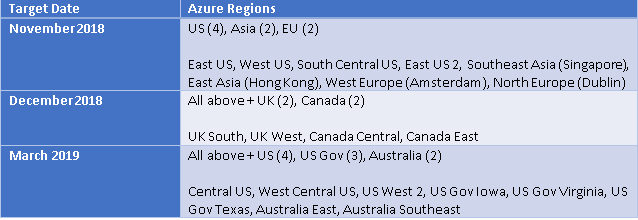

# Frequently asked questions (FAQ)

Find answers to common questions about Microsoft Azure Dedicated HSM.

## Q: What is an HSM?

A Hardware Security Module (HSM) is a physical computing device. It is used to safeguard and manage cryptographic keys that can be used for cryptographic operations. The key material stays safely in a tamper-resistant, tamper-evident hardware module, while allowing authenticated/authorized applications to use the keys to perform cryptographic operations. The key material never leaves the HSM protection boundary.

## Q: What is an HSM used for?

HSMs are used for storing cryptographic keys that are used for cryptographic functionality such as SSL (secure socket layer), encrypting data, PKI (public key infrastructure), DRM (digital rights management), and signing documents.

## Q: What is Dedicated HSM offering?

Azure Dedicated HSM (hardware security module) provides HSMs hosted in Azure datacenters. These HSMs are directly connected to a customer's VNET. They are dedicated network HSMs (Gemalto's SafeNet Network HSM 7 Model A790) available in a customer's private IP address space. Microsoft does not have access to the cryptographic functionality of the HSMs. Only a customer has full administrative control and cryptographic control over them. Customers are the only ones who can get full activity logs directly from the HSM. Dedicated HSMs help customers meet requirements such as those outlined in FIPS 140-2 Level 3, GDPR, HIPAA, PCI-DSS, eIDAS, and others.

## Q: How does Dedicated HSM work?

HSMs are provisioned using PowerShell or the Azure command-line interface. You can specify the region and the VNET the HSMs should use. The HSMs will be available in the designated subnet at the assigned IP addresses in your private IP address space. The appliance is managed using SSH. While connected to it you may initialize the HSM, create partitions, and assign roles. You can then use the Gemalto provided HSM client tools/SDK/software to perform cryptographic operations from your applications.

## Q: When will Dedicated HSM be available in my region?

Dedicated HSMs will roll out to limited Azure regions starting November 2018. See the roll-out schedule below:

## Q: How does my application connect to a Dedicated HSM?

You use Gemalto provided HSM client tools/SDK/software to perform cryptographic operations from your applications.

## Q: Can an application connect to Dedicated HSM from a different VNET in or across regions?

Yes, you will need to use [VNET peering](../virtual-network/virtual-network-peering-overview.md) (in same region or across regions) to establish connectivity across VNETs.

## Q: Can I sync Dedicated HSM with on-premises HSMs?

Yes, you can sync on-premises HSMs with Dedicated HSM. You must use site-to-site or point-to-point VPN connectivity with your on-premises network.

## Q: Can I encrypt data used by other Azure services using keys stored in Dedicated HSM?

No. Azure Dedicated HSMs are only accessible from inside your VNET.

## Q: How do I decide whether to use Azure Key Vault or Azure Dedicated HSM?

Azure Dedicated HSM is the appropiate choice for enterprises migrating to Azure on-premises applications that use HSMs. Dedicated HSMs present an option to migrate an application with minimal changes. If cryptographic operations are performed in the application's code running in an Azure VM or Web App, they can use Dedicated HSM. In general, shrink-wrapped software running in IaaS (infrastructure as a service) models, that support HSMs as a key store can use Dedicate HSM, such as Application gateway or traffic manager for keyless SSL, ADCS (Active Directory Certificate Services), or similar PKI tools, tools/applications used for document signing, code signing, or a SQL Server (IaaS) configured with TDE (transparent database encryption) with master key in an HSM using an EKM (extensible key management) provider. Azure Key Vault is suitable for “born-in-cloud” applications or for encryption at rest scenarios where customer data is processed by PaaS (platform as a service) or SaaS (Software as a service) scenarios such as Office 365 Customer Key, Azure Information Protection, Azure Disk Encryption, Azure Data Lake Store encryption with customer-managed key, Azure Storage encryption with customer managed key, and Azure SQL with customer managed key.

## Q: What usage scenarios can Dedicated HSM be used for?

Azure Dedicated HSM is most suitable for customer with "lift-and-shift" scenarios, where customers are migrating on-premises applications to Azure that are using HSMs. This provides customers a low-friction option to migrate to Azure with minimal changes to the application. If cryptographic operations are performed customer's own code running in Azure VM or Web App, they can use Dedicated HSM. In general, shrink-wrapped software running in IaaS (infrastructure as a service) models, that support HSMs as a key store can use Dedicate HSM, such as Application gateway or traffic manager for keyless SSL, ADCS (Active Directory Certificate Services), or similar PKI tools, tools/applications used for document signing, code signing, or a SQL Server (IaaS) configured with TDE (transparent database encryption) with master key in an HSM using an EKM (extensible key management) provider.

## Q: Can Dedicated HSM be used with Office 365 Customer Key, Azure Information Protection, Azure Data Lake Store, Disk Encryption, Azure Storage encryption, Azure SQL TDE?

No.

## Q: Can I upgrade software/firmware on HSMs allocated to me?

Azure Dedicated HSM gives full administrative control of the HSM appliance to the customer, including upgrading software/firmware. However, Microsoft will only support the HSM software/firmware that comes installed by default when the device is provisioned. Newer software/firmware versions are do not immediately receive FIPS certification, so upgrading firmware/software may make the device fall out of FIPS compliance.

## Q: Can I set up high availability configuration using multiple HSMs in the same region or across multiple regions?

Yes. High availability configuration and setup is performed in the HSM client software provided by Gemalto. HSMs from the same VNET or other VNETs in the same region or across regions, or on-prem HSMs connected to a VNET using site-to-site or point-to-point VPN can be added to same high availability configuration.

## Q: How many HSMs can I add to same high availability configuration from one single application?

16.

## Q: What is the SLA for Dedicated HSM service?

At this time, there is no SLA provided for Dedicated HSM service.  Microsoft will ensure network level access to the device, and hence standard Azure networking SLAs apply.

## Q: Does the customer get full exclusive control over the HSMs with Dedicated HSMs?

Yes. Each network HSM appliance is fully dedicated to one single customer.

## Q: What level of access does Microsoft have to my HSM?

Microsoft does not have any administrative or cryptographic control over the HSM.

## Q: Can Microsoft or anyone at Microsoft access keys in my Dedicated HSM?

No. Microsoft does not have any access to the keys stored in customer allocated Dedicated HSM.

## Q: How does a customer ensure that when an HSM is deprovisioned all the key material is wiped out?

Before requesting deprovisioning, a customer must have zeroized the HSM using Gemalto provided HSM client tools.

## Q: How do I monitor my HSM?

A customer has full access to HSM activity logs via syslog and SNMP. A customer will need to set up a syslog server or SNMP server to receive the logs or events from the HSMs.

## Q: How are the HSMs hosted in Dedicated HSM service protected?

Azure datacenters have extensive physical and procedural security controls. In addition to that Dedicated HSMs are hosted in a special restricted access area of datacenter with additional physical access controls and video camera surveillance for added security.

## Q: What happens in case of a security breach or hardware tampering?

Dedicated HSM service uses SafeNet Network HSM 7 appliances. These appliances support physical and logical tamper detection. If there is ever a tamper event the HSMs are automatically zeroized.

## Q: How can I ensure that keys in my Dedicated HSMs are not lost due to error or a malicious insider attack?

It is highly recommended to use an on-premises HSM backup device to perform regular periodic backup of the HSMs for disaster recovery. You will need to use a peer-to-peer or site-to-site VPN connection to an on-premises workstation connected to an HSM backup device.

## Q: Is it safe to store encryption keys for my most important data in Dedicated HSM?

Yes, Dedicated HSM provisions SafeNet Network HSM 7 appliances that use FIPS 140-2 Level 3 validated HSMs. 

## Q: What cryptographic keys and algorithms are supported by Dedicated HSM?

Dedicated HSM service provisions SafeNet Network HSM 7 appliances. They support a wide range of cryptographic key types and algorithms including:
Full Suite B support

* Asymmetric:
  * RSA
  * DSA
  * Diffie-Hellman
  * Elliptic Curve
  * Cryptography (ECDSA, ECDH, Ed25519, ECIES) with named, user-defined, and Brainpool curves, KCDSA
* Symmetric:
  * AES-GCM
  * Triple DES
  * DES
  * ARIA, SEED
  * RC2
  * RC4
  * RC5
  * CAST
  * Hash/Message Digest/HMAC: SHA-1, SHA-2, SM3
  * Key Derivation: SP800-108 Counter Mode
  * Key Wrapping: SP800-38F
  * Random Number Generation: FIPS 140-2 approved DRBG (SP 800-90 CTR mode), complying with BSI DRG.4

## Q: Is Dedicated HSM FIPS 140-2 Level 3 validated?

Yes. Dedicated HSM service provisions SafeNet Network HSM 7 appliances that use FIPS 140-2 Level 3 validated HSMs.

## Q: What do I need to do to make sure I operate Dedicated HSM in FIPS 140-2 Level 3 mode?

Dedicated HSM service provisions SafeNet Network HSM 7 appliances, that use FIPS 140-2 Level 3 validated HSMs. The default deployed configuration, operating system and firmware, are also FIPS validated. You do not need to take any action for FIPS 140-2 Level 3 compliance.

## Q: Can I get full access log of all HSM operations from Dedicated HSM?

Yes. You can send logs from the HSM appliance to a syslog server

## Q: Does Dedicated HSM comply with any industry standard or certifications?

Not on the day of release, however we are planning to complete the audits and procedures required to get several industry standards/certifications in coming months. 

## Q: How many cryptographic operations are supported per second with Dedicated HSM?

Dedicated HSM provisions SafeNet Network HSM 7 appliances (model A790). Here's a summary of maximum performance for some operations: 
Maximum Performance:

* RSA-2048: 10,000 transactions per second
* ECC P256: 20,000 transactions per second
* AES-GCM: 17,000 transactions per second

## Q: How many partitions can be created in Dedicated HSM?

10

## Q: How many keys can be supported in Dedicated HSM?

Maximum number of keys. These numbers are also applicable to key pairs if using asymmetric keys.

* RSA-2048 - 19,000
* ECC-P256 - 91,000
* AES-256 - 218,000

Capacity will vary depending on specific key attributes set in the key generation template and number of partitions.

## Q: What SDKs, APIs, client software is available to use with Dedicated HSM?

PKCS#11, Java (JCA/JCE), Microsoft CAPI and CNG, OpenSSL

## Q: How do I get access to Dedicated HSM client software, documentation, firmware images?

Customer must work directly with Gemalto to get access to HSM client software, documentation, OS/firmware images.

## Q: If there is a security vulnerability found and a patch is released by Gemalto, who is responsible for upgrading/patching OS/Firmware?

Microsoft does not have the ability to connect to HSMs allocated to customers. Customer must upgrade and patch the HSMs.

## Q: What operating systems are supported by Dedicated HSM client software?

>> Windows, Linux, Solaris*, AIX*, HP-UX*, FreeBSD *
>> Virtual: VMware, Hyper-V, Xen, KVM

## Q: Can I import keys from an existing On-prem HSM to Dedicated HSM?

Yes, if you have on-premises SafeNet HSMs. There are multiple methods. Refer to Gemalto HSM documentation.

## Q: How do I manage Dedicated HSM?

You can manage the Dedicated HSMs by accessing the HSM via SSH command-line interface.

## Q: How do I manage partitions on the Dedicated HSM?

You must install Gemalto HSM client software to manage the HSMs and partitions.

## Q: How do I configure my client application to create high availability configuration with multiple partitions from multiple HSMs?

You need to set up your HSM client application configuration to use partitions from multiple HSMs in a high availability configuration. Refer to Gemalto HSM client software documentation.

## Q: What authentication mechanisms are supported by Dedicated HSM?

Dedicated HSM service provisions SafeNet Network HSM 7 appliances (model A790). It supports password-based authentication.

## Q: How do I get support for Dedicated HSM?

The same way you get support for all other Azure services. The Azure support team will escalate to Gemalto support as necessary depending on the case.
