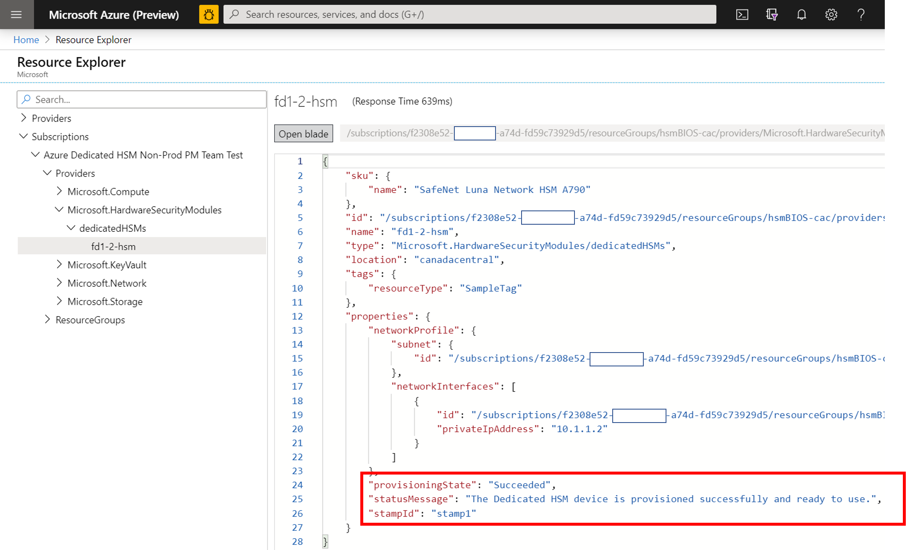
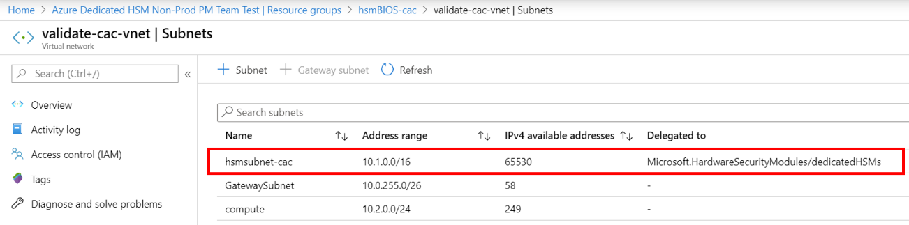
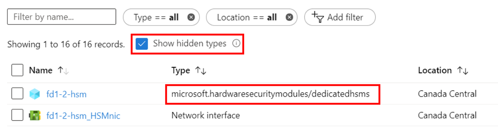
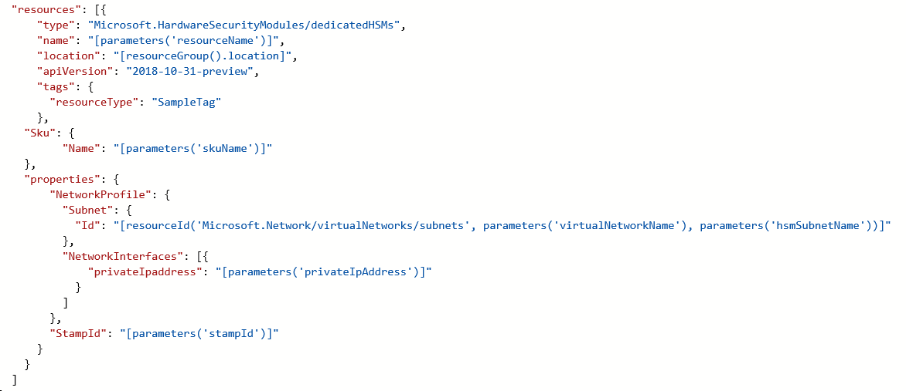

---
title: What is Dedicated HSM? - Azure Dedicated HSM | Microsoft Docs
description: Overview of Azure Dedicated HSM provides key storage capabilities within Azure that meets FIPS 140-2 Level 3 certification
services: dedicated-hsm
author: msmbaldwin
manager: rkarlin
tags: azure-resource-manager

ms.service: key-vault
ms.workload: identity
ms.tgt_pltfrm: na
ms.devlang: na
ms.topic: overview
ms.custom: "mvc, seodec18"
ms.date: 12/07/2018
ms.author: mbaldwin

#Customer intent: As an IT Pro, Decision maker I am looking for key storage capability within Azure Cloud that meets FIPS 140-2 Level 3 certification and that gives me exclusive access to the hardware.

---
# Troubleshooting

The Azure Dedicated HSM service has two distinct facets. Firstly, the registration and deployment in Azure of the HSM devices with their underlying network components. Secondly, the configuration of the HSM devices in preparation for use/integration with a given workload or application. Although the Thales Luna Network HSM devices are the same in Azure as you would purchase directly from Thales, the fact they are a resource in Azure creates some unique considerations. These considerations and any resulting troubleshooting insights or best practices, are documented here to ensure high visibility and access to critical information. Once the service is in use, definitive information is available via support requests to either Microsoft or Thales directly. 

> [!NOTE]
> It should be noted that prior to performing any configuration on a newly deployed HSM device, it should be updated with any relevant patches. A specific required patch is [KB0019789](https://supportportal.gemalto.com/csm?id=kb_article_view&sys_kb_id=19a81c8bdb9a1fc8d298728dae96197d&sysparm_article=KB0019789) in Thales support portal which addresses a reboot hang issue.

## HSM Registration

Dedicated HSM is not freely available for use as it is delivering hardware resources in the cloud and hence is a precious resource that needs protecting. We therefore use a whitelisting process via email using HSMrequest@microsoft.com. 

### Getting access to Dedicated HSM

If you believe Dedicated HSM will fit your key storage requirements, then email HSMrequest@microsoft.com to request access. Outline your application, the regions you would like HSMs and the volume of HSMs you are looking for. If you work with a Microsoft representative, such as an Account Executive or Cloud Solution Architect for example, then include them in any request.

## HSM Provisioning

Provisioning an HSM device in Azure can be done via either CLI or PowerShell. When registering for the service, a sample ARM template will be provided and assistance will be given for initial customization. 

### HSM Deployment Failure Information

Dedicated HSM supports CLI and PowerShell for deployment so portal based error information is limited and not verbose. Better information can be found by using the Resource Explorer. The portal home page has an icon for this and more detailed error information is available. This information helps a lot if pasted in when creating a support request related to deployment issues.



### HSM Subnet Delegation
The number one reason for deployment failures is forgetting to set the appropriate delegation for the customer defined subnet on which the HSMs will be provisioned. Setting that delegation is part of the VNet and subnet prerequisites for deployment and more details can be found in the tutorials.



### HSM Deployment Race Condition

The standard ARM template provided for deployment has HSM and ExpressRoute gateway related resources. Networking resources are a dependency for successful HSM deployment and timing can be crucial.  Occasionally, we have seen deployment failures related to dependency issues and rerunning the deployment often solves the issue. If not, deleting resources and then redeploying is often successful. After attempting this and still finding issue, raise a support request in the Azure portal selecting the problem type of "Issues configuring the Azure setup".

### HSM Deployment Using Terraform

A few customers have used Terraform as an automation environment instead of ARM templates as supplied when registering for this service. The HSMs cannot be deployed this way but the dependent networking resources can. Terraform has a module to call out to a minimal ARM template that jut has the HSM deployment.  In this situation, care should be taken to ensure networking resources such as the required ExpressRoute Gateway are fully deployed before deploying HSMs. The following CLI command can be used to test for completed deployment and integrated as required. Replace the angle bracket place holders for your specific naming. You should look for a result of "provisioningState is Succeeded"

```azurecli
az resource show --ids /subscriptions/<subid>/resourceGroups/<myresourcegroup>/providers/Microsoft.Network/virtualNetworkGateways/<myergateway>
```

### Deployment failure based on quota
Deployments can fail if you exceed 2 HSMs per stamp and 4 HSMs per region. To avoid this situation, ensure you have deleted resources from previously failed deployments before deploying again. Refer to the "How do I see HSMs" item below to check resources. If you believe you need to exceed this quota, which is primarily there as a safeguard, then please email HSMrequest@microsoft.com with details.

### Deployment failure based on capacity
When a particular stamp or region is becoming full, that is, nearly all free HSMs are provisioned, this can lead to deployment failures. Each stamp has 11 HSMs available for customers, which means 22 per region. There are also 3 spares and 1 test device in each stamp. If you believe you may have hit a limit, then email HSMrequest@microsoft.com for information on fill-level of specific stamps.

###  How do I see HSMs when provisioned?
Due to Dedicated HSM being a whitelisted service, it is considered a "Hidden Type" in the Azure portal. To see the HSM resources, you must check the "Show hidden types" check box as shown below. The NIC resource always follows the HSM and is a good place to find out the IP address of the HSM prior to using SSH to connect.



## Networking Resources

Deployment of Dedicated HSM has a dependency on networking resources and some consequential limitations to be aware of.

### Provisioning ExpressRoute

Dedicated HSM uses ExpressRoute Gateway as a "tunnel" for communication between the customer private IP address space and the physical HSM in an Azure datacenter.  Considering there is a restriction of one gateway per Vnet, customers requiring connection to their on-premises resources via ExpressRoute, will have to use another Vnet for that connection.  

### HSM Private IP Address

The sample templates provided for Dedicated HSM assume the HSM IP will be automatically taken from a given subnet range. You can specify an explicit IP address for the HSM via a "NetworkInterfaces" attribute in the ARM template. 



## HSM Initialization

Initialization prepares a new HSM for use, or an existing HSM for reuse. Initialization of the HSM must be complete before you can generate or store objects, allow clients to connect, or perform cryptographic operations.

### Lost Credentials

Loss of the Shell administrator password will result in loss of HSM key material. A support request should be made to reset the HSM.
When initializing the HSM, securely store credentials. Shell and HSM credentials should be kept in accordance with your company's policies.

### Failed Logins

Providing incorrect credentials to HSMs can have destructive consequences. The following are default behaviors for HSM Roles.

| Role | Threshold (# of tries) | Result of too many bad login attempts | Recovery |
|--|--|--|--|
| HSM SO | 3 |  HSM is zeroized (all HSM objects identities, and all partitions are gone)  |  HSM must be reinitialized. Contents can be restored from backup(s). | 
| Partition SO | 10 |  Partition is zeroized. |  Partition must be reinitialized. Contents can be restored from backup. |  
| Audit | 10 | Lockout | Unlocked automatically after 10 minutes. |  
| Crypto Officer | 10 (can be decreased) | If HSM policy 15: Enable SO reset of partition PIN is set to 1 (enabled), the CO and CU roles are locked out.<br>If HSM policy 15: Enable SO reset of partition PIN is set to 0 (disabled), the CO and CU roles are permanently locked out and the partition contents are no longer accessible. This is the default setting. | CO role must be unlocked and the credential reset by the Partition SO, using `role resetpw -name co`.<br>The partition must be reinitialized, and key material restored from a backup device. |  

## HSM Configuration 

The following items are situation where configuration errors are either common or have an impact that is worthy of calling out:

### HSM Documentation and Software
Software and documentation for the Thales SafeNet Luna 7 HSM devices is not available from Microsoft and must be downloaded from Thales directly. Registration is required using the Thales Customer ID received during the registration process. The devices, as provided by Microsoft, have software version 7.2 and firmware version 7.0.3. Early in 2020 Thales made documentation public and it can be found [here](https://thalesdocs.com/gphsm/luna/7.2/docs/network/Content/Home_network.htm).  

### HSM Networking Configuration

Be careful when configuring the networking within the HSM.  The HSM has a connection via the ExpressRoute Gateway from a customer private IP address space directly to the HSM.  This communication channel is for customer communication only and Microsoft has no access. If the HSM is configured in a such a way that this network path is impacted, that means all communication with the HSM is removed.  In this situation, the only option is to raise a Microsoft support request via the Azure portal to have the device reset. This reset procedure sets the HSM back to its initial state and all configuration and key material is lost.  Configuration must be recreated and when the device joins the HA group it will get key material replicated.  

### HSM Device Reboot

Some configuration changes require the HSM to be power cycled or rebooted. Microsoft testing of the HSM in Azure determined that on some occasions the reboot could stop responding. The implication is that a support request must be created in the Azure portal requesting hard-reboot and that could take up to 48 hours to complete considering it's a manual process in an Azure datacenter.  To avoid this situation, ensure you have deployed the reboot patch available from Thales directly. Refer to [KB0019789](https://supportportal.gemalto.com/csm?sys_kb_id=d66911e2db4ffbc0d298728dae9619b0&id=kb_article_view&sysparm_rank=1&sysparm_tsqueryId=d568c35bdb9a4850d6b31f3b4b96199e&sysparm_article=KB0019789) in the Thales Luna Network HSM 7.2 Downloads for a recommended patch for a reboot hang issue (Note: you will need to have registered in the Thales support portal to download).

### NTLS Certificates out of sync
A client may lose connectivity to an HSM when a certificate expires or has been overwritten through configuration updates. The certificate exchange client configuration should be reapplied with each HSM.
Example NTLS logging with invalid certificate:

> NTLS[8508]: info : 0 : Incoming connection request... : 192.168.50.2/59415
> NTLS[8508]: Error message from SSLAccept is : error:14094418:SSL routines:ssl3_read_bytes:tlsv1 alert unknown ca
> NTLS[8508]: Error during SSL accept ( RC_SSL_ERROR )
> NTLS[8508]: info : 0xc0000711 : Fail to establish a secure channel with client : 192.168.50.2/59415 : RC_SSL_FAILED_HANDSHAKE
> NTLS[8508]: info : 0 : NTLS Client "Unknown host name" Connection instance removed : 192.168.50.2/59415

### Failed TCP Communication

Communication from the Luna Client installation to the HSM requires at a minimum TCP port 1792. Consider this as any network configurations are changed in the environment.

### Failed HA Group Member Doesn't Recover

If a failed HA Group member doesn't recover, it must be manually recovered from the Luna client using the command hagroup recover.
It is necessary to configure a retry count for an HA group to enable auto recover. By default an HA group will not attempt to recover an HA member into the group when it recovers.

### HA Group Doesn't Sync

In the case where member partitions do not have the same cloning domain, the ha synchronize command will display the following:
Warning: Synchronize may fail.  The members in slot 0 and slot 1 have conflicting settings for private key cloning.
A new partition with the correct cloning domain should be added to the HA group, followed by removing the incorrectly configured partition.

## HSM Deprovisioning 

Only when fully finished with an HSM can it be deprovisioned and then Microsoft will reset it and return it to a free pool. 

### How to delete an HSM resource

The Azure resource for an HSM cannot be deleted unless the HSM is in a "zeroized" state.  Hence, all key material must have been deleted prior to trying to delete it as a resource. The quickest way to zeroize is to get the HSM admin password wrong 3 times (note: this refers to the HSM admin and not appliance level admin). The Luna shell does have a `hsm -factoryreset` command that zeroizes but it can only be executed via console on the serial port and customers do not have access to this.

## Next steps

This article has provided insight into areas across the HSM deployment lifecycle that may have issues or require troubleshooting or careful consideration. Hopefully this article helps you avoid unnecessary delays and frustration, and if you have relevant additions or changes, then raise a support request with Microsoft and let us know. 
