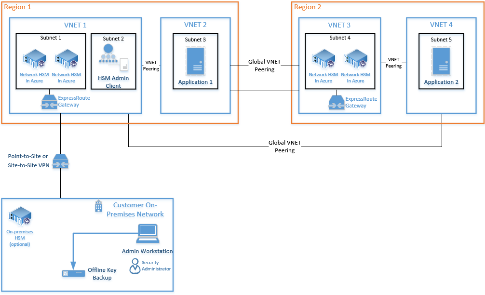
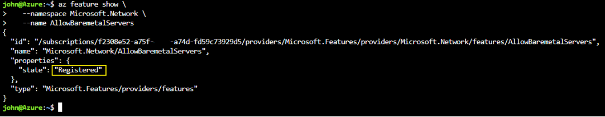
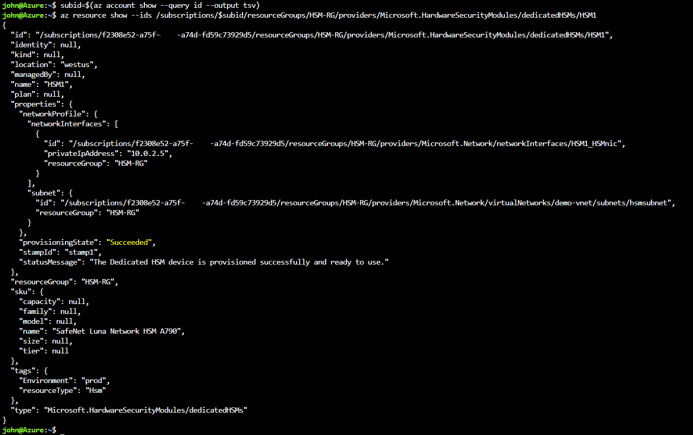
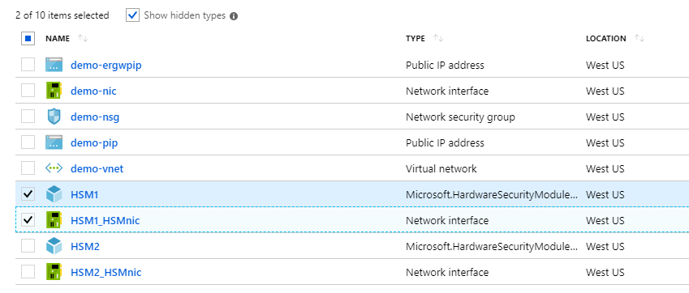
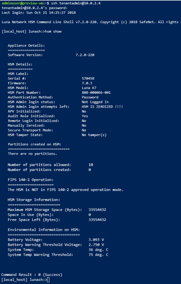

---
title: Tutorial deploy into an existing virtual network using the Azure CLI - Azure Dedicated HSM | Microsoft Docs
description: Tutorial showing how to deploy a dedicated HSM using the CLI into an existing virtual network
services: dedicated-hsm
documentationcenter: na
author: barclayn
manager: barbkess
editor: ''

ms.service: key-vault
ms.topic: tutorial
ms.custom: "mvc, seodec18"
ms.tgt_pltfrm: na
ms.workload: na
ms.date: 12/07/2018
ms.author: barclayn
---

# Tutorial: Deploying HSMs into an existing virtual network using CLI

Azure Dedicated HSM provides a physical device for sole customer use, with complete administrative control and full management responsibility. The use of physical devices creates the need for Microsoft to control device allocation to ensure capacity is managed effectively. As a result, within an Azure subscription, the Dedicated HSM service will not normally be visible for resource provisioning. Any Azure customer requiring access to the Dedicated HSM service, must first contact their Microsoft account executive to request registration for the Dedicated HSM service. Only once this process completes successfully will provisioning be possible. 

This tutorial shows a typical provisioning process where:

- A customer has a virtual network already
- They have a virtual machine
- They need to add HSM resources into that existing environment.

A typical, high availability, multi-region deployment architecture may look as follows:



This tutorial focuses on a pair of HSMs and required ExpressRoute Gateway (see Subnet 1 above) being integrated into an existing virtual network (see VNET 1 above).  All other resources are standard Azure resources. The same integration process can be used for HSMs in subnet 4 on VNET 3 above.

## Prerequisites

Azure Dedicated HSM is not currently available in the Azure portal. All interaction with the service will be via command-line or using PowerShell. This tutorial will use the command-line (CLI) interface in the Azure Cloud Shell. If you are new to the Azure CLI, follow getting started instructions here: [Azure CLI 2.0 Get Started](https://docs.microsoft.com/cli/azure/get-started-with-azure-cli?view=azure-cli-latest).

Assumptions:

- You completed the Azure Dedicated HSM registration process
- You have been approved for use of the service. If not, contact your Microsoft account representative for details.
- You created a Resource Group for these resources and the new ones deployed in this tutorial will join that group.
- You already created the necessary virtual network, subnet, and virtual machines as per the diagram above and now want to integrate 2 HSMs into that deployment.

All instructions below assume that you have already navigated to the Azure portal and you have opened the Cloud Shell (select “\>\_” towards the top right of the portal).

## Provisioning a Dedicated HSM

Provisioning HSMs and integrating them into an existing virtual network via ExpressRoute Gateway will be validated using ssh. This validation helps ensure reachability and basic availability of the HSM device for any further configuration activities. The following commands will use an Azure Resource Manager template to create the HSM resources and associated networking resources.

### Validating Feature Registration

As mentioned above, any provisioning activity requires that the Dedicated HSM service is registered for your subscription. To validate that, run the following commands in the Azure portal cloud shell.

```azurecli
az feature show \
   --namespace Microsoft.HardwareSecurityModules \
   --name AzureDedicatedHSM
```

The following command verifies the networking features required for the Dedicated HSM service.

```azurecli
az feature show \
   --namespace Microsoft.Network \
   --name AllowBaremetalServers
```

Both commands should return a status of “Registered” (as shown below). If the commands don't return "Registered" you need to register for this service, contact your Microsoft account representative.



### Creating HSM resources

An HSM is provisioned into a customers’ virtual network so a virtual network and subnet are required. A dependency for the HSM to enable communication between the virtual network and physical device is an ExpressRoute Gateway, and finally a virtual machine is required to access the HSM device using the Gemalto client software. These resources have been collected into a template file, with corresponding parameter file, for ease of use. The files are available by contacting Microsoft directly as HSMrequest@Microsoft.com.

Once you have the files, you must edit the parameter file to insert your preferred names for resources. Edit lines with “value”: “”.

- `namingInfix` Prefix for names of HSM resources
- `ExistingVirtualNetworkName` Name of the virtual network used for the HSMs
- `DedicatedHsmResourceName1` Name of HSM resource in datacenter stamp 1
- `DedicatedHsmResourceName2` Name of HSM resource in datacenter stamp 2
- `hsmSubnetRange` Subnet IP Address range for HSMs
- `ERSubnetRange` Subnet IP Address range for VNET gateway

An example of these changes is as follows:

```json
{
"$schema": "https://schema.management.azure.com/schemas/2015-01-01/deploymentTemplate.json",
  "contentVersion": "1.0.0.0",
  "parameters": {
    "namingInfix": {
      "value": "MyHSM"
    },
    "ExistingVirtualNetworkName": {
      "value": "MyHSM-vnet"
    },
    "DedicatedHsmResourceName1": {
      "value": "HSM1"
    },
    "DedicatedHsmResourceName2": {
      "value": "HSM2"
    },
    "hsmSubnetRange": {
      "value": "10.0.2.0/24"
    },
    "ERSubnetRange": {
      "value": "10.0.255.0/26"
    },
  }
}
```

The associated Azure Resource Manager template file will create 6 resources with this information:

- A subnet for the HSMs in the specified VNET
- A subnet for the virtual network gateway
- A virtual network gateway that connects the VNET to the HSM devices
- A public IP address for the gateway
- An HSM in stamp 1
- An HSM in stamp 2

Once parameter values are set, the files need to be uploaded to Azure portal cloud shell file share for use. In the Azure portal, click the “\>\_” cloud shell symbol top right and this will make the bottom portion of the screen a command environment. The options for this are BASH and PowerShell and you should select BASH if not already set.

The command shell has an upload/download option on the toolbar and you should select this to upload the template and parameter files to your file share:


Once the files are uploaded, you are ready to create resources. Prior to creating new HSM resources there are some pre-requisite resources you should ensure are in place. You must have a virtual network with subnet ranges for compute, HSMs, and gateway. The following commands serve as an example of what would create such a virtual network.

```azurecli
az network vnet create \
  --name myHSM-vnet \
  --resource-group myRG \
  --address-prefix 10.2.0.0/16
  --subnet-name compute
  --subnet-prefix 10.2.0.0/24
```

```azurecli
--vnet-name myHSM-vnet \
  --resource-group myRG \
  --name hsmsubnet \
  --address-prefixes 10.2.1.0/24 \
  --delegations Microsoft.HardwareSecurityModules/dedicatedHSMs
```

```azurecli
az network vnet subnet create \
  --vnet-name myHSM-vnet \
  --resource-group myRG \
  --name GatewaySubnet \
  --address-prefixes 10.2.255.0/26
```

>[!NOTE]
>The most important configuration to note for the virtual network, is that the subnet for the HSM device must have delegations set to “Microsoft.HardwareSecurityModules/dedicatedHSMs”.  The HSM provisioning will not work without this option being set.

Once all pre-requisites are in place, run the following command to use the Azure Resource Manager template ensuring you have updated values with your unique names (at least the resource group name):

```azurecli
az group deployment create \
   --resource-group myRG  \
   --template-file ./Deploy-2HSM-toVNET-Template.json \
   --parameters ./Deploy-2HSM-toVNET-Params.json \
   --name HSMdeploy \
   --verbose
```

This deployment should take approximately 25 to 30 minutes to complete with the bulk of that time being the HSM devices


When the deployment completes successfully “provisioningState”: “Succeeded” will be displayed. You can connect to your existing virtual machine and use SSH to ensure availability of the HSM device.

## Verifying the Deployment

To verify the devices have been provisioned and see device attributes, run the following command set. Ensure the resource group is set appropriately and the resource name is exactly as you have in the parameter file.

```azurecli
subid=$(az account show --query id --output tsv)
az resource show \
   --ids /subscriptions/$subid/resourceGroups/myRG/providers/Microsoft.HardwareSecurityModules/dedicatedHSMs/HSM1
az resource show \
   --ids /subscriptions/$subid/resourceGroups/myRG/providers/Microsoft.HardwareSecurityModules/dedicatedHSMs/HSM2
```



You will also now be able to see the resources using the [Azure resource explorer](https://resources.azure.com/).   Once in the explorer, expand “subscriptions” on the left, expand your specific subscription for Dedicated HSM, expand “resource groups”, expand the resource group you used and finally select the “resources” item.

## Testing the Deployment

Testing the deployment is a case of connecting to a virtual machine that can access the HSM(s) and then connecting directly to the HSM device. These actions will confirm the HSM is reachable.
The ssh tool is used to connect to the virtual machine. The command will be similar to the following but with the administrator name and dns name you specified in the parameter.

`ssh adminuser@hsmlinuxvm.westus.cloudapp.azure.com`

The IP Address of the VM could also be used in place of the DNS name in the above command. If the command is successful, it will prompt for a password and you should enter that. Once logged on to the virtual machine, you can sign in to the HSM using the private IP address found in the portal for the network interface resource associated with the HSM.



>[!NOTE]
>Notice the “Show hidden types” checkbox, which when selected will display HSM resources.

In the screenshot above, clicking the “HSM1_HSMnic” or “HSM2_HSMnic” would show the appropriate Private IP Address. Otherwise, the `az resource show` command used above is a way to identify the right IP Address. 

When you have the correct IP address, run the following command substituting that address:

`ssh tenantadmin@10.0.2.4`

If successful you will be prompted for a password. The default password is PASSWORD and the HSM will first ask you to change your password so set a strong password and use whatever mechanism your organization prefers to store the password and prevent loss.

>[!IMPORTANT]
>if you lose this password, the HSM will have to be reset and that means losing your keys.

When you are connected to the HSM using ssh, run the following command to ensure the HSM is operational.

`hsm show`

The output should look as shown on the image below:



At this point, you have allocated all resources for a highly available, two HSM deployment and validated access and operational state. Any further configuration or testing involves more work with the HSM device itself. For this, you should follow the instructions in the Gemalto Luna Network HSM 7 Administration Guide chapter 7 to initialize the HSM and create partitions. All documentation and software are available directly from Gemalto for download once you are registered in the Gemalto Customer Support Portal and have a Customer ID. Download Client Software version 7.2 to get all required components.

## Delete or clean up resources

If you have finished with just the HSM device, then it can be deleted as a resource and returned to the free pool. The obvious concern when doing this is any sensitive customer data that is on the device. To remove sensitive customer data the device should be factory reset using the Gemalto client. Refer to the Gemalto administrators guide for the SafeNet Network Luna 7 device and consider the following commands in order.

1. `hsm factoryReset -f`
2. `sysconf config factoryReset -f -service all`
3. `network interface delete -device eth0`
4. `network interface delete -device eth1`
5. `network interface delete -device eth2`
6. `network interface delete -device eth3`
7. `my file clear -f`
8. `my public-key clear -f`
9. `syslog rotate`


> [!NOTE]
> if you have issue with any Gemalto device configuration you should contact [Gemalto customer support](https://safenet.gemalto.com/technical-support/).


If you have finished with resources in this resource group, then you can remove them all with the following command:

```azurecli
az group deployment delete \
   --resource-group myRG \
   --name HSMdeploy \
   --verbose

```

## Next steps

After completing the steps in the tutorial, Dedicated HSM resources are provisioned and you have a virtual network with necessary HSMs and further network components to enable communication with the HSM.  You are now in a position to compliment this deployment with more resources as required by your preferred deployment architecture. For more information on helping plan your deployment, see the Concepts documents.
A design with two HSMs in a primary region addressing availability at the rack level, and two HSMs in a secondary region addressing regional availability is recommended. The template file used in this tutorial can easily be used as a basis for a two HSM deployment but needs to have its parameters modified to meet your requirements.

* [High Availability](high-availability.md)
* [Physical Security](physical-security.md)
* [Networking](networking.md)
* [Supportability](supportability.md)
* [Monitoring](monitoring.md)
