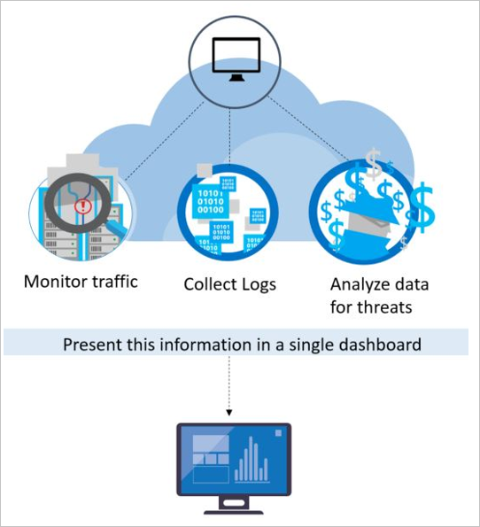

# Security alerts and incidents

This article describes security alerts and notifications in Microsoft Defender for Cloud.

## What are security alerts?

Security alerts are the notifications generated by Defender for Cloud's workload protection plans when threats are identified in your Azure, hybrid, or multicloud environments.

- Security alerts are triggered by advanced detections available when you enable [Defender plans](defender-for-cloud-introduction.md#protect-cloud-workloads) for specific resource types.
- Each alert provides details of affected resources, issues, and remediation steps.
- Defender for Cloud classifies alerts and prioritizes them by severity.
- Alerts are displayed in the portal for 90 days, even if the resource related to the alert was deleted during that time. This is because the alert might indicate a potential breach to your organization that needs to be further investigated.
- Alerts can be exported to CSV format.
- Alerts can also be streamed directly to a Security Information and Event Management (SIEM) such as Microsoft Sentinel, Security Orchestration Automated Response (SOAR), or IT Service Management (ITSM) solution.
- Defender for Cloud leverages the [MITRE Attack Matrix](https://attack.mitre.org/matrices/enterprise/) to associate alerts with their perceived intent, helping formalize security domain knowledge.

### How are alerts classified?

Alerts have a severity level assigned to help prioritize how to attend to each alert. Severity is based on:

- The specific trigger
- The confidence level that there was malicious intent behind the activity that led to the alert

| Severity          | Recommended response                                                                                                                                                                                                                                                                                                                                                                                                                                             |
|-------------------|------------------------------------------------------------------------------------------------------------------------------------------------------------------------------------------------------------------------------------------------------------------------------------------------------------------------------------------------------------------------------------------------------------------------------------------------------------------|
| **High**          | There is a high probability that your resource is compromised. You should look into it right away. Defender for Cloud has high confidence in both the malicious intent and in the findings used to issue the alert. For example, an alert that detects the execution of a known malicious tool such as Mimikatz, a common tool used for credential theft.                                                                                                           |
| **Medium**        | This is probably a suspicious activity might indicate that a resource is compromised. Defender for Cloud's confidence in the analytic or finding is medium and the confidence of the malicious intent is medium to high. These would usually be machine learning or anomaly based detections, for example a sign-in attempt from an unusual location.                                                                                                            |
| **Low**           | This might be a benign positive or a blocked attack. Defender for Cloud isn't confident enough that the intent is malicious and the activity might be innocent. For example, log clear is an action that might happen when an attacker tries to hide their tracks, but in many cases is a routine operation performed by admins. Defender for Cloud doesn't usually tell you when attacks were blocked, unless it's an interesting case that we suggest you look into. |
| **Informational** | An incident is typically made up of a number of alerts, some of which might appear on their own to be only informational, but in the context of the other alerts might be worthy of a closer look.                                                                                                                                                                                                                                                               |

## What are security incidents?

**A security incident** is a collection of related alerts.

Incidents provide you with a single view of an attack and its related alerts, so that you can quickly understand the actions an attacker took, and the affected resources.

As the breath of threat coverage grows, so does the need to detect even the slightest compromise. It's challenging for security analysts to triage different alerts and identify an actual attack. By correlating alerts and low fidelity signals into security incidents, Defender for Cloud helps analysts cope with this alert fatigue.

In the cloud, attacks can occur across different tenants, Defender for Cloud can combine AI algorithms to analyze attack sequences that are reported on each Azure subscription. This technique identifies the attack sequences as prevalent alert patterns, instead of just being incidentally associated with each other.

During an investigation of an incident, analysts often need extra context to reach a verdict about the nature of the threat and how to mitigate it. For example, even when a network anomaly is detected, without understanding what else is happening on the network or with regard to the targeted resource, it's difficult to understand what actions to take next. To help, a security incident can include artifacts, related events, and information. The additional information available for security incidents varies, depending on the type of threat detected and the configuration of your environment.

### Correlating alerts into incidents

Defender for Cloud correlates alerts and contextual signals into incidents.

- Correlation looks at different signals across resources and combines security knowledge and AI to analyze alerts, discovering new attack patterns as they occur.
- By using the information gathered for each step of an attack, Defender for Cloud can also rule out activity that appears to be steps of an attack, but actually isn't.

> [!TIP]
> In the [incidents reference](incidents-reference.md), review the list of security incident that can be produced by incident correlation.

## How does Defender for Cloud detect threats?

To detect real threats and reduce false positives, Defender for Cloud monitors resources, collects, and analyzes data for threats, often correlating data from multiple sources.

### Microsoft initiatives

Microsoft Defender for Cloud benefits from having security research and data science teams throughout Microsoft who continuously monitor for changes in the threat landscape. This includes the following initiatives:

- **Microsoft security specialists**: Ongoing engagement with teams across Microsoft that work in specialized security fields, like forensics and web attack detection.

- **Microsoft security research**: Our researchers are constantly on the lookout for threats. Because of our global presence in the cloud and on-premises, we have access to an expansive set of telemetry. The wide-reaching and diverse collection of datasets enables us to discover new attack patterns and trends across our on-premises consumer and enterprise products, as well as our online services. As a result, Defender for Cloud can rapidly update its detection algorithms as attackers release new and increasingly sophisticated exploits. This approach helps you keep pace with a fast moving threat environment.

- **Threat intelligence monitoring**: Threat intelligence includes mechanisms, indicators, implications, and actionable advice about existing or emerging threats. This information is shared in the security community and Microsoft continuously monitors threat intelligence feeds from internal and external sources.

- **Signal sharing**: Insights from security teams across Microsoft's broad portfolio of cloud and on-premises services, servers, and client endpoint devices are shared and analyzed.

- **Detection tuning**: Algorithms are run against real customer data sets and security researchers work with customers to validate the results. True and false positives are used to refine machine learning algorithms.

These combined efforts culminate in new and improved detections, which you can benefit from instantly – there's no action for you to take.

### Security analytics

Defender for Cloud employs advanced security analytics, which go far beyond signature-based approaches. Breakthroughs in big data and [machine learning](https://azure.microsoft.com/blog/machine-learning-in-azure-security-center/) technologies are leveraged to evaluate events across the entire cloud fabric – detecting threats that would be impossible to identify using manual approaches and predicting the evolution of attacks. These security analytics include:

## Integrated threat intelligence

 Microsoft has an immense amount of global threat intelligence. Telemetry flows in from multiple sources, such as Azure, Microsoft 365, Microsoft CRM online, Microsoft Dynamics AX, outlook.com, MSN.com, the Microsoft Digital Crimes Unit (DCU), and Microsoft Security Response Center (MSRC). Researchers also receive threat intelligence information that is shared among major cloud service providers and feeds from other third parties. Microsoft Defender for Cloud can use this information to alert you to threats from known bad actors.

### Behavioral analytics

Behavioral analytics is a technique that analyzes and compares data to a collection of known patterns. However, these patterns are not simple signatures. They are determined through complex machine learning algorithms that are applied to massive datasets. They are also determined through careful analysis of malicious behaviors by expert analysts. Microsoft Defender for Cloud can use behavioral analytics to identify compromised resources based on analysis of virtual machine logs, virtual network device logs, fabric logs, and other sources.

### Anomaly detection

Defender for Cloud also uses anomaly detection to identify threats. In contrast to behavioral analytics that depends on known patterns derived from large data sets, anomaly detection is more "personalized" and focuses on baselines that are specific to your deployments. Machine learning is applied to determine normal activity for your deployments and then rules are generated to define outlier conditions that could represent a security event.

## Exporting alerts

You have a range of options for viewing your alerts outside of Defender for Cloud, including:

- **Download CSV report** on the alerts dashboard provides a one-time export to CSV.
- **Continuous export** from Environment settings allows you to configure streams of security alerts and recommendations to Log Analytics workspaces and Event Hubs. [Learn more](continuous-export.md).
- **Microsoft Sentinel connector** streams security alerts from Microsoft Defender for Cloud into Microsoft Sentinel. [Learn more](../sentinel/connect-azure-security-center.md).

Learn about [streaming alerts to a SIEM, SOAR, or IT Service Management solution](export-to-siem.md) and how to [continuously export data](continuous-export.md).

## Next steps

In this article, you learned about the different types of alerts available in Defender for Cloud. For more information, see:

- [Security alerts in Azure Activity log](https://go.microsoft.com/fwlink/?linkid=2114113) - In addition to being available in the Azure portal or programmatically, Security alerts and incidents are audited as events in Azure Activity Log
- [Reference table of Defender for Cloud alerts](alerts-reference.md)
- [Respond to security alerts](managing-and-responding-alerts.md#respond-to-security-alerts)
- Learn how to [manage security incidents in Defender for Cloud](incidents.md).
