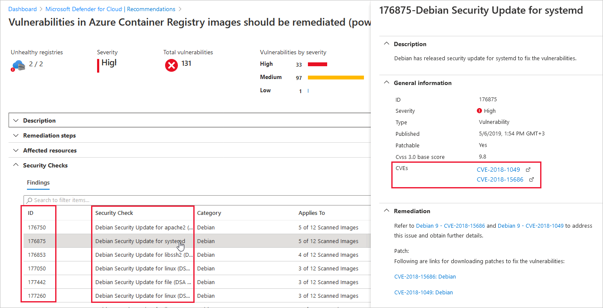

# Use asset inventory to manage your resources' security posture

The asset inventory page of Microsoft Defender for Cloud shows the [security posture](concept-cloud-security-posture-management.md) of the resources you've connected to Defender for Cloud. Defender for Cloud periodically analyzes the security state of resources connected to your subscriptions to identify potential security issues and provides you with active recommendations. Active recommendations are recommendations that can be resolved to improve your security posture.

Use this view and its filters to address such questions as:

- Which of my subscriptions with [Defender plans](defender-for-cloud-introduction.md#protect-cloud-workloads) enabled have outstanding recommendations?
- Which of my machines with the tag 'Production' are missing the Log Analytics agent?
- How many of my machines tagged with a specific tag have outstanding recommendations?
- Which machines in a specific resource group have a known vulnerability (using a CVE number)?

The security recommendations on the asset inventory page are also shown in the **Recommendations** page, but here they're shown according to the affected resource. Learn more about [implementing security recommendations](review-security-recommendations.md).

## Availability

|Aspect|Details|
|----|:----|
|Release state:|General availability (GA)|
|Pricing:|Free<br> Some features of the inventory page, such as the [software inventory](#access-a-software-inventory) require paid solutions to be in-place|
|Required roles and permissions:|All users|
|Clouds:|:::image type="icon" source="./media/icons/yes-icon.png"::: Commercial clouds<br>:::image type="icon" source="./media/icons/yes-icon.png"::: National (Azure Government, Microsoft Azure operated by 21Vianet) <br> <br> Software inventory isn't currently supported in national clouds.|

## What are the key features of asset inventory?

The inventory page provides the following tools:

:::image type="content" source="media/asset-inventory/highlights-of-inventory.png" alt-text="Main features of the asset inventory page in Microsoft Defender for Cloud." lightbox="media/asset-inventory/highlights-of-inventory.png":::

### 1 - Summaries

Before you define any filters, a prominent strip of values at the top of the inventory view shows:

- **Total resources**: The total number of resources connected to Defender for Cloud.
- **Unhealthy resources**: Resources with active security recommendations that you can implement. [Learn more about implementing security recommendations](review-security-recommendations.md).
- **Unmonitored resources**: Resources with agent monitoring issues - they have the Log Analytics agent deployed, but the agent isn't sending data or has other health issues.
- **Unregistered subscriptions**: Any subscription in the selected scope that hasn't yet been connected to Microsoft Defender for Cloud.

### 2 - Filters

The multiple filters at the top of the page provide a way to quickly refine the list of resources according to the question you're trying to answer. For example, if you wanted to know which of your machines with the tag 'Production' are missing the Log Analytics agent, you can filter the list for **Agent monitoring**:"Not installed" and **Tags**:"Production".

As soon as you've applied filters, the summary values are updated to relate to the query results.

### 3 - Export and asset management tools

**Export options** - Inventory includes an option to export the results of your selected filter options to a CSV file. You can also export the query itself to Azure Resource Graph Explorer to further refine, save, or modify the Kusto Query Language (KQL) query.

> [!TIP]
> The KQL documentation provides a database with some sample data together with some simple queries to get the "feel" for the language. [Learn more in this KQL tutorial](/azure/data-explorer/kusto/query/tutorial?pivots=azuredataexplorer).

**Asset management options** - When you've found the resources that match your queries, inventory provides shortcuts for operations such as:

- Assign tags to the filtered resources - select the checkboxes alongside the resources you want to tag.
- Onboard new servers to Defender for Cloud - use the **Add non-Azure servers** toolbar button.
- Automate workloads with Azure Logic Apps - use the **Trigger Logic App** button to run a logic app on one or more resources. Your logic apps have to be prepared in advance, and accept the relevant trigger type (HTTP request). [Learn more about logic apps](../logic-apps/logic-apps-overview.md).

## How does asset inventory work?

Asset inventory utilizes [Azure Resource Graph (ARG)](../governance/resource-graph/index.yml), an Azure service that lets you query Defender for Cloud's security posture data across multiple subscriptions.

ARG is designed to provide efficient resource exploration with the ability to query at scale.

You can use [Kusto Query Language (KQL)](/azure/data-explorer/kusto/query/) in the asset inventory to quickly produce deep insights by cross-referencing Defender for Cloud data with other resource properties.

## How to use asset inventory

1. From Defender for Cloud's sidebar, select **Inventory**.

1. Use the **Filter by name** box to display a specific resource, or use the filters to focus on specific resources.

    By default, the resources are sorted by the number of active security recommendations.

    > [!IMPORTANT]
    > The options in each filter are specific to the resources in the currently selected subscriptions **and** your selections in the other filters.
    >
    > For example, if you've selected only one subscription, and the subscription has no resources with outstanding security recommendations to remediate (0 unhealthy resources), the **Recommendations** filter will have no options.

    :::image type="content" source="./media/asset-inventory/filtering-to-prod-unmonitored.gif" alt-text="Using the filter options in Microsoft Defender for Cloud's asset inventory to filter resources to production resources that aren't monitored":::

1. To use the **Security findings contain** filter, enter free text from the ID, security check, or CVE name of a vulnerability finding to filter to the affected resources:

    

    > [!TIP]
    > The **Security findings contain** and **Tags** filters only accept a single value. To filter by more than one, use **Add filters**.

1. <a id="onoffpartial"></a>To use the **Defender for Cloud** filter, select one or more options (Off, On, or Partial):

    - **Off** - Resources not protected by a Microsoft Defender plan. You can right-click on the resources and upgrade them:

        :::image type="content" source="./media/asset-inventory/upgrade-resource-inventory.png" alt-text="Upgrade a resource to be protected by the relevant Microsoft Defender plan via right-click." lightbox="./media/asset-inventory/upgrade-resource-inventory.png":::

    - **On** - Resources protected by a Microsoft Defender plan
    - **Partial** - **Subscriptions** with some but not all of the Microsoft Defender plans disabled. For example, the following subscription has seven Microsoft Defender plans disabled.

        :::image type="content" source="./media/asset-inventory/pricing-tier-partial.png" alt-text="Subscription partially protected by Microsoft Defender plans.":::

1. To further examine the results of your query, select the resources that interest you.

1. To view the current selected filter options as a query in Resource Graph Explorer, select **Open query**.

    

1. If you've defined some filters and left the page open, Defender for Cloud won't update the results automatically. Any changes to resources won't impact the displayed results unless you manually reload the page or select **Refresh**.

## Access a software inventory

To access the software inventory, you'll need one of the following **paid** solutions:

- [Agentless machine scanning](concept-agentless-data-collection.md) from [Defender Cloud Security Posture Management (CSPM)](concept-cloud-security-posture-management.md).
- [Agentless machine scanning](concept-agentless-data-collection.md) from [Defender for Servers P2](plan-defender-for-servers-select-plan.md#plan-features).
- [Microsoft Defender for Endpoint integration](integration-defender-for-endpoint.md) from [Defender for Servers](defender-for-servers-introduction.md).

If you've already enabled the integration with Microsoft Defender for Endpoint and enabled Microsoft Defender for Servers, you'll have access to the software inventory.

:::image type="content" source="media/asset-inventory/software-inventory-filters.gif" alt-text="If you've enabled the threat and vulnerability solution, Defender for Cloud's asset inventory offers a filter to select resources by their installed software.":::

> [!NOTE]
> The "Blank" option shows machines without Microsoft Defender for Endpoint or without Microsoft Defender for Servers.

Besides the filters in the asset inventory page, you can explore the software inventory data from Azure Resource Graph Explorer.

Examples of using Azure Resource Graph Explorer to access and explore software inventory data:

1. Open **Azure Resource Graph Explorer**.

    :::image type="content" source="./media/multi-factor-authentication-enforcement/opening-resource-graph-explorer.png" alt-text="Launching Azure Resource Graph Explorer** recommendation page" :::

1. Select the following subscription scope: securityresources/softwareinventories

1. Enter any of the following queries (or customize them or write your own!) and select **Run query**.

    - To generate a basic list of installed software:

        ```kusto
        securityresources
        | where type == "microsoft.security/softwareinventories"
        | project id, Vendor=properties.vendor, Software=properties.softwareName, Version=properties.version
        ```

    - To filter by version numbers:

        ```kusto
        securityresources
        | where type == "microsoft.security/softwareinventories"
        | project id, Vendor=properties.vendor, Software=properties.softwareName, Version=tostring(properties.    version)
        | where Software=="windows_server_2019" and parse_version(Version)<=parse_version("10.0.17763.1999")
        ```

    - To find machines with a combination of software products:

        ```kusto
        securityresources
        | where type == "microsoft.security/softwareinventories"
        | extend vmId = properties.azureVmId
        | where properties.softwareName == "apache_http_server" or properties.softwareName == "mysql"
        | summarize count() by tostring(vmId)
        | where count_ > 1
        ```

    - Combination of a software product with another security recommendation:

        (In this example – machines having MySQL installed and exposed management ports)

        ```kusto
        securityresources
        | where type == "microsoft.security/softwareinventories"
        | extend vmId = tolower(properties.azureVmId)
        | where properties.softwareName == "mysql"
        | join (
        securityresources
        | where type == "microsoft.security/assessments"
        | where properties.displayName == "Management ports should be closed on your virtual machines" and properties.status.code == "Unhealthy"
        | extend vmId = tolower(properties.resourceDetails.Id)
        ) on vmId
        ```

## Next steps

This article described the asset inventory page of Microsoft Defender for Cloud.

For more information on related tools, see the following pages:

- [Azure Resource Graph (ARG)](../governance/resource-graph/index.yml)
- [Kusto Query Language (KQL)](/azure/data-explorer/kusto/query/)
-  View common question about [asset inventory](faq-defender-for-servers.yml)
