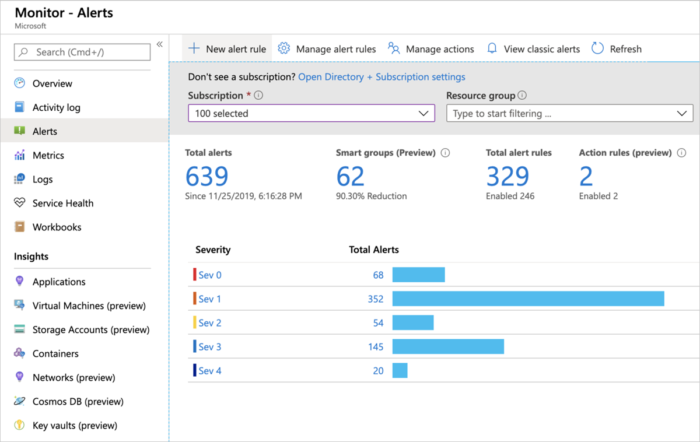
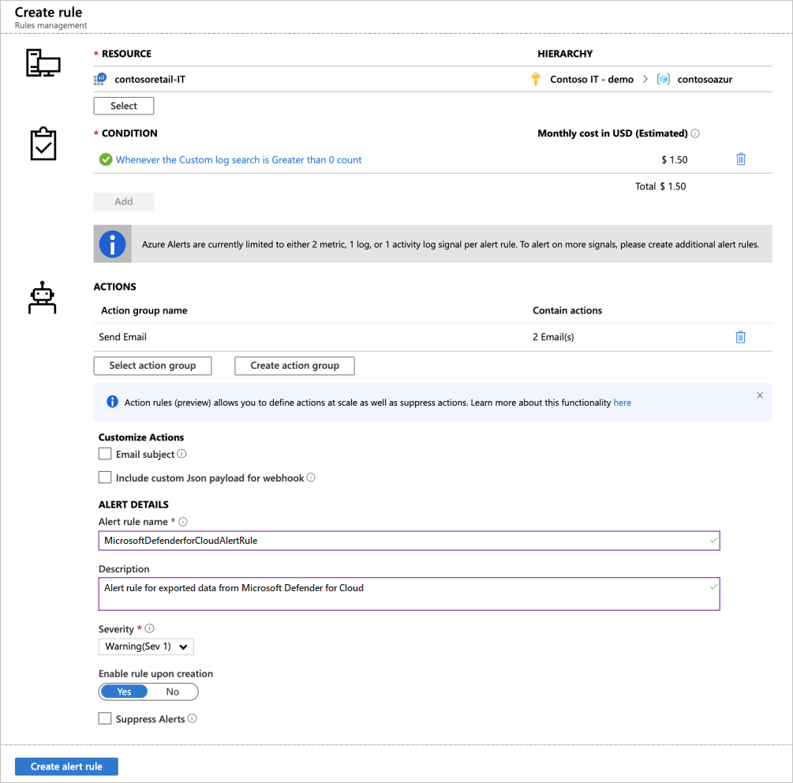

# Continuously export Microsoft Defender for Cloud data 

Microsoft Defender for Cloud generates detailed security alerts and recommendations. To analyze the information in these alerts and recommendations, you can export them to Azure Log Analytics, Event Hubs, or to another [SIEM, SOAR, or IT classic deployment model solution](export-to-siem.md). You can stream the alerts and recommendations as they're generated or define a schedule to send periodic snapshots of all of the new data.

With **continuous export**, you can fully customize what information to export and where it goes. For example, you can configure it so that:

- All high severity alerts are sent to an Azure event hub
- All medium or higher severity findings from vulnerability assessment scans of your SQL servers are sent to a specific Log Analytics workspace
- Specific recommendations are delivered to an event hub or Log Analytics workspace whenever they're generated
- The secure score for a subscription is sent to a Log Analytics workspace whenever the score for a control changes by 0.01 or more

This article describes how to configure continuous export to Log Analytics workspaces or Azure event hubs.

> [!TIP]
> Defender for Cloud also offers the option to perform a one-time, manual export to CSV. Learn more in [Manual one-time export of alerts and recommendations](#manual-one-time-export-of-alerts-and-recommendations).

## Availability

|Aspect|Details|
|----|:----|
|Release state:|General availability (GA)|
|Pricing:|Free|
|Required roles and permissions:|<ul><li>**Security admin** or **Owner** on the resource group</li><li>Write permissions for the target resource.</li><li>If you're using the [Azure Policy 'DeployIfNotExist' policies](#configure-continuous-export-at-scale-using-the-supplied-policies), you need the permissions that allow you to assign policies</li><li>To export data to Event Hubs, you need Write permission on the Event Hubs Policy.</li><li>To export to a Log Analytics workspace:<ul><li>if it **has the SecurityCenterFree solution**, you need a minimum of read permissions for the workspace solution: `Microsoft.OperationsManagement/solutions/read`</li><li>if it **doesn't have the SecurityCenterFree solution**, you need write permissions for the workspace solution: `Microsoft.OperationsManagement/solutions/action`</li><li>Learn more about [Azure Monitor and Log Analytics workspace solutions](/previous-versions/azure/azure-monitor/insights/solutions)</li></ul></li></ul>|
|Clouds:|:::image type="icon" source="./media/icons/yes-icon.png"::: Commercial clouds :::image type="icon" source="./media/icons/yes-icon.png"::: National (Azure Government, Microsoft Azure operated by 21Vianet)|

## What data types can be exported?

Continuous export can export the following data types whenever they change:

- Security alerts.
- Security recommendations.
- Security findings. Findings can be thought of as 'sub' recommendations and belong to a 'parent' recommendation. For example:
  - The recommendations [System updates should be installed on your machines (powered by Update Center)](https://portal.azure.com/#blade/Microsoft_Azure_Security/RecommendationsBlade/assessmentKey/e1145ab1-eb4f-43d8-911b-36ddf771d13f) and [System updates should be installed on your machines](https://portal.azure.com/#blade/Microsoft_Azure_Security/RecommendationsBlade/assessmentKey/4ab6e3c5-74dd-8b35-9ab9-f61b30875b27) each has one 'sub' recommendation per outstanding system update.
  - The recommendation [Machines should have vulnerability findings resolved](https://portal.azure.com/#blade/Microsoft_Azure_Security/RecommendationsBlade/assessmentKey/1195afff-c881-495e-9bc5-1486211ae03f) has a 'sub' recommendation for every vulnerability identified by the vulnerability scanner.
    > [!NOTE]
    > If you’re configuring a continuous export with the REST API, always include the parent with the findings.
- Secure score per subscription or per control.
- Regulatory compliance data.

## Set up a continuous export

You can configure continuous export from the Microsoft Defender for Cloud pages in Azure portal, via the REST API, or at scale using the supplied Azure Policy templates.

### [**Use the Azure portal**](#tab/azure-portal)

### Configure continuous export from the Defender for Cloud pages in Azure portal

If you're setting up a continuous export to Log Analytics or Azure Event Hubs:

1. From Defender for Cloud's menu, open **Environment settings**.

1. Select the specific subscription for which you want to configure the data export.

1. From the sidebar of the settings page for that subscription, select **Continuous export**.

    :::image type="content" source="./media/continuous-export/continuous-export-options-page.png" alt-text="Export options in Microsoft Defender for Cloud." lightbox="./media/continuous-export/continuous-export-options-page.png":::

    Here you see the export options. There's a tab for each available export target, either event hub or Log Analytics workspace.

1. Select the data type you'd like to export and choose from the filters on each type (for example, export only high severity alerts).

1. Select the export frequency:
    - **Streaming** – assessments are sent when a resource’s health state is updated (if no updates occur, no data is sent).
    - **Snapshots** – a snapshot of the current state of the selected data types that are sent once a week per subscription. To identify snapshot data, look for the field ``IsSnapshot``.

    If your selection includes one of these recommendations, you can include the vulnerability assessment findings together with them:
    - [SQL databases should have vulnerability findings resolved](https://portal.azure.com/#blade/Microsoft_Azure_Security/RecommendationsBlade/assessmentKey/82e20e14-edc5-4373-bfc4-f13121257c37)
    - [SQL servers on machines should have vulnerability findings resolved](https://portal.azure.com/#blade/Microsoft_Azure_Security/RecommendationsBlade/assessmentKey/f97aa83c-9b63-4f9a-99f6-b22c4398f936)
    - [Container registry images should have vulnerability findings resolved (powered by Qualys)](https://portal.azure.com/#blade/Microsoft_Azure_Security/RecommendationsBlade/assessmentKey/dbd0cb49-b563-45e7-9724-889e799fa648)
    - [Machines should have vulnerability findings resolved](https://portal.azure.com/#blade/Microsoft_Azure_Security/RecommendationsBlade/assessmentKey/1195afff-c881-495e-9bc5-1486211ae03f)
    - [System updates should be installed on your machines](https://portal.azure.com/#blade/Microsoft_Azure_Security/RecommendationsBlade/assessmentKey/4ab6e3c5-74dd-8b35-9ab9-f61b30875b27)

    To include the findings with these recommendations, enable the **include security findings** option.

    :::image type="content" source="./media/continuous-export/include-security-findings-toggle.png" alt-text="Include security findings toggle in continuous export configuration." :::

1. From the "Export target" area, choose where you'd like the data saved. Data can be saved in a target of a different subscription (for example, on a Central Event Hubs instance or a central Log Analytics workspace).

    You can also send the data to an [Event hubs or Log Analytics workspace in a different tenant](#export-data-to-an-azure-event-hubs-or-log-analytics-workspace-in-another-tenant).

1. Select **Save**.

> [!NOTE]
> Log analytics supports records that are only up to 32KB in size. When the data limit is reached, you will see an alert telling you that the `Data limit has been exceeded`.

### [**Use the REST API**](#tab/rest-api)

### Configure continuous export using the REST API

Continuous export can be configured and managed via the Microsoft Defender for Cloud [automations API](/rest/api/defenderforcloud/automations). Use this API to create or update rules for exporting to any of the following possible destinations:

- Azure Event Hubs
- Log Analytics workspace
- Azure Logic Apps

You can also send the data to an [Event Hubs or Log Analytics workspace in a different tenant](#export-data-to-an-azure-event-hubs-or-log-analytics-workspace-in-another-tenant).

Here are some examples of options that you can only use in the API:

- **Greater volume** - You can create multiple export configurations on a single subscription with the API. The **Continuous Export** page in the Azure portal supports only one export configuration per subscription.

- **Additional features** - The API offers parameters that aren't shown in the Azure portal. For example, you can add tags to your automation resource and define your export based on a wider set of alert and recommendation properties than the ones offered in the **Continuous Export** page in the Azure portal.

- **More focused scope** - The API provides a more granular level for the scope of your export configurations. When defining an export with the API, you can do so at the resource group level. If you're using the **Continuous Export** page in the Azure portal, you have to define it at the subscription level.

    > [!TIP]
    > These API-only options are not shown in the Azure portal. If you use them, there'll be a banner informing you that other configurations exist.

### [**Deploy at scale with Azure Policy**](#tab/azure-policy)

### Configure continuous export at scale using the supplied policies

Automating your organization's monitoring and incident response processes can greatly improve the time it takes to investigate and mitigate security incidents.

To deploy your continuous export configurations across your organization, use the supplied Azure Policy 'DeployIfNotExist' policies to create and configure continuous export procedures.

**To implement these policies**

1. Select the policy you want to apply from this table:

    |Goal  |Policy  |Policy ID  |
    |---------|---------|---------|
    |Continuous export to Event Hubs|[Deploy export to Event Hubs for Microsoft Defender for Cloud alerts and recommendations](https://portal.azure.com/#blade/Microsoft_Azure_Policy/PolicyDetailBlade/definitionId/%2fproviders%2fMicrosoft.Authorization%2fpolicyDefinitions%2fcdfcce10-4578-4ecd-9703-530938e4abcb)|cdfcce10-4578-4ecd-9703-530938e4abcb|
    |Continuous export to Log Analytics workspace|[Deploy export to Log Analytics workspace for Microsoft Defender for Cloud alerts and recommendations](https://portal.azure.com/#blade/Microsoft_Azure_Policy/PolicyDetailBlade/definitionId/%2fproviders%2fMicrosoft.Authorization%2fpolicyDefinitions%2fffb6f416-7bd2-4488-8828-56585fef2be9)|ffb6f416-7bd2-4488-8828-56585fef2be9|

    > [!TIP]
    > You can also find these by searching Azure Policy:
    >
    > 1. Open Azure Policy.
    > :::image type="content" source="./media/continuous-export/opening-azure-policy.png" alt-text="Accessing Azure Policy.":::
    > 2. From the Azure Policy menu, select **Definitions** and search for them by name.

1. From the relevant Azure Policy page, select **Assign**.
    :::image type="content" source="./media/continuous-export/export-policy-assign.png" alt-text="Assigning the Azure Policy.":::

1. Open each tab and set the parameters as desired:
    1. In the **Basics** tab, set the scope for the policy. To use centralized management, assign the policy to the Management Group containing the subscriptions that use continuous export configuration.
    1. In the **Parameters** tab, set the resource group and data type details.
        > [!TIP]
        > Each parameter has a tooltip explaining the options available to you.
        >
        > Azure Policy's parameters tab (1) provides access to similar configuration options as Defender for Cloud's continuous export page (2).
        > :::image type="content" source="./media/continuous-export/azure-policy-next-to-continuous-export.png" alt-text="Comparing the parameters in continuous export with Azure Policy." lightbox="./media/continuous-export/azure-policy-next-to-continuous-export.png":::
    1. Optionally, to apply this assignment to existing subscriptions, open the **Remediation** tab and select the option to create a remediation task.
1. Review the summary page and select **Create**.

---

## Exporting to a Log Analytics workspace

If you want to analyze Microsoft Defender for Cloud data inside a Log Analytics workspace or use Azure alerts together with Defender for Cloud alerts, set up continuous export to your Log Analytics workspace.

### Log Analytics tables and schemas

Security alerts and recommendations are stored in the *SecurityAlert* and *SecurityRecommendation* tables respectively.

The name of the Log Analytics solution containing these tables depends on whether you've enabled the enhanced security features: Security ('Security and Audit') or SecurityCenterFree.

> [!TIP]
> To see the data on the destination workspace, you must enable one of these solutions **Security and Audit** or **SecurityCenterFree**.

To view the event schemas of the exported data types, visit the [Log Analytics table schemas](https://aka.ms/ASCAutomationSchemas).

## Export data to an Azure Event Hubs or Log Analytics workspace in another tenant

You ***cannot*** configure data to be exported to a log analytics workspace in another tenant when using Azure Policy to assign the configuration. This process only works with the REST API, and the configuration is unsupported in the Azure portal (due to requiring multitenant context). Azure Lighthouse ***does not*** resolve this issue with Policy, although you can use Lighthouse as the authentication method.

When collecting data into a tenant, you can analyze the data from one central location.

To export data to an Azure Event Hubs or Log Analytics workspace in a different tenant:

1. In the tenant that has the Azure Event Hubs or Log Analytics workspace, [invite a user](../active-directory/external-identities/what-is-b2b.md#easily-invite-guest-users-from-the-azure-portal) from the tenant that hosts the continuous export configuration, or alternatively configure Azure Lighthouse for the source and destination tenant.
1. If using Azure AD B2B Guest access, ensure that the user accepts the invitation to access the tenant as a guest.
1. If you're using a Log Analytics Workspace, assign the user in the workspace tenant one of these roles: Owner, Contributor, Log Analytics Contributor, Sentinel Contributor, or Monitoring Contributor.
1. Create and submit the request to the Azure REST API to configure the required resources. You'll need to manage the bearer tokens in both the context of the local (workspace) and the remote (continuous export) tenant. 

## Continuously export to an event hub behind a firewall

You can enable continuous export as a trusted service, so that you can send data to an event hub that has an Azure Firewall enabled.

**To grant access to continuous export as a trusted service**:

1. Sign in to the [Azure portal](https://portal.azure.com).

1. Navigate to **Microsoft Defender for Cloud** > **Environmental settings**.

1. Select the relevant resource.

1. Select **Continuous export**.

1. Select **Export as a trusted service**.

    :::image type="content" source="media/continuous-export/export-as-trusted.png" alt-text="Screenshot that shows where the checkbox is located to select export as trusted service.":::

You need to add the relevant role assignment on the destination Event Hubs.

**To add the relevant role assignment on the destination Event Hub**:

1. Navigate to the selected Event Hubs.

1. Select **Access Control** > **Add role assignment**

    :::image type="content" source="media/continuous-export/add-role-assignment.png" alt-text="Screenshot that shows where the add role assignment button is found." lightbox="media/continuous-export/add-role-assignment.png":::

1. Select **Azure Event Hubs Data Sender**.

1. Select the **Members** tab.

1. Select **+ Select members**.

1. Search for and select **Windows Azure Security Resource Provider**.

    :::image type="content" source="media/continuous-export/windows-security-resource.png" alt-text="Screenshot that shows you where to enter and search for Microsoft Azure Security Resource Provider." lightbox="media/continuous-export/windows-security-resource.png":::

1. Select **Review + assign**.

## View exported alerts and recommendations in Azure Monitor

You might also choose to view exported Security Alerts and/or recommendations in [Azure Monitor](../azure-monitor/alerts/alerts-overview.md).

Azure Monitor provides a unified alerting experience for various Azure alerts including Diagnostic Log, Metric alerts, and custom alerts based on Log Analytics workspace queries.

To view alerts and recommendations from Defender for Cloud in Azure Monitor, configure an Alert rule based on Log Analytics queries (Log Alert):

1. From Azure Monitor's **Alerts** page, select **New alert rule**.

    

1. In the create rule page, configure your new rule (in the same way you'd configure a [log alert rule in Azure Monitor](../azure-monitor/alerts/alerts-unified-log.md)):

    - For **Resource**, select the Log Analytics workspace to which you exported security alerts and recommendations.

    - For **Condition**, select **Custom log search**. In the page that appears, configure the query, lookback period, and frequency period. In the search query, you can type *SecurityAlert* or *SecurityRecommendation* to query the data types that Defender for Cloud continuously exports to as you enable the Continuous export to Log Analytics feature.

    - Optionally, configure the [Action Group](../azure-monitor/alerts/action-groups.md) that you'd like to trigger. Action groups can trigger email sending, ITSM tickets, WebHooks, and more.
    

The Microsoft Defender for Cloud alerts or recommendations appears (depending on your configured continuous export rules and the condition you defined in your Azure Monitor alert rule) in Azure Monitor alerts, with automatic triggering of an action group (if provided).

## Manual one-time export of alerts and recommendations

To download a CSV report for alerts or recommendations, open the **Security alerts** or **Recommendations** page and select the **Download CSV report** button.

> [!TIP]
> Due to Azure Resource Graph limitations, the reports are limited to a file size of 13K rows. If you're seeing errors related to too much data being exported, try limiting the output by selecting a smaller set of subscriptions to be exported.

:::image type="content" source="./media/continuous-export/download-alerts-csv.png" alt-text="Download alerts data as a CSV file." lightbox="./media/continuous-export/download-alerts-csv.png":::

> [!NOTE]
> These reports contain alerts and recommendations for resources from the currently selected subscriptions.

## Next steps

In this article, you learned how to configure continuous exports of your recommendations and alerts. You also learned how to download your alerts data as a CSV file.

For related material, see the following documentation:

- Learn more about [workflow automation templates](https://github.com/Azure/Azure-Security-Center/tree/master/Workflow%20automation).
- [Azure Event Hubs documentation](../event-hubs/index.yml)
- [Microsoft Sentinel documentation](../sentinel/index.yml)
- [Azure Monitor documentation](../azure-monitor/index.yml)
- [Export data types schemas](https://aka.ms/ASCAutomationSchemas)
- Check out [common questions](faq-general.yml) about continuous export.
