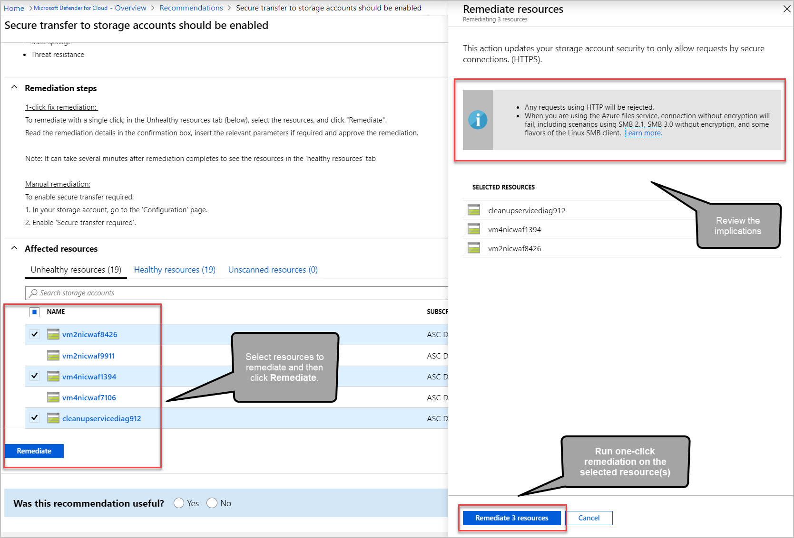

# Creat customer recommendations in Microsoft Defender for Cloud

Recommendations give you suggestions on how to better secure your resources. 

Security standards contain comprehensive sets of security recommendations to help secure your cloud environments. Security teams can use the readily available regulatory standards and also can create their own custom standards and recommendations to meet specific internal requirements.   

Microsoft Defender for Cloud provides the option of creating custom recommendations and standards for AWS and GCP using KQL queries. You can use a query editor to build and test queries over your data.  

There are three types of resources to create and manage custom recommendations: 

1. **Recommendations** – contains: 
    1. Recommendation details (name, description, severity, remediation logic, etc.) 
    1. Recommendation logic in KQL. 
    1. The standard it belongs to. 
1.  **Standard** – defines a set of recommendations. 
1.  **Standard assignment** – defines the scope which the standard evaluates (for example, specific AWS accounts). 

## Prerequisites

|Aspect|Details|
|----|:----|
|Required/Preferred Environmental Requirements| This private preview includes only AWS and GCP recommendations.   Please note that this feature is going to be part of the CSPM premium bundle in the future. |
| Required Roles & Permissions | Subscription Owner / Contributor |
|Clouds:| :::image type="icon" source="./media/icons/yes-icon.png"::: National (Azure Government, Azure China 21Vianet) Commercial clouds :::image type="icon" source="./media/icons/no-icon.png"::: National (Azure Government, Azure China 21Vianet) |

## Create a n customer standard
1. Navigate to Microsoft Defender for Cloud > environment settings. 

1. Select the relevant account / project 

1. Select ‘Standards’ 

1. Select ‘Add’ -> ‘Standard’ 

    :::image type="content" source="./media/implement-security-recommendations/security-center-remediate-recommendation.png" alt-text="Manual remediation steps for a recommendation." lightbox="./media/implement-security-recommendations/security-center-remediate-recommendation.png":::

1. Once completed, a notification appears informing you whether the issue is resolved.

## Fix button

To simplify remediation and improve your environment's security (and increase your secure score), many recommendations include a **Fix** option.

**Fix** helps you quickly remediate a recommendation on multiple resources.

To implement a **Fix**:

1. From the list of recommendations that have the **Fix** action icon :::image type="icon" source="media/implement-security-recommendations/fix-icon.png" border="false":::, select a recommendation.

    :::image type="content" source="./media/implement-security-recommendations/microsoft-defender-for-cloud-recommendations-fix-action.png" alt-text="Recommendations list highlighting recommendations with Fix action" lightbox="./media/implement-security-recommendations/microsoft-defender-for-cloud-recommendations-fix-action.png":::

1. From the **Unhealthy resources** tab, select the resources that you want to implement the recommendation on, and select **Fix**.

    > [!NOTE]
    > Some of the listed resources might be disabled, because you don't have the appropriate permissions to modify them.

1. In the confirmation box, read the remediation details and implications.

    

    > [!NOTE]
    > The implications are listed in the grey box in the **Fixing resources** window that opens after clicking **Fix**. They list what changes happen when proceeding with the **Fix**.
:::image type="content" source="media/implement-security-recommendations/fixing-resources-window.png" alt-text="Screenshot showing fixing resources window." lightbox="media/implement-security-recommendations/fixing-resources-window.png":::

1. Insert the relevant parameters if necessary, and approve the remediation.

    > [!NOTE]
    > It can take several minutes after remediation completes to see the resources in the **Healthy resources** tab. To view the remediation actions, check the [activity log](#activity-log).

1. Once completed, a notification appears informing you if the remediation succeeded.

## Fix actions logged to the activity log

The remediation operation uses a template deployment or REST API `PATCH` request to apply the configuration on the resource. These operations are logged in [Azure activity log](../azure-monitor/essentials/activity-log.md).

## Next steps

In this document, you were shown how to remediate recommendations in Defender for Cloud. To learn how  recommendations are defined and selected for your environment, see the following page:

- [What are security policies, initiatives, and recommendations?](security-policy-concept.md)
