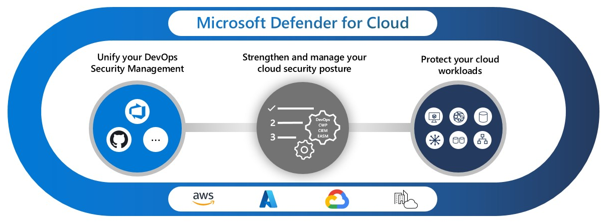

# What is Microsoft Defender for Cloud?

Microsoft Defender for Cloud is a cloud-native application protection platform (CNAPP) with a set of security measures and practices designed to protect cloud-based applications from various cyber threats and vulnerabilities. Defender for Cloud combines the capabilities of:

- A development security operations (DevSecOps) solution that unifies security management at the code level across multicloud and multiple-pipeline environments
- A cloud security posture management (CSPM) solution that surfaces actions that you can take to prevent breaches
- A cloud workload protection platform (CWPP) with specific protections for servers, containers, storage, databases, and other workloads

## Secure cloud applications

Defender for Cloud helps you to incorporate good security practices early during the software development process, or DevSecOps. You can protect your code management environments and your code pipelines, and get insights into your development environment security posture from a single location. Defender for Cloud currently includes Defender for DevOps.

Today’s applications require security awareness at the code, infrastructure, and runtime levels to make sure that deployed applications are hardened against attacks.

| Capability | What problem does it solve? | Get started | Defender plan and pricing |
| ---------- | --------------------------- | ----------- | ------------------------- |
| [Code pipeline insights](defender-for-devops-introduction.md)       | Empowers security teams with the ability to protect applications and resources from code to cloud across multi-pipeline environments, including GitHub and Azure DevOps. Findings from Defender for DevOps, such as IaC misconfigurations and exposed secrets, can then be correlated with other contextual cloud security insights to prioritize remediation in code.                            | Connect [Azure DevOps](quickstart-onboard-devops.md) and [GitHub](quickstart-onboard-github.md) repositories to Defender for Cloud             | [Defender for DevOps](https://azure.microsoft.com/pricing/details/defender-for-cloud/)                          |

## Improve your security posture

The security of your cloud and on-premises resources depends on proper configuration and deployment. Defender for Cloud recommendations identify the steps that you can take to secure your environment.

Defender for Cloud includes Foundational CSPM (Free) capabilities for free. You can also enable advanced CSPM capabilities by enabling paid Defender plans.

| Capability | What problem does it solve? | Get started | Defender plan and pricing |
| ---------- | --------------------------- | ----------- | ------------------------- |
| [Centralized policy management](security-policy-concept.md)       | Define the security conditions that you want to maintain across your environment. The policy translates to recommendations that identify resource configurations that violate your security policy. The [Microsoft cloud security benchmark](concept-regulatory-compliance.md) is a built-in standard that applies security principles with detailed technical implementation guidance for Azure, for other cloud providers (such as AWS and GCP), and for other Microsoft clouds.            | [Customize security a policy](custom-security-policies.md)                          | Foundational CSPM (Free) |
| [Secure score]( secure-score-security-controls.md) | Summarize your security posture based on the security recommendations. As you remediate recommendations, your secure score improves. | [Track your secure score](secure-score-access-and-track.md) | Foundational CSPM (Free) |
| [Multicloud coverage](plan-multicloud-security-get-started.md) | Connect to your multicloud environments with agentless methods for CSPM insight and CWP protection. | Connect your [Amazon AWS](quickstart-onboard-aws.md) and [Google GCP](quickstart-onboard-gcp.md) cloud resources to Defender for Cloud | Foundational CSPM (Free) |
| [Cloud Security Posture Management (CSPM)](concept-cloud-security-posture-management.md) | Use the dashboard to see weaknesses in your security posture. | [Enable CSPM tools](enable-enhanced-security.md) | Foundational CSPM (Free) |
| [Advanced Cloud Security Posture Management](concept-cloud-security-posture-management.md) | Get advanced tools to identify weaknesses in your security posture, including: - Governance to drive actions to improve your security posture - Regulatory compliance to verify compliance with security standards - Cloud security explorer to build a comprehensive view of your environment | [Enable CSPM tools](enable-enhanced-security.md) | Defender CSPM |
| [Data-aware Security Posture](concept-data-security-posture.md) | Data-aware security posture automatically discovers datastores containing sensitive data, and helps reduce risk of data breaches. | [Enable data-aware security posture](data-security-posture-enable.md) | Defender CSPM or Defender for Storage |
| [Attack path analysis](concept-attack-path.md#what-is-attack-path-analysis) | Model traffic on your network to identify potential risks before you implement changes to your environment. | [Build queries to analyze paths](how-to-manage-attack-path.md) | Defender CSPM |
| [Cloud Security Explorer](concept-attack-path.md#what-is-cloud-security-explorer) | A map of your cloud environment that lets you build queries to find security risks. | [Build queries to find security risks](how-to-manage-cloud-security-explorer.md) | Defender CSPM |
| [Security governance](governance-rules.md#building-an-automated-process-for-improving-security-with-governance-rules) | Drive security improvements through your organization by assigning tasks to resource owners and tracking progress in aligning your security state with your security policy. | [Define governance rules](governance-rules.md#defining-governance-rules-to-automatically-set-the-owner-and-due-date-of-recommendations) | Defender CSPM |
| [Microsoft Entra Permissions Management](../active-directory/cloud-infrastructure-entitlement-management/index.yml) | Provide comprehensive visibility and control over permissions for any identity and any resource in Azure, AWS, and GCP. | [Review your Permission Creep Index (CPI)](other-threat-protections.md#entra-permission-management-formerly-cloudknox) | Defender CSPM |

## Protect cloud workloads

Proactive security principles require that you implement security practices that protect your workloads from threats. Cloud workload protections (CWP) surface workload-specific recommendations that lead you to the right security controls to protect your workloads.

When your environment is threatened, security alerts right away indicate the nature and severity of the threat so you can plan your response. After you identify a threat in your environment, you need to quickly respond to limit the risk to your resources.

| Capability | What problem does it solve? | Get started | Defender plan and pricing |
| ---------- | --------------------------- | ----------- | ------------------------- |
| Protect cloud servers | Provide server protections through Microsoft Defender for Endpoint or extended protection with just-in-time network access, file integrity monitoring, vulnerability assessment, and more. | [Secure your multicloud and on-premises servers](defender-for-servers-introduction.md) | [Defender for Servers](https://azure.microsoft.com/pricing/details/defender-for-cloud/) |
| Identify threats to your storage resources | Detect unusual and potentially harmful attempts to access or exploit your storage accounts using advanced threat detection capabilities and Microsoft Threat Intelligence data to provide contextual security alerts. | [Protect your cloud storage resources](defender-for-storage-introduction.md) | [Defender for Storage](https://azure.microsoft.com/pricing/details/defender-for-cloud/) |
| Protect cloud databases | Protect your entire database estate with attack detection and threat response for the most popular database types in Azure to protect the database engines and data types, according to their attack surface and security risks. | [Deploy specialized protections for cloud and on-premises databases](quickstart-enable-database-protections.md) | - [Defender for Azure SQL Databases](https://azure.microsoft.com/pricing/details/defender-for-cloud/) - [Defender for SQL servers on machines](https://azure.microsoft.com/pricing/details/defender-for-cloud/) - [Defender for Open-source relational databases](https://azure.microsoft.com/pricing/details/defender-for-cloud/) - [Defender for Azure Cosmos DB](https://azure.microsoft.com/pricing/details/defender-for-cloud/) |
| Protect containers | Secure your containers so you can improve, monitor, and maintain the security of your clusters, containers, and their applications with environment hardening, vulnerability assessments, and run-time protection. | [Find security risks in your containers](defender-for-containers-introduction.md) | [Defender for Containers](https://azure.microsoft.com/pricing/details/defender-for-cloud/) |
| [Infrastructure service insights](asset-inventory.md) | Diagnose weaknesses in your application infrastructure that can leave your environment susceptible to attack. | - [Identify attacks targeting applications running over App Service](defender-for-app-service-introduction.md) - [Detect attempts to exploit Key Vault accounts](defender-for-key-vault-introduction.md) - [Get alerted on suspicious Resource Manager operations](defender-for-resource-manager-introduction.md) - [Expose anomalous DNS activities](defender-for-dns-introduction.md) | - [Defender for App Service](https://azure.microsoft.com/pricing/details/defender-for-cloud/)  - [Defender for Key Vault](https://azure.microsoft.com/pricing/details/defender-for-cloud/)  - [Defender for Resource Manager](https://azure.microsoft.com/pricing/details/defender-for-cloud/)  - [Defender for DNS](https://azure.microsoft.com/pricing/details/defender-for-cloud/)|
| [Security alerts](alerts-overview.md) | Get informed of real-time events that threaten the security of your environment. Alerts are categorized and assigned severity levels to indicate proper responses. | [Manage security alerts]( managing-and-responding-alerts.md) | [Any workload protection Defender plan](#protect-cloud-workloads) |
| [Security incidents](alerts-overview.md#what-are-security-incidents) | Correlate alerts to identify attack patterns and integrate with Security Information and Event Management (SIEM), Security Orchestration Automated Response (SOAR), and IT Service Management (ITSM) solutions to respond to threats and limit the risk to your resources. | [Export alerts to SIEM, SOAR, or ITSM systems](export-to-siem.md) | [Any workload protection Defender plan](#protect-cloud-workloads) |

## Learn More

For more information about Defender for Cloud and how it works, check out:

- A [step-by-step walkthrough](https://mslearn.cloudguides.com/en-us/guides/Protect%20your%20multi-cloud%20environment%20with%20Microsoft%20Defender%20for%20Cloud) of Defender for Cloud
- An interview about Defender for Cloud with an expert in cybersecurity in [Lessons Learned from the Field](episode-six.md)
- [Microsoft Defender for Cloud - Use cases](https://techcommunity.microsoft.com/t5/microsoft-defender-for-cloud/microsoft-defender-for-cloud-use-cases/ba-p/2953619)
- [Microsoft Defender for Cloud PoC Series - Microsoft Defender for Containers](https://techcommunity.microsoft.com/t5/microsoft-defender-for-cloud/microsoft-defender-for-cloud-poc-series-microsoft-defender-for/ba-p/3064644)

## Next steps

> [!div class="nextstepaction"]
> [Enable Microsoft Defender plans](enable-enhanced-security.md)
