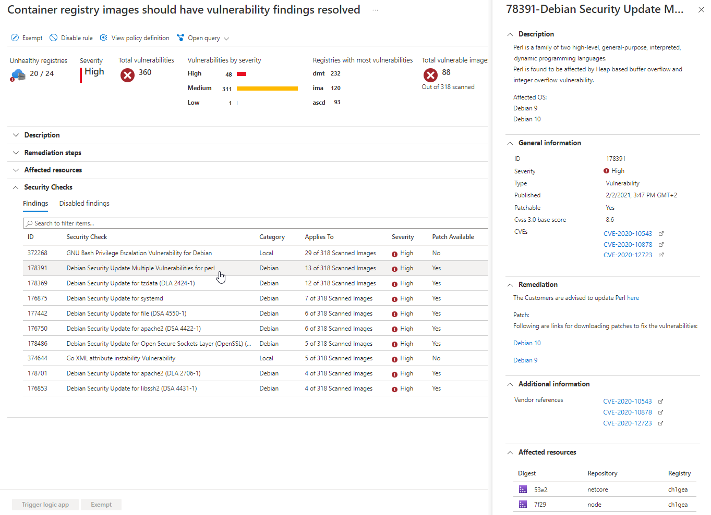
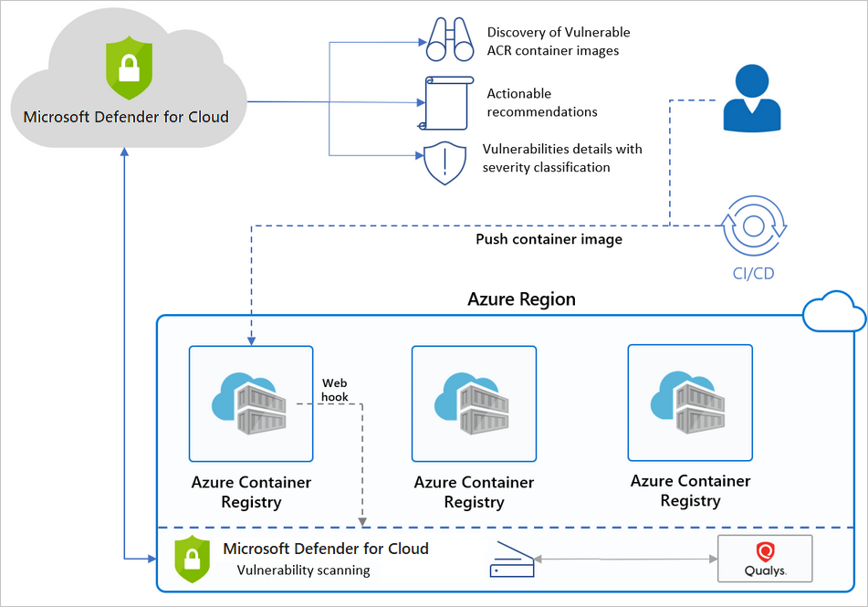

# Introduction to Microsoft Defender for container registries (deprecated)

> [!IMPORTANT]
> We have started a public preview of Azure Vulnerability Assessment powered by MDVM. For more information see [Vulnerability assessments for Azure with Microsoft Defender Vulnerability Management](agentless-container-registry-vulnerability-assessment.md).

Azure Container Registry (ACR) is a managed, private Docker registry service that stores and manages your container images for Azure deployments in a central registry. It's based on the open-source Docker Registry 2.0.

To protect the Azure Resource Manager based registries in your subscription, enable **Microsoft Defender for container registries** at the subscription level. Defender for Cloud will then scan all images when they’re pushed to the registry, imported into the registry, or pulled within the last 30 days. You’ll be charged for every image that gets scanned – once per image.

## Availability

> [!IMPORTANT]
> Microsoft Defender for container registries has been replaced with [**Microsoft Defender for Containers**](defender-for-containers-introduction.md). If you've already enabled Defender for container registries on a subscription, you can continue to use it. However, you won't get Defender for Containers' improvements and new features.
>
> This plan is no longer available for subscriptions where it isn't already enabled.
>
> To upgrade to Microsoft Defender for Containers, open the Defender plans page in the portal and enable the new plan:
>
> :::image type="content" source="media/defender-for-containers/enable-defender-for-containers.png" alt-text="Enable Microsoft Defender for Containers from the Defender plans page.":::
>
> Learn more about this change in [the release note](release-notes-archive.md#microsoft-defender-for-containers-plan-released-for-general-availability-ga).

|Aspect|Details|
|----|:----|
|Release state:|Deprecated (Use [**Microsoft Defender for Containers**](defender-for-containers-introduction.md))|
|Supported registries and images:|Linux images in ACR registries accessible from the public internet with shell access [ACR registries protected with Azure Private Link](../container-registry/container-registry-private-link.md)|
|Unsupported registries and images:|Windows images 'Private' registries (unless access is granted to [Trusted Services](../container-registry/allow-access-trusted-services.md#trusted-services)) Super-minimalist images such as [Docker scratch](https://hub.docker.com/_/scratch/) images, or "Distroless" images that only contain an application and its runtime dependencies without a package manager, shell, or OS Images with [Open Container Initiative (OCI) Image Format Specification](https://github.com/opencontainers/image-spec/blob/master/spec.md)|
|Required roles and permissions:|**Security reader** and [Azure Container Registry roles and permissions](../container-registry/container-registry-roles.md)|
|Clouds:|:::image type="icon" source="./media/icons/yes-icon.png" border="false"::: Commercial clouds :::image type="icon" source="./media/icons/yes-icon.png" border="false"::: National (Azure Government, Microsoft Azure operated by 21Vianet)|

## What are the benefits of Microsoft Defender for container registries?

Defender for Cloud identifies Azure Resource Manager based ACR registries in your subscription and seamlessly provides Azure-native vulnerability assessment and management for your registry's images.

**Microsoft Defender for container registries** includes a vulnerability scanner to scan the images in your Azure Resource Manager-based Azure Container Registry registries and provide deeper visibility into your images'  vulnerabilities. The integrated scanner is powered by Qualys, the industry-leading vulnerability scanning vendor.

When issues are found – by Qualys or Defender for Cloud – you'll get notified in the workload protection dashboard. For every vulnerability, Defender for Cloud provides actionable recommendations, along with a severity classification, and guidance for how to remediate the issue. For details of Defender for Cloud's recommendations for containers, see the [reference list of recommendations](recommendations-reference.md#recs-container).

Defender for Cloud filters and classifies findings from the scanner. When an image is healthy, Defender for Cloud marks it as such. Defender for Cloud generates security recommendations only for images that have issues to be resolved. Defender for Cloud provides details of each reported vulnerability and a severity classification. Additionally, it gives guidance for how to remediate the specific vulnerabilities found on each image.

By only notifying when there are problems, Defender for Cloud reduces the potential for unwanted informational alerts.

## When are images scanned?

There are three triggers for an image scan:

- **On push** - Whenever an image is pushed to your registry, Defender for container registries automatically scans that image. To trigger the scan of an image, push it to your repository.

- **Recently pulled** - Since new vulnerabilities are discovered every day, **Microsoft Defender for container registries** also scans, on a weekly basis, any image that has been pulled within the last 30 days. There's no additional charge for these rescans; as mentioned above, you're billed once per image.

- **On import** - Azure Container Registry has import tools to bring images to your registry from Docker Hub, Microsoft Container Registry, or another Azure container registry. **Microsoft Defender for container registries** scans any supported images you import. Learn more in [Import container images to a container registry](../container-registry/container-registry-import-images.md).

The scan completes typically within 2 minutes, but it might take up to 40 minutes. Findings are made available as security recommendations such as this one:

## How does Defender for Cloud work with Azure Container Registry

Below is a high-level diagram of the components and benefits of protecting your registries with Defender for Cloud.

## FAQ - Azure Container Registry image scanning

### How does Defender for Cloud scan an image?

Defender for Cloud pulls the image from the registry and runs it in an isolated sandbox with the Qualys scanner. The scanner extracts a list of known vulnerabilities.

Defender for Cloud filters and classifies findings from the scanner. When an image is healthy, Defender for Cloud marks it as such. Defender for Cloud generates security recommendations only for images that have issues to be resolved. By only notifying you when there are problems, Defender for Cloud reduces the potential for unwanted informational alerts.

### Can I get the scan results via REST API?

Yes. The results are under [Sub-Assessments REST API](/rest/api/defenderforcloud/sub-assessments/list). Also, you can use Azure Resource Graph (ARG), the Kusto-like API for all of your resources: a query can fetch a specific scan.

### What registry types are scanned? What types are billed?

For a list of the types of container registries supported by Microsoft Defender for container registries, see [Availability](#availability).

If you connect unsupported registries to your Azure subscription, Defender for Cloud won't scan them and won't bill you for them.

### Can I customize the findings from the vulnerability scanner?

Yes. If you have an organizational need to ignore a finding, rather than remediate it, you can optionally disable it. Disabled findings don't impact your secure score or generate unwanted noise.

[Learn about creating rules to disable findings from the integrated vulnerability assessment tool](defender-for-containers-vulnerability-assessment-azure.md#disable-specific-findings).

### Why is Defender for Cloud alerting me to vulnerabilities about an image that isn’t in my registry?

Defender for Cloud provides vulnerability assessments for every image pushed or pulled in a registry. Some images might reuse tags from an image that was already scanned. For example, you might reassign the tag “Latest” every time you add an image to a digest. In such cases, the ‘old’ image does still exist in the registry and might still be pulled by its digest. If the image has security findings and is pulled, it'll expose security vulnerabilities.

## Next steps

> [!div class="nextstepaction"]
> [Scan your images for vulnerabilities](defender-for-containers-vulnerability-assessment-azure.md)
