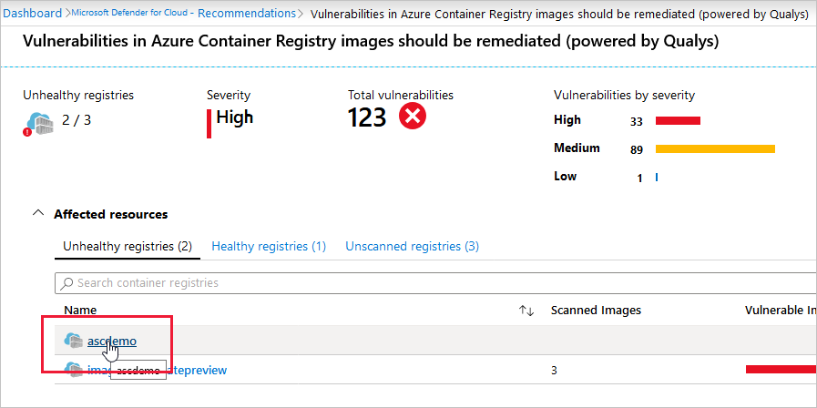
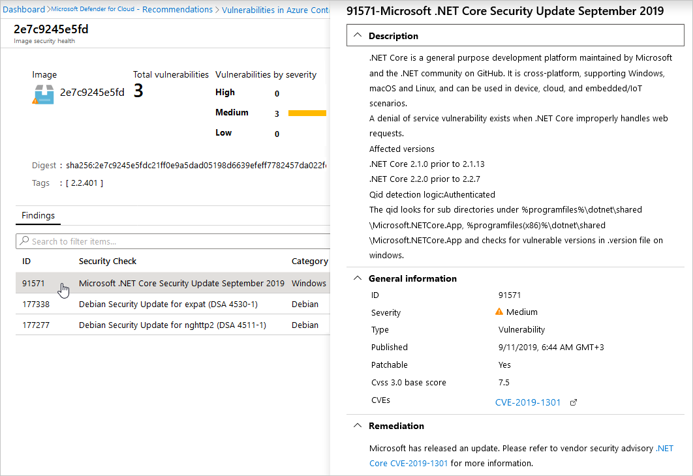

# Use Defender for Containers to scan your Azure Container Registry images for vulnerabilities

This article explains how to use Defender for Containers to scan the container images stored in your Azure Resource Manager-based Azure Container Registry, as part of the protections provided within Microsoft Defender for Cloud.

To enable scanning of vulnerabilities in containers, you have to [enable Defender for Containers](defender-for-containers-enable.md). When the scanner, powered by Qualys, reports vulnerabilities, Defender for Cloud presents the findings and related information as recommendations. In addition, the findings include related information such as remediation steps, relevant CVEs, CVSS scores, and more. You can view the identified vulnerabilities for one or more subscriptions, or for a specific registry.

Defender for Cloud filters and classifies findings from the scanner. Images without vulnerabilities are marked as healthy and Defender for Cloud doesn't send notifications about healthy images to keep you from getting unwanted informational alerts.

The triggers for an image scan are:

- **On push** - Whenever an image is pushed to your registry, Defender for Containers automatically scans that image. To trigger the scan of an image, push it to your repository.

- **Recently pulled** - Since new vulnerabilities are discovered every day, **Microsoft Defender for Containers** also scans, on a weekly basis, any image that has been pulled within the last 30 days. There's no extra charge for these rescans; as mentioned above, you're billed once per image.

- **On import** - Azure Container Registry has import tools to bring images to your registry from Docker Hub, Microsoft Container Registry, or another Azure container registry. **Microsoft Defender for Containers** scans any supported images you import. Learn more in [Import container images to a container registry](../container-registry/container-registry-import-images.md).

- **Continuous scan**- This trigger has two modes:

  - A continuous scan based on an image pull.  This scan is performed every seven days after an image was pulled, and only for 30 days after the image was pulled. This mode doesn't require the security profile, or extension.

  - (Preview) Continuous scan for running images. This scan is performed every seven days for as long as the image runs. This mode runs instead of  the above mode when the Defender profile, or extension is running on the cluster.
    
When a scan is triggered, findings are available as Defender for Cloud recommendations from 2 minutes up to 15 minutes after the scan is complete.

Also, check out the ability scan container images for vulnerabilities as the images are built in your CI/CD GitHub workflows. Learn more in [Defender for DevOps](defender-for-devops-introduction.md).

## Prerequisites

Before you can scan your ACR images:

- [Enable Defender for Containers](defender-for-containers-enable.md) for your subscription. Defender for Containers is now ready to scan images in your registries.

    >[!NOTE]
    > This feature is charged per image.

- If you want to find vulnerabilities in images stored in other container registries, you can import the images into ACR and scan them.

    Use the ACR tools to bring images to your registry from Docker Hub or Microsoft Container Registry. When the import completes, the imported images are scanned by the built-in vulnerability assessment solution.

    Learn more in [Import container images to a container registry](../container-registry/container-registry-import-images.md)

    You can also [scan images in Amazon AWS Elastic Container Registry](defender-for-containers-va-ecr.md) directly from the Azure portal.

For a list of the types of images and container registries supported by Microsoft Defender for Containers, see [Availability](supported-machines-endpoint-solutions-clouds-containers.md?tabs=azure-aks#registries-and-images).

## View and remediate findings

1. To view the findings, open the **Recommendations** page. If issues were found, you'll see the recommendation [Container registry images should have vulnerability findings resolved](https://portal.azure.com/#blade/Microsoft_Azure_Security/RecommendationsBlade/assessmentKey/dbd0cb49-b563-45e7-9724-889e799fa648).

    

1. Select the recommendation.

    The recommendation details page opens with additional information. This information includes the list of registries with vulnerable images ("Affected resources") and the remediation steps.

1. Select a specific registry to see the repositories within it that have vulnerable repositories.

    

    The registry details page opens with the list of affected repositories.

1. Select a specific repository to see the repositories within it that have vulnerable images.

    

    The repository details page opens. It lists the vulnerable images together with an assessment of the severity of the findings.

1. Select a specific image to see the vulnerabilities.

    

    The list of findings for the selected image opens.

    

1. To learn more about a finding, select the finding.

    The findings details pane opens.

    

    This pane includes a detailed description of the issue and links to external resources to help mitigate the threats.

1. Follow the steps in the remediation section of this pane.

1. When you've taken the steps required to remediate the security issue, replace the image in your registry:

    1. Push the updated image to trigger a scan.

    1. Check the recommendations page for the recommendation [Container registry images should have vulnerability findings resolved](https://portal.azure.com/#blade/Microsoft_Azure_Security/RecommendationsBlade/assessmentKey/dbd0cb49-b563-45e7-9724-889e799fa648).

        If the recommendation still appears and the image you've handled still appears in the list of vulnerable images, check the remediation steps again.

    1. When you're sure the updated image has been pushed, scanned, and is no longer appearing in the recommendation, delete the “old” vulnerable image from your registry.

## Disable specific findings

> [!NOTE]
> [!INCLUDE [Legalese](../../includes/defender-for-cloud-preview-legal-text.md)]

If you have an organizational need to ignore a finding, rather than remediate it, you can optionally disable it. Disabled findings don't affect your secure score or generate unwanted noise.

When a finding matches the criteria you've defined in your disable rules, it won't appear in the list of findings. Typical scenarios include:

- Disable findings with severity below medium
- Disable findings that are non-patchable
- Disable findings with CVSS score below 6.5
- Disable findings with specific text in the security check or category (for example, “RedHat”, “CentOS Security Update for sudo”)

> [!IMPORTANT]
> To create a rule, you need permissions to edit a policy in Azure Policy.
>
> Learn more in [Azure RBAC permissions in Azure Policy](../governance/policy/overview.md#azure-rbac-permissions-in-azure-policy).

You can use any of the following criteria:

- Finding ID
- Category
- Security check
- CVSS v3 scores
- Severity
- Patchable status

To create a rule:

1. From the recommendations detail page for [Container registry images should have vulnerability findings resolved](https://portal.azure.com/#blade/Microsoft_Azure_Security/RecommendationsBlade/assessmentKey/dbd0cb49-b563-45e7-9724-889e799fa648), select **Disable rule**.
1. Select the relevant scope.
1. Define your criteria.
1. Select **Apply rule**.

    :::image type="content" source="./media/defender-for-containers-va-acr/new-disable-rule-for-registry-finding.png" alt-text="Create a disable rule for VA findings on registry.":::

1. To view, override, or delete a rule:
    1. Select **Disable rule**.
    1. From the scope list, subscriptions with active rules show as **Rule applied**.
        :::image type="content" source="./media/remediate-vulnerability-findings-vm/modify-rule.png" alt-text="Modify or delete an existing rule.":::
    1. To view or delete the rule, select the ellipsis menu ("...").

## FAQ

### How does Defender for Containers scan an image?

Defender for Containers pulls the image from the registry and runs it in an isolated sandbox with the Qualys scanner. The scanner extracts a list of known vulnerabilities.

Defender for Cloud filters and classifies findings from the scanner. When an image is healthy, Defender for Cloud marks it as such. Defender for Cloud generates security recommendations only for images that have issues to be resolved. By only notifying you when there are problems, Defender for Cloud reduces the potential for unwanted informational alerts.

### Can I get the scan results via REST API?

Yes. The results are under [Sub-Assessments REST API](/rest/api/defenderforcloud/sub-assessments/list). Also, you can use Azure Resource Graph (ARG), the Kusto-like API for all of your resources: a query can fetch a specific scan.

### Why is Defender for Cloud alerting me to vulnerabilities about an image that isn’t in my registry?

Some images may reuse tags from an image that was already scanned. For example, you may reassign the tag “Latest” every time you add an image to a digest. In such cases, the ‘old’ image does still exist in the registry and may still be pulled by its digest. If the image has security findings and is pulled, it will expose security vulnerabilities.

## Next steps

Learn more about the [advanced protection plans of Microsoft Defender for Cloud](enhanced-security-features-overview.md).
