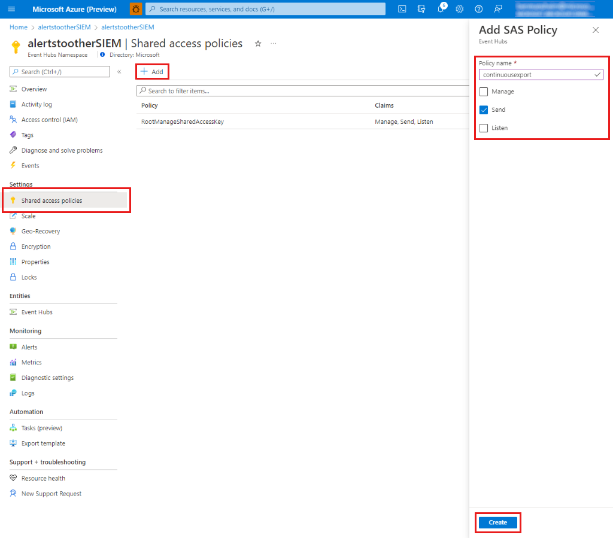
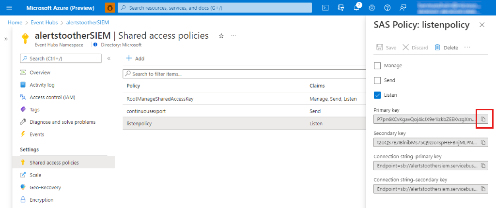
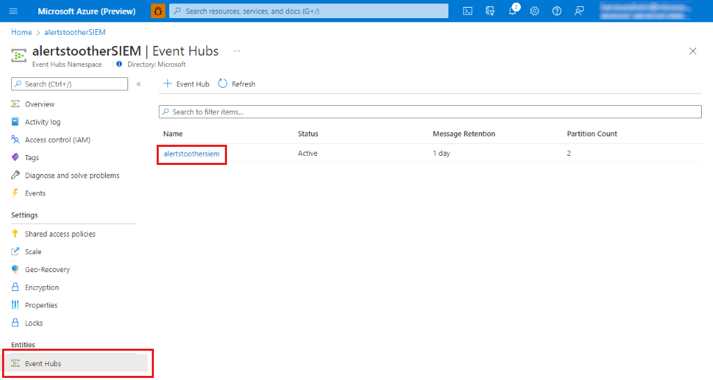

# Stream alerts to a SIEM, SOAR, or IT Service Management solution

[!INCLUDE [Banner for top of topics](./includes/banner.md)]

Microsoft Defender for Cloud can stream your security alerts into the most popular Security Information and Event Management (SIEM),
Security Orchestration Automated Response (SOAR), and IT Service Management (ITSM) solutions.
Security alerts are notifications that Defender for Cloud generates when it detects threats on your resources.
Defender for Cloud prioritizes and lists the alerts, along with the information needed for you to quickly investigate the problem.
Defender for Cloud also provides detailed steps to help you remediate attacks.
Alerts data is retained for 90 days.

There are Azure-native tools for ensuring you can view your alert data in all of the most popular solutions in use today, including:

- **Microsoft Sentinel**
- **Splunk Enterprise and Splunk Cloud**
- **IBM's QRadar**
- **ServiceNow**
- **ArcSight**
- **Power BI**
- **Palo Alto Networks**

## Stream alerts to Microsoft Sentinel

Defender for Cloud natively integrates with Microsoft Sentinel, Azure's cloud-native SIEM and SOAR solution.

[Learn more about Microsoft Sentinel](../sentinel/overview.md).

### Microsoft Sentinel's connectors for Defender for Cloud

Microsoft Sentinel includes built-in connectors for Microsoft Defender for Cloud at the subscription and tenant levels:

- [Stream alerts to Microsoft Sentinel at the subscription level](../sentinel/connect-azure-security-center.md)
- [Connect all subscriptions in your tenant to Microsoft Sentinel](https://techcommunity.microsoft.com/t5/azure-sentinel/azure-security-center-auto-connect-to-sentinel/ba-p/1387539)

When you connect Defender for Cloud to Microsoft Sentinel, the status of Defender for Cloud alerts that get ingested into Microsoft Sentinel is synchronized between the two services. So, for example, when an alert is closed in Defender for Cloud, that alert is also shown as closed in Microsoft Sentinel. If you change the status of an alert in Defender for Cloud, the status of the alert in Microsoft Sentinel is also updated, but the statuses of any Microsoft Sentinel **incidents** that contain the synchronized Microsoft Sentinel alert aren't updated.

You can enable the preview feature **bi-directional alert synchronization** to automatically sync the status of the original Defender for Cloud alerts with Microsoft Sentinel incidents that contain the copies of those Defender for Cloud alerts. So, for example, when a Microsoft Sentinel incident that contains a Defender for Cloud alert is closed, Defender for Cloud automatically closes the corresponding original alert.

Learn more in [Connect alerts from Microsoft Defender for Cloud](../sentinel/connect-azure-security-center.md).

> [!NOTE]
> The bi-directional alert synchronization feature isn't available in the Azure Government cloud.

### Configure ingestion of all audit logs into Microsoft Sentinel

Another alternative for investigating Defender for Cloud alerts in Microsoft Sentinel is to stream your audit logs into Microsoft Sentinel:
- [Connect Windows security events](../sentinel/connect-windows-security-events.md)
- [Collect data from Linux-based sources using Syslog](../sentinel/connect-syslog.md)
- [Connect data from Azure Activity log](../sentinel/data-connectors-reference.md#azure-activity)

> [!TIP]
> Microsoft Sentinel is billed based on the volume of data that it ingests for analysis in Microsoft Sentinel and stores in the Azure Monitor Log Analytics workspace. Microsoft Sentinel offers a flexible and predictable pricing model. [Learn more at the Microsoft Sentinel pricing page](https://azure.microsoft.com/pricing/details/azure-sentinel/).

## Stream alerts to QRadar and Splunk

The export of security alerts to Splunk and QRadar uses Event Hubs and a built-in connector.
You can either use the PowerShell script or the Azure portal.
Here's an overview of the steps you'll do in the Azure portal:

1. Create an Event Hubs name space and event hub.
2. Define a policy for the event hub with “Send” permissions.
3. **If you are streaming your alerts to QRadar SIEM** - Create an event hub "Listen" policy, then copy and save the connection string of the policy that you’ll use in QRadar.
4. Create a consumer group, then copy and save the name that you’ll use in the SIEM platform.
5. Enable continuous export of your security alerts to the defined event hub.
6. **If you are streaming your alerts to QRadar SIEM** - Create a storage account, then copy and save the connection string to the account that you’ll use in QRadar.
7. **If you are streaming your alerts to Splunk SIEM**:
   1. Create an Microsoft Azure Active Directory application.
   2. Save Tenant, App ID, App password.
   3. Give permissions to the Azure AD Application to read from the event hub you created before.

Finally, you’ll need to use the procedure specific to each SIEM to install the solution in the SIEM platform.

### Prerequisites

In order to do these instructions, make sure you have: 

- Azure subscription ([Create a free account](https://azure.microsoft.com/free/))
- Azure resource group ([Create a resource group](../azure-resource-manager/management/manage-resource-groups-portal.md))

### Step 1. Set up your streaming solution

You can set up your Azure environment to support continuous export using either:

- Using a PowerShell script (Recommended)

    Download and run [the PowerShell script](https://github.com/Azure/Microsoft-Defender-for-Cloud/tree/main/Powershell%20scripts/3rd%20party%20SIEM%20integration).
    Enter the required parameters and the script performs all of the necessary steps for you.
    When the script finishes, it outputs the relevant details you’ll use in installing the solution in the SIEM platform.

- In the Azure portal

    1. In the [Event Hubs service](../event-hubs/event-hubs-create.md), create an Event Hubs namespace and event hub.
        
    1. Define a policy for the event hub with "Send" permissions:
        1. In the Event Hubs menu, select the Event Hubs namespace you created.
        1. In the namespace menu, select **Shared access policies**.
        1. Click **Add**, enter a unique policy name, and select **Send**.
        1. Click **Create** to create the policy.
            
    1. **If you are streaming your alerts to QRadar SIEM** - Create another policy but this time make it a Listen policy.
        1. Click **Add**, enter a unique policy name, and select **Send**.
        1. Click **Create** to create the policy.
        1. After the listen policy is created, copy the **Connection string primary key** and save it to use later.
            
    1. Create a consumer group, then copy and save the name to use in the
      SIEM platform.
        1. In the Entities section of the Event Hubs namespace menu, select **Event Hubs** and click on the event hub you created.
            
        1. Click **Consumer group**.
    1. Enable continuous export:
        Tenant level:
        1. In the search box in the menu, search for "Policy" and go to the Policy and select **Definitions** in the menu.
        1. Look for "deploy export".
        1. Select the **Deploy export to Event Hub for Azure Security Center data** built-in policy and click **Assign**.
        1. Enter "scope" to define the level of data to export. To select a tenant root management group level you need to have permissions on tenant level.
        1. (Optional) You can also define specific subscriptions to exclude from the export.
        1. Enter an assignment name.
        1. Make sure policy enforcement is enabled.
        1. In the policy parameters:
           1. Select a resource group that defines where the automation resource is saved.
           1. Select Resource group location.
           1. Click the **...** next to the **Event Hub details** and enter the details for the event hub, including:
               - Subscription.
               - The Event Hubs namespace you created.
               - The event hub you created.
               - In **authorizationrules**, select the shared access policy that you created to send alerts.
        1. Click **Review and Create** and **Create** to finish the process of defining the continuous export to Event Hubs.
            - Notice that when you activate continuous export policy on tenant root management group level, it automatically streams your alerts on any **new** subscription that will be created under this tenant.
    1. **If you are streaming your alerts to QRadar SIEM** - Create a storage account, then copy and save the connection string to the account to use in QRadar.
        1. Go to the Azure portal, click **Create a resource**, and select **Storage account**. If that option is not shown, search for "storage account".
        1. Click **Create**.
        1. Enter the details for the storage account, click **Review and Create**, and then **Create**.
        1. After you create your storage account and go to the resource, in the menu select **Access Keys**.
        1. Select **Show keys** to see the keys, and copy the connection string of Key 1.
    1. **If you are streaming your alerts to Splunk SIEM -** Create an Azure AD application.
        1. In the menu search box, search for "Azure Active Directory" and go to Azure Active Directory.
        1. Go to the Azure portal, click **Create a resource**, and select **Azure Active Directory**. If that option is not shown, search for "active directory".
        1. In the menu, select **App registrations**.
        1. Click **New registration**.
        1. Enter a unique name for the application and click **Register**.
        1. Copy to Clipboard and save the **Application (client) ID** and **Directory (tenant) ID**.
        1. In the menu, go to **Certificates & secrets**.
        1. Create a password for the application to prove its identity when requesting a token:
            1. Select **New client secret**.
            1. Enter a short description, choose the expiration time of the secret, and click **Add**.
            1. After the secret is created, copy the Secret ID and save it for later use together with the Application ID and Directory (tenant) ID.
    1. **If you are streaming your alerts to Splunk SIEM -** Give permissions to the Azure AD Application to read from the event hub you created before.
        1. Go to the Event Hubs namespace you created.
        1. In the menu, go to **Access control**.
        1. Click **Add** and select **Add role assignment**.
        1. Click **Add role assignment**.
        1. In the Roles tab, search for **Azure Event Hubs Data Receiver**.
        1. Click **Next**.
        1. Click **Select Members**.
        1. Search for the Azure AD application you created before and select it.
        1. Click **Close**.

### Step 2. Connect the event hub to your preferred solution using the built-in connectors:

| Tool | Hosted in Azure | Description |
|:---|:---| :---|
|  IBM QRadar | No | The Microsoft Azure DSM and Microsoft Azure Event Hubs Protocol are available for download from [the IBM support website](https://www.ibm.com/support). |
| Splunk | No | [Splunk Add-on for Microsoft Cloud Services](https://splunkbase.splunk.com/app/3110/) is an open source project available in Splunkbase.    If you can't install an add-on in your Splunk instance, if for example you're using a proxy or running on Splunk Cloud, you can forward these events to the Splunk HTTP Event Collector using [Azure Function For Splunk](https://github.com/Microsoft/AzureFunctionforSplunkVS), which is triggered by new messages in the event hub. |

## Stream alerts with continuous export

To stream alerts into **ArcSight**, **Splunk**, **QRadar**, **SumoLogic**, **Syslog servers**, **LogRhythm**, **Logz.io Cloud Observability Platform**, and other monitoring solutions, configure Azure Event Hubs with built-in connectors:

> [!NOTE]
> To stream alerts at the tenant level, use this Azure policy and set the scope at the root management group. You'll need permissions for the root management group as explained in [Defender for Cloud permissions](permissions.md): [Deploy export to an event hub for Microsoft Defender for Cloud alerts and recommendations](https://portal.azure.com/#blade/Microsoft_Azure_Policy/PolicyDetailBlade/definitionId/%2fproviders%2fMicrosoft.Authorization%2fpolicyDefinitions%2fcdfcce10-4578-4ecd-9703-530938e4abcb).

1. Enable [continuous export](continuous-export.md) to stream Defender for Cloud alerts into a dedicated event hub at the subscription level. To do this at the Management Group level using Azure Policy, see [Create continuous export automation configurations at scale](continuous-export.md?tabs=azure-policy#configure-continuous-export-at-scale-using-the-supplied-policies).

2. Connect the event hub to your preferred solution using the built-in connectors:

    | Tool | Hosted in Azure | Description |
    |:---|:---| :---|
    | SumoLogic | No | Instructions for setting up SumoLogic to consume data from an event hub are available at [Collect Logs for the Azure Audit App from Event Hubs](https://help.sumologic.com/Send-Data/Applications-and-Other-Data-Sources/Azure-Audit/02Collect-Logs-for-Azure-Audit-from-Event-Hub). |
    | ArcSight | No | The ArcSight Azure Event Hubs smart connector is available as part of [the ArcSight smart connector collection](https://community.microfocus.com/cyberres/arcsight/f/arcsight-product-announcements/163662/announcing-general-availability-of-arcsight-smart-connectors-7-10-0-8114-0). |
    | Syslog server | No | If you want to stream Azure Monitor data directly to a syslog server, you can use a [solution based on an Azure function](https://github.com/miguelangelopereira/azuremonitor2syslog/).
    | LogRhythm | No| Instructions to set up LogRhythm to collect logs from an event hub are available [here](https://logrhythm.com/six-tips-for-securing-your-azure-cloud-environment/). 
    |Logz.io | Yes | For more information, see [Getting started with monitoring and logging using Logz.io for Java apps running on Azure](/azure/developer/java/fundamentals/java-get-started-with-logzio)

3. Optionally, stream the raw logs to the event hub and connect to your preferred solution. Learn more in [Monitoring data available](../azure-monitor/essentials/stream-monitoring-data-event-hubs.md#monitoring-data-available).

To view the event schemas of the exported data types, visit the [Event Hubs event schemas](https://aka.ms/ASCAutomationSchemas).

## Use the Microsoft Graph Security API to stream alerts to third-party applications

As an alternative to Sentinel and Azure Monitor, you can use Defender for Cloud's built-in integration with [Microsoft Graph Security API](https://www.microsoft.com/security/business/graph-security-api). No configuration is required and there are no additional costs.

You can use this API to stream alerts from your **entire tenant** (and data from many Microsoft Security products) into third-party SIEMs and other popular platforms:

- **Splunk Enterprise and Splunk Cloud** - [Use the Microsoft Graph Security API Add-On for Splunk](https://splunkbase.splunk.com/app/4564/)
- **Power BI** - [Connect to the Microsoft Graph Security API in Power BI Desktop](/power-bi/connect-data/desktop-connect-graph-security).
- **ServiceNow** - [Install and configure the Microsoft Graph Security API application from the ServiceNow Store](https://docs.servicenow.com/bundle/sandiego-security-management/page/product/secops-integration-sir/secops-integration-ms-graph/task/ms-graph-install.html?cshalt=yes).
- **QRadar** - [Use IBM's Device Support Module for Microsoft Defender for Cloud via Microsoft Graph API](https://www.ibm.com/support/knowledgecenter/SS42VS_DSM/com.ibm.dsm.doc/c_dsm_guide_ms_azure_security_center_overview.html). 
- **Palo Alto Networks**, **Anomali**, **Lookout**, **InSpark**, and more - [Use the Microsoft Graph Security API](https://www.microsoft.com/security/business/graph-security-api#office-MultiFeatureCarousel-09jr2ji).

## Next steps

This page explained how to ensure your Microsoft Defender for Cloud alert data is available in your SIEM, SOAR, or ITSM tool of choice. For related material, see:

- [What is Microsoft Sentinel?](../sentinel/overview.md)
- [Alert validation in Microsoft Defender for Cloud](alert-validation.md) - Verify your alerts are correctly configured
- [Continuously export Defender for Cloud data](continuous-export.md)
