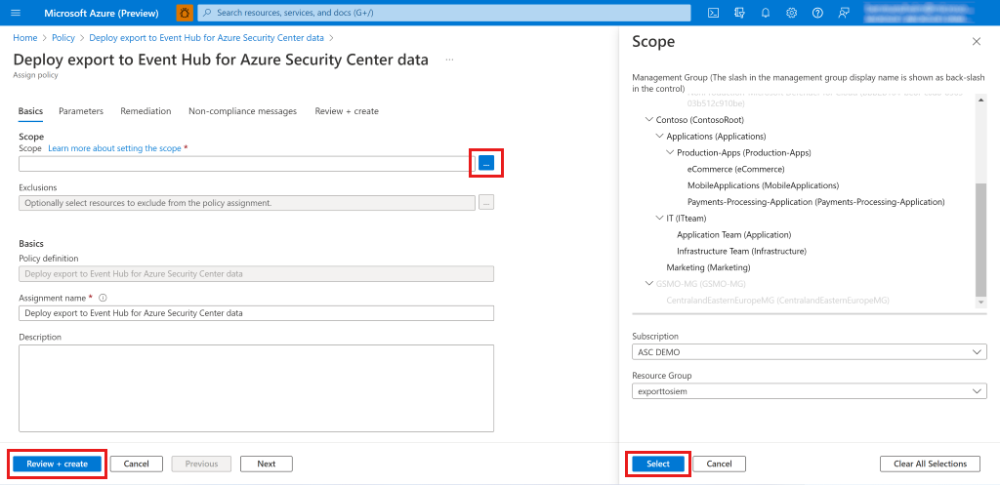
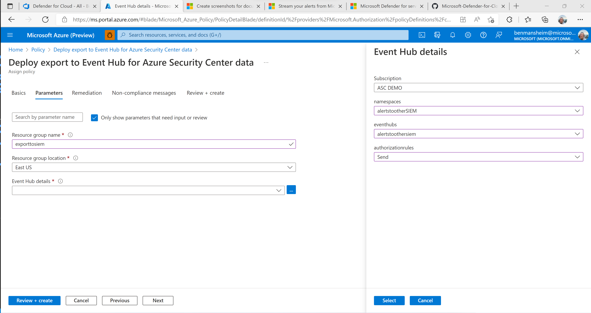
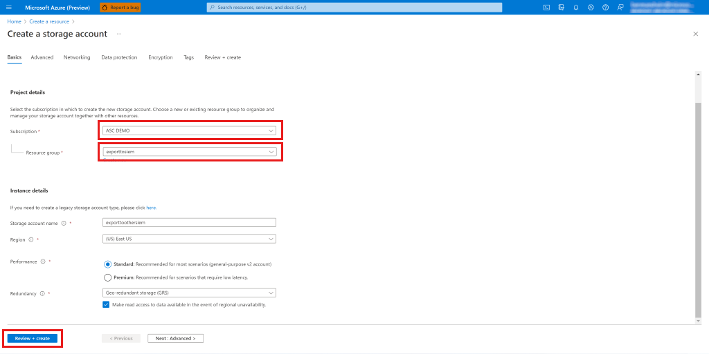
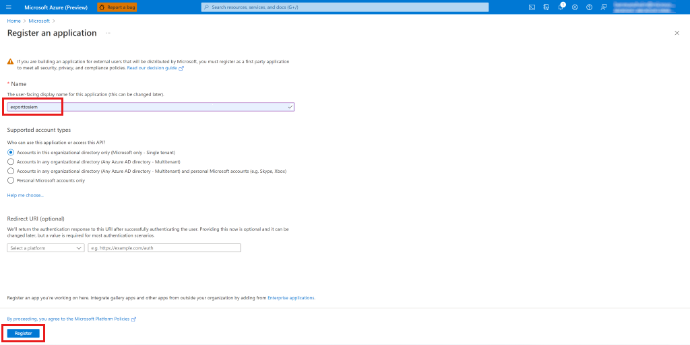
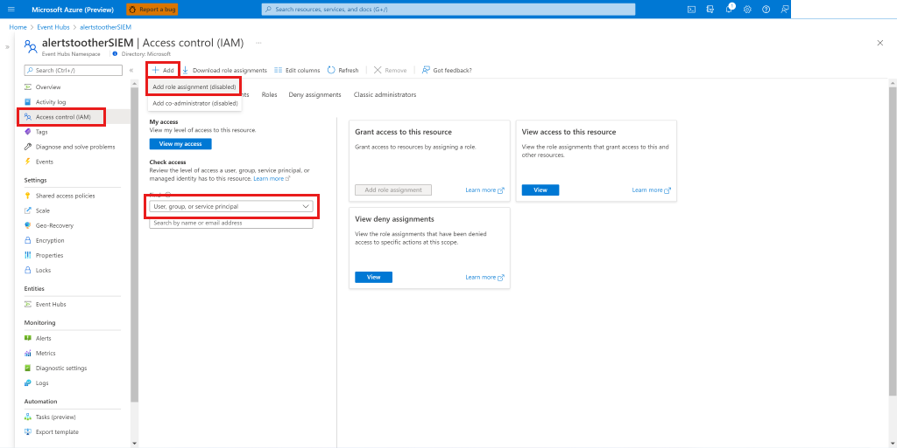

# Prepare Azure resources for exporting to Splunk and QRadar

In order to stream Microsoft Defender for Cloud security alerts to IBM QRadar and Splunk, you have to set up resources in Event Hubs and Azure Active Directory (Azure AD). Here are the instructions for configuring these resources in the Azure portal, but you can also configure them using a PowerShell script. Make sure you review [Stream alerts to QRadar and Splunk](export-to-siem.md#stream-alerts-to-qradar-and-splunk) before you configure the Azure resources for continuous export.

To configure the Azure resources for QRadar and Splunk in the Azure portal:

## Step 1. Create an Event Hubs namespace and event hub with send permissions
1. In the [Event Hubs service](../event-hubs/event-hubs-create.md), 
    
1. In the Event Hubs menu, select the Event Hubs namespace you created.
1. In the namespace menu, select **Shared access policies**.
1. Select **Add**, enter a unique policy name, and select **Send**.
1. Select **Create** to create the policy.
    

## Step 2. **For streaming to QRadar SIEM** - Create another policy but this time make it a Listen policy
1. Select **Add**, enter a unique policy name, and select **Listen**.
1. Select **Create** to create the policy.
1. After the listen policy is created, copy the **Connection string primary key** and save it to use later.
    

## Step 3. Create a consumer group, then copy and save the name to use in the SIEM platform:
1. In the Entities section of the Event Hubs namespace menu, select **Event Hubs** and select the event hub you created.
    
1. Select **Consumer group**.

## Step 4. Enable continuous export on the Tenant level
1. In the Azure search box, search for "policy" and go to the Policy.
1. In the Policy menu, select **Definitions**.
1. Search for "deploy export" and select the **Deploy export to Event Hub for Azure Security Center data** built-in policy.
1. Select **Assign**.
1. Define the basic policy options:
    1. In Scope, select the **...** to select the level of data to export.
    1. Find your subscription in the Subscription dropdown list, find your resource group in the Resource Group dropdown list, and select **Select**.
        - To select a tenant root management group level you need to have permissions on tenant level.
    1. (Optional) In Exclusions you can define specific subscriptions to exclude from the export.
    1. Enter an assignment name.
    1. Make sure policy enforcement is enabled.
    
1. In the policy parameters:
    1. Enter the resource group where the automation resource is saved.
    1. Select resource group location.
    1. Select the **...** next to the **Event Hub details** and enter the details for the event hub, including:
        - Subscription.
        - The Event Hubs namespace you created.
        - The event hub you created.
        - In **authorizationrules**, select the shared access policy that you created to send alerts.
    
1. Select **Review and Create** and **Create** to finish the process of defining the continuous export to Event Hubs.
    - Notice that when you activate continuous export policy on tenant root management group level, it automatically streams your alerts on any **new** subscription that will be created under this tenant.

## Step 5. **For streaming alerts to QRadar SIEM** - Create a storage account

1. Go to the Azure portal, select **Create a resource**, and select **Storage account**. If that option isn't shown, search for "storage account".
1. Select **Create**.
1. Enter the details for the storage account, select **Review and Create**, and then **Create**.
    
1. After you create your storage account and go to the resource, in the menu select **Access Keys**.
1. Select **Show keys** to see the keys, and copy the connection string of Key 1.
    

## Step 6. **For streaming alerts to Splunk SIEM** - Create an Azure AD application

1. In the menu search box, search for "Azure Active Directory" and go to Azure Active Directory.
1. Go to the Azure portal, select **Create a resource**, and select **Azure Active Directory**. If that option isn't shown, search for "active directory".
1. In the menu, select **App registrations**.
1. Select **New registration**.
1. Enter a unique name for the application and select **Register**.
    
1. Copy to Clipboard and save the **Application (client) ID** and **Directory (tenant) ID**.
1. Create the client secret for the application:
    1. In the menu, go to **Certificates & secrets**.
    1. Create a password for the application to prove its identity when requesting a token:
    1. Select **New client secret**.
    1. Enter a short description, choose the expiration time of the secret, and select **Add**.
    
1. After the secret is created, copy the Secret ID and save it for later use together with the Application ID and Directory (tenant) ID.

## Step 7. **For streaming alerts to Splunk SIEM** - Allow Azure AD to read from the event hub

1. Go to the Event Hubs namespace you created.
1. In the menu, go to **Access control**.
1. Select **Add** and select **Add role assignment**.
1. Select **Add role assignment**.
    
1. In the Roles tab, search for **Azure Event Hubs Data Receiver**.
1. Select **Next**.
1. Select **Select Members**.
1. Search for the Azure AD application you created before and select it.
1. Select **Close**.

To continue setting up continuous export of alerts, [install the built-in connectors](export-to-siem.md#step-2-connect-the-event-hub-to-your-preferred-solution-using-the-built-in-connectors) for the SIEM you're using.