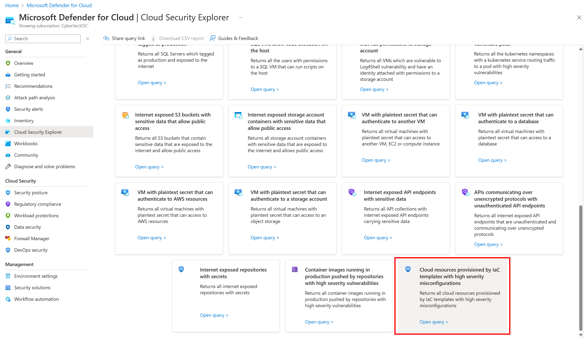

# Map Infrastructure as Code Templates to Cloud Resources
Mapping Infrastructure as Code (IaC) templates to cloud resources ensures consistent, secure, and auditable infrastructure provisioning. It enables rapid response to security threats and a security-by-design approach. If there are misconfigurations in runtime resources, this mapping allows remediation at the template level, ensuring no drift and facilitating deployment via CI/CD methodology.

## Prerequisites

To allow Microsoft Defender for Cloud to map Infrastructure as Code template to cloud resources, you need:

- An Azure account with Defender for Cloud onboarded. If you don't already have an Azure account, [create one for free](https://azure.microsoft.com/free/?WT.mc_id=A261C142F).
- [Azure DevOps](quickstart-onboard-devops.md) environment onboarded into Microsoft Defender for Cloud.
- [Defender Cloud Security Posture Management (CSPM)](tutorial-enable-cspm-plan.md) enabled.
- Configure your Azure Pipelines to run [Microsoft Security DevOps Azure DevOps extension](azure-devops-extension.md).
- Tag your supported Infrastructure as Code templates and your cloud resources. (Open-source tools like [Yor_trace](https://github.com/bridgecrewio/yor) can be used to automatically tag Infrastructure as Code templates)
   - Supported cloud platforms: AWS, Azure, GCP.
   - Supported source code management systems: Azure DevOps.
   - Supported template languages: Azure Resource Manager, Bicep, CloudFormation, Terraform.
  
> [!NOTE]
> Microsoft Defender for Cloud will only use the following tags from Infrastructure as Code templates for mapping:
> - yor_trace
> - mapping_tag

## See the mapping between your IaC template and your cloud resources 

To see the mapping between your IaC template and your cloud resources in the [Cloud Security Explorer](how-to-manage-cloud-security-explorer.md):

1. Sign in to the [Azure portal](https://portal.azure.com/).
2. Go to **Microsoft Defender for Cloud** > **Cloud Security Explorer**.
3. Search for and select all your cloud resources from the drop-down menu.
4. Select + to add other filters to your query.
5. Add the subfilter **Provisioned by** from the category **Identity & Access**.
6. Select **Code repositories** from the category **DevOps**.
7. After building your query, select **Search** to run the query.

Alternatively, you can use the built-in template named “Cloud resources provisioned by IaC templates with high severity misconfigurations”.

> [!NOTE]
> Please note that mapping between your Infrastructure as Code templates to your cloud resources can take up to 12 hours to appear in the Cloud Security Explorer.

## (Optional) Create sample IaC mapping tags

To create sample IaC mapping tags within your code repositories, follow these steps:

1. Add an **IaC template with tags** to your repository. To use an example template, see [here](https://github.com/microsoft/security-devops-azdevops/tree/main/samples/IaCMapping). 
2. Select **save** to commit directly to the main branch or create a new branch for this commit.
3. Include the **Microsoft Security DevOps** task in your Azure pipeline.
4. Verify that the **pipeline logs** show a finding saying **“An IaC tag(s) was found on this resource”**. This means that Defender for Cloud successfully discovered tags.

## Next steps

- Learn more about [DevOps security in Defender for Cloud](defender-for-devops-introduction.md).