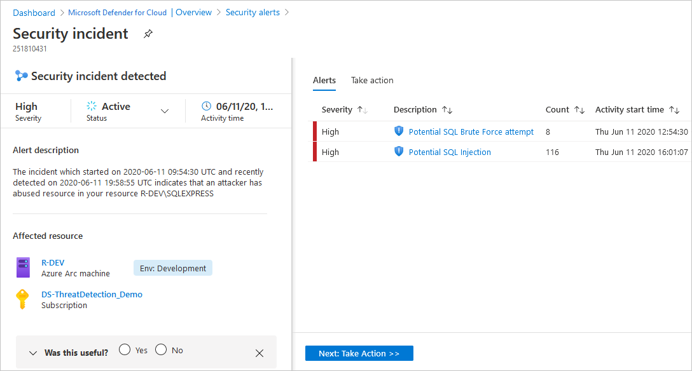
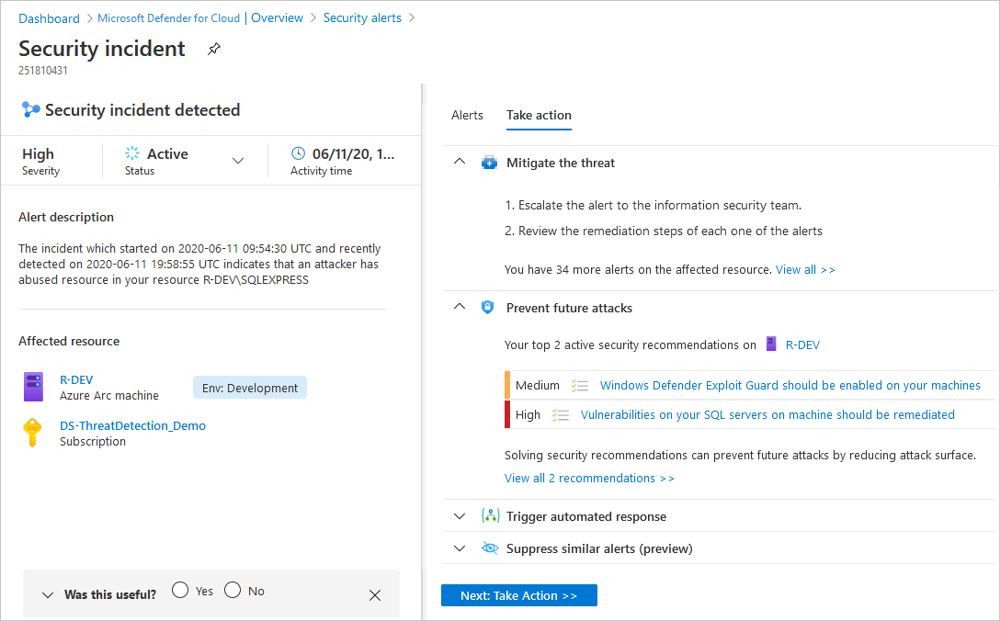

# Manage security incidents in Microsoft Defender for Cloud

Triaging and investigating security alerts can be time consuming for even the most skilled security analysts. For many, it's hard to know where to begin. 

Defender for Cloud uses [analytics](./alerts-overview.md) to connect the information between distinct [security alerts](managing-and-responding-alerts.md). Using these connections, Defender for Cloud can provide a single view of an attack campaign and its related alerts to help you understand the attacker's actions and the affected resources.

This page provides an overview of incidents in Defender for Cloud.

## What is a security incident?

In Defender for Cloud, a security incident is an aggregation of all alerts for a resource that align with [kill chain](alerts-reference.md#intentions) patterns. Incidents appear in the [Security alerts](managing-and-responding-alerts.md) page. Select an incident to view the related alerts and get more information.

## Managing security incidents

1. On Defender for Cloud's security alerts page, use the **Add filter** button to filter by alert name to the alert name **Security incident detected on multiple resources**. 

    :::image type="content" source="media/incidents/locating-incidents.png" alt-text="Locating the incidents on the security alerts page in Microsoft Defender for Cloud.":::

    The list is now filtered to show only incidents. Notice that security incidents have a different icon to security alerts.

    :::image type="content" source="media/incidents/incidents-list.png" alt-text="List of incidents on the security alerts page in Microsoft Defender for Cloud.":::

1. To view details of an incident, select one from the list. A side pane appears with more details about the incident.

    :::image type="content" source="media/incidents/incident-quick-peek.png" alt-text="Side pane showing details of the incident.":::

1. To view more details, select **View full details**.

    

    The left pane of the security incident page shows high-level information about the security incident: title, severity, status, activity time, description, and the affected resource. Next to the affected resource you can see the relevant Azure tags. Use these tags to infer the organizational context of the resource when investigating the alert.

    The right pane includes the **Alerts** tab with the security alerts that were correlated as part of this incident. 

    >[!TIP]
    > For more information about a specific alert, select it. 

    

    To switch to the **Take action** tab, select the tab or the button on the bottom of the right pane. Use this tab to take further actions such as:
    - *Mitigate the threat* - provides manual remediation steps for this security incident
    - *Prevent future attacks* - provides security recommendations to help reduce the attack surface, increase security posture, and prevent future attacks
    - *Trigger automated response* - provides the option to trigger a Logic App as a response to this security incident
    - *Suppress similar alerts* - provides the option to suppress future alerts with similar characteristics if the alert isn’t relevant for your organization 

   > [!NOTE]
   > The same alert can exist as part of an incident, as well as to be visible as a standalone alert.

1. To remediate the threats in the incident, follow the remediation steps provided with each alert.

## Next steps

This page explained the security incident capabilities of Defender for Cloud. For related information, see the following pages:

- [Security alerts in Defender for Cloud](alerts-overview.md)
- [Manage and respond to security alerts](managing-and-responding-alerts.md)
