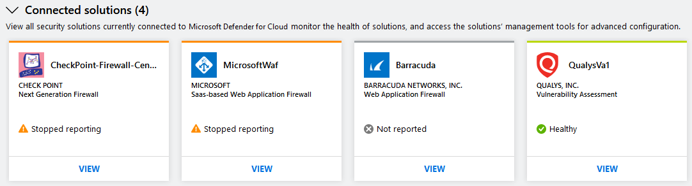
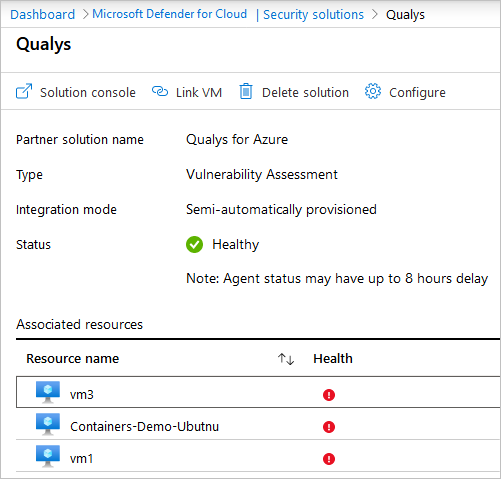
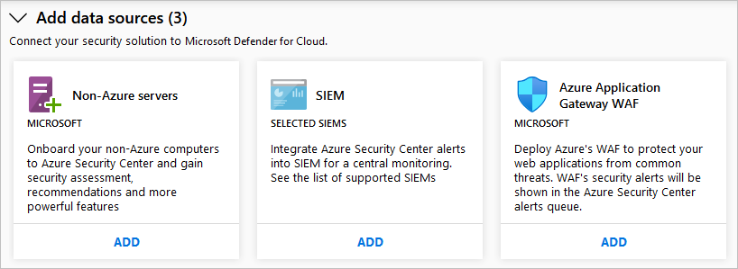

# Integrate security solutions in Microsoft Defender for Cloud

This document helps you to manage security solutions already connected to Microsoft Defender for Cloud and add new ones.

## Integrated Azure security solutions
Defender for Cloud makes it easy to enable integrated security solutions in Azure. Benefits include:

- **Simplified deployment**: Defender for Cloud offers streamlined provisioning of integrated partner solutions. For solutions like antimalware and vulnerability assessment, Defender for Cloud can provision the agent on your virtual machines. For firewall appliances, Defender for Cloud can take care of much of the network configuration required.
- **Integrated detections**: Security events from partner solutions are automatically collected, aggregated, and displayed as part of Defender for Cloud alerts and incidents. These events are also fused with detections from other sources to provide advanced threat-detection capabilities.
- **Unified health monitoring and management**: Customers can use integrated health events to monitor all partner solutions at a glance. Basic management is available, with easy access to advanced setup by using the partner solution.

Currently, integrated security solutions include vulnerability assessment by [Qualys](https://www.qualys.com/public-cloud/#azure) and [Rapid7](https://www.rapid7.com/products/insightvm/).

> [!NOTE]
> Defender for Cloud does not install the Log Analytics agent on partner virtual appliances because most security vendors prohibit external agents running on their appliances.

Learn more about the integration of [vulnerability scanning tools from Qualys](deploy-vulnerability-assessment-vm.md), including a built-in scanner available to customers that enable Microsoft Defender for Servers.

Defender for Cloud also offers vulnerability analysis for your:

- SQL databases - [Explore vulnerability assessment reports in the vulnerability assessment dashboard](defender-for-sql-on-machines-vulnerability-assessment.md#explore-vulnerability-assessment-reports)
- Azure Container Registry images - [Use Microsoft Defender for container registries to scan your images for vulnerabilities](defender-for-containers-vulnerability-assessment-azure.md)
- Amazon AWS Elastic Container Registry images - [Use Microsoft Defender for container registries to scan your images for vulnerabilities](defender-for-containers-vulnerability-assessment-elastic.md)

## How security solutions are integrated
Azure security solutions that are deployed from Defender for Cloud are automatically connected. You can also connect other security data sources, including computers running on-premises or in other clouds.

:::image type="content" source="./media/partner-integration/security-solutions-page-01-2023.png" alt-text="Screenshot showing security Solutions page." lightbox="./media/partner-integration/security-solutions-page-01-2023.png":::

## Manage integrated Azure security solutions and other data sources

1. From the [Azure portal](https://azure.microsoft.com/features/azure-portal/), open **Defender for Cloud**.

1. From Defender for Cloud's menu, select **Security solutions**.

From the **Security solutions** page, you can see the health of integrated Azure security solutions and run basic management tasks.

### Connected solutions

The **Connected solutions** section includes security solutions that are currently connected to Defender for Cloud. It also shows the health status of each solution.  

The status of a security solution can be:

* **Healthy** (green) - no health issues.
* **Unhealthy** (red) - there's a health issue that requires immediate attention.
* **Stopped reporting** (orange) - the solution has stopped reporting its health.
* **Not reported** (gray) - the solution hasn't reported anything yet and no health data is available. A solution's status might be unreported if it was connected recently and is still deploying.

> [!NOTE]
> If health status data is not available, Defender for Cloud shows the date and time of the last event received to indicate whether the solution is reporting or not. If no health data is available and no alerts were received within the last 14 days, Defender for Cloud indicates that the solution is unhealthy or not reporting.
>
>

Select **VIEW** for additional information and options such as:

   - **Solution console** - Opens the management experience for this solution.
   - **Link VM** - Opens the Link Applications page. Here you can connect resources to the partner solution.
   - **Delete solution**
   - **Configure**

   

### Discovered solutions

Defender for Cloud automatically discovers security solutions running in Azure but not connected to Defender for Cloud and displays the solutions in the **Discovered solutions** section. These  solutions include Azure solutions, like [Microsoft Entra ID Protection](../active-directory/identity-protection/overview-identity-protection.md), and partner solutions.

> [!NOTE]
> Enable **advanced protections** at the subscription level for the discovered solutions feature. Learn more in [Quickstart: Enable enhanced security features](enable-enhanced-security.md).

Select **CONNECT** under a solution to integrate with Defender for Cloud and be notified of security alerts.

### Add data sources

The **Add data sources** section includes other available data sources that can be connected. For instructions on adding data from any of these sources, select **ADD**.

## Next steps

In this article, you learned how to integrate partner solutions in Defender for Cloud. To learn how to set up an integration with Microsoft Sentinel, or any other SIEM, see [Continuously export Defender for Cloud data](continuous-export.md).
