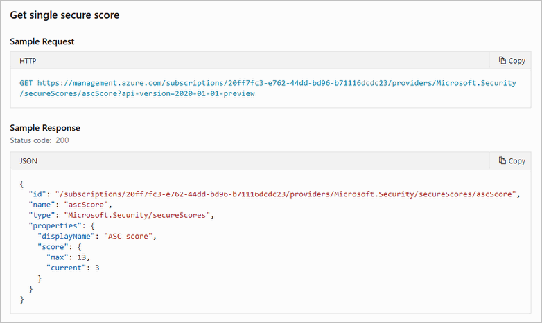

# Access and track your secure score

You can find your overall secure score, and your score per subscription, through the Azure portal or programmatically as described in the following sections:

> [!TIP]
> For a detailed explanation of how your scores are calculated, see [Calculations - understanding your score](secure-score-security-controls.md#calculations---understanding-your-score).

## Get your secure score from the portal

Defender for Cloud displays your score prominently in the portal. When you select the Secure score tile on the overview page, you're taken to the dedicated secure score page, where you'll see the score broken down by subscription. Select a single subscription to see the detailed list of prioritized recommendations and the potential effect that remediating them will have on the subscription's score. 

Your secure score is shown in the following locations in Defender for Cloud's portal pages.

- In a tile on Defender for Cloud's **Overview** (main dashboard):

    :::image type="content" source="./media/secure-score-security-controls/score-on-main-dashboard.png" alt-text="The secure score on Defender for Cloud's dashboard":::

- In the dedicated **Secure score** page you can see the secure score for your subscription and your management groups:

    :::image type="content" source="./media/secure-score-security-controls/score-on-dedicated-dashboard.png" alt-text="The secure score for subscriptions on Defender for Cloud's secure score page":::

    :::image type="content" source="./media/secure-score-security-controls/secure-score-management-groups.png" alt-text="The secure score for management groups on Defender for Cloud's secure score page":::

    > [!NOTE]
    > Any management groups for which you don't have sufficient permissions, will show their score as “Restricted.” 

- At the top of the **Recommendations** page:

    :::image type="content" source="./media/secure-score-security-controls/score-on-recommendations-page.png" alt-text="The secure score on Defender for Cloud's recommendations page":::

## Get your secure score from the REST API

You can access your score via the secure score API. The API methods provide the flexibility to query the data and build your own reporting mechanism of your secure scores over time. For example, you can use the [Secure Scores API](/rest/api/defenderforcloud/secure-scores) to get the score for a specific subscription. In addition, you can use the [Secure Score Controls API](/rest/api/defenderforcloud/secure-score-controls) to list the security controls and the current score of your subscriptions.



For examples of tools built on top of the secure score API, see [the secure score area of our GitHub community](https://github.com/Azure/Azure-Security-Center/tree/master/Secure%20Score). 

## Get your secure score from Azure Resource Graph

Azure Resource Graph provides instant access to resource information across your cloud environments with robust filtering, grouping, and sorting capabilities. It's a quick and efficient way to query information across Azure subscriptions programmatically or from within the Azure portal. [Learn more about Azure Resource Graph](../governance/resource-graph/index.yml).

To access the secure score for multiple subscriptions with Azure Resource Graph:

1. From the Azure portal, open **Azure Resource Graph Explorer**.

    :::image type="content" source="./media/multi-factor-authentication-enforcement/opening-resource-graph-explorer.png" alt-text="Launching Azure Resource Graph Explorer** recommendation page" :::

1. Enter your Kusto query (using the following examples for guidance).

    - This query returns the subscription ID, the current score in points and as a percentage, and the maximum score for the subscription. 

        ```kusto
        SecurityResources 
        | where type == 'microsoft.security/securescores' 
        | extend current = properties.score.current, max = todouble(properties.score.max)
        | project subscriptionId, current, max, percentage = ((current / max)*100)
        ```

    - This query returns the status of all the security controls. For each control, you'll get the number of unhealthy resources, the current score, and the maximum score. 

        ```kusto
        SecurityResources 
        | where type == 'microsoft.security/securescores/securescorecontrols'
        | extend SecureControl = properties.displayName, unhealthy = properties.unhealthyResourceCount, currentscore = properties.score.current, maxscore = properties.score.max
        | project SecureControl , unhealthy, currentscore, maxscore
        ```

1. Select **Run query**.


## Tracking your secure score over time

### Secure Score Over Time report in workbooks page

Defender for Cloud's workbooks page includes a ready-made report for visually tracking the scores of your subscriptions, security controls, and more. Learn more in [Create rich, interactive reports of Defender for Cloud data](custom-dashboards-azure-workbooks.md).

:::image type="content" source="media/custom-dashboards-azure-workbooks/secure-score-over-time-snip.png" alt-text="A section of the secure score over time report from Microsoft Defender for Cloud's workbooks gallery":::

### Power BI Pro dashboards

If you're a Power BI user with a Pro account, you can use the **Secure Score Over Time** Power BI dashboard to track your secure score over time and investigate any changes.

> [!TIP]
> You can find this dashboard, as well as other tools for working programmatically with secure score, in the dedicated area of the Microsoft Defender for Cloud community on GitHub: <https://github.com/Azure/Azure-Security-Center/tree/master/Secure%20Score>

The dashboard contains the following two reports to help you analyze your security status:

- **Resources Summary** - provides summarized data regarding your resources’ health.

- **Secure Score Summary** - provides summarized data regarding your score progress. Use the “Secure score over time per subscription” chart to view changes in the score. If you notice a dramatic change in your score, check the “detected changes that might affect your secure score” table for possible changes that could have caused the change. This table presents deleted resources, newly deployed resources, or resources that their security status changed for one of the recommendations.

:::image type="content" source="./media/secure-score-security-controls/power-bi-secure-score-dashboard.png" alt-text="The optional Secure Score Over Time Power BI dashboard for tracking your secure score over time and investigating changes.":::


## Next steps

This article described how to access and track your secure score. For related material, see the following articles:

- [Learn about the different elements of a recommendation](review-security-recommendations.md)
- [Learn how to remediate recommendations](implement-security-recommendations.md)
- [View the GitHub-based tools for working programmatically with secure score](https://github.com/Azure/Azure-Security-Center/tree/master/Secure%20Score)
