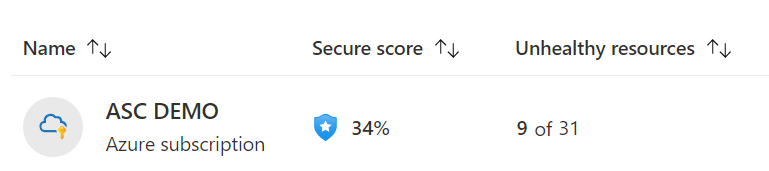
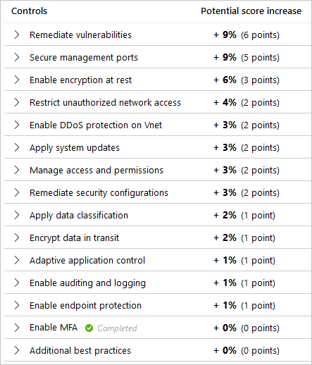
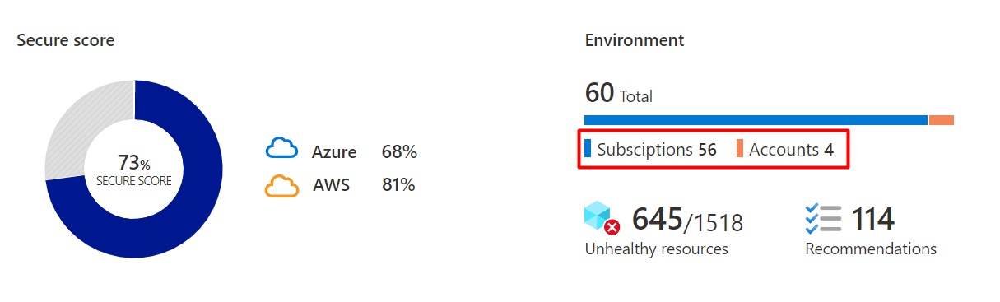

# Secure score

## Overview of secure score

Microsoft Defender for Cloud has two main goals:

- to help you understand your current security situation
- to help you efficiently and effectively improve your security

The central feature in Defender for Cloud that enables you to achieve those goals is the **secure score**.

Defender for Cloud continually assesses your cross-cloud resources for security issues. It then aggregates all the findings into a single score so that you can tell, at a glance, your current security situation: the higher the score, the lower the identified risk level.

- In the Azure portal pages, the secure score is shown as a percentage value and the underlying values are also clearly presented:

    :::image type="content" source="./media/secure-score-security-controls/single-secure-score-via-ui.png" alt-text="Overall secure score as shown in the portal.":::

- In the Azure mobile app, the secure score is shown as a percentage value and you can tap the secure score to see the details that explain the score:

    :::image type="content" source="./media/secure-score-security-controls/single-secure-score-via-mobile.png" alt-text="Overall secure score as shown in the Azure mobile app.":::

To increase your security, review Defender for Cloud's recommendations page and remediate the recommendation by implementing the remediation instructions for each issue. Recommendations are grouped into **security controls**. Each control is a logical group of related security recommendations, and reflects your vulnerable attack surfaces. Your score only improves when you remediate *all* of the recommendations for a single resource within a control. To see how well your organization is securing each individual attack surface, review the scores for each security control.

For more information, see [How your secure score is calculated](secure-score-security-controls.md#how-your-secure-score-is-calculated) below.

## Manage your security posture

On the Security posture page, you're able to see the secure score for your entire subscription, and each environment in your subscription. By default all environments are shown.

:::image type="content" source="media/secure-score-security-controls/security-posture-page.png" alt-text="Screenshot of the security posture page.":::

| Page section | Description |
|--|--|
| :::image type="content" source="media/secure-score-security-controls/select-environment.png" alt-text="Screenshot showing the different environment options."::: | Select your environment to see its secure score, and details. Multiple environments can be selected at once. The page will change based on your selection here.|
| :::image type="content" source="media/secure-score-security-controls/environment.png" alt-text="Screenshot of the environment section of the security posture page."::: | Shows the total number of subscriptions, accounts and projects that affect your overall score. It also shows how many unhealthy resources and how many recommendations exist in your environments. |

The bottom half of the page allows you to view and manage viewing the individual secure scores, number of unhealthy resources and even view the recommendations for all of your individual subscriptions, accounts, and projects.

You can group this section by environment by selecting the Group by Environment checkbox.

:::image type="content" source="media/secure-score-security-controls/bottom-half.png" alt-text="Screenshot of the bottom half of the security posture page.":::

## How your secure score is calculated

The contribution of each security control towards the overall secure score is shown on the recommendations page.

:::image type="content" source="./media/secure-score-security-controls/security-controls.png" alt-text="Microsoft Defender for Cloud's security controls and their impact on your secure score." lightbox="./media/secure-score-security-controls/security-controls.png":::

To get all the possible points for a security control, all of your resources must comply with all of the security recommendations within the security control. For example, Defender for Cloud has multiple recommendations regarding how to secure your management ports. You'll need to remediate them all to make a difference to your secure score.

### Example scores for a control

:::image type="content" source="./media/secure-score-security-controls/remediate-vulnerabilities-control.png" alt-text="Screenshot showing how to apply system updates security control." lightbox="./media/secure-score-security-controls/remediate-vulnerabilities-control.png":::

In this example:

- **Remediate vulnerabilities security control** - This control groups multiple recommendations related to discovering and resolving known vulnerabilities.

- **Max score** - The maximum number of points you can gain by completing all recommendations within a control. The maximum score for a control indicates the relative significance of that control and is fixed for every environment. Use the max score values to triage the issues to work on first. For a list of all controls and their max scores, see [Security controls and their recommendations](#security-controls-and-their-recommendations).

- **Current score** - The current score for this control.

    Current score = [Score per resource] * [Number of healthy resources]

    Each control contributes towards the total score. In this example, the control is contributing 2.00 points to current total secure score.

- **Potential score increase** - The remaining points available to you within the control. If you remediate all the recommendations in this control, your score will increase by 9%.

    Potential score increase = [Score per resource] * [Number of unhealthy resources]

- **Insights** - Gives you extra details for each recommendation, such as:

  - :::image type="icon" source="media/secure-score-security-controls/preview-icon.png" border="false"::: Preview recommendation - This recommendation won't affect your secure score until it's GA.

  - :::image type="icon" source="media/secure-score-security-controls/fix-icon.png" border="false"::: Fix - From within the recommendation details page, you can use 'Fix' to resolve this issue.

  - :::image type="icon" source="media/secure-score-security-controls/enforce-icon.png" border="false"::: Enforce - From within the recommendation details page, you can automatically deploy a policy to fix this issue whenever someone creates a non-compliant resource.

  - :::image type="icon" source="media/secure-score-security-controls/deny-icon.png" border="false"::: Deny - From within the recommendation details page, you can prevent new resources from being created with this issue.

### Calculations - understanding your score

|Metric|Formula and example|
|-|-|
|**Security control's current score**|   Each individual security control contributes towards the Security Score. Each resource affected by a recommendation within the control, contributes towards the control's current score. The current score for each control is a measure of the status of the resources *within* the control.  In this example, the max score of 6 would be divided by 78 because that's the sum of the healthy and unhealthy resources. 6 / 78 = 0.0769 Multiplying that by the number of healthy resources (4) results in the current score: 0.0769 * 4 = **0.31**  |
|**Secure score** Single subscription, or connector|    In this example, there's a single subscription, or connector with all security controls available (a potential maximum score of 60 points). The score shows 28 points out of a possible 60 and the remaining 32 points are reflected in the "Potential score increase" figures of the security controls.    This equation is the same equation for a connector with just the word subscription being replaced by the word connector. |
|**Secure score** Multiple subscriptions, and connectors|   The combined score for multiple subscriptions and connectors includes a *weight* for each subscription, and connector. The relative weights for your subscriptions, and connectors are determined by Defender for Cloud based on factors such as the number of resources. The current score for each subscription, a dn connector is calculated in the same way as for a single subscription, or connector, but then the weight is applied as shown in the equation. When you view multiple subscriptions and connectors, the secure score evaluates all resources within all enabled policies and groups their combined impact on each security control's maximum score.  The combined score is **not** an average; rather it's the evaluated posture of the status of all resources across all subscriptions, and connectors.  Here too, if you go to the recommendations page and add up the potential points available, you'll find that it's the difference between the current score (22) and the maximum score available (58).|

### Which recommendations are included in the secure score calculations?

Only built-in recommendations have an impact on the secure score.

Recommendations flagged as **Preview** aren't included in the calculations of your secure score. They should still be remediated wherever possible, so that when the preview period ends they'll contribute towards your score.

Preview recommendations are marked with: :::image type="icon" source="media/secure-score-security-controls/preview-icon.png" border="false":::

## Improve your secure score

To improve your secure score, remediate security recommendations from your recommendations list. You can remediate each recommendation manually for each resource, or use the **Fix** option (when available) to resolve an issue on multiple resources quickly. For more information, see [Remediate recommendations](implement-security-recommendations.md).

You can also [configure the Enforce and Deny options](prevent-misconfigurations.md) on the relevant recommendations to improve your score and make sure your users don't create resources that negatively impact your score.

## Security controls and their recommendations

The table below lists the security controls in Microsoft Defender for Cloud. For each control, you can see the maximum number of points you can add to your secure score if you remediate *all* of the recommendations listed in the control, for *all* of your resources.

The set of security recommendations provided with Defender for Cloud is tailored to the available resources in each organization's environment. You can [disable recommendations](tutorial-security-policy.md#disable-a-security-recommendation) and [exempt specific resources from a recommendation](exempt-resource.md) to further customize the recommendations.

We recommend every organization carefully reviews their assigned Azure Policy initiatives.

> [!TIP]
> For details about reviewing and editing your initiatives, see [manage security policies](tutorial-security-policy.md).

Even though Defender for Cloud's default security initiative, the Azure Security Benchmark, is based on industry best practices and standards, there are scenarios in which the built-in recommendations listed below might not completely fit your organization. It's sometimes necessary to adjust the default initiative - without compromising security - to ensure it's aligned with your organization's own policies, industry standards, regulatory standards, and benchmarks.  

[!INCLUDE [security-center-controls-and-recommendations](../../includes/asc/security-control-recommendations.md)]

## FAQ - Secure score

### If I address only three out of four recommendations in a security control, will my secure score change?

No. It won't change until you remediate all of the recommendations for a single resource. To get the maximum score for a control, you must remediate all recommendations for all resources.

### If a recommendation isn't applicable to me, and I disable it in the policy, will my security control be fulfilled and my secure score updated?

Yes. We recommend disabling recommendations when they're inapplicable in your environment. For instructions on how to disable a specific recommendation, see [Disable security recommendations](./tutorial-security-policy.md#disable-a-security-recommendation).

### If a security control offers me zero points towards my secure score, should I ignore it?

In some cases, you'll see a control max score greater than zero, but the impact is zero. When the incremental score for fixing resources is negligible, it's rounded to zero. Don't ignore these recommendations because they still bring security improvements. The only exception is the "Additional Best Practice" control. Remediating these recommendations won't increase your score, but it will enhance your overall security.

## Next steps

This article described the secure score and the included security controls.

> [!div class="nextstepaction"]
> [Access and track your secure score](secure-score-access-and-track.md)

For related material, see the following articles:

- [Learn about the different elements of a recommendation](review-security-recommendations.md)
- [Learn how to remediate recommendations](implement-security-recommendations.md)
- [View the GitHub-based tools for working programmatically with secure score](https://github.com/Azure/Azure-Security-Center/tree/master/Secure%20Score)
