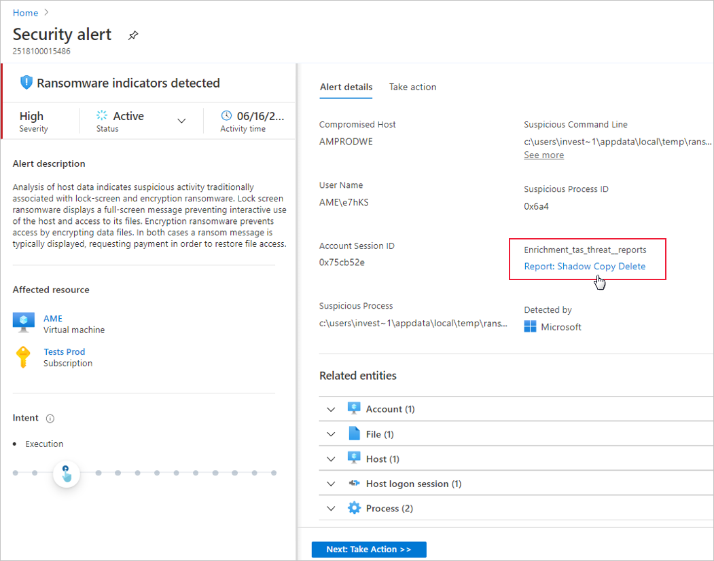

# Microsoft Defender for Cloud threat intelligence report

Microsoft Defender for Cloud's threat intelligence reports can help you learn more about a threat that triggered a security alert.

## What is a threat intelligence report?

Defender for Cloud's threat protection works by monitoring security information from your Azure resources, the network, and connected partner solutions. It analyzes this information, often correlating information from multiple sources, to identify threats. For more information, see [How Microsoft Defender for Cloud detects and responds to threats](alerts-overview.md#detect-threats).

When Defender for Cloud identifies a threat, it triggers a [security alert](managing-and-responding-alerts.md), which contains detailed information regarding the event, including suggestions for remediation. To help incident response teams investigate and remediate threats, Defender for Cloud provides threat intelligence reports containing information about detected threats. The report includes information such as:

* Attacker’s identity or associations (if this information is available)
* Attackers’ objectives
* Current and historical attack campaigns (if this information is available)
* Attackers’ tactics, tools, and procedures
* Associated indicators of compromise (IoC) such as URLs and file hashes
* Victimology, which is the industry and geographic prevalence to assist you in determining if your Azure resources are at risk
* Mitigation and remediation information

> [!NOTE]
> The amount of information in any particular report will vary; the level of detail is based on the malware’s activity and prevalence.

Defender for Cloud has three types of threat reports, which can vary according to the attack. The reports available are:

* **Activity Group Report**: provides deep dives into attackers, their objectives, and tactics.
* **Campaign Report**: focuses on details of specific attack campaigns.
* **Threat Summary Report**: covers all of the items in the previous two reports.

This type of information is useful during the incident response process. Such as when there's an ongoing investigation to understand the source of the attack, the attacker’s motivations, and what to do to mitigate this issue in the future.

## How to access the threat intelligence report?

1. From Defender for Cloud's menu, open the **Security alerts** page.
1. Select an alert. 

    The alerts details page opens with more details about the alert. For example, the **Ransomware indicators detected** alert details page:

    

1. Select the link to the report, and a PDF will open in your default browser.

    

    You can optionally download the PDF report. 

    >[!TIP]
    > The amount of information available for each security alert will vary according to the type of alert.

## Next steps

This page explained how to open threat intelligence reports when investigating security alerts. For related information, see the following pages:

* [Managing and responding to security alerts in Microsoft Defender for Cloud](managing-and-responding-alerts.md). Learn how to manage and respond to security alerts.
* [Handling security incidents in Microsoft Defender for Cloud](incidents.md)
