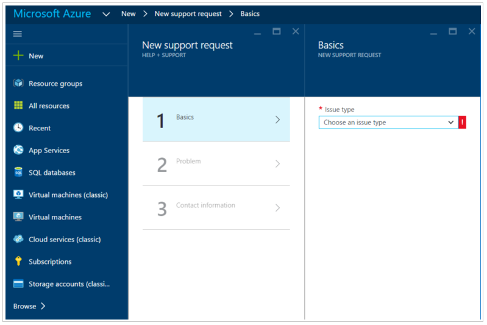

# Microsoft Defender for Cloud Troubleshooting Guide

This guide is for information technology (IT) professionals, information security analysts, and cloud administrators whose organizations need to troubleshoot Defender for Cloud related issues.

> [!TIP]
> When you're facing an issue or need advice from our support team, the **Diagnose and solve problems** section of the Azure portal is good place to look for solutions:
>
> :::image type="content" source="media/release-notes/solve-problems.png" alt-text="Defender for Cloud's 'Diagnose and solve problems' page":::

## Use the Audit Log to investigate issues

The first place to look for troubleshooting information is the [Audit Log records](../azure-monitor/essentials/platform-logs-overview.md) records for the failed component. In the audit logs, you can see details including:

- Which operations were performed
- Who initiated the operation
- When the operation occurred
- The status of the operation

The audit log contains all write operations (PUT, POST, DELETE) performed on your resources, but not read operations (GET).

## Troubleshooting the Log Analytics agent

Defender for Cloud uses the Log Analytics agent to [collect and store data](./enable-data-collection.md). The information in this article represents Defender for Cloud functionality after transition to the Log Analytics agent.

Alert types:

- Virtual Machine Behavioral Analysis (VMBA)
- Network Analysis
- SQL Database and Azure Synapse Analytics Analysis
- Contextual Information

Depending on the alert types, customers can gather the necessary information to investigate the alert by using the following resources:

- Security logs in the Virtual Machine (VM) event viewer in Windows
- AuditD in Linux
- The Azure activity logs and the enable diagnostic logs on the attack resource.

Customers can share feedback for the alert description and relevance. Navigate to the alert itself, select the **Was This Useful** button, select the reason, and then enter a comment to explain the feedback. We consistently monitor this feedback channel to improve our alerts.

### Check the Log Analytics agent processes and versions

Just like the Azure Monitor, Defender for Cloud uses the Log Analytics agent to collect security data from your Azure virtual machines. After data collection is enabled and the agent is correctly installed in the target machine, the `HealthService.exe` process should be running.

Open the services management console (services.msc), to make sure that the Log Analytics agent service running as shown below:

:::image type="content" source="./media/troubleshooting-guide/troubleshooting-guide-fig5.png" alt-text="Screenshot of the Log Analytics agent service in Task Manager.":::

To see which version of the agent you have, open **Task Manager**, in the **Processes** tab locate the **Log Analytics agent Service**, right-click on it and select **Properties**. In the **Details** tab, look the file version as shown below:

:::image type="content" source="./media/troubleshooting-guide/troubleshooting-guide-fig6.png" alt-text="Screenshot of the Log Analytics agent service details.":::

### Log Analytics agent installation scenarios

There are two installation scenarios that can produce different results when installing the Log Analytics agent on your computer. The supported scenarios are:

- **Agent installed automatically by Defender for Cloud**: You can view the alerts in Defender for Cloud and Log search. You'll receive email notifications to the email address that was configured in the security policy for the subscription the resource belongs to.

- **Agent manually installed on a VM located in Azure**: in this scenario, if you're using agents downloaded and installed manually prior to February 2017, you can view the alerts in the Defender for Cloud portal only if you filter on the subscription the workspace belongs to. If you filter on the subscription the resource belongs to, you won't see any alerts. You'll receive email notifications to the email address that was configured in the security policy for the subscription the workspace belongs to.

> [!NOTE]
> To avoid the behavior explained in the second scenario, make sure you download the latest version of the agent.

### Monitoring agent network connectivity issues

For agents to connect to and register with Defender for Cloud, they must have access to the DNS addresses and network ports for Azure network resources.

- When you use proxy servers, you need to make sure that the appropriate proxy server resources are configured correctly in the [agent settings](../azure-monitor/agents/agent-windows.md).
- You need to configure your network firewalls to permit access to Log Analytics.

The Azure network resources are:

| Agent Resource | Ports | Bypass HTTPS inspection |
|---|---|---|
| *.ods.opinsights.azure.com | 443 | Yes |
| *.oms.opinsights.azure.com | 443 | Yes |
| *.blob.core.windows.net | 443 | Yes |
| *.azure-automation.net | 443 | Yes |

If you're having trouble onboarding the Log Analytics agent, make sure to read [how to troubleshoot Operations Management Suite onboarding issues](https://support.microsoft.com/help/3126513/how-to-troubleshoot-operations-management-suite-onboarding-issues).

## Antimalware protection isn't working properly

The guest agent is the parent process of everything the [Microsoft Antimalware](../security/fundamentals/antimalware.md) extension does. When the guest agent process fails, the Microsoft Antimalware protection that runs as a child process of the guest agent may also fail.

Here are some other troubleshooting tips:

- If the target VM was created from a custom image, make sure that the creator of the VM installed guest agent.
- If the target is a Linux VM, then installing the Windows version of the antimalware extension will fail. The Linux guest agent has specific OS and package requirements.
- If the VM was created with an old version of guest agent, the old agents might not have the ability to auto-update to the newer version. Always use the latest version of guest agent when you create your own images.
- Some third-party administration software may disable the guest agent, or block access to certain file locations. If third-party administration software is installed on your VM, make sure that the antimalware agent is on the exclusion list.
- Make sure that firewall settings and Network Security Group (NSG) aren't blocking network traffic to and from guest agent.
- Make sure that there are no Access Control Lists (ACLs) that prevent disk access.
- The guest agent requires sufficient disk space in order to function properly.

By default the Microsoft Antimalware user interface is disabled, but you can [enable the Microsoft Antimalware user interface](/archive/blogs/azuresecurity/enabling-microsoft-antimalware-user-interface-post-deployment) on Azure Resource Manager VMs.

## Troubleshooting problems loading the dashboard

If you experience issues loading the workload protection dashboard, make sure that the user that first enabled Defender for Cloud on the subscription and the user that want to turn on data collection have the *Owner* or *Contributor* role on the subscription. If that is the case, users with the *Reader* role on the subscription can see the dashboard, alerts, recommendations, and policy.

## Contacting Microsoft Support

You can also find troubleshooting information for Defender for Cloud at the [Defender for Cloud Q&A page](/answers/topics/azure-security-center.html). If you need further troubleshooting, you can open a new support request using **Azure portal** as shown below:

## See also

In this page, you learned about troubleshooting steps for Defender for Cloud. To learn more about Microsoft Defender for Cloud:

- Learn how to [manage and respond to security alerts](managing-and-responding-alerts.md) in Microsoft Defender for Cloud
- [Alert validation](alert-validation.md) in Microsoft Defender for Cloud
- Review [frequently asked questions](faq-general.yml) about using Microsoft Defender for Cloud
