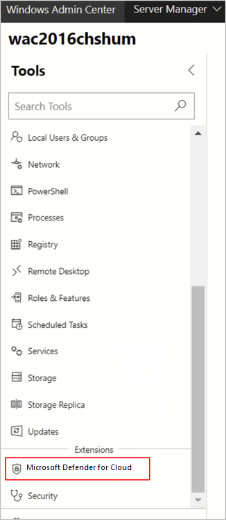
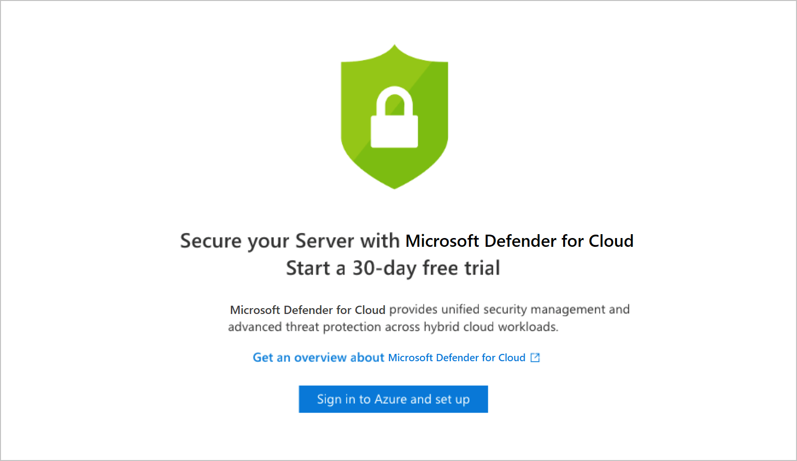
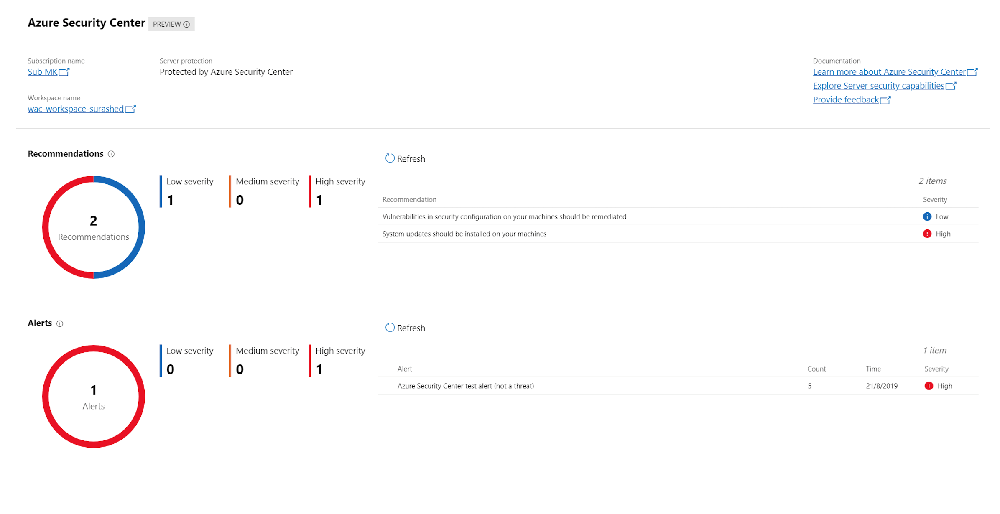

# Protect Windows Admin Center resources with Microsoft Defender for Cloud

Windows Admin Center is a management tool for your Windows servers. It's a single location for system administrators to access most the most commonly used admin tools. From within Windows Admin Center, you can directly onboard your on-premises servers into Microsoft Defender for Cloud. You can then view a summary of your security recommendations and alerts directly in the Windows Admin Center experience.

When you've successfully onboarded a server from Windows Admin Center to Microsoft Defender for Cloud, you can:

- View security alerts and recommendations inside the Defender for Cloud extension in Windows Admin Center.

- View the security posture and retrieve other detailed information of your Windows Admin Center managed servers in Defender for Cloud within the Azure portal (or via an API).

Through the combination of these two tools, Defender for Cloud becomes your single pane of glass to view all your security information, whatever the resource: protecting your Windows Admin Center managed on-premises servers, your VMs, and any other PaaS workloads.

## Onboard Windows Admin Center managed servers into Defender for Cloud

1. From Windows Admin Center, select one of your servers, and in the **Tools** pane, select the Microsoft Defender for Cloud extension:

    

    > [!NOTE]
    > If the server is already onboarded to Defender for Cloud, the set-up window will not appear.

1. Select **Sign in to Azure and set up**.
    

1. Follow the instructions to connect your server to Defender for Cloud. After you've entered the necessary details and confirmed, Defender for Cloud makes the necessary configuration changes to ensure that all of the following are true:
    - An Azure Gateway is registered.
    - The server has a workspace to report to and an associated subscription.
    - Defender for Cloud's Log Analytics solution is enabled on the workspace. This solution provides Microsoft Defender for Cloud's features for *all* servers and virtual machines reporting to this workspace.
    - Microsoft Defender for Servers is enabled on the subscription.
    - The Log Analytics agent is installed on the server and configured to report to the selected workspace. If the server already reports to another workspace, it's configured to report to the newly selected workspace as well.

    > [!NOTE]
    > It might take some time after onboarding for recommendations to appear. In fact, depending on your server activity you might not receive *any* alerts. To generate test alerts to test your alerts are working correctly, follow the instructions in [the alert validation procedure](alert-validation.md).

## View security recommendations and alerts in Windows Admin Center

Once onboarded, you can view your alerts and recommendations directly in the Microsoft Defender for Cloud area of Windows Admin Center. Select a recommendation or an alert to view them in the Azure portal. There, you'll get additional information and learn how to remediate issues.

## View security recommendations and alerts for Windows Admin Center managed servers in Defender for Cloud

From Microsoft Defender for Cloud:

- To view security recommendations for all your Windows Admin Center servers, open [asset inventory](asset-inventory.md) and filter to the machine type that you want to investigate. select the **VMs and Computers** tab.

- To view security alerts for all your Windows Admin Center servers, open **Security alerts**. Select **Filter** and ensure **only** "Non-Azure" is selected:

    :::image type="content" source="./media/windows-admin-center-integration/filtering-alerts-by-environment.png" alt-text="Filter security alerts for Windows Admin Center managed servers." lightbox="./media/windows-admin-center-integration/filtering-alerts-by-environment.png":::

## Next steps

[Integrate security solutions in Microsoft Defender for Cloud](partner-integration.md)
