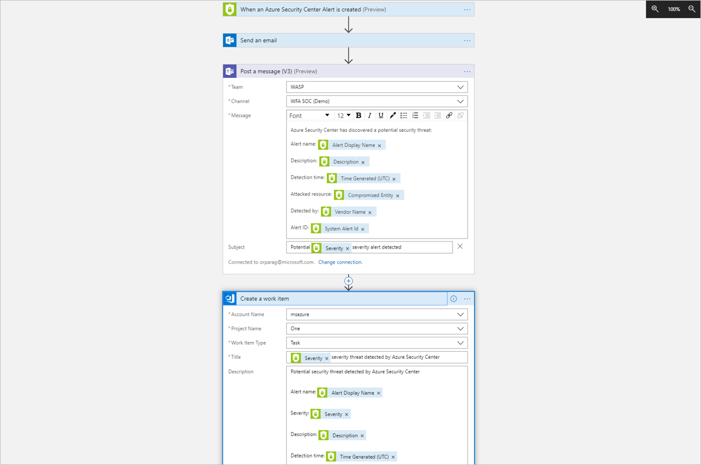
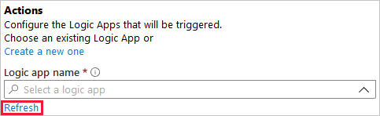
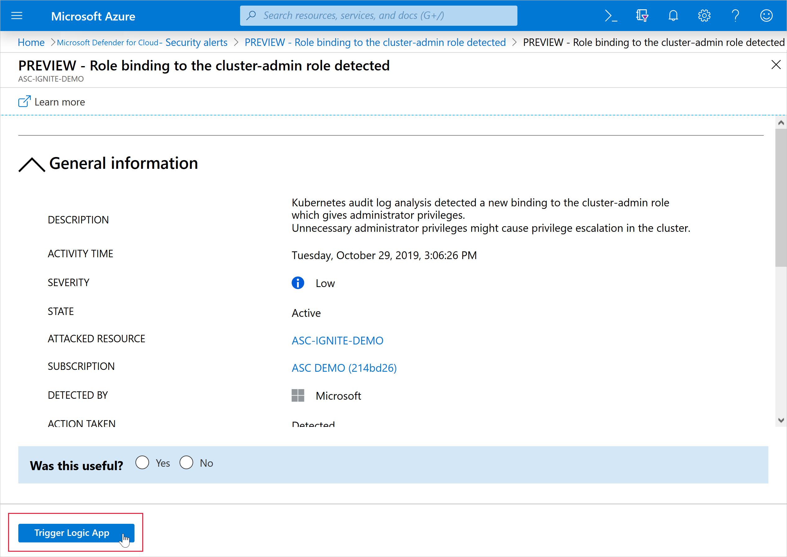

# Automate responses to Microsoft Defender for Cloud triggers

Every security program includes multiple workflows for incident response. These processes might include notifying relevant stakeholders, launching a change management process, and applying specific remediation steps. Security experts recommend that you automate as many steps of those procedures as you can. Automation reduces overhead. It can also improve your security by ensuring the process steps are done quickly, consistently, and according to your predefined requirements.

This article describes the workflow automation feature of Microsoft Defender for Cloud. This feature can trigger consumption Logic Apps on security alerts, recommendations, and changes to regulatory compliance. For example, you might want Defender for Cloud to email a specific user when an alert occurs. You'll also learn how to create Logic Apps using [Azure Logic Apps](../logic-apps/logic-apps-overview.md).

## Availability

|Aspect|Details|
|----|:----|
|Release state:|General availability (GA)|
|Pricing:|Free|
|Required roles and permissions:|**Security admin role** or **Owner** on the resource group Must also have write permissions for the target resource  To work with Azure Logic Apps workflows, you must also have the following Logic Apps roles/permissions:  - [Logic App Operator](../role-based-access-control/built-in-roles.md#logic-app-operator) permissions are required or Logic App read/trigger access (this role can't create or edit logic apps; only *run* existing ones)  - [Logic App Contributor](../role-based-access-control/built-in-roles.md#logic-app-contributor) permissions are required for Logic App creation and modification If you want to use Logic App connectors, you may need other credentials to sign in to their respective services (for example, your Outlook/Teams/Slack instances)|
|Clouds:|:::image type="icon" source="./media/icons/yes-icon.png"::: Commercial clouds :::image type="icon" source="./media/icons/yes-icon.png"::: National (Azure Government, Azure China 21Vianet)|

## Create a logic app and define when it should automatically run 

1. From Defender for Cloud's sidebar, select **Workflow automation**.

    :::image type="content" source="./media/workflow-automation/list-of-workflow-automations.png" alt-text="Screenshot of workflow automation page showing the list of defined automations." lightbox="./media/workflow-automation/list-of-workflow-automations.png":::

    From this page you can create new automation rules, enable, disable, or delete existing ones.

1. To define a new workflow, select **Add workflow automation**. The options pane for your new automation opens.

    :::image type="content" source="./media/workflow-automation/add-workflow.png" alt-text="Add workflow automations pane." lightbox="media/workflow-automation/add-workflow.png":::

    Here you can enter:
    1. A name and description for the automation.
    1. The triggers that will initiate this automatic workflow. For example, you might want your Logic App to run when a security alert that contains "SQL" is generated.

        > [!NOTE]
        > If your trigger is a recommendation that has "sub-recommendations", for example **Vulnerability assessment findings on your SQL databases should be remediated**, the logic app will not trigger for every new security finding; only when the status of the parent recommendation changes.

    1. The consumption Logic App that will run when your trigger conditions are met. 

1. From the Actions section, select **visit the Logic Apps page** to begin the Logic App creation process.

    :::image type="content" source="media/workflow-automation/visit-logic.png" alt-text="Screenshot that shows where on the screen you need to select the visit the logic apps page in the actions section of the add workflow automation screen." border="true":::

    You'll be taken to Azure Logic Apps.

1. Select **(+) Add**.

    :::image type="content" source="media/workflow-automation/logic-apps-create-new.png" alt-text="Screenshot of the create a logic app screen." lightbox="media/workflow-automation/logic-apps-create-new.png":::

1. Fill out all required fields and select **Review + Create**.

    The message **Deployment is in progress** appears. Wait for the deployment complete notification to appear and select **Go to resource** from the notification.

1. Review the information you entered and select **Create**.

    In your new logic app, you can choose from built-in, predefined templates from the security category. Or you can define a custom flow of events to occur when this process is triggered.

    > [!TIP]
    > Sometimes in a logic app, parameters are included in the connector as part of a string and not in their own field. For an example of how to extract parameters, see step #14 of [Working with logic app parameters while building Microsoft Defender for Cloud workflow automations](https://techcommunity.microsoft.com/t5/azure-security-center/working-with-logic-app-parameters-while-building-azure-security/ba-p/1342121).

    The logic app designer supports the following Defender for Cloud triggers:

    - **When a Microsoft Defender for Cloud Recommendation is created or triggered** - If your logic app relies on a recommendation that gets deprecated or replaced, your automation will stop working and you'll need to update the trigger. To track changes to recommendations, use the [release notes](release-notes.md).

    - **When a Defender for Cloud Alert is created or triggered** - You can customize the trigger so that it relates only to alerts with the severity levels that interest you.
    
    - **When a Defender for Cloud regulatory compliance assessment is created or triggered** - Trigger automations based on updates to regulatory compliance assessments.

    > [!NOTE]
    > If you are using the legacy trigger "When a response to a Microsoft Defender for Cloud alert is triggered", your logic apps will not be launched by the Workflow Automation feature. Instead, use either of the triggers mentioned above. 

    

1. After you've defined your logic app, return to the workflow automation definition pane ("Add workflow automation"). Select **Refresh** to ensure your new Logic App is available for selection.

    

1. Select your logic app and save the automation. The Logic App dropdown only shows Logic Apps with supporting Defender for Cloud connectors mentioned above.

## Manually trigger a Logic App

You can also run Logic Apps manually when viewing any security alert or recommendation.

To manually run a Logic App, open an alert, or a recommendation and select **Trigger Logic App**:

## Configure workflow automation at scale using the supplied policies

Automating your organization's monitoring and incident response processes can greatly improve the time it takes to investigate and mitigate security incidents.

To deploy your automation configurations across your organization, use the supplied Azure Policy 'DeployIfNotExist' policies described below to create and configure workflow automation procedures.

Get started with [workflow automation templates](https://github.com/Azure/Azure-Security-Center/tree/master/Workflow%20automation).

To implement these policies:

1. From the table below, select the policy you want to apply:

    |Goal  |Policy  |Policy ID  |
    |---------|---------|---------|
    |Workflow automation for security alerts              |[Deploy Workflow Automation for Microsoft Defender for Cloud alerts](https://portal.azure.com/#view/Microsoft_Azure_Policy/PolicyDetailBlade/definitionId/%2Fproviders%2FMicrosoft.Authorization%2FpolicyDefinitions%2Ff1525828-9a90-4fcf-be48-268cdd02361e)|f1525828-9a90-4fcf-be48-268cdd02361e|
    |Workflow automation for security recommendations     |[Deploy Workflow Automation for Microsoft Defender for Cloud recommendations](https://portal.azure.com/#view/Microsoft_Azure_Policy/PolicyDetailBlade/definitionId/%2Fproviders%2FMicrosoft.Authorization%2FpolicyDefinitions%2F73d6ab6c-2475-4850-afd6-43795f3492ef)|73d6ab6c-2475-4850-afd6-43795f3492ef|
    |Workflow automation for regulatory compliance changes|[Deploy Workflow Automation for Microsoft Defender for Cloud regulatory compliance](https://portal.azure.com/#view/Microsoft_Azure_Policy/PolicyDetailBlade/definitionId/%2Fproviders%2FMicrosoft.Authorization%2FpolicyDefinitions%2F509122b9-ddd9-47ba-a5f1-d0dac20be63c)|509122b9-ddd9-47ba-a5f1-d0dac20be63c|

    > [!NOTE]
    > The three workflow automation policies have recently been rebranded. Unfortunately, this change came with an unavoidable breaking change. To learn how to mitigate this breaking change, see [mitigate breaking change](#mitigate-breaking-change),

    > [!TIP]
    > You can also find these by searching Azure Policy:
    > 1. Open Azure Policy.
    > :::image type="content" source="./media/continuous-export/opening-azure-policy.png" alt-text="Accessing Azure Policy.":::
    > 2. From the Azure Policy menu, select **Definitions** and search for them by name. 

1. From the relevant Azure Policy page, select **Assign**.
    :::image type="content" source="./media/workflow-automation/export-policy-assign.png" alt-text="Assigning the Azure Policy.":::

1. Open each tab and set the parameters as desired:
    1. In the **Basics** tab, set the scope for the policy. To use centralized management, assign the policy to the Management Group containing the subscriptions that will use the workflow automation configuration. 
    1. In the Parameters tab, enter the required information. 

    :::image type="content" source="media/workflow-automation/parameters-tab.png" alt-text="Screenshot of the parameters tab.":::

    1. (Optional), Apply this assignment to an existing subscription in the **Remediation** tab and select the option to create a remediation task.

1. Review the summary page and select **Create**.

## Data types schemas

To view the raw event schemas of the security alerts or recommendations events passed to the Logic App instance, visit the [Workflow automation data types schemas](https://aka.ms/ASCAutomationSchemas). This can be useful in cases where you aren't using Defender for Cloud's built-in Logic App connectors mentioned above, but instead are using Logic App's generic HTTP connector - you could use the event JSON schema to manually parse it as you see fit.

## FAQ - Workflow automation

### Does workflow automation support any business continuity or disaster recovery (BCDR) scenarios?

When preparing your environment for BCDR scenarios, where the target resource is experiencing an outage or other disaster, it's the organization's responsibility to prevent data loss by establishing backups according to the guidelines from Azure Event Hubs, Log Analytics workspace, and Logic App.

For every active automation, we recommend you create an identical (disabled) automation and store it in a different location. When there's an outage, you can enable these backup automations and maintain normal operations.

Learn more about [Business continuity and disaster recovery for Azure Logic Apps](../logic-apps/business-continuity-disaster-recovery-guidance.md).

### Mitigate breaking change

Recently we've rebranded the following recommendation:

- [Deploy Workflow Automation for Microsoft Defender for Cloud alerts](https://portal.azure.com/#view/Microsoft_Azure_Policy/PolicyDetailBlade/definitionId/%2Fproviders%2FMicrosoft.Authorization%2FpolicyDefinitions%2Ff1525828-9a90-4fcf-be48-268cdd02361e)
- [Deploy Workflow Automation for Microsoft Defender for Cloud recommendations](https://portal.azure.com/#view/Microsoft_Azure_Policy/PolicyDetailBlade/definitionId/%2Fproviders%2FMicrosoft.Authorization%2FpolicyDefinitions%2F73d6ab6c-2475-4850-afd6-43795f3492ef)
- [Deploy Workflow Automation for Microsoft Defender for Cloud regulatory compliance](https://portal.azure.com/#view/Microsoft_Azure_Policy/PolicyDetailBlade/definitionId/%2Fproviders%2FMicrosoft.Authorization%2FpolicyDefinitions%2F509122b9-ddd9-47ba-a5f1-d0dac20be63c)

Unfortunately, this change came with an unavoidable breaking change. The breaking change causes all of the old workflow automation policies that used the built-in connectors to be uncompliant.

**To mitigate this issue**:

1. Navigate to the logic app that is connected to the policy.
1. Select **Logic app designer**.
1. Select the **three dot** > **Rename**.
1. Rename the Defender for Cloud connector as follows:
    
    | Original name | New name|
    |--|--|
    |Deploy Workflow Automation for Microsoft Defender for Cloud alerts | When a Microsoft Defender for Cloud dAlert is created or triggered [1](#footnote1)|
    | Deploy Workflow Automation for Microsoft Defender for Cloud recommendations | When a Microsoft Defender for Cloud Recommendation is created or triggered |
    | Deploy Workflow Automation for Microsoft Defender for Cloud regulatory compliance | When a Microsoft Defender for Cloud Regulatory Compliance Assessment is created or triggered |

    1 The typo `Clou dAlert` is intentional.

## Next steps

In this article, you learned about creating Logic Apps, automating their execution in Defender for Cloud, and running them manually. For more information, see the following documentation:

- [Use workflow automation to automate a security response](/training/modules/resolve-threats-with-azure-security-center/)
- [Security recommendations in Microsoft Defender for Cloud](review-security-recommendations.md)
- [Security alerts in Microsoft Defender for Cloud](alerts-overview.md)
- [Workflow automation data types schemas](https://aka.ms/ASCAutomationSchemas)
