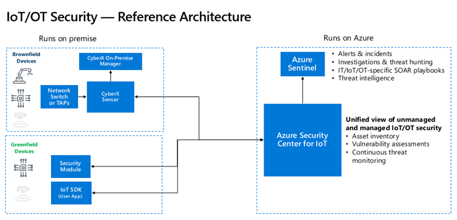
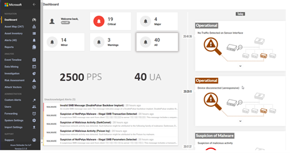

# Azure Defender for IoT architecture

This article describes the functional system architecture of the Defender for IoT solution.

## Defender for IoT components

Defender for IoT connects both to the Azure cloud as well as to on-premises components. The solution is designed for scalability in large and geographically distributed environments with multiple remote locations. This solution enables a multi-layered distributed architecture by country, region, business unit, or zone. 

Azure Defender for IoT includes the following components: 
- Azure Defender for IoT sensors
- Management consoles:
    - Sensor console
    - On-premises management console
    - Azure portal
- Embedded security agent (security module and IoT SDK)

### Azure Defender for IoT sensors

Defender for IoT sensors discover and continuously monitor network devices. Sensors collect ICS network traffic using passive (agentless) monitoring on IoT and OT devices. 
 
Purpose-built for IoT and OT networks, the agentless technology delivers deep visibility into IoT and OT risk within minutes of being connected to the network. It has zero performance impact on the network and network devices due to its non-invasive, Network Traffic Analysis (NTA) approach. 
 
Leveraging patented, IoT and OT-aware behavioral analytics and Layer-7 Deep Packet Inspection (DPI), it allows you to analyze beyond traditional signature-based solutions to immediately detect advanced IoT and OT threats (such as fileless malware) based on anomalous or unauthorized activity. 
  
Defender for IoT sensors connect to a SPAN port or network TAP and immediately begins performing DPI on IoT and OT network traffic. 
 
Data collection, processing, analysis, and alerting takes place directly on the sensor. This makes it ideally suited for locations with low bandwidth or high latency connectivity, because only metadata is transferred to the management console.

The sensor includes five analytics detection engines. The engines trigger alerts based on analysis of both real-time and pre-recorded traffic. The following engines are available: 

#### Protocol violation detection engine
The protocol violation detection engine identifies the use of packet structures and field values that violate ICS protocol specifications, for example: Modbus exception, and Initiation of an obsolete function code alerts.

#### Policy violation detection engine
Using machine learning, the policy violation detection engine alerts users of any deviation from baseline behavior, such as unauthorized use of specific function codes, access to specific objects, or changes to device configuration. For example: DeltaV software version changed, and Unauthorized PLC programming alerts. Specifically, the policy violation engine models the ICS networks as deterministic sequences of states and transitions—using a patented technique called Industrial Finite State Modeling (IFSM). The policy violation detection engine establishes a baseline of the ICS networks, so that the platform requires a shorter learning period to build a baseline of the network than generic mathematical approaches or analytics, which were originally developed for IT rather than OT networks.

#### Industrial malware detection engine
The industrial malware detection engine identifies behaviors that indicate the presence of known malware, such as Conficker, Black Energy, Havex, WannaCry,NotPetya, and Triton. 

#### Anomaly detection engine
The anomaly detection engine detects unusual machine-to-machine (M2M) communications and behaviors. By modeling ICS networks as deterministic sequences of states and transitions, the platform requires a shorter learning period than generic mathematical approaches or analytics originally developed for IT rather than OT. It also detects anomalies faster, with minimal false positives. Anomaly detection engine alerts include Excessive SMB login attempts, and PLC Scan Detected alerts.

#### Operational incident detection
The operational incident detection detects operational issues such as intermittent connectivity that can indicate early signs of equipment failure. For example, the device is suspected to be disconnected (unresponsive), and Siemens S7 stop PLC command was sent alerts.

### Management consoles
Managing Azure Defender for IoT across hybrid environments is accomplished via two management portals: 
- Sensor console
- The on-premises management console
- The Azure portal

#### Sensor console
Sensor detections are displayed in the sensor console, where they can be viewed, investigated, and analyzed in a network map, asset inventory, and in an extensive range of reports, for example risk assessment reports, data mining queries and attack vectors. You can also use the console to view and handle threats detected by sensor engines, forward information to third party systems, manage users, and more.

#### On-premises management console
The on-premises management console enables security operations center (SOC) operators to manage and analyze alerts aggregated from multiple sensors into one single dashboard and provides an overall view of the health of the OT networks.

This architecture provides a comprehensive unified view of the network at a SOC level, optimized alert handling, and the control of operational network security, ensuring that decision-making and risk management remain flawless.

In addition to multi-tenancy, monitoring, data analysis, and centralized sensor remote control, the management console provides additional system maintenance tools (such as alert exclusion) and fully customized reporting features for each of the remote appliances. This scalable architecture supports both local management at a site level, zone level, and global management within the SOC.

The management console can be deployed for high-availability configuration, which provides a backup console that periodically receives backups of all configuration files required for recovery. If the master console fails, the local site management appliances will automatically fail over to synchronize with the backup console to maintain availability without interruption.

#### Azure portal

The Defender for IoT portal in Azure is used to help you:
·	Purchase solution appliances
·	Install and update software
·	Onboard sensors to Azure
·	Update Threat Intelligence packages

## Embedded security agent: Built-in mode

In **Built-in** mode, Defender  for IoT is enabled when you elect to turn on the **Security** option in your IoT Hub. Offering real-time monitoring, recommendations and alerts, Built-in mode offers single-step device visibility and unmatched security. Build-in mode does not require agent installation on any devices and uses advanced analytics on logged activities to analyze and protect your field device and IoT hub.

## Embedded security agent: Enhanced mode

In **Enhanced** mode, after turning on the **Security** option in your IoT Hub and installing Defender  for IoT device agents on your devices, the agents collect, aggregate, and analyze raw security events from your devices. Raw security events can include IP connections, process creation, user logins, and other security-relevant information. Defender  for IoT device agents also handle event aggregation to help avoid high network throughput. The agents are highly customizable, allowing you to use them for specific tasks, such as sending only important information at the fastest SLA, or for aggregating extensive security information and context into larger segments, avoiding higher service costs.

Device agents, and other applications use the **Azure send security message SDK** to send security information into Azure IoT Hub. IoT Hub gets this information and forwards it to the Defender for IoT service.

Once the Defender  for IoT service is enabled, in addition to the forwarded data, IoT Hub also sends out all of its internal data for analysis by Defender  for IoT. This data includes device-cloud operation logs, device identities, and Hub configuration. All of this information helps to create the Defender  for IoT analytics pipeline.

Defender  for IoT analytics pipeline also receives additional threat intelligence streams from various sources within Microsoft and Microsoft partners. The Defender  for IoT entire analytics pipeline works with every customer configuration made on the service (such as custom alerts and use of the send security message SDK).

Using the analytics pipeline, Defender  for IoT combines all of the streams of information to generate actionable recommendations and alerts. The pipeline contains both custom rules created by security researchers and experts as well as   machine learning models searching for deviation from standard device behavior and risk analysis.

Defender  for IoT recommendations and alerts (analytics pipeline output) is written to the Log Analytics workspace of each customer. Including the raw events in the workspace as well as the alerts and recommendations enables deep dive investigations and queries using the exact details of the suspicious activities detected.

## Next steps

In this article, you learned about the basic architecture and workflow of Defender  for IoT solution. To learn more about prerequisites, how to get started and enable your security solution in IoT Hub, see the following articles:

- [Service prerequisites](service-prerequisites.md)
- [Getting started](getting-started.md)
- [Configure your solution](quickstart-configure-your-solution.md)
- [Enable security in IoT Hub](quickstart-onboard-iot-hub.md)
- [Defender  for IoT FAQ](resources-frequently-asked-questions.md)
- [Defender  for IoT security alerts](concept-security-alerts.md)
