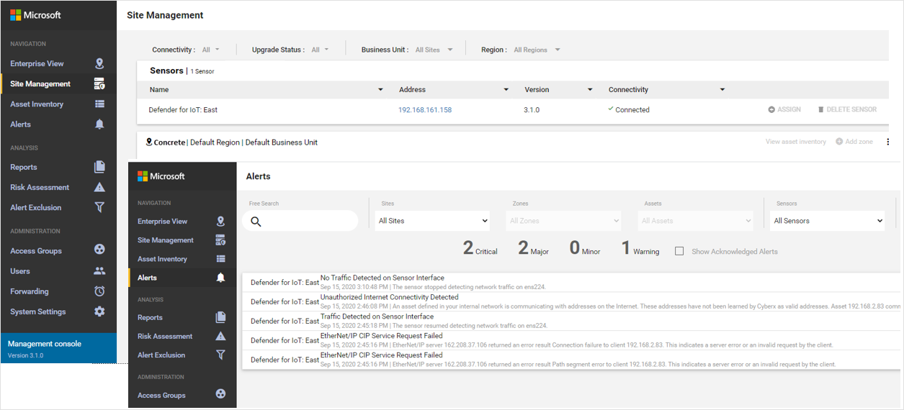
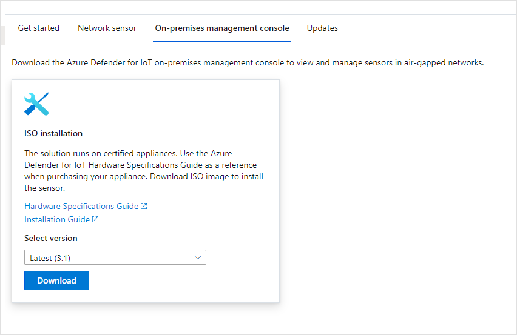

# Deploy the management console
This article describes how to deploy the Azure Defender for IoT on-premises management console.

## The on-premises management console

The on-premises management console provides a consolidated view of all network assets and delivers a real-time view of key IoT and OT risk indicators and alerts across all your facilities. Tightly integrated with your SOC workflows and run books, it enables easy prioritization of mitigation activities and cross-site correlation of threats.

- Holistic - reduce complexity with a single unified platform for asset management, risk and vulnerability management, as well as threat monitoring with incident response.

- Aggregation and correlation – display, aggregate and analyze data and alerts collected from all sites.

- Control all sensors – configure and monitor all sensors from a single location.

   

## Deploy the on-premises management console appliance

This process requires acquiring your own hardware and installing software. The solution runs on certified appliances. Refer to the [Azure Defender for IoT hardware specifications guide](https://aka.ms/AzureDefenderforIoTBareMetalAppliance) as a reference when purchasing your certified appliance.

Refer to the [Azure Defender for IoT Installation Guide](https://aka.ms/AzureDefenderforIoTInstallSensorISO) for details about downloading the ISO image and installing the sensor software.

**To deploy the on-premises management console:**

1. Navigate to Microsoft Azure Defender for IoT.

2. Select **on-premises management console**.

   

3. Select version 3.1 from the **Select Version** menu.

4. Select **Download** and save the file.

5. After the software is installed, carry out network setup tasks. Refer to the [Azure Defender for IoT Network Setup Guide](https://aka.ms/AzureDefenderForIoTNetworkSetup) for details.

## Next steps

To learn more about configuration options, continue to the how-to guide for module configuration.
> [!div class="nextstepaction"]
> [Module configuration how-to guide](./how-to-agent-configuration.md)
