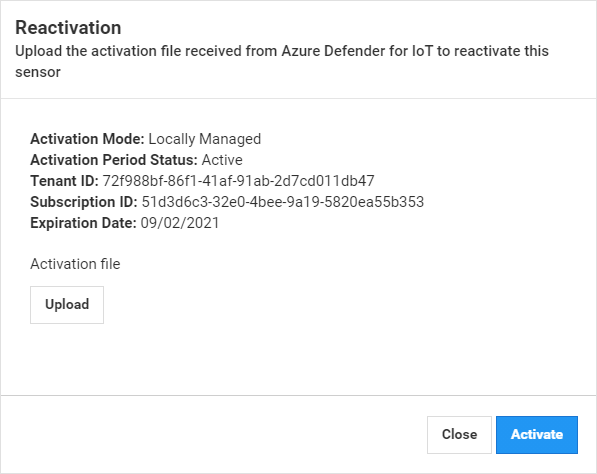

# View and manage onboarded sensors

This article describes how to view and delete onboarded sensors, as well as download new activation files for onboarded sensors.

## Update sensor management mode

You may want to update the mode that your sensor is managed. When you do this, you need to remove the current sensor from the sensor management page and upload a new Activation file.

- **Work in the Cloud Managed mode instead of Locally Managed mode**: Update the activation file for your locally managed sensor with an activation file for a Cloud Managed sensor. After reactivation, sensor detections are displayed in both the sensor and Azure Defender for IoT portal. After the reactivation file is successfully uploaded newly detected alert information is sent to Azure.

- **Work in the Locally Managed mode instead of Cloud Managed mode**: Update the activation file for a Cloud Managed sensor with an activation file for a Locally Managed sensor. After reactivation, sensor detection information is only displayed in the sensor.

- **Associate the sensor to a new IoT Hub**: You may want to associate your sensor with a new IoT Hub. To do this, re-register then sensor and upload a new activation file.

**To reactivate the sensor:**

1. Navigate to the Azure Defender for IoT, **Sensor Management** page.

2. Select the sensor for which you want to upload a new activation file.

3. Delete it.

4. Onboard the sensor again from the **Onboarding** page in the new mode or with a new IoT Hub.

5. Download the activation file from the **Download activation file** page.

6. Log in to the Azure Defender for IoT sensor console.

7. In the sensor console, select **System Settings** and then select **Reactivation**.

   

8. Select **Upload** and select the file you saved.

9. Select **Activate**.
 
## Delete sensors

If you delete a cloud managed sensor, information will not be sent to the IoT Hub.

Delete locally managed sensors when you are no longer working with them.

**To delete sensors:**

1. Navigate to the Azure Defender for IoT **Sensor Management** page.

2. Select the sensors you want to delete.

3. Select **Delete sensor**.

## Next steps

To learn more about configuration options, continue to the how-to guide for module configuration.
> [!div class="nextstepaction"]
> [Module configuration how-to guide](./how-to-agent-configuration.md)
