# About Azure Defender for IoT

As enterprises implement digital transformation for greater efficiency and productivity, boards and management teams are increasingly concerned about the financial and liability risk resulting from the deployment of massive numbers of unmanaged IoT and Operational Technology (OT) devices. 

Adversaries targeting this expanded attack surface can cause substantial corporate impact including safety and environmental incidents, costly production downtime, and theft of sensitive intellectual property. 

Legacy IoT/OT devices do not support agents and are often unpatched, misconfigured, and invisible to IT teams – making them soft targets for adversaries looking to pivot deeper into corporate networks.  

Traditional network security monitoring tools developed for corporate IT networks are unable to address these environments because they lack a deep understanding of the specialized protocols, devices, and machine-to-machine (M2M) behaviors found in IoT/OT environments.
   
Azure Defender for IoT is a holistic solution that continuously discovers, monitors, and manages IoT/OT threats, risks and vulnerabilities. It helps accelerate incident response; provides insight into operational challenges and simplifies hybrid workload protection by delivering unified IoT/OT visibility and control. 

Purpose-built for IoT/OT networks, Azure Defender for IoT delivers deep visibility into IoT/OT risk within minutes of being connected to the network, with zero impact on the network and network devices due to its passive, non-invasive, Network Traffic Analysis (NTA) approach. Leveraging patented, IoT/OT-aware behavioral analytics to detect advanced IoT/OT threats (such as fileless malware) based on anomalous or unauthorized activity. This holistic solution addresses key use cases:

  - IoT/OT Asset Discovery & Continuous Threat Monitoring

  - IoT Risk & Vulnerability Management

  - Threat Hunting & Incident Response

  - Operational Efficiency 

  - Unified IT/OT Security 

## Components

  - **Defender for IoT sensor:** Defender for IoT sensors collect ICS network traffic using passive (agentless) monitoring. Passive and non-intrusive, the sensors have zero impact on OT/IoT networks and devices. The sensor connects to a SPAN port or network TAP and immediately begins monitoring your network. Detections are displayed in the sensor console, where they can be viewed, investigated, and analyzed in a network map, asset inventory and an extensive range of reports, for example risk assessment reports, data mining queries and attack vectors. Read more about sensor capabilities in the [***Defender for IoT Sensor User Guide***](https://aka.ms/AzureDefenderforIoTUserGuide).

  - **Defender for IoT on-premises management console:** The on-premises management console lets you carry out asset management, risk, and vulnerability management, as well as threat monitoring and incident response across your enterprise. It provides a unified view of all network assets, key IoT/OT risk indicators and alerts detected in facilities where sensors are deployed. Use the on-premises management console to view and manage sensors in air-gapped networks.

## About this guide

The following is covered in this guide:

  - **Hardware:** Dell and HPE physical appliance details

  - **Software:** Sensor and on-premises management console software installation

  - **Virtual Appliances:** virtual machine details and software installation

After installation, connect your sensor to your network. Refer to the [Network Setup Guide](https://aka.ms/AzureDefenderForIoTNetworkSetup).

### Getting more information

  - To get assistance or support, contact [support.microsoft.com](https://support.microsoft.com/en-us/supportforbusiness/productselection?sapId=82c88f35-1b8e-f274-ec11-c6efdd6dd099).

  - For additional documentation, visit the [Help Center](https://help.cyberx-labs.com/).

#About Defender for IoT appliances 

This section covers information about Defender for IoT sensor appliances and the appliance for the Defender for IoT on-premises management console.

### Physical appliances

The Defender for IoT appliance sensor connects to a SPAN port or network TAP and immediately begins collecting ICS network traffic using passive (agentless) monitoring. This process has zero impact on OT networks and assets because it is not placed in the data path and does not actively scan OT assets.

The following rack mount appliances are available:

| **Deployment Type** | **Corporate** | **Enterprise** | **SMB** |  |
|--|--|--|--|--|
| **Model** | HPE ProLiant DL360 | Dell PowerEdge R340 XL | HPE ProLiant DL20 | HPE ProLiant DL20 |
| **Monitoring ports** | up to 15 RJ45 or 8 OPT | up to 9 RJ45 or 6 OPT | up to 8 RJ45 or 6 OPT | 4 RJ45 |
| **Max Bandwidth\*** | 3 Gb/Sec | 1 Gb/Sec | 1 Gb/Sec | 100 Mb/Sec |
| **Max Protected Devices** | 30,000 | 10,000 | 15,000 | 1,000 |

*Max Bandwidth capacity may vary depending on protocol distribution

### Virtual appliances

The following virtual appliances are available:

| **Deployment Type** | **Enterprise** | **SMB** | **Line** |
|--|--|--|--|
| **Description** | Virtual appliance for enterprise deployments | Virtual appliance for SMB deployments | Virtual appliance for line deployments |
| **Max Bandwidth\*** | 150 Mb/Sec | 15 Mb/Sec | 3 Mb/Sec |
| **Max protected devices** | 3,000 | 300 | 100 |
| **Deployment Type** | Enterprise | SMB | Line |
| **Description** | Virtual appliance for enterprise deployments | Virtual appliance for SMB deployments | Virtual appliance for line deployments |

*Max Bandwidth capacity may vary depending on protocol distribution

### On-premises management console hardware specifications

 |  | |
 ------------------------------ |--|
 **Description**                | In a multi-tier architecture, the on-premises management console delivers visibility and control across geographically distributed sites. It integrates with SOC security stacks including SIEMs, ticketing systems, next-generation firewalls, secure remote access platforms, and the Defender for IoT ICS Malware Sandbox. |
 **Deployment type**                | Enterprise |
 **Appliance Type**                 | Dell R340, VM |
 **Number of Managed Sensors** | Unlimited |

## Preparing for the installation

### Accessing the ISO installation image

The installation image is accessible from the **Azure Defender for IoT** portal.

To access the file:

1. Log in to your Azure account.

2. Go to the **Network sensor** or **On-premises management console** page and select a version to download.

   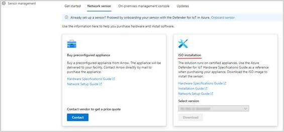

### Installing from DVD

Before the installation, ensure you have:

  - a portable DVD drive with the USB connector.

  - ISO installer image.

To install:

1.  Burn the image to a DVD/prepare a Disk on Key.

2.  Connect the DVD/Disk on Key and configure the appliance to boot from DVD/Disk on Key.

> [!NOTE]
> Burn the ISO image to the DVD as “Image”. Insert a portable DVD drive into your computer and right click on the ISO Image and choose “Burn to disk”.

### Install from disk-on-key

Before the installation, ensure you have:

  - A Disk on Key with the USB version 3.0 and later, min size 4GB

  - ISO installer image file

Before you begin:

1.  Download RUFUS.

2.  Download ISO image.

3.  A USB Disk on Key that you want to use, size 4GB.

The Disk on Key will be erased in this process.

To prepare a Disk on Key:

1. Run Rufus and select SENSOR ISO.

   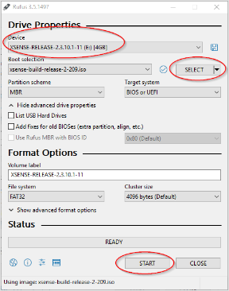

2. Connect the Disk on Key to the to the front panel.

3. Set the BIOS of the server to boot from the USB.

## DELL POWEREDGE R340XL installation

This section provides the Dell PowerEdge R340XL installation procedure.

Before installing the software on the Dell appliance, you need to adjust the appliance BIOS configuration.

This section contains covers:

  - [Dell PowerEdge R340 Front Panel](#dell-poweredge-r340-front-panel) and [Dell PowerEdge R340 Back Panel](#dell-poweredge-r340-back-panel) contains front and back panels description, and information required for installation, such as drivers and ports.

  - [Dell BIOS Configuration](#dell-bios-configuration) provides information about how to connect to the Dell appliance management interface and configure the BIOS.

  - [Software Installation (Dell R340)](#software-installation-dell-r340) describes the procedure required to install the Defender for IoT sensor software.

### DELL POWEREDGE R340XL requirements 

This section describes the requirements for installing the DELL POWEREDGE R340XL appliance.

- Enterprise license for iDrac

- BIOS configuration XML

- Servers firmware versions:

  - Bios Version – 2.1.6

  - iDrac version - 3.23.23.23

### Dell PowerEdge R340 front panel

|                                |                     |
|--------------------------------|---------------------|
| 1\.	Left control panel         | 4\. Information tag |
| 2\.	Optical drive \(optional\) | 5\. Drives          |
| 3\.	Right control panel        |                     |

### Dell PowerEdge R340 back panel

|                                           |                                                |
|-------------------------------------------|------------------------------------------------|
| 1\.	Serial port                           | 7\. Power supply unit 2                        |
| 2\.	NIC port \(Gb 1\)                     | 8\. System identification button               |
| 3\.	NIC port \(Gb 1\)                     | 9\. System status indicator cable port \(CMA\) |
| 4\.	Half\-height PCIe expansion card slot | 10\. USB 3\.0 port \(2\)                       |
| 5\.	Full\-height PCIe expansion card slot | 11\. iDRAC9 dedicated network port             |
| 6\.	Power supply unit 1                   | 12\. VGA port                                  |

### Dell BIOS configuration

Dell BIOS configuration is required to adjust the Dell appliance to work with the software.

The BIOS configuration is performed using a pre-defined configuration. The file is accessible from the [Help Center](https://help.cyberx-labs.com/).

You need to import the configuration file to the Dell appliance.

Before using the configuration file, you need to establish the communication between the Dell appliance and the management computer.

Dell appliance is managed by an integrated Dell Remote Access Controller (iDRAC) with Lifecycle Controller, which is embedded in every Dell PowerEdge server. It provides functionality that helps you deploy, update, monitor and maintain Dell PowerEdge appliances.

To establish the communication between the Dell appliance and the management computer, you need to define iDRAC IP address and management computer IP on the same subnet.

When the connection is established, you can configure the BIOS.

To configure Dell BIOS:

1. [Configure iDRAC IP](#configure-idrac-ip)

2. [Import the BIOS Configuration File](#import-the-bios-configuration-file)

#### Configure iDRAC IP

1. Power up the sensor.

2. If the OS is already installed, click on F2 to enter the BIOS configuration.

3. Select **iDRAC Settings**.

   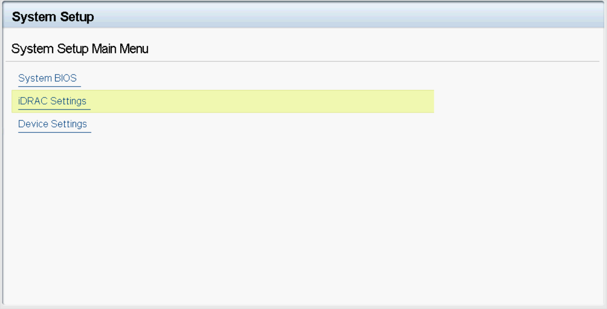

4. Select **Network**.

   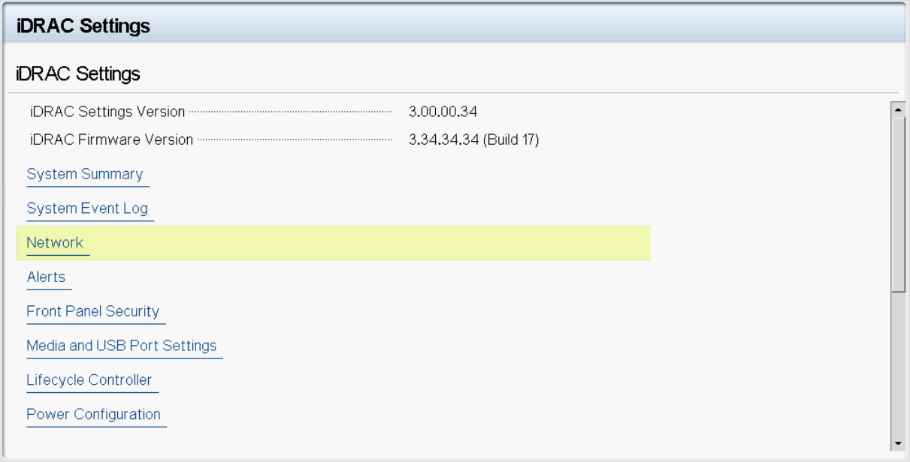

   > [!NOTE]
   > During the installation you must configure the default iDRAC IP address and password mentioned in the following steps. After the installation, you change these definitions.

5. Change the Static IPv4 Address to 10.100.100.250.

6. Change the Static Subnet Mask to 255.255.255.0.

   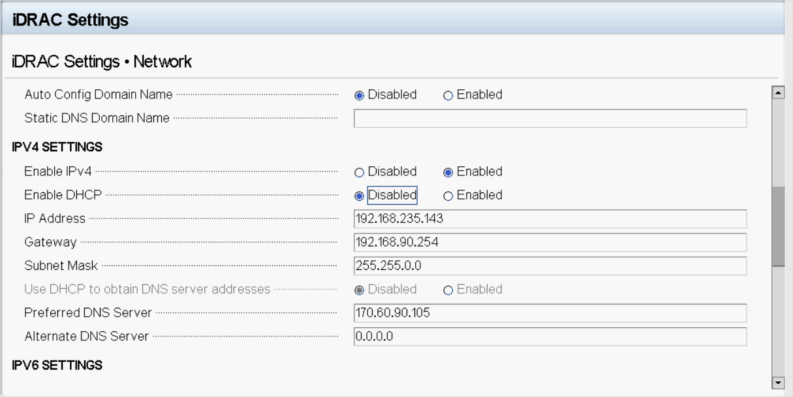

7. Select **Back** and **Finish**.

#### Import the BIOS configuration file

This section describes how to configure the BIOS using the Configuration file.

1. Plug in a PC with Static preconfigured IP address **10.100.100.200** to **iDRAC** port.

   

2. Open a browser and type **10.100.100.250** to connect to iDRAC web interface.

3. Login with Dell default administrator privileges:

   - Username: root

   - Password: calvin

4. For appliances the credentials are:

   - Username: cyberx

   - Password: xhxvhttju,@4338

     The import server profile operation is initiated.

     > [!NOTE]
     > Before importing the file make sure:

     > <ul>
     > <li>
You are the only user that is currently connected to iDRAC.
</li>
     > <li>
The system is not in the BIOS menu.
</li>
     > </ul>

5. Go to **Configuration** > **Server Configuration Profile**. And set the following parameters:

   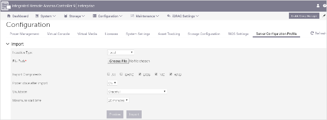

   | Parameter         | Configuration                                             |
   | ----------------- | --------------------------------------------------------- |
   | Location Type     | Select **Local**                                          |
   | File Path         | Select **Choose File** and add the configuration XML file |
   | Import Components | Select **BIOS, NIC, RAID**                                |
   | Maximum wait time | Select **20 minutes**                                     |

6. Select **Import**.

7. To monitor the process, go to **Maintenance** > **Job Queue**:

   

#### Manually configuring BIOS 

This section describes how to manually configure the appliance BIOS. You will need to manually configure if:

  - You did not purchase your appliance from Arrow

  - You have an appliance, but do not have access to the XML Configuration file

After you access the BIOS, go to **Device Settings**.

To manually configure:

1. Access the Appliance BIOS directly using a keyboard and screen.

   or

2. Access the appliance BIOS using iDRAC.

   1. If the Appliance is not a Defender for IoT appliance, open a browser and go to the IP address that was configured before. Login with Dell default administrator privileges: Username: root, Password: calvin.

   2. If the Appliance is a Defender for IoT appliance, log in with the following credentials: Username: cyberx, Password: xhxvhttju,@4338

3. Once you access the BIOS, go to **Device Settings**.

   

4. Choose the RAID controlled configuration by selecting **Integrated RAID controller 1: Dell PERC\<PERC H330 Adapter\> Configuration Utility**.

   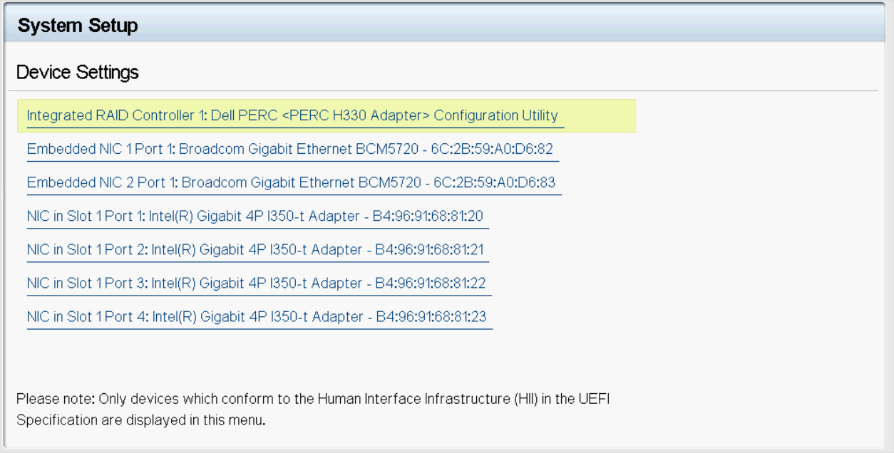

5. Select **Configuration Management**.

   

6. Select **Create Virtual Disk**.

   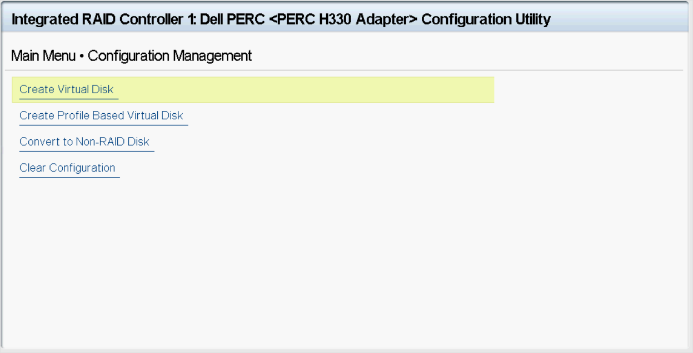

7. In the **Select RAID Level** field, select **RAID5**. In the **Virtual Disk Name** field, enter **ROOT** and select **Physical Disks**.

   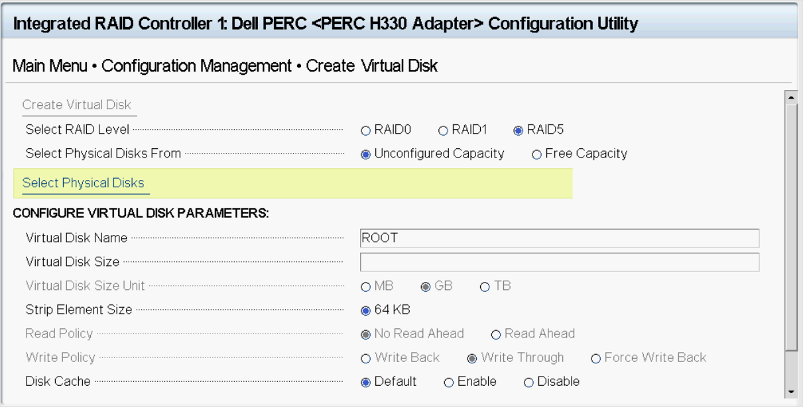

8. Select **Check All** and then select **Apply Changes**

   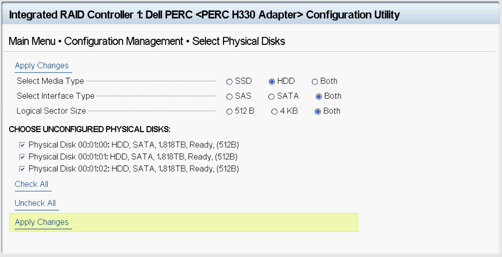

9. Select **Ok**.

   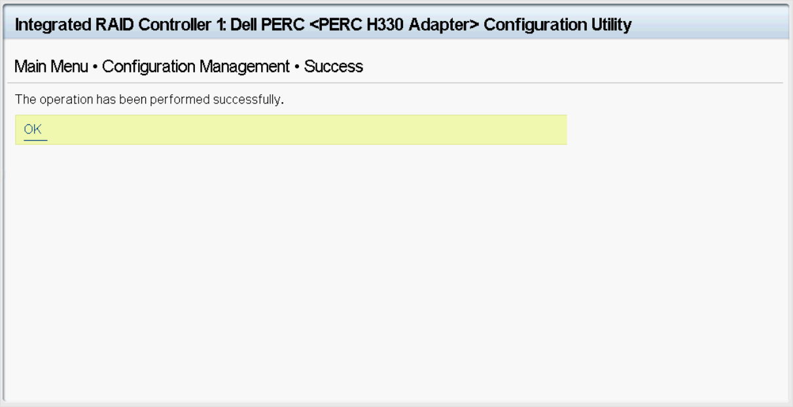

10. Scroll down the screen and select **Create Virtual Disk**.

    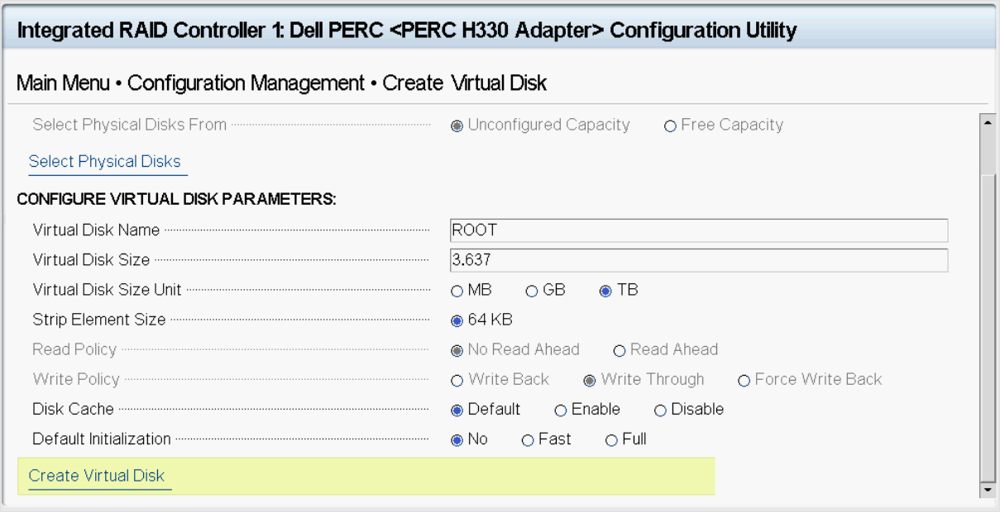

11. Select the **Confirm** checkbox and select **Yes**.

    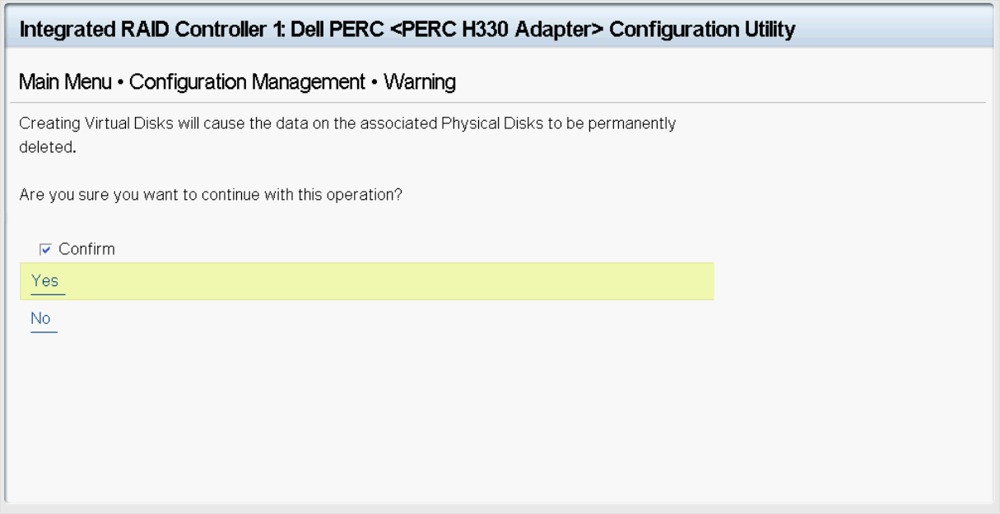

12. Select **OK**.

    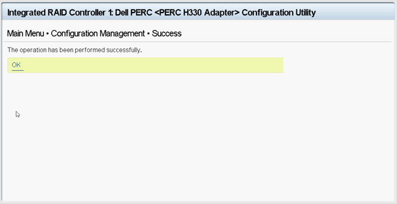

13. Return to the main screen and select **System BIOS**.

    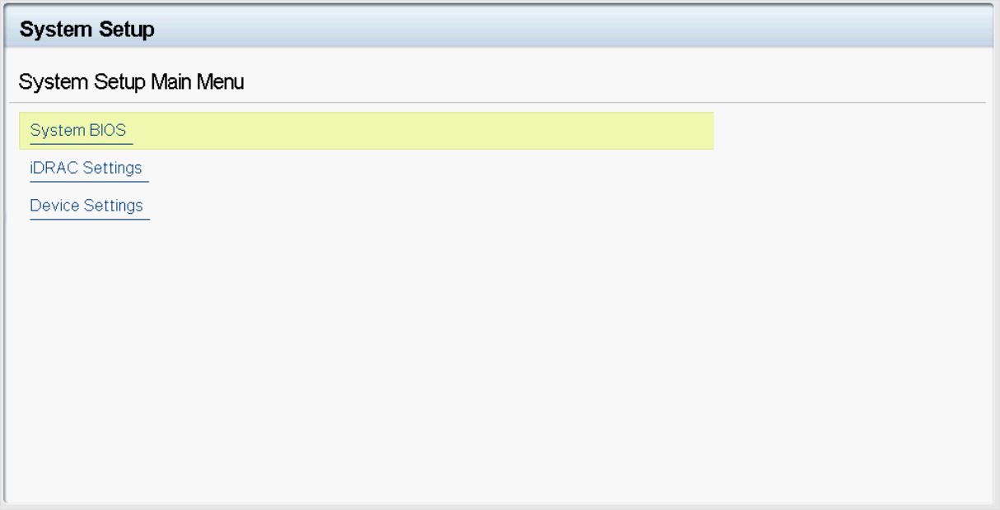

14. Select **Boot Settings**.

    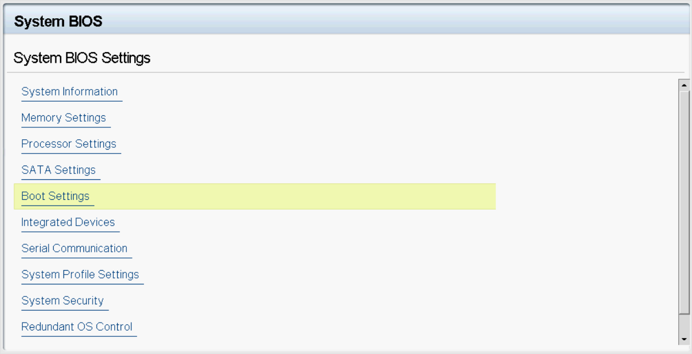

15. For the **Boot Mode** option, select **BIOS**.

    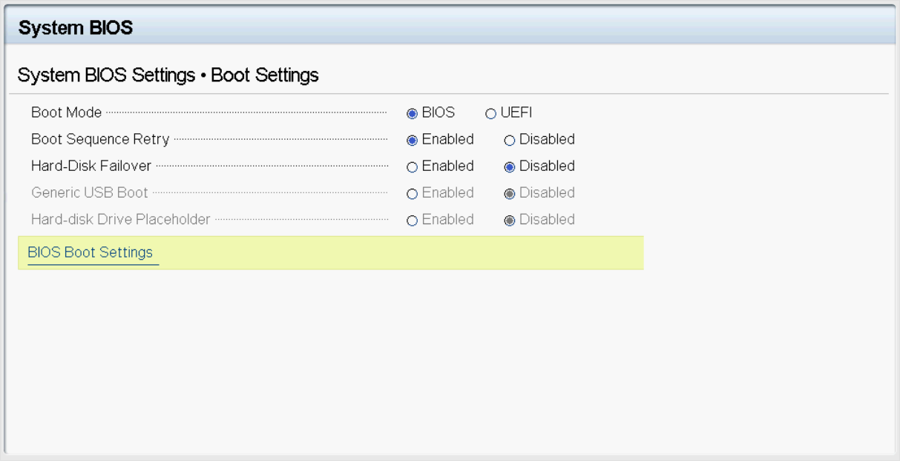

16. Select **Back** and then select **Finish** to exit the BIOS settings.

### Software installation (Dell R340)

The installation process takes approximately 20 minutes. After the installation, the system is restarted several times.

To install:

1. Verify that the version media is mounted to the appliance in one of the following ways:

   1. By connecting the external CD or Disk-on-Key with the release.

   2. By mounting an ISO image using the iDRAC. This can be done as follows: After logging in to iDRAC, select the Virtual Console, and then select **Virtual Media**.

   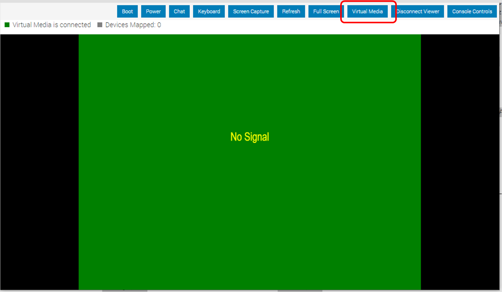

2. In the **Map CD**/DVD section, select **Choose File**.

   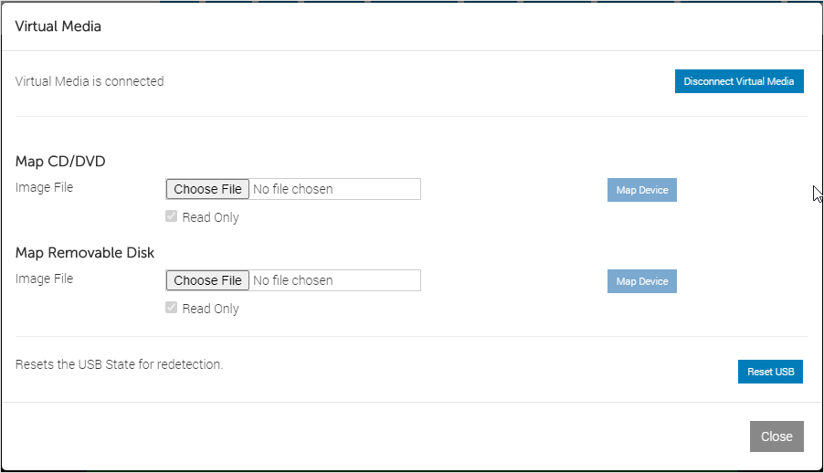

3. Choose the version ISO image file for this version from the dialog box that opens.

   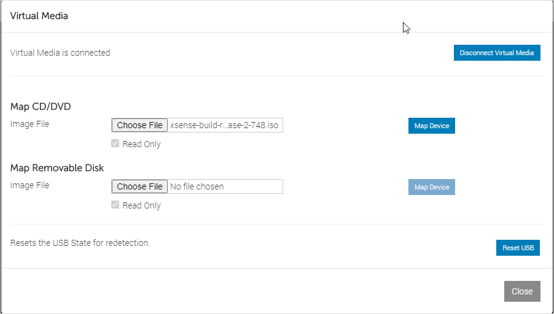

4. Select the **Map Device** button.

   

5. The media is mounted. Select **Close**.

6. Boot the appliance. When using iDRAC, rebooting the servers can be done by clicking on the **Consul Control** Button, on the **Keyboard Macros** click on the **Apply** Button which will initiate Ctrl-Alt-Del sequence.

7. Select **English**.

   

8. Select `SENSOR-RELEASE-\<version\> Enterprise…`

   

9. Define the appliance profile and network properties:

   

     | Parameter | Configuration |
   |--|--|
   | **Hardware profile** | enterprise |
   | **Management interface** | eno1 |
   | **Network parameters \(usually provided by the customer\)** | **management network IP address:** |
   |  | **subnet mask:** |
   |  | **appliance hostname:** |
   |  | **DNS:** |
   |  | **default gateway IP address:** |
   |  | **input interfaces:** The list of input interfaces is generated for you by the system\.  To mirror the input interfaces, copy all the items presented in the list with a comma separator\. NOTE: There is no need to configure the bridge interface, this option is used for special use cases only\. |

10. After approximately 10 minutes, the two sets of credentials appear. One for a *CyberX* user and one for a *Support* user.  
      
    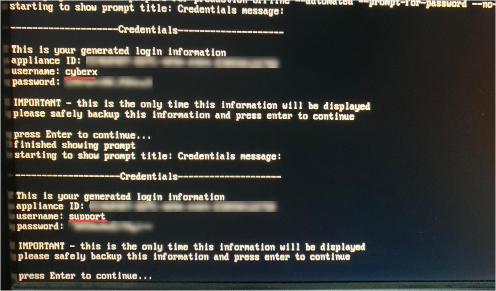

11. *Save the Appliance ID and passwords. You need credentials to access the platform for the first time.*

12. Select **Enter** to continue.

## HPE ProLiant DL20 Installation

This section describes the HPE ProLiant DL20 installation process, which includes the following steps:

  - Enable Remote Access and update the default admin password.
  - Configure BIOS and RAID settings.
  - Install the software.

### About the installation

  - Enterprise and SMB appliances can be installed. The install process is identical for both appliance types, except for the Array Configuration.
  - A default Administrative user is provided. It is recommended to change the password during the network configuration.
  - During the network configuration, you will configure the iLO port on network port 1.
  - The installation process takes approximately 20 minutes. After the installation, the system is restarted several times.

### HPE ProLiant DL20 front panel

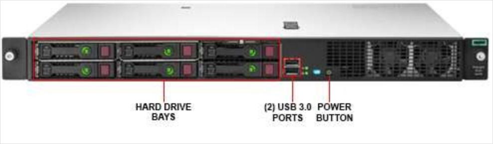

### HPE ProLiant DL20 back panel

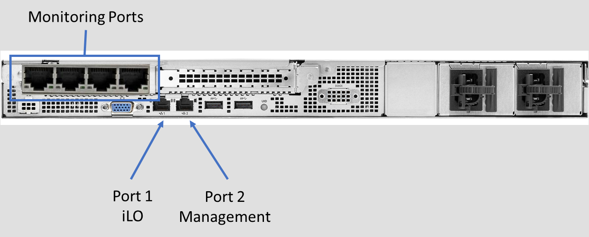

### Enable remote access and update password

This section describes how to set up network options and update the default password.

**To enable and update the password:**

1. Connect a screen and a keyboard to the HP appliance and power the appliance and Press **F9**.

    

2. Go to **System Utilities >** **System Configuration > iLO 5 Configuration Utility > Network Options**.

    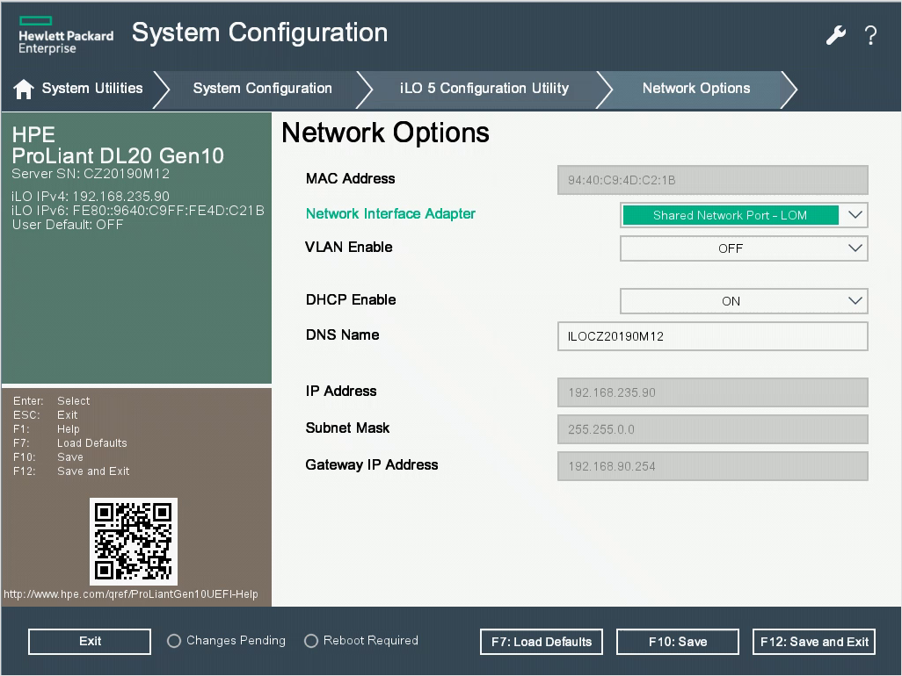

    1.  Select **Shared Network Port-LOM** from the **Network Interface Adapter** field.
    
    2.  Disable DHCP.
    
    3.  Enter the enter IP Address, Subnet Mask and Gateway IP Address.

3. select **F10: Save**.

4. Select **Esc** to get back to the **iLO 5 Configuration Utility** and select **User Management**

5. Select **User Management**, **Edit/Remove User**. The administrator is the only default user defined. You need to change the default password.

    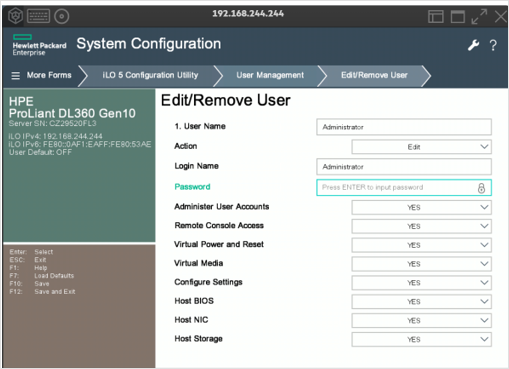

6. Change the default password and select **F10: Save**.

    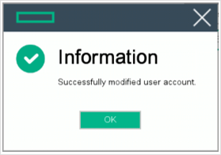

### Configure the HPE BIOS

This section describes how to configure the HPE BIOS for the Enterprise and SMB appliances.

**To configure:**

1. Select **System Utilities >** **System Configuration > BIOS/Platform Configuration (RBSU)**.

    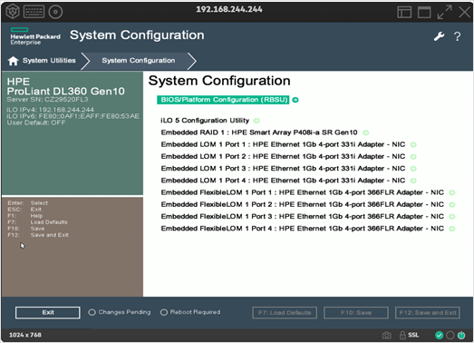

2. In the **BIOS/Platform Configuration (RBSU)** form, select **Boot Options**.

    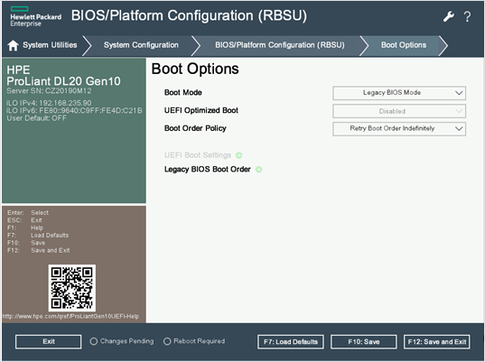

3. Change the **Boot Mode** to **Legacy BIOS Mode** and select **F10: Save**.

4. Select **Esc** twice to the System Configuration form.

#### For the enterprise appliance

1. Select **Embedded RAID 1: HPE Smart Array P408i-a SR Gen 10 > Array Configuration > Create Array**.

    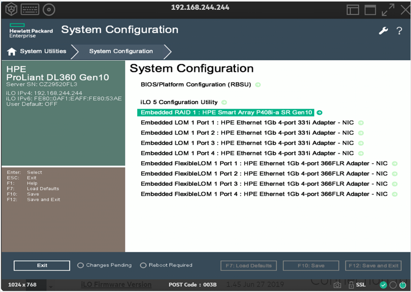

2. In the **Create Array** form, select all the options. 3 options are available for the *Enterprise* appliance.

    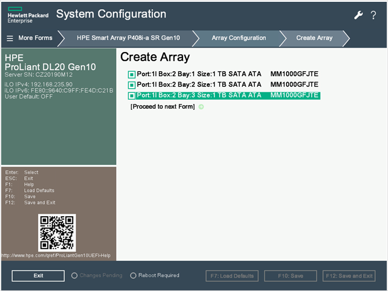

#### For the SMB appliance

1. Select **Embedded RAID 1: HPE Smart Array P208i-a SR Gen 10 > Array Configuration > Create Array**.

    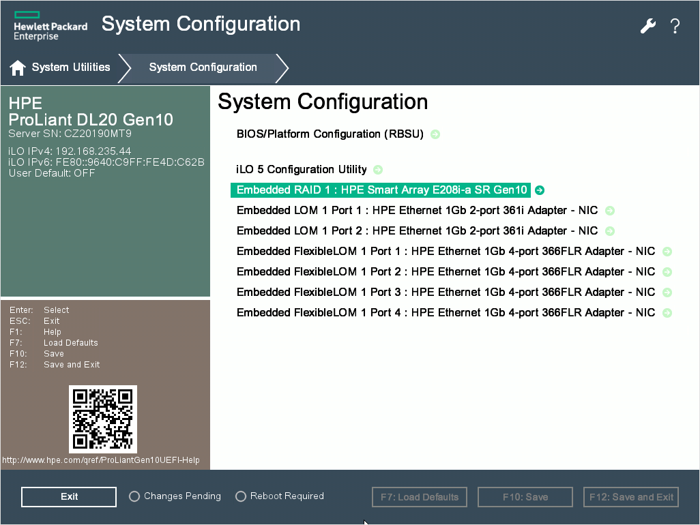

    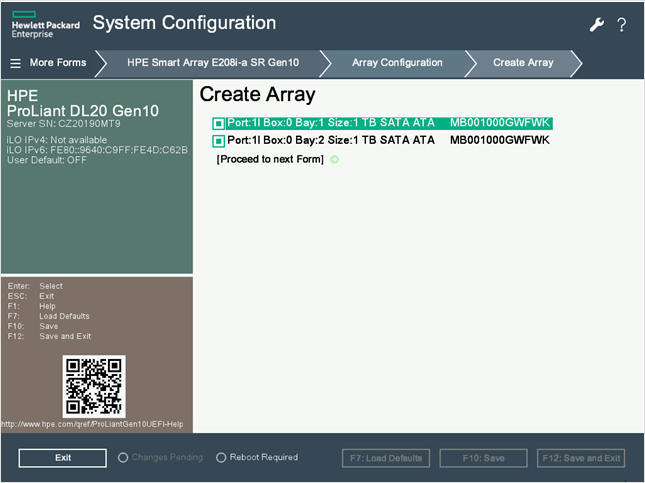

2. Select **Proceed to Next Form**.

3. In the **Set RAID Level** form, set the level to **RAID 5** for Enterprise deployments and **RAID 1** for SMB **deployments**.

    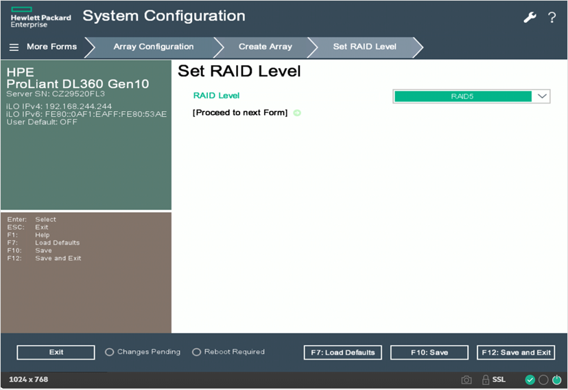

4. Select **Proceed to Next Form**.

5. In the **Logical Drive Label** form, type **Logical Drive 1**.

    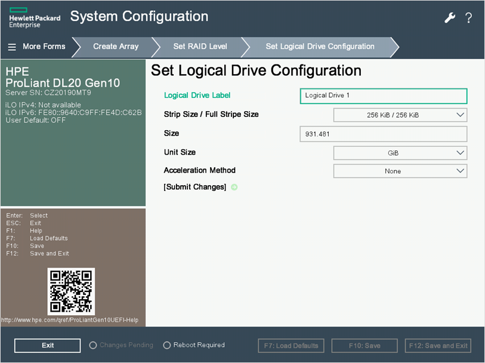

6. Select **Submit Changes**.

    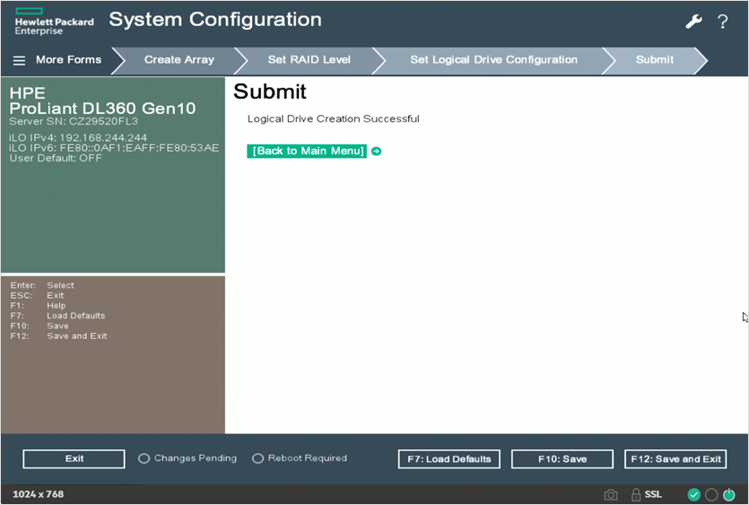

7. In the **Submit** form, select **Back to Main Menu**.

    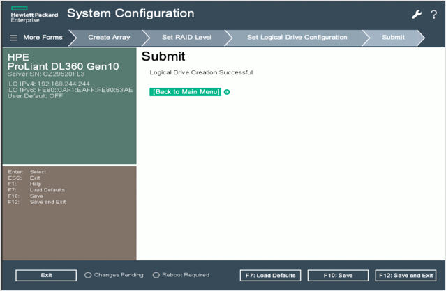

8. Select **F10: Save** and then press **Esc** twice.

    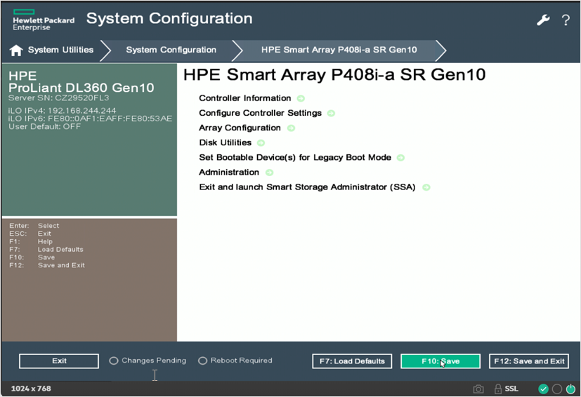

9. In the **System Utilities** window, select **One-Time Boot Menu**.

    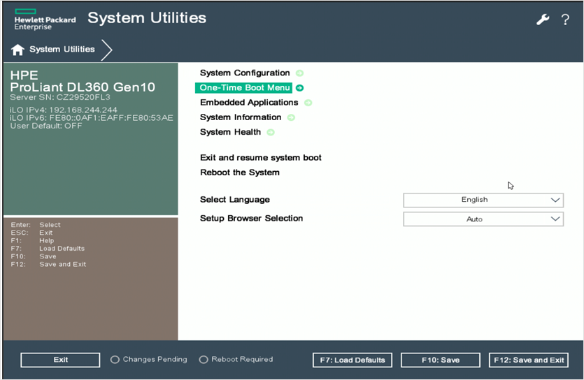

10. In the **One-Time Boot Menu** form, select **Legacy BIOS One-Time Boot Menu**.

    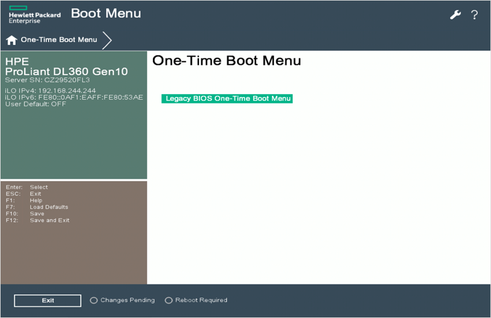

11. The Booting in Legacy and Boot override windows appear. Choose a boot override option, for example to a CD-ROM, USB, HDD, or UEFI Shell.

    

    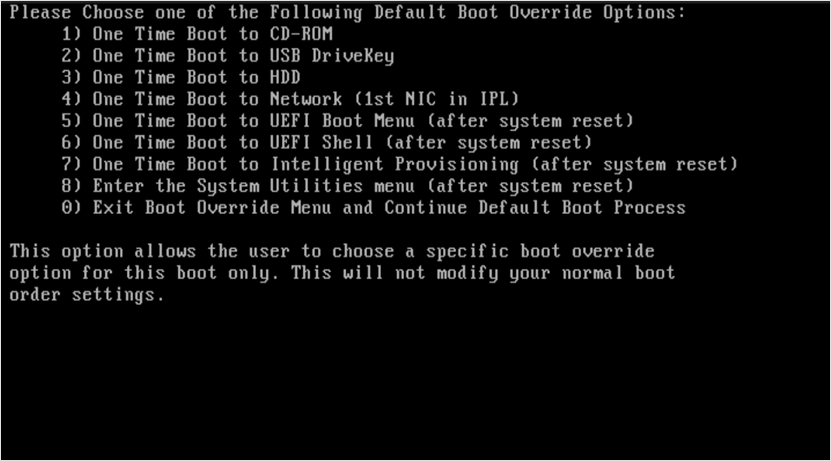

### Software installation (HPE ProLiant DL20 appliance)

The installation process takes approximately 20 minutes. After the installation, the system is restarted several times.

**To install:**

1. Connect screen and keyboard to the appliance and then connect to the CLI.

2. Connect external CD or Disk on Key with the ISO image you downloaded from the **Azure Defender for IoT** portal, **Updates** page.

3. Boot the appliance.

4. Select **English**.

    

5. Select **SENSOR -RELEASE**-<version> Enterprise.

    

6. In the installation Wizard, define the appliance profile and network properties:

    

    | Parameter | Configuration |
    | ----------| ------------- |
    | **Hardware profile** | Select Enterprise or office for SMB deployments. |
    | **Management interface** | eno2 |
    | **Default network parameters (usually the parameters are provided by the customer)** | **management network IP address:** |
    |  | **subnet mask:** |
    |  | **appliance hostname:** |
    |  | **DNS:** |
    |  | **the default gateway IP address:** |
    |  | **input interfaces:** The list of input interfaces is generated for you by the system.  To mirror the input interfaces, copy all the items presented in the list with a comma separator: **eno5, eno3, eno1, eno6, eno4**  **For HPE DL20 : Do not list eno1, enp1s0f4u4 (iLo interfaces)**  **BRIDGE**: There is no need to configure the bridge interface, this option is used for special use cases only. Press enter to continue. |

7. After approximately 10 minutes, the two sets of credentials appear. One for a **CyberX** user and one for a **support** user.

8. *Save the Appliance ID and passwords. You need the credentials to access the platform for the first time.*

    

9. Select **Enter** to continue.

## HPE ProLiant DL360 installation

  - A default Administrative user is provided. It is recommended to change the password during the network configuration.

  - During the network configuration you will configure the iLO port.

  - The installation process takes approximately 20 minutes. After the installation, the system is restarted several times.

### HPE ProLiant DL360 front panel

### HPE ProLiant DL360 back panel

### Enable remote access and update password

Refer to the following sections in ***HPE ProLiant DL20 Installation***:

  - **Enable Remote Access and Update Password**

  - **Configure the HPE BIOS**

The Enterprise configuration is identical.

> [!Note]
> In the Array form verify that you select all the options.

### iLO Remote Install (from Virtual Drive)

This section describes the iLO installation from a virtual drive.

**To Install:**

1. Login to the iLO console, right click on the servers’ screen

    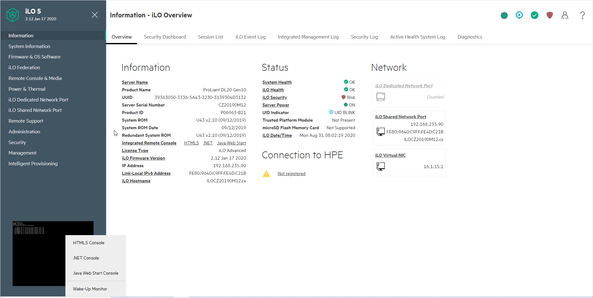

2. Choose HTML5 Console, the following console will appear:

    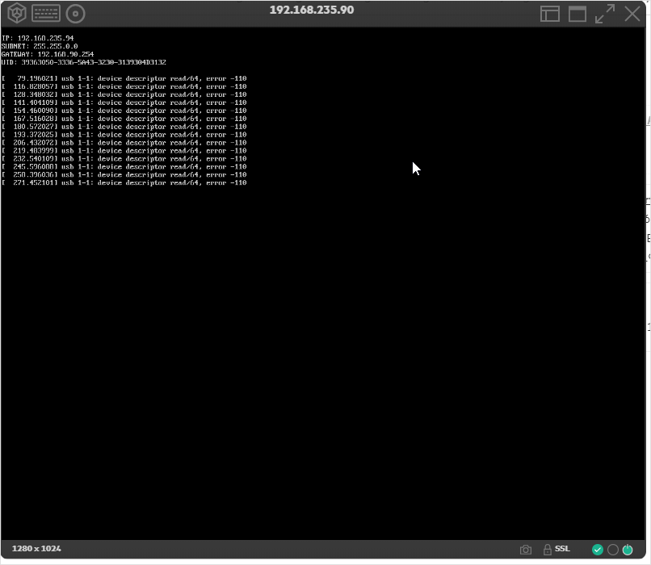

3. Select the CD icon, and choose the CD/CD option

4. Select **Local ISO file**.

    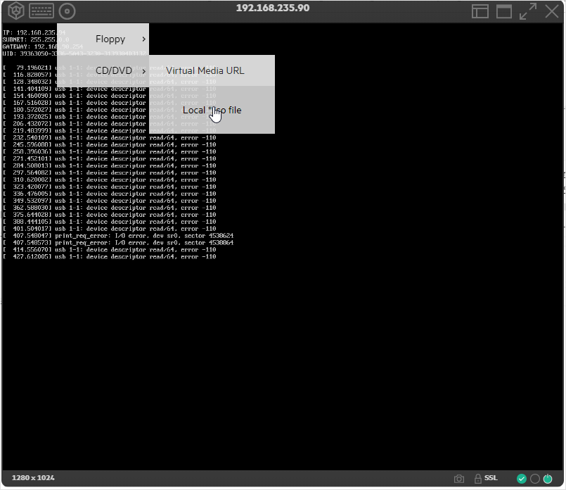

5. In the Dialog box, choose the relevant ISO file

6. Go the left Icon, choose Power, and click on reset

    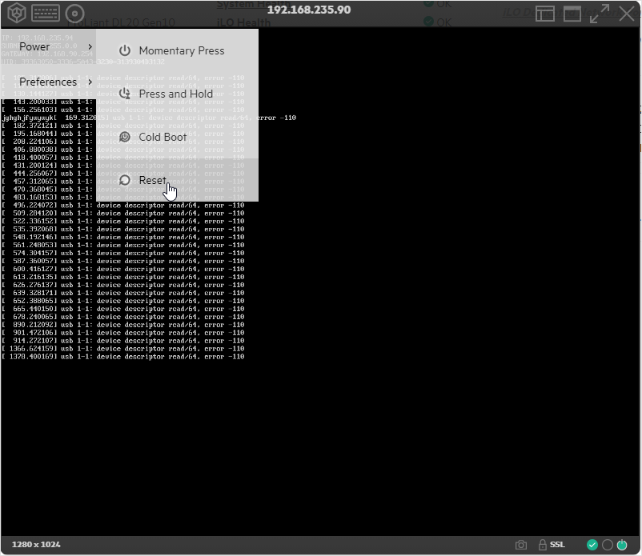

7. The appliance will reboot and run the sensor installation process

### Software installation (HPE DL360)

The installation process takes approximately 20 minutes. After the installation, the system is restarted several times.

**To install:**

1. Connect screen and keyboard to the appliance and then connect to the CLI.

2. Connect external CD or Disk on Key with the ISO image you downloaded from the **Azure Defender for IoT** portal, **Updates** page.

3. Boot the appliance.

4. Select **English**.

    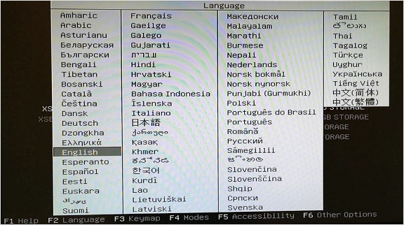

5. Select **SENSOR-RELEASE**-<version> Enterprise.

    

6. In the installation Wizard, define the appliance profile and network properties:

    

    | Parameter | Configuration |
    | ----------| ------------- |
    | **Hardware profile** | Select corporate. |
    | **Management interface** | eno2 |
    | **Default network parameters (usually provided by the customer)** | **management network IP address:** |
    |  | **subnet mask:** |
    |  | **appliance hostname:** |
    |  | **DNS:** |
    |  | **the default gateway IP address:** |
    |  | **input interfaces:** The list of input interfaces is generated for you by the system.  To mirror the input interfaces, copy all the items presented in the list with a comma separator.  **Note:** There is no need to configure the bridge interface, this option is used for special use cases only. |

7. After approximately 10 minutes, the two sets of credentials appear. One for a **CyberX** user and one for a **support** user.

    

8. *Save the Appliance ID and passwords. You need credentials to access the platform for the first time.*

9. Select **Enter** to continue.

## Virtual appliance - sensor installation

The Azure Defender for IoT sensor Virtual Machine can be deployed in the following architectures:

| Architecture | Specifications | Usage | Comments |
|---|---|---|---|
| **Enterprise** | CPU: 8 Memory: 32G RAM HDD: 1800 GB | Production environment | Default and most common |
| **Small Business** | CPU: 4  Memory: 8G RAM HDD: 500 GB | Test or very small production environments |   |
| **Office** | CPU: 4 Memory: 8G RAM HDD: 100 GB | Small Test environments |   |

### Prerequisites

The on-premises management console supports both VMWare and Hyper-V Deployment options. Before you begin the installation, make sure the following:

  - VMWare (ESXi 5.5 or later) or Hyper-V hypervisor (Windows 10 Pro or Enterprise) is installed and operational

  - Available hardware resources for the Virtual Machine

  - Azure Defender for IoT Sensor – ISO Installation file

Make sure the Hypervisor is running (Hyper-V example below)

  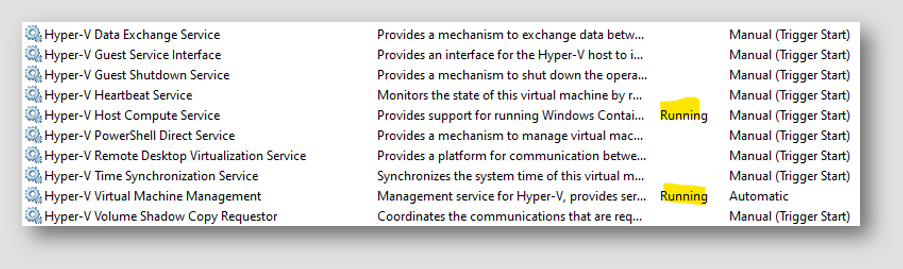

### Create the virtual machine (ESXi)

1. Log in to the ESXi, choose the relevant **datastore** and click on **Datastore Browser**

2. **Upload** the Image and click **Close**

    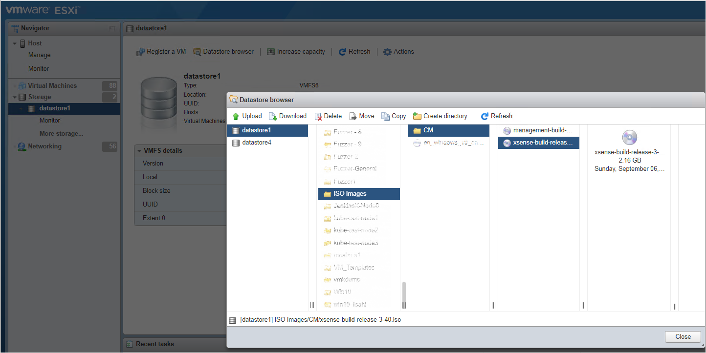

3. Go to **Virtual Machines**. Select **Create/Register VM**

4. Choose **Create new virtual machine** and select on **Next**

    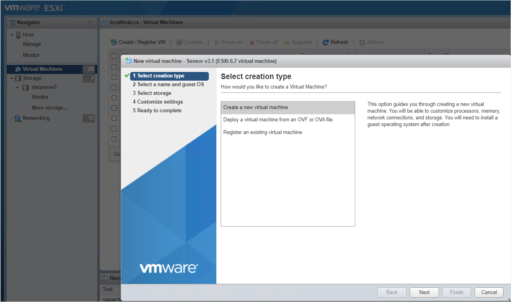

5. Add sensor name and choose

   - Compatibility: **&lt;latest ESXi version&gt;**

   - Guest OS family: **Linux**

   - Guest OS version: **Ubuntu Linux (64-bit)**

6. Click **Next**

    

7. Choose relevant datastore and click **Next**

8. Change the Virtual Hardware parameters according to the required architecture.

9. For **CD/DVD Drive 1** select **Datastore ISO file** and choose the ISO file that you uploaded earlier

10. Click on **Next** and **Finish**

### Create the virtual machine (Hyper-V)

This section describes how to create a virtual machine using Hyper-V.

**To create a virtual machine:**

1. Create a virtual disk in Hyper-V Manager​.

    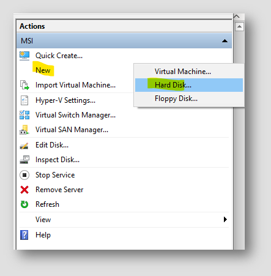 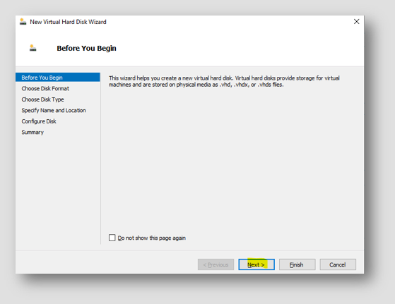

2. Select format = *VHDX.*

    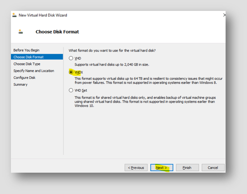

3. Select type = *Dynamic Expanding.*

    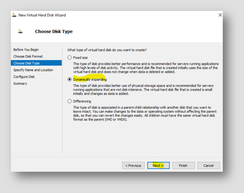

4. Enter name and location for the VHD.

    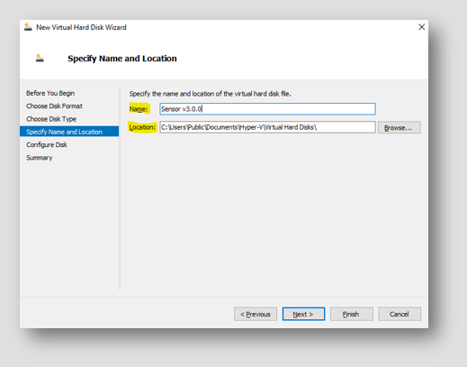

5. Enter required size (according to architecture)    

    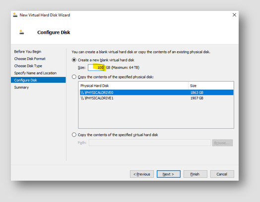

6. Review summary and select Finish.

    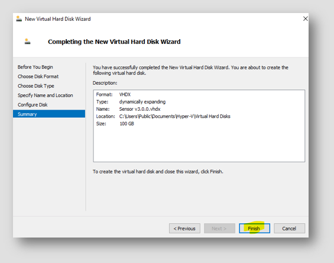

7. In the ACTION menu, create a new Virtual Machine.

    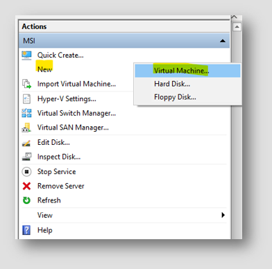 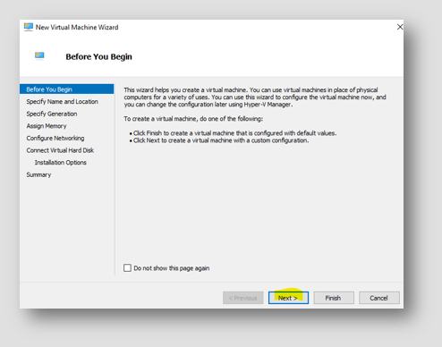

8. Enter a name for the Virtual Machine.

    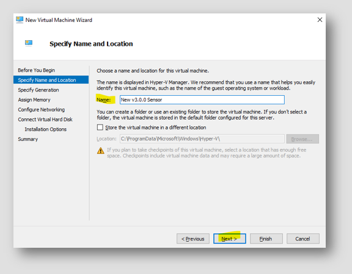

9. Select Generation, **Generation 1**.

    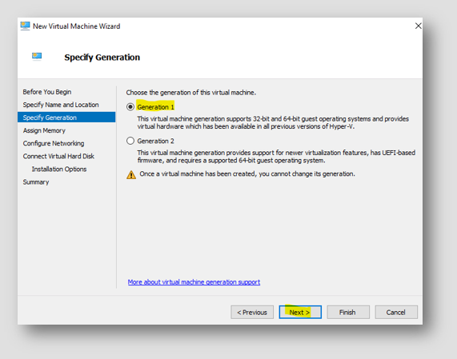

10. Specify memory allocation (according to architecture) and Dynamic Memory, **ON**.

    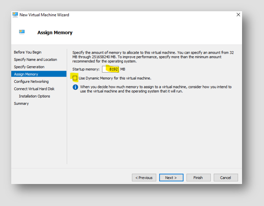

11. Configure the Network Adaptor according to your server network topology.

    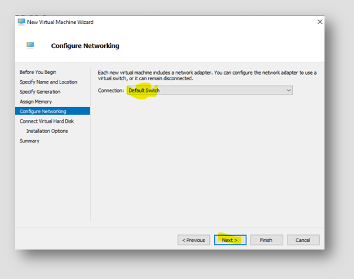

12. Connect the VHDX created previously to the Virtual Machine.

    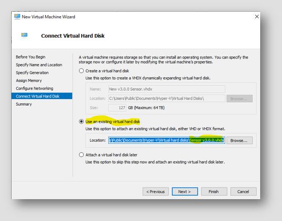

13. Review the Summary and select **Finish**.

    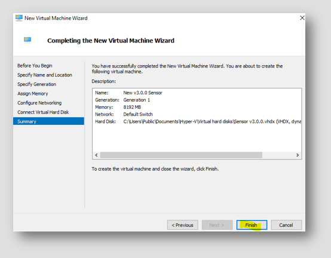

14. Right-click the new Virtual Machine and select **Settings**.

    

15. Select **Add Hardware** and add a new Network Adapter.

    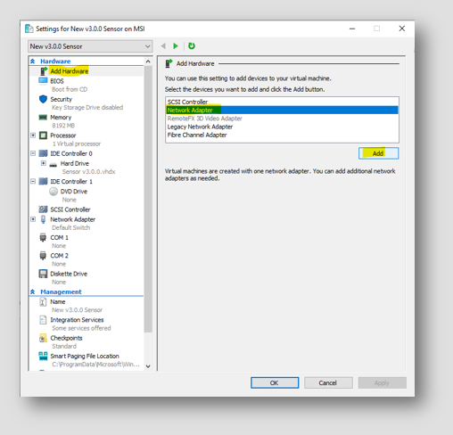

16. Select the Virtual Switch that will connect to the Sensor management network

    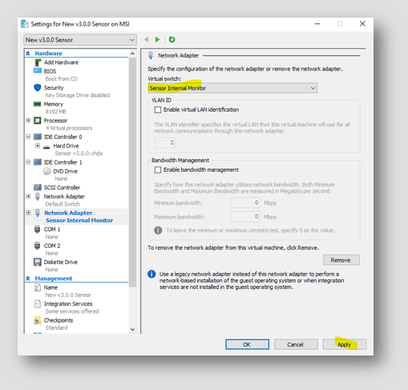

17. Allocate CPU resources (according to architecture).

    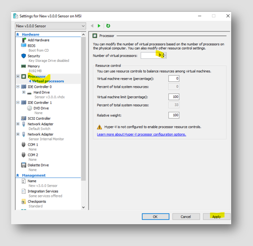

18. Connect the management console ISO image to a virtual DVD drive.

    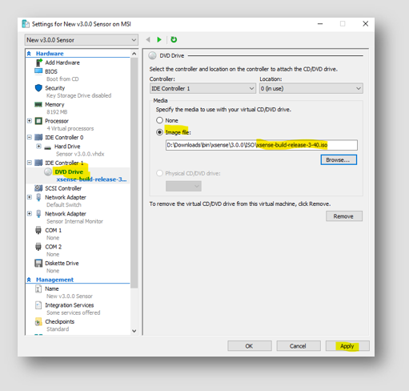 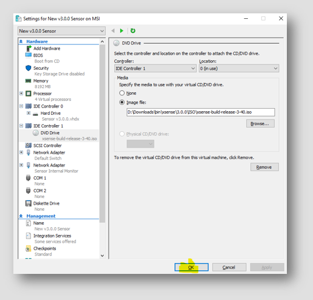

19. Start the Virtual Machine.

    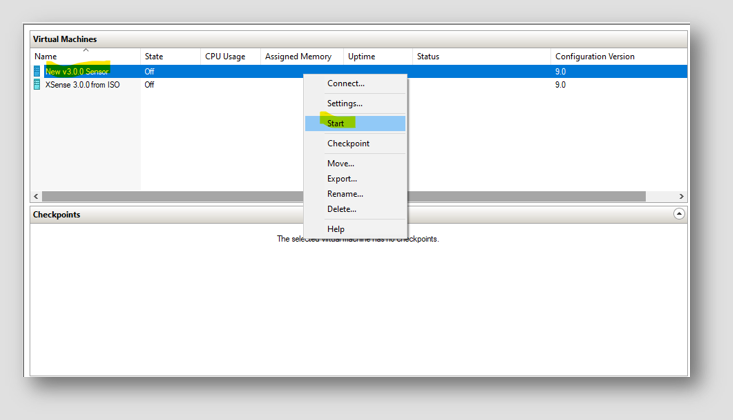

20. In the ACTION menu, select **Connect…** to continue the software installation

    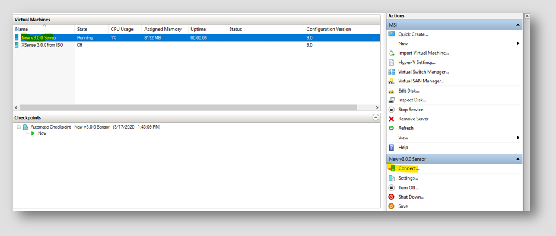

### Software installation (ESXi and Hyper-V)

This section describes the ESXi and Hyper-V software installation.

**To install:**

1. Open the Virtual Machine console.

2. The VM will boot from the ISO image, and the language selection screen will be shown. Select *English*.

    

3. Select the required architecture

    

4. Define the appliance profile and network properties:

    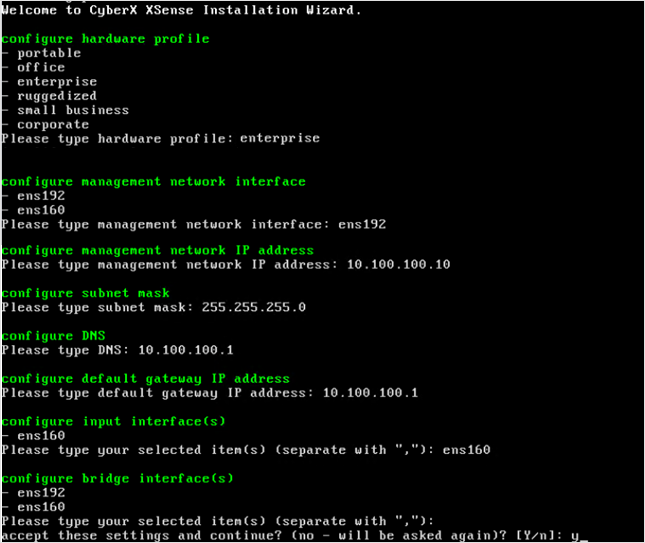

    | Parameter | Configuration |
    | ----------| ------------- |
    | **Hardware profile** | &lt;required architecture&gt; |
    | **Management interface** | ens192 |
    | **DNetwork parameters (usually provided by the customer)** | **management network IP address:** |
    |  | **subnet mask:** |
    |  | **appliance hostname:** |
    |  | **DNS:** |
    |  | **default gateway:** |
    |  | **input interfaces:** |
    |  | **bridge interfaces:** No need to configure the bridge interface, this option is for special use cases only |

5. Type Y to accept the settings

6. Login credentials are automatically generated and presented. Record these in a safe place as they are required for first login and administration.

   - **Support** – the administrative user for user management

   - **Cyberx** – the equivalent of root for accessing the appliance

    

7. The appliance will reboot

8. Access the management console via the IP address previously configured `https://ip_address`

    

## Virtual appliance - on-premises management console installation

The on-premises management console Virtual Machine supports the following architectures.

#### 1. Enterprise
   - **Specifications** : CPU: 8, Memory: 32G RAM, HDD: 1.8TB
   - **Usage** : Large production environments
 
#### 2. Small Business
   - **Specifications** : CPU: 4, Memory: 8G RAM, HDD: 500 GB
   - **Usage** : Large production environments

#### 3. Office
   - **Specifications** : CPU: 4, Memory: 8G RAM, HDD: 100 GB
   - **Usage** : Small Test environments   
   

### Prerequisites

The on-premises management console supports both VMWare and Hyper-V Deployment options. Before you begin the installation, verify the following:

- VMWare (ESXi 5.5 or later) or Hyper-V hypervisor (Windows 10 Pro or Enterprise) is installed and operational

- Available hardware resources for the Virtual Machine

- On Premise Management Console – ISO Installation file
    
Make sure the Hypervisor is running (Hyper-V example below)

### Create the virtual machine (ESXi)

This section describes how to a create virtual machine (ESXi).

**To create:**

1. Log in to the ESXi, and choose the relevant **datastore** and select **Datastore Browser**

2. **Upload** the Image and select **Close**.

   

3. Go to **Virtual Machines**.

4. Select **Create/Register VM**.

5. Choose **Create new virtual machine** and select **Next**.

   

6. Add a sensor name and choose:

   - Compatibility: \<latest ESXi version>

   - Guest OS family: Linux

   - Guest OS version: Ubuntu Linux (64-bit)

7. Select **Next**.
    
   

8. Choose relevant datastore and select **Next**.

9. Change the Virtual Hardware parameters according to the required architecture.

10. For **CD/DVD Drive 1** select **Datastore ISO file** and choose the ISO file that you uploaded earlier

11. Select **Next** and **Finish**.

### Create the virtual machine (hyper-v)

This section describes how to create a virtual machine using Hyper-V.

**To create:**

1. Create a virtual disk in Hyper-V Manager​.

     

2. Select format = VHDX.

   

3. Select **Next**.

4. Select type = Dynamic Expanding.

   

5. Select **Next**.

6. Enter name and location for the VHD.

   

7. Select **Next**.

8. Enter required size (according to architecture)

   

9. Select **Next**.

10. Review summary and select **Finish**.

    

11. In the ACTION menu, *create a new Virtual Machine*

      

12. Select **Next**.

13. Enter a name for the Virtual Machine.

    

14. Select **Next**.

15. Select Generation = **Generation 1**.

    

16. Select **Next**.

17. Specify memory allocation (according to architecture) and Dynamic Memory = ON.

    

18. Select **Next**.

19. Configure Network Adaptor according to your server network topology.

    

20. Select **Next**.

21. Connect the VHDX created previously to the Virtual Machine.

    

22. Select **Next**.

23. Review the Summary and select **Finish**.

    

24. Right click the new Virtual Machine, and select **Settings**.

    

25. Select **Add Hardware** and add a new **Network Adapter**.

    

26. Select the *Virtual Switch* which will connect to the sensor management network.

    

27. Allocate CPU resources (according to architecture)

    

28. Connect the management console ISO image to a virtual DVD drive
    
     

29. Start the Virtual Machine.

    

30. In the ACTION menu, select **Connect…** to continue the software installation.

    

### Software installation (ESXi and Hyper-V)

Booting the Virtual Machine will start the installation process from the ISO image.

**To install:**

1. Select **English**.

    

2. Select the required architecture for your deployment

    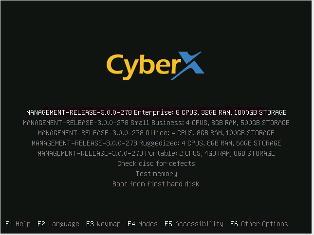

3. Define the network interface for the sensor management network – *interface, IP, subnet, DNS server and Default Gateway:*

    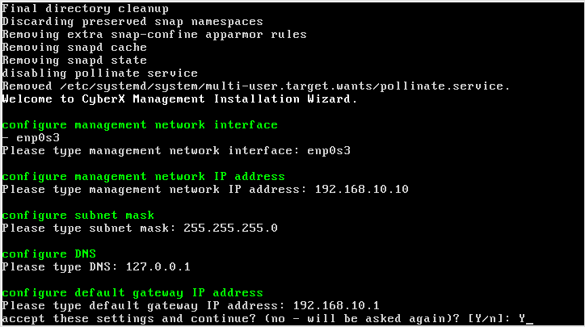

4. Login credentials are automatically generated and presented. Record these in a safe place as they are required for first login and administration.

  - **Support** – the administrative user for user management

  - **Cyberx** – the equivalent of root for accessing the appliance

    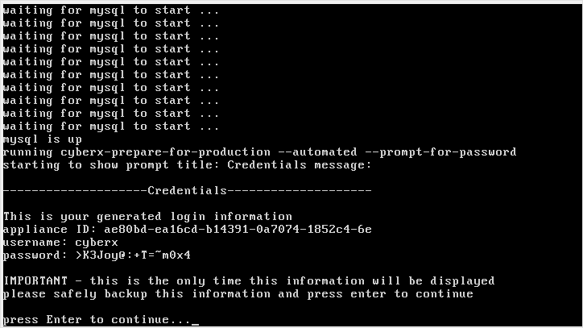

    

5. The appliance will reboot

6. Access the management console via the IP address previously configured <https://ip_address>

    

## Post install validation

To validate the installation of a physical appliance, it is required to perform a number of tests. The same validation process applies to all the appliance types.

The validation is done using the GUI or the CLI and it is available to user *Support* and user *CyberX*.

Post-install validation must include the following tests:

  - **Sanity test:** Verify the system is up and running.

  - **Version:** Verify the version is correct.

  - **ifconfig:** Verify all the input interfaces configured during the installation process are up and running.

### Checking system health using the GUI

#### Sanity

- **Appliance** : Runs the appliance sanity check. The same check you can perform using the CLI command system-sanity.

- **Version** : Displays the appliance version.

- **Network Properties** : Displays the sensor network parameters.

#### Redis

- **Memory** : Provides the overall picture of memory usage, such as how much memory was used and how much remained.

- **Longest Key** : Displays the longest keys that might cause extensive memory usage.

#### System

- **Core Log** : Provides the last 500 rows of the core log, enabling to view the recent log rows without exporting the entire system log.

- **Task Manager** : Translates the tasks that appear in the Table of Processes to the following layers: 
  - persistent layer (Redis) 
  - cash layer (SQL)

- **Network Statistics** : Displays your network statistics.

- **TOP** : TOP (table of processes) is a Linux command that shows the processes. It provides a dynamic real-time view of the running system.

- **Backup Memory Check** : Provides the status of the backup memory, checking the following:
  - The location of the backup folder 
  - The size of the backup folder
  - The limitations of the backup folder
  - When was the last backup
  - How much space there is for the additional backup files

- **ifconfig** : Displays the appliance physical interfaces’ parameters.

- **CyberX nload** : Displays network traffic and bandwidth using the 6 second-test.

- **Errors from Core, log** : Displays errors from the core log file.

**To access the tool:**

1. Log into to the sensor with Support user credentials.

2. Select **System Statistics** from the **System Settings** window.

    

### Checking system health using the CLI

**Test 1: Sanity – verify the system is up and running:**

1. Connect to CLI with Linux terminal (e.g. putty) user **support**

2. Type system sanity

3. Check that all the services are green, up and running

    

4. Verify that System is UP! (prod) is displayed at the bottom

**Test 2: Version Check – verify that the correct version is used:**

1. Connect to CLI with Linux terminal (e.g. putty) with user **support**.

2. Type system version.

3. Check that the correct version is displayed.

**Test 3: Network Validation - verify all the input interfaces configured during the installation process are up and running:**

1. Connect to CLI with Linux terminal (e.g. putty) user **support**.

2. Type network list (the equivalent of the Linux command ifconfig).

3. Validate that the required input interfaces appear, for example, if 2 quad Copper NICs are installed, there should be 10 interfaces in the list.

    

**Test 4: Management Access to UI – verify that you can access the Console Web GUI:**

1. Connect a laptop with an eth cable to the management port (**Gb1**).

2. Define the laptop NIC address to be in the same range as the appliance.

    

3. Ping to \<appliance IP> from the laptop to verify connectivity (default: 10.100.10.1).

4. Open the Chrome browser in the laptop and type the \<appliance IP>.

5. In the **Your connection is not private** window, click **Advanced** and proceed.

6. The test is successful when the Defender login appears.

   

## Troubleshooting

### Cannot connect using a web interface

1. Verify that the computer that trying to connect is on the same network as the appliance.

2. Verify that the GUI network is connected to the Management port.

3. Ping the appliance IP address. If there is no Ping:

   - Connect a monitor and a keyboard to the appliance.

   - Use **support** user and password to login.

   - Use the command **network list** to see the current IP address.

      

4. In case the network parameters are misconfigured, use the following procedure to change it:

   - Use command network edit-settings

   - To change the management network IP address, select **Y**.

   - To change the subnet mask, select **Y**.

   - To change the DNS, select **Y**.

   - To change the default gateway IP address, select **Y**.

   - (for sensor only) For the input interface change, select **N**.

   - To apply the settings, select **Y**.

5. After reboot, connect with user Support and use the network list command to verify that the parameters were changed.

6. Try to ping and connect from GUI again.

### The appliance is not responding

1. Connect with a monitor and keyboard to the appliance or use Putty to connect remotely to the CLI.

2. Use the Support credentials to log in.

3. Use system sanity command and check that all processes are up and running.

    

For any other issues, contact [support.microsoft.com](https://support.microsoft.com/en-us/supportforbusiness/productselection?sapId=82c88f35-1b8e-f274-ec11-c6efdd6dd099).

## Appendix A: Mirroring Port on vSwitch (ESXi)

### Configure a SPAN port on existing vSwitch

> [!NOTE]  
> A vSwitch does not have mirroring capabilities, but a simple workaround can be used to implement SPAN port.

**To configure a SPAN port:**

1. Open vSwitch Properties:

   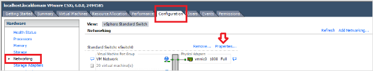

2. Click **Add…**

   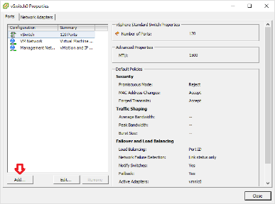

3. Select **Virtual Machine** and select **Next**.

4. Insert Network Label **SPAN Network**, select **VLAN ID** **All** and select **Next**.

   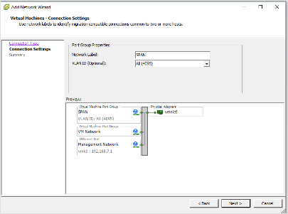

5. Select **Finish**.

6. Select **SPAN Network** and click **Edit…**

7. Select **Security**, and verify that **Promiscuous Mode** policy is set to **Accept** mode.

   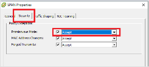

8. Click **OK** and **Close** the vSwitch Properties.

9. Open the **XSense VM** properties.

10. For **Network Adapter 2**, select the **SPAN** network.

    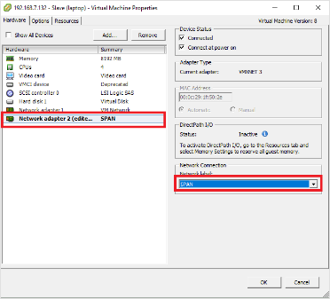

11. Select **OK**.

12. Connect to the sensor and verify that mirroring works.

## Appendix B: Access Sensors from the On-premises Management Console

Enhance system security by preventing users log in directly to the sensor. Instead leverage proxy tunneling to let users access the sensor directly from the Center Manager with a single firewall rule. This narrows the possibility of unauthorized access to the network environment beyond the sensor.

The user experience when logging in to the sensor remains the same.

**To enable tunnelling:**

1. Log in to the on-premises management console CLI with CyberX or Support user credentials.

2. Type: sudo cyberx-management-tunnel-enable.

3. Select enter.

4. Type --port 10000.