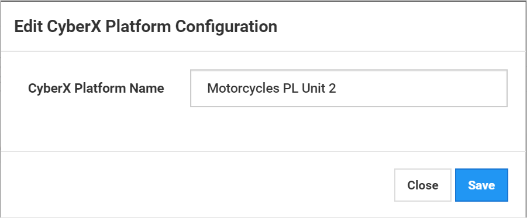
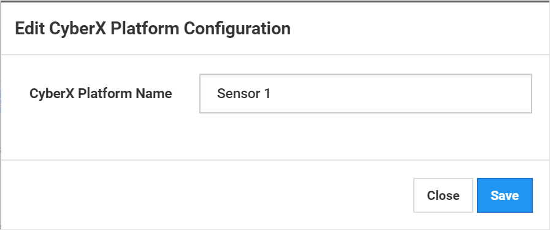
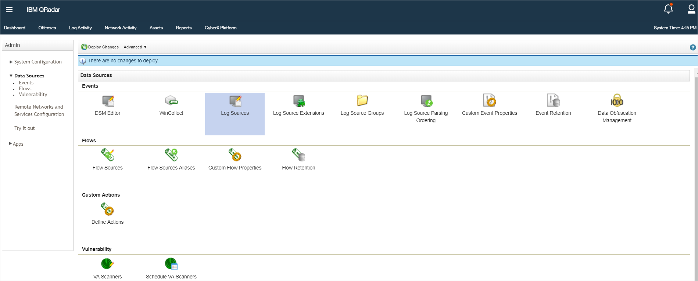
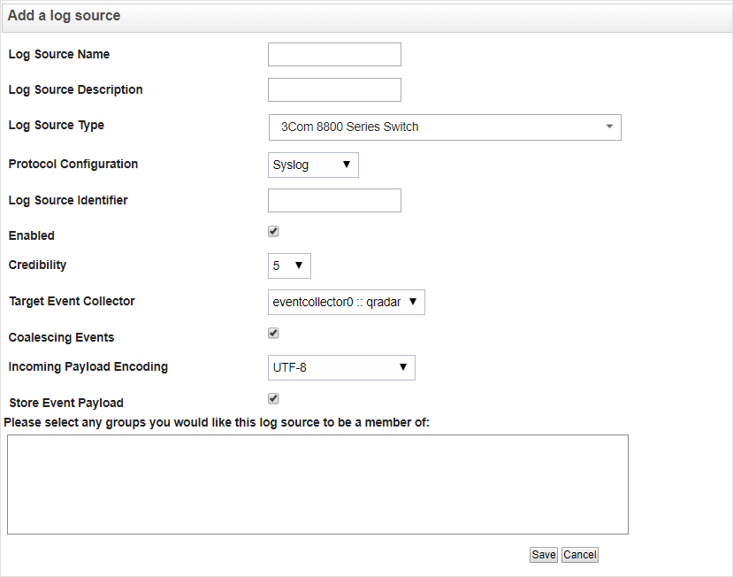
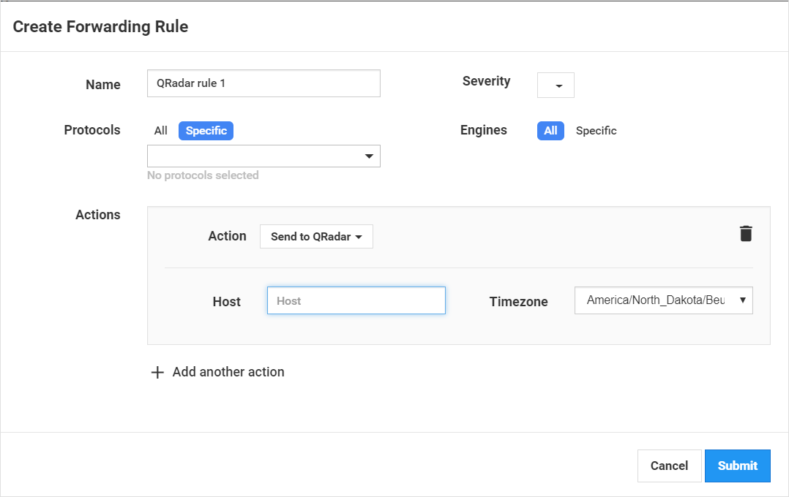

# Introduction

This document describes how to configure the CyberX solution integration with QRadar.

**To perform QRadar integration with CyberX:**

1. Define the CyberX appliance name, see [this page](defining-cyberx-appliance-name.md).
1. Configure Syslog Listener for QRadar, see [this page](configuring-syslog-listener-for-qradar.md).
1. Deploy appliance QID, see [this page](deploying-cyberx-platform-qid.md).
1. Set up receiving QRadar notifications, see [this page](setting-up-qradar-forwarding-rules.md).
1. Add custom fields to Alerts, see [this page](adding-custom-fields-to-alerts.md).

## Defining CyberX appliance name

You can change the platform name at any time. The change takes effect immediately.

When building sites and assigning appliances to zones in the on-premises management console, it is important for more efficient usage that each CyberX appliance has a significant name. For example, “Motorcycles PL Unit 2” means that this appliance is protecting unit #2 in the Motorcycles production line.

**To change the appliance name:**
1. In the bottom of the side menu, click on the current appliance name. The **Edit CyberX Platform Configuration** dialog box appears.
   
1. In the **CyberX Platform Name** text box, type the new appliance name and click **Save**.
1. The **Edit CyberX Platform Configuration** dialog box closes, and the new name appears in the left pane.

## Configuring Syslog listener for QRadar

**To configure the Syslog listener to work with QRadar:**
1. Login to QRadar.
1. From the left pane select **Admin > Data Sources**, the **Data Sources** window appears.
   
1. In the **Data Sources** window, click **Log Sources.** The **Modal** window appears.
   
1. In the **Modal** window, click **Add**. The **Add a log source** dialog box appears.
   
1. In the **Add a log source** dialog box, set the following parameters:
   - **Log Source Name**: `<XSense Name>`
   - **Log Source Description**: `<XSense Name>`
   - **Log Source Type**: `Universal LEEF`
   - **Protocol Configuration**: `Syslog`
   - **Log Source Identifier**: `<XSenseName>`
   > [!NOTE]
   > Log Source Identifier name must not include a white space. It is recommended to replace each white space character with an underscore.
1. Click **Save**, the **Add a log source** dialog box closes.
1. Click **Deploy Changes**.

## Deploying CyberX platform QID

QID is an event identifier in QRadar. All of CyberX platform reports are tagged under the same event (XSense Alert).

**To deploy Xsense QID:**
1. Login to QRadar console.
1. Create a file named `xsense_qids`.
1. In the file, type the following: `,XSense Alert,XSense Alert Report From <XSense Name>,5,7001`.
1. Execute: `sudo /opt/qradar/bin/qidmap_cli.sh -i -f <path>/xsense_qids`. The message that the QID was deployed successfully appears.

## Setting Up QRadar forwarding rules

QRadar forwarding rule must be configured in the CyberX appliance and mapped in the on-premises management console.

**To define QRadar notifications in the CyberX appliance:**
1. In the From the side menu, select **Forwarding**. The **Forwarding** window appears.
   
1. Set the Action to QRadar.
1. Configure the QRadar IP address and the timezone.
1. Click **Submit**.

**To map notifications to QRadar in the Central Manager:**
1. From the side menu, select Forwarding.
1. In the Qradar GUI, select **Log Activity** under QRadar.
1. Select **Add Filter** and set the following parameters:
   - Parameter: `Log Sources [Indexed]`
   - Operator: `Equals`
   - Log Source Group: `Other`
   - Log Source: `<Xsense Name>`
1. Double-click an unknown report from XSense.
1. Click **Map Event**.
1. The Modal Log Source Event page pops up.
1. In the Modal Log Source Event page, select as follows:
   - High-Level Category - Suspicious Activity + Low-Level Category - Unknown Suspicious Event + Log
   - Source Type - any
1. Click **Search**.
1. From the results, choose the line in which the name XSense appears and click **OK**.

All the XSense reports from now on are tagged as XSense Alerts.

## Adding custom fields to alerts

**To add custom fields to alerts:**
1. Click **Extract** Property, a modal window will appear
1. Choose Regex Based
1. Configure the following fields:
   - New Property: <choose from the list below>
      - Xsense Alert Description
      - Xsense Alert ID
      - Xsense Alert Score
      - Xsense Alert Title
      - Xsense Destination Name
      - Xsense Direct Redirect
      - Xsense Sender IP
      - Xsense Sender Name
      - Xsense Alert Engine
      - Xsense Source Device Name
   - Check Optimize Parsing
   - Field Type: `AlphaNumeric`
   - Check Enabled
   - Log Source Type: `Universal LEAF`
   - Log Source: `<Xsense Name>`
   - Event Name (should be already set as XSense Alert)
   - Capture Group: 1
   - Regex:
      - Xsense Alert Description RegEx: `msg=(.*)(?=\t)`
      - Xsense Alert ID RegEx: `alertId=(.*)(?=\t)`
      - Xsense Alert Score RegEx: `Detected score=(.*)(?=\t)`
      - Xsense Alert Title RegEx: `title=(.*)(?=\t)`
      - Xsense Destination Name RegEx: `dstName=(.*)(?=\t)`
      - Xsense Direct Redirect RegEx: `rta=(.*)(?=\t)`
      - Xsense Sender IP: RegEx: `reporter=(.*)(?=\t)`
      - Xsense Sender Name RegEx: `senderName=(.*)(?=\t)`
      - Xsense Alert Engine RegEx: `engine =(.*)(?=\t)`
      - Xsense Source Device Name RegEx: `src`