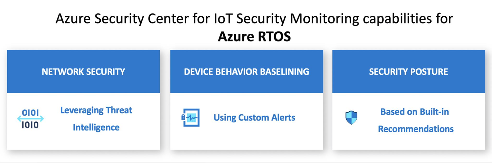

---

title: Security module for Azure RTOS overview
description: Learn more about the security module for Azure RTOS support and implementation as part of Azure Defender for IoT.
services: defender-for-iot
ms.service: defender-for-iot
documentationcenter: na
author: mlottner
manager: rkarlin
editor: ''

ms.devlang: na
ms.topic: conceptual
ms.tgt_pltfrm: na
ms.workload: na
ms.date: 09/07/2020
ms.author: mlottner
---

# Overview: Defender for IoT security module for Azure RTOS (preview)

The Azure Defender for IoT security module provides a comprehensive security solution for devices that use Azure RTOS. It provides coverage for common threats and potential malicious activities on real-time operating system (RTOS) devices. Azure RTOS now ships with the Azure IoT security module built in.

The security module for Azure RTOS offers the following features:

- Malicious network activity detection
- Custom alert-based device behavior baselining
- Improved device security hygiene

## Detect malicious network activities

Inbound and outbound network activity of each device is monitored. Supported protocols are TCP, UDP, and ICMP on IPv4 and IPv6. Defender for IoT inspects each of these network activities against the Microsoft threat intelligence feed. The feed gets updated in real time with millions of unique threat indicators collected worldwide.

## Device behavior baselining based on custom alerts

Baselining allows for clustering of devices into security groups and defining the expected behavior of each group. Because IoT devices are typically designed to operate in well-defined and limited scenarios, it's easy to create a baseline that defines their expected behavior by using a set of parameters. Any deviation from the baseline triggers an alert.

## Improve your device security hygiene

By using the recommended infrastructure Defender for IoT provides, you can gain knowledge and insights about issues in your environment that impact and damage the security posture of your devices. A weak IoT-device security posture can allow potential attacks to succeed if it's left unchanged. Security is always measured by the weakest link within any organization.

## Get started protecting Azure RTOS devices

Security Module for Azure RTOS is provided as a free download for your devices. The Defender for IoT cloud service is available with a 30-day trial per Azure subscription. To get started, download the [security module for Azure RTOS](https://github.com/MicrosoftDocs/azure-docs/blob/master/articles/defender-for-iot/iot-security-azure-rtos.md). 

## Next steps

In this article, you learned about the security module for Azure RTOS. To learn more about the security module and get started, see the following articles:

- [Azure RTOS IoT security module concepts](concept-rtos-security-module.md)
- [Quickstart: Azure RTOS IoT security module](quickstart-azure-rtos-security-module.md)
