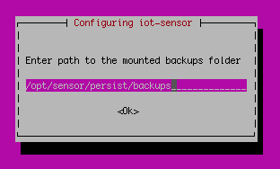
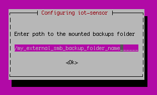

# Back up and restore OT network sensors from the sensor console

OT sensor data can be backed up and restored from the sensor console to help protect against hard drive failures and data loss. In this article, learn how to:

- Set up automatic backup files from the sensor console GUI or via CLI
- Back up files manually via sensor console GUI and CLI
- Use an SMB server to save your backup file to an external server
- Restore an OT sensor from the GUI or via CLI

## Set up backup and restore files

OT sensors are automatically backed up daily at 3:00 AM, including configuration and detected data. Backup files do *not* include PCAP or log files, which must be manually backed up if needed.

We recommend that you configure your system to automatically transfer backup files to your own internal network.

For more information, see [On-premises backup file capacity](references-data-retention.md#on-premises-backup-file-capacity).

> [!NOTE]
> Backup files can be used to restore an OT sensor only if the OT sensor's current software version is the same as the version in the backup file.

### Turn on backup functionality

If your OT sensor is configured *not* to run automatic backups, you can turn this back on manually in the `/var/cyberx/properties/backup.properties` file on the OT sensor machine.

## Create a manual backup file

You may want to create a manual backup file, such as just after updating your OT sensor software, or when troubleshooting with customer support.

To create a backup file that you can use to restore your sensor, use the CLI and run the `cyberx-xsense-system-backup` CLI command. For more information, see the [OT sensor CLI reference](cli-ot-sensor.md#start-an-immediate-unscheduled-backup).

To create a protected backup file to send to the support team, use the sensor GUI. Backup files created from the sensor GUI can be opened only together with assistance from Microsoft support.

**To create a manual backup file from the sensor GUI**:

1. Sign into the OT sensor GUI and select **System settings** > **Sensor management** > **Health and troubleshooting** > **Backup & restore**.

1. In the **Backup & restore pane**:

    - Enter a meaningful filename for your backup file.
    - Select the content you want to back up.
    - Select **Export**.

Your new, protected backup file is listed in the **Archived files** area of the backup pane.

## Save your backup to an external server (SMB)

We recommend saving your OT sensor backup files on your internal network. To do this, you may want to use an SMB server. For example:

1. Create a shared folder on the external SMB server, and make sure that you have the folder's path and the credentials required to access the SMB server.

1. Sign into your OT sensor via SSH using the [*admin*](roles-on-premises.md#access-per-privileged-user) user.
   > [!NOTE]
   > If you're using a sensor version earlier than 23.2.0, use the [*cyberx_host*](roles-on-premises.md#legacy-users) user instead. Skip the next step for running `system shell` and jump directly to creating a directory for your backup files. 

1. Access the host by running the `system shell` command. Enter the admin user's password when prompted and press **ENTER**. 

1. Create a directory for your backup files. Run:
    ```bash
    sudo mkdir /<backup_folder_name>

    sudo chmod 777 /<backup_folder_name>/
    ```

1. Edit the `fstab` file with details about your backup folder. Run:
    
    ```bash
    sudo nano /etc/fstab

    add - //<server_IP>/<folder_path> /<backup_folder_name_on_cyberx_server> cifs rw,credentials=/etc/samba/user,vers=X.X,file_mode=0777,dir_mode=0777
    ```
   Make sure you replace `vers=X.X` with the correct version of your external SMB server. For example `vers=3.0`.

1. Edit and create credentials to share for the SMB server. Run:

    ```bash
    sudo nano /etc/samba/user
    ```

1. Add your credentials as follows:

   ```bash
   username=<user name>
   password=<password>
   ```

1. Mount the backup directory. Run:

    ```bash
    sudo mount -a
    ```

1. Configure your backup directory on the SMB server to use the shared file on the OT sensor. Run:

    ```bash
    sudo dpkg-reconfigure iot-sensor
    ```

    Follow the instructions on screen and validate that the settings are correct on each step.

    To move to the next step without making changes, press **ENTER**.

    You'll be prompted to `Enter path to the mounted backups folder`. For example:

    


    The factory default value is `/opt/sensor/persist/backups`.

    Set the value to the folder you created in the first few steps, using the following syntax: `/<backup_folder_name>`. For example:

    


    Confirm the change by pressing **ENTER** and continue with the rest of the steps until the end.

## Restore an OT sensor

The following procedures describe how to restore your sensor using a backup file created via automatically or via CLI. Restoring your sensor using backup files created via the sensor GUI is supported only together with customer support.

### Restore an OT sensor from the sensor GUI

1. Sign into the OT sensor via SFTP and download the backup file you want to use to a location accessible from the OT sensor GUI. 
    Backup files are saved on your OT sensor machine, at `/var/cyberx/backups`, and are named using the following syntax: `<sensor name>-backup-version-<version>-<date>.tar`.

    For example: `Sensor_1-backup-version-2.6.0.102-2019-06-24_09:24:55.tar`

    > [!IMPORTANT]
    > Make sure that the backup file you select uses the same OT sensor software version that's currently installed on your OT sensor.
    >
    > Your backup file must be one that had been generated automatically or manually via the CLI. If you're using a backup file generated manually by the GUI, contact support to use it to restore your sensor.


1. Sign into the OT sensor GUI and select **System settings** > **Sensor management** > **Health and troubleshooting** > **Backup & restore** > **Restore**.

1. Select **Browse** to select your downloaded backup file. The sensor will start to restore from the selected backup file.

1. When the restore process is complete, select **Close**.

### Restore an OT sensor from the latest backup via CLI

To restore your OT sensor from the latest, automatically generated backup file via CLI:

1. Make sure that your backup file has the same OT sensor software version as the current software version on the OT sensor.

1. Use the `cyberx-xsense-system-restore` CLI command to restore your OT sensor.

For more information, see the [OT sensor CLI reference](cli-ot-sensor.md#start-an-immediate-unscheduled-backup).

## Next steps

For more information, see [Maintain OT network sensors from the GUI](how-to-manage-individual-sensors.md).
