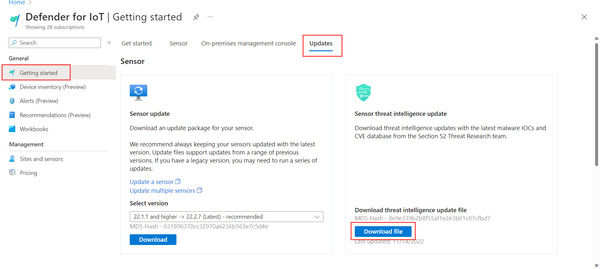

# Updating Threat Intelligence Data for Sensors 
  
 In this section:  
 * Overview  
 * Delivering Packages  
 * Updating Threat Packages  
 * Changing Update Mode  
 * Reviewing Package Update Status  
 * Reviewing Package Information  
 * Additional Resources
     
     
     
## Overview

Security teams at Microsoft carry out proprietary ICS threat intelligence and vulnerability research. These teams include MSTIC (Microsoft Threat Intelligence Center), MART (Microsoft Detection and Response Team), DCU (Digital Crimes Unit), and Section 52 (IoT/OT/ICS domain experts that track ICS-specific zero-days, reverse-engineering malware, campaigns, and adversaries).
  
Security teams provide:

- Protection from known and relevant threats.
- Insights that help triage and prioritize.
- Understanding of the full context of threats before they're affected.
- Relevant, accurate, and actionable data.  

The teams detect, analyse, and respond to threats in Microsoft:

- Cloud infrastructure and services.
- Traditional products and devices.
- Internal corporate resources.

This intelligence provides contextual information to enrich Microsoft platform analytics, and supports the company's managed services for incident response and breach investigation. Threat intelligence packages contain signatures (including malware signatures), CVEs, and other security content.
  
    
    
## Delivering Packages

Threat intelligence packages are provided approximately once a month, or if needed more frequently. Announcements about new packages are available from [Microsoft](https://techcommunity.microsoft.com/t5/azure-defender-for-iot/bd-p/AzureDefenderIoT).

You can also see the most current package delivered from the [Threat Intelligence Update](https://techcommunity.microsoft.com/t5/azure-defender-for-iot/bd-p/AzureDefenderIoT) section of the **Updates** page on **Defender for IoT** in the **Azure portal**.
  
    
    
## Updating sensor threat intelligence packages

Three options are available for updating sensor threat intelligence packages:

- Automatically push package updates to sensors.
- Manually push package updates to sensors as required.
- Download a package and upload to a sensor or multiple sensors.

Users with Defender for IoT Security Reader permissions can automatically and manually push packages to sensors.
  
  
### Automatically push updates to sensors

Packages can be automatically updated to cloud connected sensors as they are released by Defender for IoT. Ensure automatic package update by onboarding your cloud connected sensor with the **Automatic Threat Intelligence Updates** option enabled. For more information, see [Onboarding a sensor](tutorial-onboarding.md#onboard-and-activate-the-virtual-sensor).
  
  
### Manually push updates to sensors

Packages can be manually pushed from Defender for IoT to sensors when required. This gives you the ability to control when a package is installed, without the need to download and then upload it to your sensors.

**To manually push packages:**

1. Go to the Microsoft Defender for IoT **Sites and Sensors** page.
2. Select the ellipsis (...) for a sensor and then select **Push Threat Intelligence update**. The **Update Status** field displays the update progress.  

### Downloading packages and uploading to sensors

Packages can be downloaded from the **Azure portal** and manually uploaded to individual or multiple sensors. If the on-premises management console manages your sensors, you can download threat intelligence packages to the management console and push them to multiple sensors simultaneously.

This option is available for both cloud connected and locally managed sensors.

**To upload to a single sensor:**
  
1. Go to the Microsoft Defender for IoT **Updates** page.
2. Download and save the **Threat Intelligence** package.
3. Sign in to the sensor console.
4. Select **System Settings** from the side menu.
5. Select **Threat Intelligence Data**, and then select **Update**.
6. Upload the new package.  

**To upload to multiple sensors simultaneously:**

1. Go to the Microsoft Defender for IoT **Updates** page.
2. Download and save the **Threat Intelligence** package.
3. Sign in to the management console.
4. Select **System Settings** from the side menu.
5. In the **Sensor Engine Configuration** section, select the sensors that should receive the updated packages.  
6. In the **Select Threat Intelligence Data** section, select the plus sign (**+**).
7. Upload the package.  
  
    
    
## Changing the threat intelligence update mode

You can change the sensor threat intelligence update mode after initial onboarding.

**To change the update mode:**

1. Select the ellipsis (...) for a sensor and then select **Edit**.
2. Enable or disable the **Automatic Threat Intelligence Updates** toggle.  
  
      
      
## Reviewing package update status on the sensor

The package update status and version information are displayed in the sensor **System Settings** > **Threat Intelligence** section.  
  
    
    
## Reviewing package information for cloud connected sensors

Review the following information about threat intelligence packages for your cloud connected sensors:

- Installed package version
- Threat intelligence update mode
- Threat intelligence update status

**To review installed package information**:  
   
1. Go to the Microsoft Defender for IoT **Sites and Sensors** page. 
2. Review the **Threat Intelligence version** installed on each sensor. Version naming is based on the day the package was built by Defender for IoT.  
3. Review the **Threat Intelligence mode**. *Automatic* indicates that newly available packages will be automatically installed on sensors as they are released by Defender for IoT. *Manual* indicates that you can push newly available packages directly to sensors as needed.   
4. Review the **Threat Intelligence update status**. The following statuses may be displayed:

- Failed
- In Progress
- Update Available   
- OK 

If cloud connected threat intelligence updates fail, review connection information in the **Sensor status** and **Last connected UTC** columns in the **Sites and Sensors** page. 
  
   
   
## Additional resources

For more information, see:

- [Onboarding a Sensor](tutorial-onboarding.md#onboard-and-activate-the-virtual-sensor)

- [Managing Sensors from the Management Console](how-to-manage-sensors-from-the-on-premises-management-console.md)
