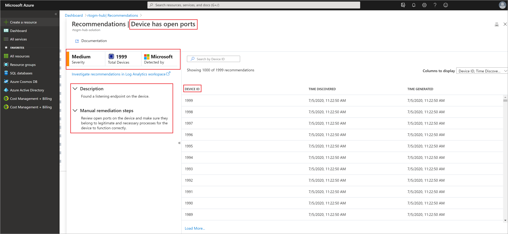

# Quickstart: Investigate security recommendations

Timely analysis and mitigation of recommendations by Defender for IoT is the best way to improve security posture and reduce attack surface across your IoT solution.

In this quickstart, we'll explore the information available in each IoT security recommendation, and explain how to drill down and use the details of each recommendation and related devices, to reduce risk.

Let's get started.

## Investigate new recommendations

The IoT Hub recommendations list displays all of the aggregated security recommendations for your IoT Hub.

1.  In the Azure portal, open the **IoT Hub** you want to investigate for new recommendations.

1.  From the **Security** menu, select **Recommendations**. All of the security recommendations for the IoT Hub will display, and the recommendations with a **New** flag, mark your recommendations from the past 24 hours. 

    

1.  Select and open any recommendation from the list to open the recommendation details and drill down to the specifics.

## Security recommendation details

Open each aggregated recommendation to display the detailed recommendation description, remediation steps, device ID for each device that triggered a recommendation. It also displays recommendation severity and direct-investigation access using Log Analytics.

1.  Select and open any security recommendation from the **IoT Hub** \> **Security** \> **Recommendations** list.

1.  Review the recommendation **description**, **severity**, **device details** of all devices that issued this recommendation in the aggregation period. 

1.  After reviewing recommendation specifics, use the **manual remediation step** instructions to help remediate and resolve the issue that caused the recommendation. 

    

1.  Explore the recommendation details for a specific device by selecting the desired device in the drill-down page.

    

1.  If further investigation is required, **Investigate the recommendation in Log Analytics** using the link. 

## Next steps

Advance to the next article to learn how to create custom alerts...

> [!div class="nextstepaction"]
> [Create custom alerts](quickstart-create-custom-alerts.md)
