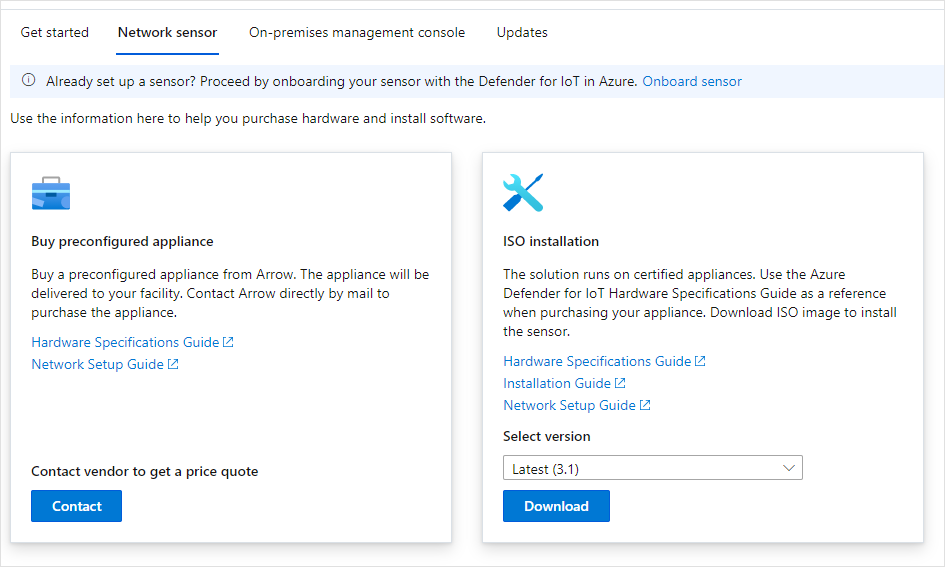
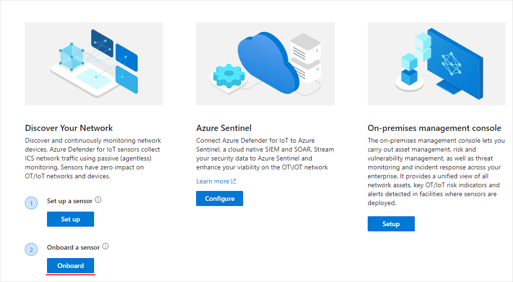
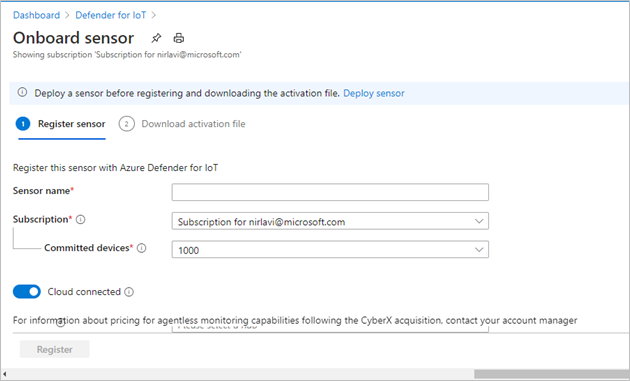
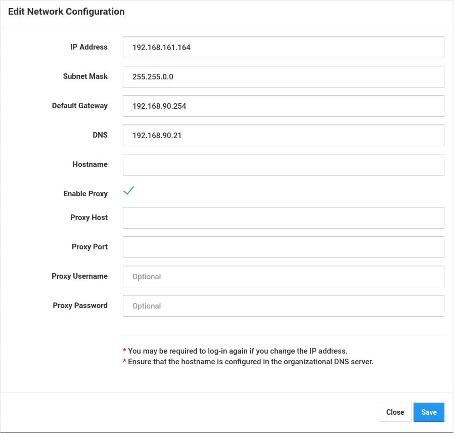

# Quickstart: Deploy and onboard a sensor

This article provides an overview of the sensor deployment process. Sensors must be onboarded to the Azure Defender for IoT portal.

This process requires acquiring a preconfigured sensor or acquiring a certified sensor appliance and installing the sensor software yourself.

If you are working with a certified sensor appliance, it is recommended to review the [Azure Defender for IoT hardware specifications guide](https://aka.ms/AzureDefenderforIoTBareMetalAppliance) before you begin.

> [!NOTE]
> The Azure Defender for IoT on-premises management console does not need to be onboarded.

Onboarding sensors lets you:

|||
|------ | ----------- |
| **Define a sensor name** | Name the sensor you are onboarding and associate it with an IoT Hub or subscription.  See **Onboard sensors** for more information.|
|**Choose a subscription and number of committed devices**|Select a subscription and the number of devices covered by the subscription. Enter the number in increments of 1000.|
| **Define a sensor management mode** | Define where asset, alert, and other information detected by the sensor is displayed. This is determined based on the **Sensor management mode** you define.  **Locally managed mode**: Information detected by the sensor is displayed in the sensor console. Detection information is also shared with the on-premises management console if the sensor is connected to it.  **Cloud managed mode**: Information detected by the sensor is displayed in the sensor console. In addition, alert information is delivered through an IoT Hub and can be shared with other Azure services, for example Azure Sentinel. See **Onboard sensor** for more information. |
| **Acquire a sensor activation file** | For **Locally Managed** sensors, an activation file is used to manage authorized sensor activation periods.  For **Cloud managed** sensors, an activation file is used as a connection between the sensor and an IoT Hub. For more information, see **Onboard sensors**. |
| **Upload an activation file to your sensor** | Activation files must be uploaded to your enterprise sensors. Network monitoring and access to sensor console features will not be available until the activation file is uploaded. For more information, see **Upload sensor activation files**. |
| **Update sensor network parameters before activation** | Update parameters defined during sensor installation. For more information, see **Error! Reference source not found**.|

**To deploy a sensor:**

1. Go to Azure Defender for IoT from the Azure portal.

2. Select **Get started.**

3. In the **Discover your network** section, select **Set up**.

   

4. Select an option for acquiring a sensor.

   

  - **Buy a preconfigured sensor**: Microsoft and Arrow have partnered to provide preconfigured sensors. To purchase a preconfigured sensor, contact Arrow at: <hardware.sales@arrow.com>. The sensor will be delivered to your facility. The most current version is installed.

  - **Bring your own appliance (ISO Installation)**: The solution runs on certified appliances. Use the [Azure Defender for IoT hardware specifications guide](https://aka.ms/AzureDefenderforIoTBareMetalAppliance) as a reference when purchasing your certified appliance.

    - Select a version from the **Select version** menu.

    - Select **Download** and save the file. Refer to the **Azure Defender for IoT Installation Guide** for details about downloading the ISO image and installing the sensor software.

5. After the software is installed on your sensor or you received a preconfigured sensor, carry out network setup tasks. Refer to the [Network setup guide](https://aka.ms/AzureDefenderForIoTNetworkSetup) for details.

## Onboard a sensor

Sensors need to be onboarded to the Azure Defender for IoT portal. Onboarding is carried out in two phases:

1. Register the sensor with the Azure Defender for IoT portal.

2. Download an Activation file for the sensor. The file will later be uploaded to your sensor.

**To access the onboard page:**

1. Navigate to Microsoft Azure Defender for IoT **Get started** page.

2. Select **2) Onboard** from the Azure Defender for IoT.

   

3. The **Onboard sensor** page opens. It provides options to register the sensor and download the activation file.

   

**To register the sensor:**

1. Choose a sensor name. For Cloud Managed sensors, the name defined here is applied the name that appears in the sensor console: this name cannot be changed from the console. For Locally Managed sensors, the name applied here will be stored in Azure, but can be updated in the sensor console. It is recommended to include the IP address of the sensor you installed as part of the name or use an easily identifiable name. This will ensure easier tracking and consistent naming between the registration name in the Azure Defender for IoT portal, and the IP of the deployed sensor displayed in the sensor console.

2. Select a subscription from the subscription dropdown.
3. In the **Committed devices** field, enter the number of devices covered by the subscription. You should re-enter this number for each sensor you onboard that is associated with the same subscription.  For example, if subscription “A” is associated with 6000 devices, enter 6000 for each sensor associated with subscription “A”.   
4. Choose a sensor management mode using the **Cloud connect** toggle. If the toggle is on, the sensor is **Cloud managed**. If the toggle is off, the sensor is **Locally managed**.

| Sensor Management Mode | Description                                                |
| ---------------------- | ---------------------------------------------------------  |
| **Cloud Managed**          | Information detected by the sensor is displayed in the sensor console. In addition, alert information is delivered through an IoT Hub and can be shared with other Azure services, for example Azure Sentinel.  Choose an IoT Hub to associate with this sensor.  You will need to upload a Cloud Managed activation file to Cloud Managed sensors.  See **Upload sensor activation files** for details. |
| **Locally Managed**        | Information detected by sensors that are Locally Managed is displayed in the sensor console. If you are working in an air-gapped network and want a unified view of all information detected by multiple Locally Managed sensors, work with the on-premises management console.  Sensors that are *Locally Managed* are associated with an Azure Subscription and contain instructions about sensor the activation expiration period.  Choose a subscription to associate with this sensor.  You will need to upload a Locally Managed activation file to each sensor.See **Upload sensor activation files** for details. |

5. Select **Register**.

6. In Download activation file page select **Download activation** file.

   

7. Save the file. The file name is format is: `<hub_name>_<sensor_name>`. The sensor name refers to the name you defined above.

8. Select **Finish**.

9. To complete the sensor onboarding process, upload the file to your sensor from the Azure Defender for IoT console.
 
## Upload a sensor activation file

This article describes how to upload an activation file to the sensor. You should have received the file when onboarding the sensor.

**Locally managed activation files**

Locally Managed sensors are associated with an Azure subscription.  The activation file for your locally managed sensors contains an expiration date. One month before this date, a warning message appears at the top of the sensor console. The warning remains until after you have updated the activation file.

You can continue working with Azure Defender for IoT features after activation file expires.

**Cloud managed activation files**

Sensors that are cloud managed are associated with an Azure IoT Hub. These sensors are not limited by activation file time periods. The activation file for cloud managed sensors is used to ensure connection to the IoT Hub.

For details about IoT Hubs, see [About IoT Hub](../iot-hub/about-iot-hub.md).

**To upload the activation file:**

1. Verify that you have the:

   - IP address for the sensor - defined during the installation

   - User login credentials needed for the sensor

2. Access the Azure Defender for IoT console from your browser using the IP address for this sensor.

3. Log in to the Azure Defender for IoT sensor console.

   

4. After successful login, the Activation screen opens. Select Upload and choose the activation file you saved.

   

5. Approve the terms and conditions.

6. Select **Activate**. The sensor network configuration parameters were defined during the software installation or when a pre-configured sensor was purchased. The following parameters were defined:
   - IP address
   - DNS  
   - Default gateway
   - Subnet mask
   - Host name
 
   You may want to update this information before activating the sensor because:
   - You need to change the preconfigured parameters defined  
   - You want to reconfigure network parameters post installation
 You can also define proxy settings before activating your sensor.

7. Select the **Sensor Network Configuration** link form the Activation dialog box.  

   

8. The parameters defined during installation are displayed. An option is also available define proxy. Update as required and select **Save**.
 
 
## Next steps

In this article, you learned how to deploy and onboard sensors. To learn more about getting started, see the following article:

- [Getting started](getting-started.md)