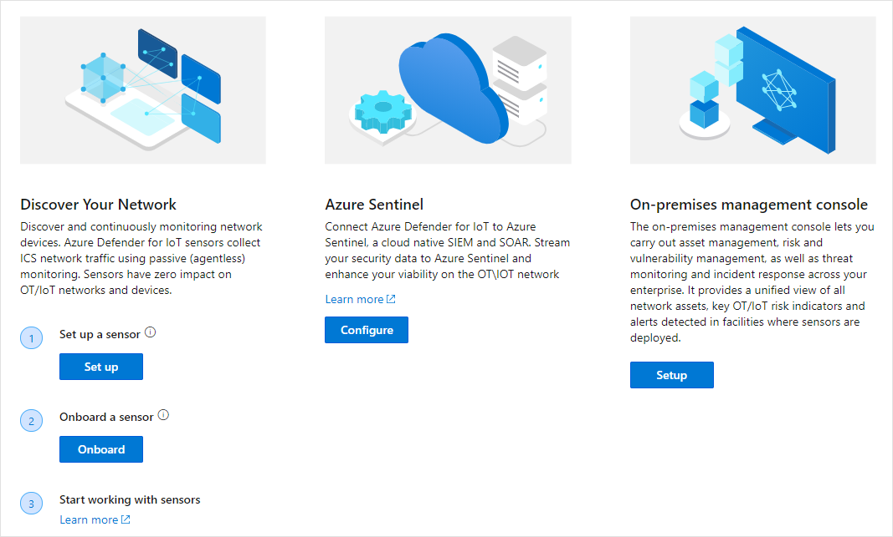

# Quickstart: Prepare your network for Azure Defender for IoT deployment

## Choose your hardware
Azure Defender for IoT supports various certified appliances, including:
- Certified pre-configured appliances, on which software is already installed
- Non-configured certified appliances on which you can download and install sensor software
- On-premises management console appliance specifications. The on-premises management console is not available as a pre-configured appliance. 

For more information, see the [Hardware Specifications Guide](https://aka.ms/AzureDefenderforIoTBareMetalAppliance)

## Install components
After acquiring your hardware components and downloading your software package from the Azure Defender for IoT portal, you can install component software. 
For more information, see the [Installation Guide](https://aka.ms/AzureDefenderforIoTInstallSensorISO).

## Onboard Sensors to the Azure Defender for IoT portal 
 This article provides an overview of deployment, onboarding, and update processes for Azure Defender for IoT sensors and the on-premises management console. This process is carried out by following instructions in the Welcome to Azure Defender for IoT page and subsequent pages.

To open the Welcome page:

1. Log in to your Azure account and search for Azure Defender for IoT.

1. **Sensor deployment** requires that you either:
Purchase preconfigured hardware from Arrow or buy your own device and install sensor software on it.
1. **On-premises management console deployment** requires that you buy your own device and install the on-premises management console software on it. For more information.

## Network setup
After installing your Defender for IoT system components, you can configure your network equipment for optimal network monitoring. 
For more information, see the [Network setup guide](https://aka.ms/AzureDefenderForIoTNetworkSetup).   

## Next steps

In this article, you learned how to prepare to use Defender for IoT. To learn more about getting started, see the following article:

- [Getting started](getting-started.md)