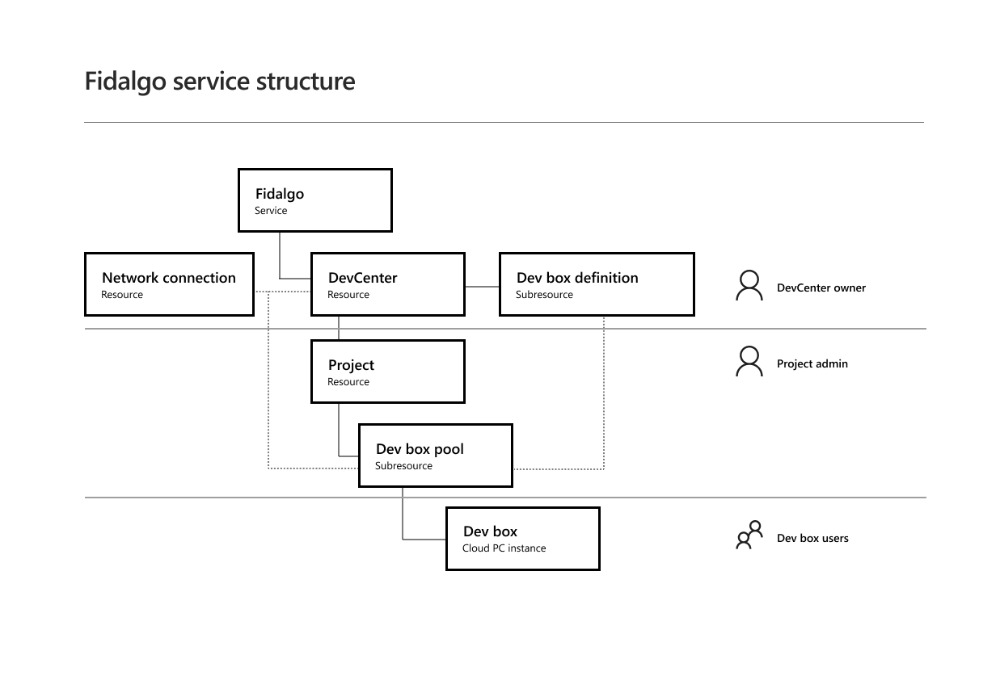

# What is Microsoft Dev Box Preview?

Microsoft Dev Box gives you self-service access to high-performance, preconfigured, and ready-to-code cloud-based workstations. These workstations are called dev boxes. 

Several roles within an organization collaborate to successfully deploy, manage, and operate resources in a Dev Box environment. DevCenter owners work with enterprise IT to configure the initial networking and security settings, define DevCenters for the organization, and create projects within those DevCenters. Project Admins create and manage Dev Box pools for projects, and Dev Box Users create and manage their own dev boxes.

## How does Microsoft Dev Box work?

Dev Box uses a hierarchical structure to assign permissions for management tasks at the appropriate level and provide access to resources where they are required. The key objects in this structure are as follows: 

- *DevCenter* - A DevCenter is a top-level resource that serves as an organizational construct, reflecting the units of organization within an enterprise. 
- *Dev Box Definition* - A Dev Box Definition details the configuration of the source image and VM size. DevCenter Owners can use Dev Box Definitions across Projects in a DevCenter. 
- *Project* - A Project is a resource associated with a DevCenter. Projects serve as an organizational construct, reflecting the workgroups within an organization. 
- *Dev Box Pool* - A Dev Box Pool is a resource associated with a Project. It consists of the configuration and network information for a given group of dev boxes.  
- *Dev Box* - A dev box is an instance of a virtual machine configured for developer use. 

### DevCenters and DevCenter Owners
Dev Box uses DevCenters to align resources with the needs of business or functional units. DevCenter Owners set up the environment to support Dev Box services, by configuring network connections, security and access policies, update policies, and audit policies. In large complex enterprises, DevCenter Owners might work closely with the enterprise IT team to configure appropriate virtual networks. Once the initial configuration is done, a DevCenter Owner can define one or more DevCenters for the enterprise. DevCenter Owners create and manage DevCenters. 

### Projects and Project Admins
The DevCenter Owner creates Projects within the DevCenter and assigns permissions for a Project Admin to manage each Project. The Project Admin is usually a lead or senior developer who has a detailed understanding of the virtual machine requirements for the workloads in their project. The DevCenter Owner gathers requirements from the Project Admins to create Dev Box Definitions that are centrally managed and can be used across Projects. The Project Admins use the definitions to create pools of dev boxes.

### Dev Boxes and Dev Box Users
Dev Box Users, who might be developers, testers, or QA professionals, select a pool in a project they have access to, and create a dev box from that pool.

Microsoft Dev Box enables you to be productive on a project very quickly. Dev Box Users can do the following:

- Create and manage dev boxes.
- Delete dev boxes when they are no longer required. 
- Create dev boxes for multiple projects. 

## Next steps

Start using Microsoft Dev Box:
- [Quickstart: Create a Dev Box Pool](./quickstart-create-dev-box-pool.md)
- [Quickstart: Create a Dev Box](./quickstart-create-dev-box.md)

