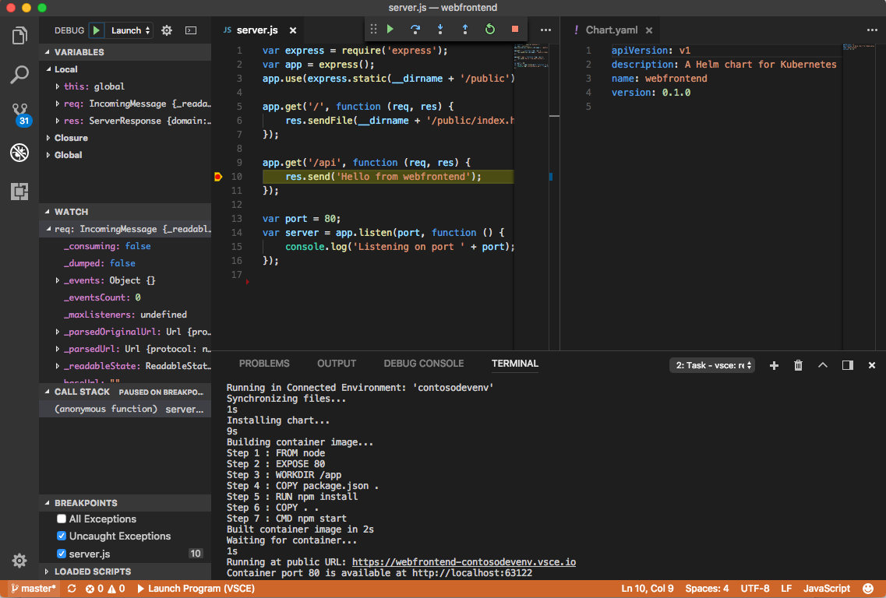

# Azure Dev Spaces
Azure Dev Spaces provides a rapid, iterative Kubernetes development experience for teams. With minimal dev machine setup, you can iteratively run and debug containers directly in Azure Kubernetes Service (AKS). Develop on Windows, Mac, or Linux using familiar tools like Visual Studio, Visual Studio Code, or the command line.

[!INCLUDE ]

## How Azure Dev Spaces simplifies Kubernetes development 

Azure Dev Spaces helps development teams be more productive on Kubernetes in the following ways:
- Minimize local dev machine setup for each team member and work directly in AKS, a managed Kubernetes cluster in Azure.
- Rapidly iterate and debug code directly in Kubernetes using Visual Studio 2017 or Visual Studio Code.
- Generate Docker and Kubernetes configuration-as-code assets for you to use from development through to production. 
- Share a managed Kubernetes cluster with your team and collaboratively work together. Develop your code in isolation, and do end-to-end testing with other components without replicating or mocking up dependencies.

[!INCLUDE ]

## See Also

[Azure Kubernetes Service](/azure/aks)