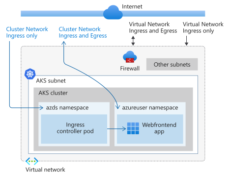

# Configure networking for Azure Dev Spaces in different network topologies

Azure Dev Spaces runs on Azure Kubernetes Service (AKS) clusters with the default networking configuration. If you want to change the networking configuration of your AKS cluster, such as putting the cluster behind a firewall, using network security groups, or using network policies, you have to incorporate additional considerations for running Azure Dev Spaces.

## Virtual network or subnet configurations

Your AKS cluster may have a different virtual network or subnet configuration to restrict ingress or egress traffic for your AKS cluster. For example, your cluster may be behind a firewall, such as Azure Firewall, or you might use Network Security Groups or custom roles for restricting network traffic.

Azure Dev Spaces has certain requirements for *Ingress and Egress* network traffic as well as *Ingress only* traffic. If you are using Azure Dev Spaces on an AKS cluster with a virtual network or subnet configuration that restricts traffic for your AKS cluster, you must follow the following ingress only and ingress and egress traffic requirements in order for Azure Dev Spaces to function properly.

### Ingress and egress network traffic requirements

Azure Dev Spaces needs ingress and egress traffic for following FQDNs:

| FQDN                       | Port       | Use      |
|----------------------------|------------|----------|
| cloudflare.docker.com      | HTTPS: 443 | To pull docker images for Azure Dev Spaces |
| gcr.io                     | HTTPS: 443 | To pull helm images for Azure Dev Spaces |
| storage.googleapis.com     | HTTPS: 443 | To pull helm images for Azure Dev Spaces |
| azds-*.azds.io             | HTTPS: 443 | To communicate with Azure Dev Spaces backend services for the Azure Dev Spaces controller. The exact FQDN can be found in *dataplaneFqdn* in `USERPROFILE\.azds\settings.json` |

Update your firewall or security configuration to allow network traffic to and from the all of the above FQDNs. For example, if you are using a firewall to secure your network,  the above FQDNs should be added to the application rule of the firewall to allow traffic to and from these domains.

### Ingress only network traffic requirements

Azure Dev Spaces provides Kubernetes namespace-level routing as well as public access to services using its own FQDN. For both of those features to work, update your firewall or network configuration to allow public ingress to the external IP address of the Azure Dev Spaces ingress controller on your cluster. Alternatively, you can create an [internal load balancer][aks-internal-lb] and add a NAT rule in your firewall to translate the public IP of your firewall to the IP of your internal load balancer. You can also use [traefik][traefik-ingress] or [NGINX][nginx-ingress] to create a custom ingress controller.

## AKS cluster network requirements

AKS allows you to use [network policies][aks-network-policies] to control ingress and egress traffic between pods on a cluster as well as egress traffic from a pod. Azure Dev Spaces has certain requirements for *Ingress and Egress* network traffic as well as *Ingress only* traffic. If you are using Azure Dev Spaces on an AKS cluster with AKS network policies, you must follow the following ingress only and ingress and egress traffic requirements in order for Azure Dev Spaces to function properly.

### Ingress and egress network traffic requirements

Azure Dev Spaces allows you to communicate directly with a pod in a dev space on your cluster for debugging. For this feature to work, add a network policy that allows ingress and egress communication to the IP addresses of the Azure Dev Spaces infrastructure, which [vary by region][dev-spaces-ip-auth-range-regions].

### Ingress only network traffic requirements

Azure Dev Spaces provides routing between pods across namespaces. For example, namespaces with Azure Dev Spaces enabled can have a parent/child relationship, which allows network traffic to be routed between pods across the parent and child namespaces. For this feature to work, add a network policy that allows traffic between namespaces where network traffic is routed, such as parent/child namespaces. Also, if the ingress controller is deployed to the *azds* namespace, then the ingress controller needs to communicate with pods instrumented by Azure Dev Space in a different namespace. For the ingress controller to function properly, network traffic must be allowed from the *azds* namespace to the namespace where the instrumented pods are running.

## Using Azure CNI

By default, AKS clusters are configured to use [kubenet][aks-kubenet] for networking, which works with Azure Dev Spaces. You can also configure your AKS cluster to use [Azure Container Networking Interface (CNI)][aks-cni]. To use Azure Dev Spaces with Azure CNI on your AKS cluster, allow your virtual network and subnet address spaces up to 10 private IP addresses for pods deployed by Azure Dev Spaces. More details on allowing private IP addresses are available in the [AKS Azure CNI documentation][aks-cni-ip-planning].

## Using API server authorized IP ranges

AKS clusters allow you to configure additional security that limits which IP address can interact with your clusters, for example using custom virtual networks or [securing access to the API server using authorized IP ranges][aks-ip-auth-ranges]. To use Azure Dev Spaces when using this additional security while [creating][aks-ip-auth-range-create] your cluster, you must [allow additional ranges based on your region][dev-spaces-ip-auth-range-regions]. You can also [update][aks-ip-auth-range-update] an existing cluster to allow those additional ranges. You also need to allow the IP address of any development machines that connect to your AKS cluster for debugging to connect to your API server.

## Using AKS private clusters

At this time, Azure Dev Spaces is not supported with [AKS private clusters][aks-private-clusters].

## Client requirements

Azure Dev Spaces uses client-side tooling, such as the Azure Dev Spaces CLI extension, Visual Studio Code extension, and Visual Studio extension, to communicate with your AKS cluster for debugging. To use the Azure Dev Spaces client-side tooling, allow traffic from the development machines to the *azds-\*.azds.io* domain. See *dataplaneFqdn* in `USERPROFILE\.azds\settings.json` for the exact FQDN. If using [API server authorized IP ranges][auth-range-section], you also need to allow the IP address of any development machines that connect to your AKS cluster for debugging to connect to your API server.

## Next steps

Learn how Azure Dev Spaces helps you develop more complex applications across multiple containers, and how you can simplify collaborative development by working with different versions or branches of your code in different spaces.

> [!div class="nextstepaction"]
> [Team development in Azure Dev Spaces][team-quickstart]

[aks-cni]: ../aks/configure-azure-cni.md
[aks-cni-ip-planning]: ../aks/configure-azure-cni.md#plan-ip-addressing-for-your-cluster
[aks-kubenet]: ../aks/configure-kubenet.md
[aks-internal-lb]: ../aks/internal-lb.md
[aks-ip-auth-ranges]: ../aks/api-server-authorized-ip-ranges.md
[aks-ip-auth-range-create]: ../aks/api-server-authorized-ip-ranges.md#create-an-aks-cluster-with-api-server-authorized-ip-ranges-enabled
[aks-ip-auth-range-update]: ../aks/api-server-authorized-ip-ranges.md#update-a-clusters-api-server-authorized-ip-ranges
[aks-network-policies]: ../aks/use-network-policies.md
[aks-private-clusters]: ../aks/private-clusters.md
[auth-range-section]: #using-api-server-authorized-ip-ranges
[dev-spaces-ip-auth-range-regions]: https://github.com/Azure/dev-spaces/tree/master/public-ips
[traefik-ingress]: how-to/ingress-https-traefik.md
[nginx-ingress]: how-to/ingress-https-nginx.md
[team-quickstart]: quickstart-team-development.md