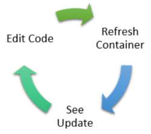
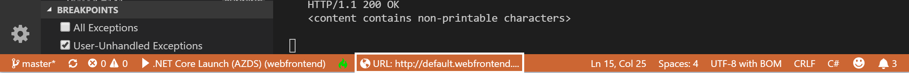
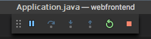

# Get Started on Azure Dev Spaces with Java

In this guide, you will learn how to:

- Create a Kubernetes-based environment in Azure that is optimized for development - a _dev space_.
- Iteratively develop code in containers using VS Code and the command line.
- Productively develop and test your code in a team environment.

> [!Note]
> **If you get stuck** at any time, see the [Troubleshooting](troubleshooting.md) section, or post a comment on this page.

You're now ready to create a Kubernetes-based dev space in Azure.

## Install the Azure CLI
Azure Dev Spaces requires minimal local machine setup. Most of your dev space's configuration gets stored in the cloud, and is shareable with other users. Start by downloading and running the [Azure CLI](/cli/azure/install-azure-cli?view=azure-cli-latest).

> [!IMPORTANT]
> If you already have the Azure CLI installed, make sure you are using version 2.0.43 or higher.

### Sign in to Azure CLI
Sign in to Azure. Type the following command in a terminal window:

```cmd
az login
```

> [!Note]
> If you don't have an Azure subscription, you can create a [free account](https://azure.microsoft.com/free).

#### If you have multiple Azure subscriptions...
You can view your subscriptions by running: 

```cmd
az account list
```
Locate the  subscription which has `isDefault: true` in the JSON output.
If this isn't the subscription you want to use, you can change the default subscription:

```cmd
az account set --subscription <subscription ID>
```

## Create a Kubernetes cluster enabled for Azure Dev Spaces

At the command prompt, create the resource group. Use one of the currently supported regions (EastUS, CentralUS, WestUS2, WestEurope, CanadaCentral, or CanadaEast).

```cmd
az group create --name MyResourceGroup --location <region>
```

Create a Kubernetes cluster with the following command:

```cmd
az aks create -g MyResourceGroup -n MyAKS --location <region> --kubernetes-version 1.11.2 --enable-addons http_application_routing
```

It takes a few minutes to create the cluster.

### Configure your AKS cluster to use Azure Dev Spaces

Enter the following Azure CLI command, using the resource group that contains your AKS cluster, and your AKS cluster name. The command configures your cluster with support for Azure Dev Spaces.

   ```cmd
   az aks use-dev-spaces -g MyResourceGroup -n MyAKS
   ```

## Get Kubernetes debugging for VS Code
Rich features like Kubernetes debugging are available for .NET Core and Node.js developers using VS Code.

1. If you don't have it, install [VS Code](https://code.visualstudio.com/Download).
1. Download and install the [VS Azure Dev Spaces extension](https://marketplace.visualstudio.com/items?itemName=azuredevspaces.azds). Click Install once on the extension's Marketplace page, and again in VS Code. 

In order to debug Java applications with Azure Dev Spaces, download and install the [Java Debugger for Azure Dev Spaces](https://marketplace.visualstudio.com/items?itemName=vscjava.vscode-java-debugger-azds) extension for VS Code. Click Install once on the extension's Marketplace page, and again in VS Code.

## Create a web app running in a container

In this section, you'll create a Java web application and get it running in a container in Kubernetes.

### Create a Java web app
Download code from GitHub by navigating to https://github.com/Azure/dev-spaces and select **Clone or Download** to download the GitHub repository to your local environment. The code for this guide is in `samples/java/getting-started/webfrontend`.

## Preparing code for Docker and Kubernetes development
So far, you have a basic web app that can run locally. You'll now containerize it by creating assets that define the app's container and how it will deploy to Kubernetes. This task is easy to do with Azure Dev Spaces: 

1. Launch VS Code and open the `webfrontend` folder. (You can ignore any default prompts to add debug assets or restore the project.)
1. Open the Integrated Terminal in VS Code (using the **View > Integrated Terminal** menu).
1. Run this command (be sure that **webfrontend** is your current folder):

    ```cmd
    azds prep --public
    ```

The Azure CLI's `azds prep` command generates Docker and Kubernetes assets with default settings:
* `./Dockerfile` describes the app's container image, and how the source code is built and runs within the container.
* A [Helm chart](https://docs.helm.sh) under `./charts/webfrontend` describes how to deploy the container to Kubernetes.

For now, it isn't necessary to understand the full content of these files. It's worth pointing out, however, that **the same Kubernetes and Docker configuration-as-code assets can be used from development through to production, thus providing better consistency across different environments.**
 
A file named `./azds.yaml` is also generated by the `prep` command, and it is the configuration file for Azure Dev Spaces. It complements the Docker and Kubernetes artifacts with additional configuration that enables an iterative development experience in Azure.

## Build and run code in Kubernetes
Let's run our code! In the terminal window, run this command from the **root code folder**, webfrontend:

```cmd
azds up
```

Keep an eye on the command's output, you'll notice several things as it progresses:
- Source code is synced to the dev space in Azure.
- A container image is built in Azure, as specified by the Docker assets in your code folder.
- Kubernetes objects are created that utilize the container image as specified by the Helm chart in your code folder.
- Information about the container's endpoint(s) is displayed. In our case, we're expecting a public HTTP URL.
- Assuming the above stages complete successfully, you should begin to see `stdout` (and `stderr`) output as the container starts up.

> [!Note]
> These steps will take longer the first time the `up` command is run, but subsequent runs should be quicker.

### Test the web app
Scan the console output for information about the public URL that was created by the `up` command. It will be in the form: 

```
(pending registration) Service 'webfrontend' port 'http' will be available at <url>
Service 'webfrontend' port 80 (TCP) is available at http://localhost:<port>
```

Open this URL in a browser window, and you should see the web app load. As the container executes, `stdout` and `stderr` output is streamed to the terminal window.

> [!Note]
> On first run, it can take several minutes for public DNS to be ready. If the public URL does not resolve, you can use the alternative http://localhost:<portnumber> URL that is displayed in the console output. If you use the localhost URL, it may seem like the container is running locally, but actually it is running in AKS. For your convenience, and to facilitate interacting with the service from your local machine, Azure Dev Spaces creates a temporary SSH tunnel to the container running in Azure. You can come back and try the public URL later when the DNS record is ready.
### Update a content file
Azure Dev Spaces isn't just about getting code running in Kubernetes - it's about enabling you to quickly and iteratively see your code changes take effect in a Kubernetes environment in the cloud.

1. In the terminal window, press `Ctrl+C` (to stop `azds up`).
1. Open the code file named `src/main/java/com/ms/sample/webfrontend/Application.java`, and edit the greeting message: `return "Hello from webfrontend in Azure!";`
1. Save the file.
1. Run  `azds up` in the terminal window.

This command rebuilds the container image and redeploys the Helm chart. To see your code changes take effect in the running application, simply refresh the browser.

But there is an even *faster method* for developing code, which you'll explore in the next section. 

## Debug a container in Kubernetes

In this section, you'll use VS Code to directly debug our container running in Azure. You'll also learn how to get a faster edit-run-test loop.



> [!Note]
> **If you get stuck** at any time, see the [Troubleshooting](troubleshooting.md) section, or post a comment on this page.

### Initialize debug assets with the VS Code extension
You first need to configure your code project so VS Code will communicate with our dev space in Azure. The VS Code extension for Azure Dev Spaces provides a helper command to set up debug configuration. 

Open the **Command Palette** (using the **View | Command Palette** menu), and use auto-complete to type and select this command: `Azure Dev Spaces: Prepare configuration files for Azure Dev Spaces`. 

This adds debug configuration for Azure Dev Spaces under the `.vscode` folder. This command is not to be confused with the `azds prep` command, which configures the project for deployment.


### Select the AZDS debug configuration
1. To open the Debug view, click on the Debug icon in the **Activity Bar** on the side of VS Code.
1. Select **Launch Java Program (AZDS)** as the active debug configuration.


> [!Note]
> If you don't see any Azure Dev Spaces commands in the Command Palette, ensure you have installed the VS Code extension for Azure Dev Spaces. Be sure the workspace you opened in VS Code is the folder that contains azds.yaml.

### Debug the container in Kubernetes
Hit **F5** to debug your code in Kubernetes.

As with the `up` command, code is synced to the dev space, and a container is built and deployed to Kubernetes. This time, of course, the debugger is attached to the remote container.

> [!Tip]
> The VS Code status bar will display a clickable URL.



Set a breakpoint in a server-side code file, for example within the `greeting()` function in the `src/main/java/com/ms/sample/webfrontend/Application.java` source file. Refreshing the browser page causes the breakpoint to hit.

You have full access to debug information just like you would if the code was executing locally, such as the call stack, local variables, exception information, etc.

### Edit code and refresh
With the debugger active, make a code edit. For example, modify the greeting in `src/main/java/com/ms/sample/webfrontend/Application.java`. 

```java
public String greeting()
{
    return "I'm debugging Java code in Azure!";
}
```

Save the file, and in the **Debug actions pane**, click the **Refresh** button.



Instead of rebuilding and redeploying a new container image each time code edits are made, which will often take considerable time, Azure Dev Spaces will incrementally recompile code within the existing container to provide a faster edit/debug loop.

Refresh the web app in the browser. You should see your custom message appear in the UI.

**Now you have a method for rapidly iterating on code and debugging directly in Kubernetes!** Next, you'll see how you can create and call a second container.

## Next steps

> [!div class="nextstepaction"]
> [Learn about team development](team-development-java.md)