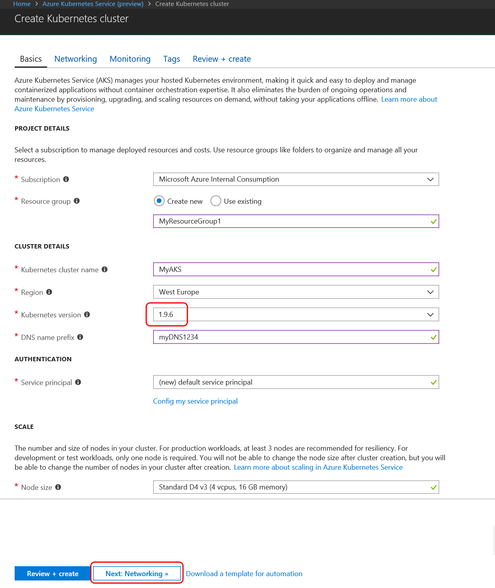
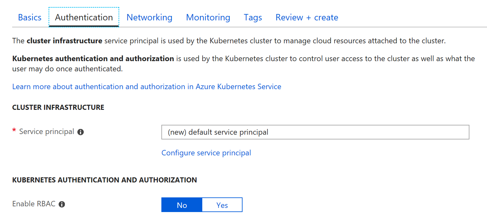
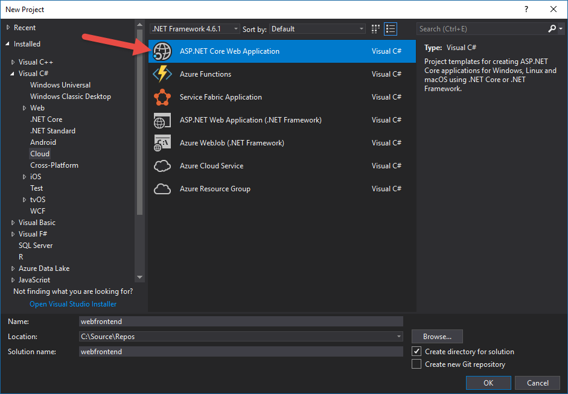
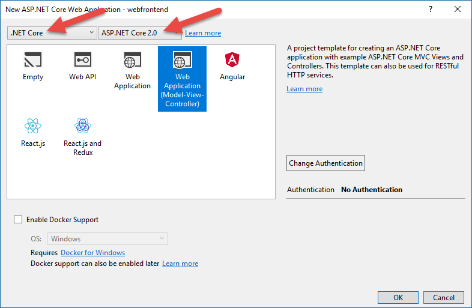
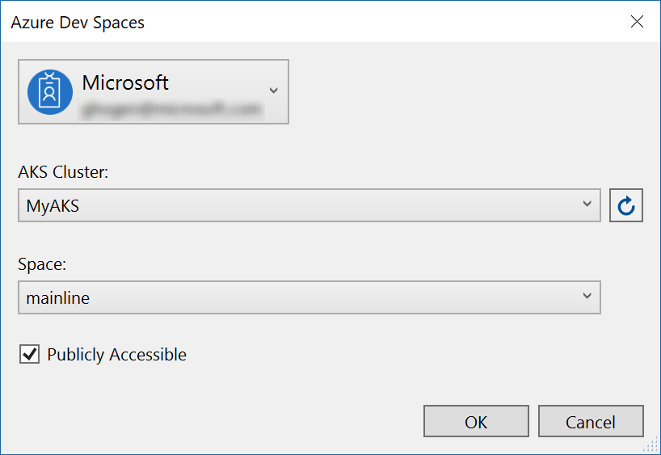
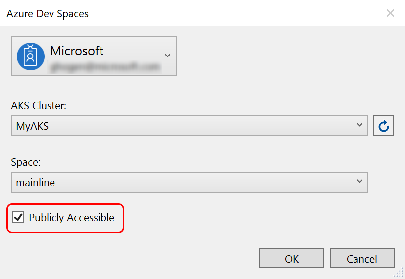
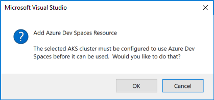
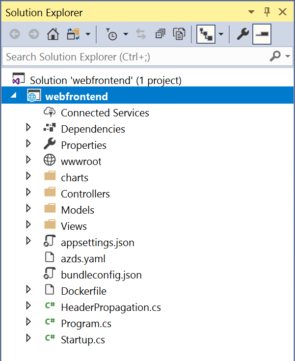

# Get started on Azure Dev Spaces with .NET Core and Visual Studio

In this guide, you will learn how to:

- Set up Azure Dev Spaces with a managed Kubernetes cluster in Azure.
- Iteratively develop code in containers using Visual Studio.
- Independently develop two separate services, and used Kubernetes' DNS service discovery to make a call to another service.
- Productively develop and test your code in a team environment.

> [!Note]
> **If you get stuck** at any time, see the [Troubleshooting](troubleshooting.md) section.


## Create a Kubernetes cluster enabled for Azure Dev Spaces

1. Sign in to the Azure portal at https://portal.azure.com.
1. Choose **Create a resource** > search for **Kubernetes** > select **Kubernetes Service** > **Create**.

   Complete the following steps under each heading of the *Create Kubernetes cluster* form and verify your selected [region supports Azure Dev Spaces][supported-regions].

   - **PROJECT DETAILS**: select an Azure subscription and a new or existing Azure resource group.
   - **CLUSTER DETAILS**: enter a name, region, version, and DNS name prefix for the AKS cluster.
   - **SCALE**: select a VM size for the AKS agent nodes and the number of nodes. If you’re getting started with Azure Dev Spaces, one node is enough to explore all the features. The node count can be easily adjusted any time after the cluster is deployed. Note that the VM size can’t be changed once an AKS cluster has been created. However, once an AKS cluster has been deployed, you can easily create a new AKS cluster with larger VMs and use Dev Spaces to redeploy to that larger cluster if you need to scale up.

   


   Select **Next: Authentication** when complete.

1. Choose your desired setting for Role-based Access Control (RBAC). Azure Dev Spaces supports clusters with RBAC enabled, or disabled.

    

1. Select **Review + create** and then **Create** when complete.

## Get the Visual Studio tools
Install the latest version of [Visual Studio](https://www.visualstudio.com/vs/). For Visual Studio 2019 on Windows you need to install the Azure Development workload. For Visual Studio 2017 on Windows you need to install the ASP.NET and web development workload as well as [Visual Studio Tools for Kubernetes](https://aka.ms/get-azds-visualstudio).

## Create a web app running in a container

In this section, you'll create an ASP.NET Core web app and get it running in a container in Kubernetes.

### Create an ASP.NET web app

From within Visual Studio, create a new project. Currently, the project must be an **ASP.NET Core Web Application**. Name the project '**webfrontend**'.



Select the **Web Application (Model-View-Controller)** template and be sure you're targeting **.NET Core** and **ASP.NET Core 2.0** in the two dropdowns at the top of the dialog. Click **OK** to create the project.



### Enable Dev Spaces for an AKS cluster

With the project you just created, select **Azure Dev Spaces** from the launch settings dropdown, as shown below.


In the dialog that is displayed next, make sure you are signed in with the appropriate account, and then either select an existing Kubernetes cluster.



Leave the **Space** dropdown defaulted to `default` for now. Later, you'll learn more about this option. Check the **Publicly Accessible** checkbox so the web app will be accessible via a public endpoint. This setting isn't required, but it will be helpful to demonstrate some concepts later in this walkthrough. But don’t worry, in either case you will be able to debug your website using Visual Studio.



Click **OK** to select or create the cluster.

If you choose a cluster that hasn't been enabled to work with Azure Dev Spaces, you'll see a message asking if you want to configure it.



Choose **OK**.

> [!IMPORTANT]
> The Azure Dev Spaces configuration process will remove the `azds` namespace in the cluster, if it exists.

 A background task will be started to accomplish this. It will take a number of minutes to complete. To see if it's still being created, hover your pointer over the **Background tasks** icon in the bottom left corner of the status bar, as shown in the following image.


> [!Note]
> Until the dev space is successfully created you cannot debug your application.

### Look at the files added to project
While you wait for the dev space to be created, look at the files that have been added to your project when you chose to use a dev space.

First, you can see a folder named `charts` has been added and within this folder a [Helm chart](https://docs.helm.sh) for your application has been scaffolded. These files are used to deploy your application into the dev space.

You will see a file named `Dockerfile` has been added. This file has information needed to package your application in the standard Docker format.

Lastly, you will see a file named `azds.yaml`, which contains development-time configuration that is needed by the dev space.



## Debug a container in Kubernetes
Once the dev space is successfully created, you can debug the application. Set a breakpoint in the code, for example on line 20 in the file `HomeController.cs` where the `Message` variable is set. Click **F5** to start debugging. 

Visual Studio will communicate with the dev space to build and deploy the application and then open a browser with the web app running. It might seem like the container is running locally, but actually it's running in the dev space in Azure. The reason for the localhost address is because Azure Dev Spaces creates a temporary SSH tunnel to the container running in AKS.

Click on the **About** link at the top of the page to trigger the breakpoint. You have full access to debug information just like you would if the code was executing locally, such as the call stack, local variables, exception information, and so on.

## Iteratively develop code

Azure Dev Spaces isn't just about getting code running in Kubernetes - it's about enabling you to quickly and iteratively see your code changes take effect in a Kubernetes environment in the cloud.

### Update a content file


1. Locate the file `./Views/Home/Index.cshtml` and make an edit to the HTML. For example, change [line 73 that reads `<h2>Application uses</h2>`](https://github.com/Azure/dev-spaces/blob/master/samples/dotnetcore/getting-started/webfrontend/Views/Home/Index.cshtml#L73) to something like: 
  
    ```html
    <h2>Hello k8s in Azure!</h2>`
    ```

2. Save the file.
3. Go to your browser and refresh the page. You should see the web page display the updated HTML.

What happened? Edits to content files, like HTML and CSS, don't require recompilation in a .NET Core web app, so an active F5 session automatically syncs any modified content files into the running container in AKS, so you can see your content edits right away.

### Update a code file
Updating code files requires a little more work, because a .NET Core app needs to rebuild and produce updated application binaries.

1. Stop the debugger in Visual Studio.
1. Open the code file named `Controllers/HomeController.cs`, and edit the message that the About page will display: `ViewData["Message"] = "Your application description page.";`
1. Save the file.
1. Press **F5** to start debugging again. 

Instead of rebuilding and redeploying a new container image each time code edits are made, which will often take considerable time, Azure Dev Spaces will incrementally recompile code within the existing container to provide a faster edit/debug loop.

Refresh the web app in the browser, and go to the About page. You should see your custom message appear in the UI.

## Next steps

> [!div class="nextstepaction"]
> [Learn about multi-service development](multi-service-netcore-visualstudio.md)


[supported-regions]: about.md#supported-regions-and-configurations