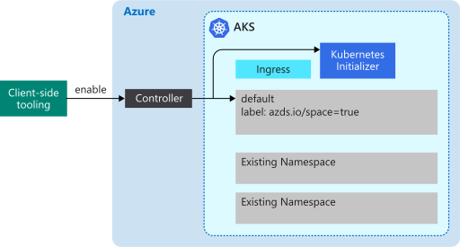
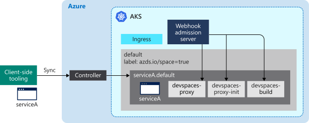

# How setting up a cluster for Azure Dev Spaces works

Azure Dev Spaces provides you with multiple ways to rapidly iterate and debug Kubernetes applications and collaborate with your team on an Azure Kubernetes Service (AKS) cluster. One way is to enable Azure Dev Spaces on your AKS cluster so you can [run services directly on your cluster][how-it-works-up] and use [additional networking and routing capabilities][how-it-works-routing]. This article describes what happens when you prepare your cluster and enable Azure Dev Spaces.

## Prepare your AKS cluster

To prepare your AKS cluster for Dev Spaces, verify your AKS cluster is in a region [supported by Azure Dev Spaces][supported-regions] and you are running Kubernetes 1.10.3 or later. You can enable Azure Dev Spaces from the Azure CLI by running `az aks use-dev-spaces`.

For an example of setting up an AKS cluster for Dev Spaces, see the [team development quickstart][quickstart-team].

When Azure Dev Spaces is enabled on your AKS cluster, it installs the controller for your cluster. The controller resides outside your AKS cluster. It drives the behavior and communication between the client-side tooling and the AKS cluster. Once it is enabled, you can interact with the controller using the client-side tooling.

The controller performs the following actions:

* Manages dev space creation and selection.
* Installs your application's Helm chart and creates Kubernetes objects.
* Builds your application's container image.
* Deploys your application to AKS.
* Does incremental builds and restarts when your source code changes.
* Manages logs and HTTP traces.
* Forwards stdout and stderr to the client-side tooling.
* Configures routing for applications within a space as well as across parent and child spaces.

The controller is a separate Azure resource outside of your cluster and does the following to resources in your cluster:

* Creates or designates a Kubernetes namespace to use as a dev space.
* Removes any Kubernetes namespace named *azds*, if it exists, and creates a new one.
* Deploys a Kubernetes webhook configuration.
* Deploys a webhook admission server.

It uses the same service principal that your AKS cluster uses to make service calls to other Azure Dev Spaces components.

In order to use Azure Dev Spaces, there must be at least one dev space. Azure Dev Spaces uses Kubernetes namespaces within your AKS cluster for dev spaces. When a controller is being installed, it prompts you to create a new Kubernetes namespace or choose an existing namespace to use as your first dev space. By default, the controller offers to upgrade the existing *default* Kubernetes namespace to your first dev space.

When a namespace is designated as a dev space, the controller adds the *azds.io/space=true* label to that namespace to identify it as a dev space. The initial dev space you create or designate is selected by default after you prepare your cluster. When a space is selected, it is used by Azure Dev Spaces for creating new workloads.

You can use the client-side tooling to create new dev spaces and remove existing dev spaces. Due to a limitation in Kubernetes, the *default* dev space cannot be removed. The controller also removes any existing Kubernetes namespaces named *azds* to avoid conflicts with the `azds` command used by the client-side tooling.

The Kubernetes webhook admission server is used to inject pods with three containers during deployment for instrumentation: a devspaces-proxy container, a devspaces-proxy-init container, and a devspaces-build container. **All three of these containers run with root access on your AKS cluster.** They also use the same service principal that your AKS cluster uses to make service calls to other Azure Dev Spaces components.

The devspaces-proxy container is a sidecar container that handles all TCP traffic into and out of the application container and helps perform routing. The devspaces-proxy container reroutes HTTP messages if certain spaces are being used. For example, it can help route HTTP messages between applications in parent and child spaces. All non-HTTP traffic passes through devspaces-proxy unmodified. The devspaces-proxy container also logs all inbound and outbound HTTP messages and sends them to the client-side tooling as traces. These traces can then be viewed by the developer to inspect the behavior of the application.

The devspaces-proxy-init container is an [init container](https://kubernetes.io/docs/concepts/workloads/pods/init-containers/) that adds additional routing rules based on the space hierarchy to your application's container. It adds routing rules by updating the application container's */etc/resolv.conf* file and iptables configuration before it starts. The updates to */etc/resolv.conf* allow for DNS resolution of services in parent spaces. The iptables configuration updates ensure all TCP traffic into and out of the application's container are routed though devspaces-proxy. All updates from devspaces-proxy-init happen in addition to the rules that Kubernetes adds.

The devspaces-build container is an init container and has the project source code and Docker socket mounted. The project source code and access to Docker allows the application container to be built directly by the pod.

> [!NOTE]
> Azure Dev Spaces uses the same node to build your application's container and run it. As a result, Azure Dev Spaces does not need an external container registry for building and running your application.

The Kubernetes webhook admission server listens for any new pod that's created in the AKS cluster. If that pod is deployed to any namespace with the *azds.io/space=true* label, it injects that pod with the additional containers. The devspaces-build container is only injected if the application's container is run using the client-side tooling.

Once you have prepared your AKS cluster, you can use the client-side tooling to prepare and run your code in your dev space.

## Client side tooling

The client-side tooling allows the user to:
* Generate a Dockerfile, Helm chart, and Azure Dev Spaces configuration file for the application.
* Create parent and child dev spaces.
* Tell the controller to build and start your application.

While your application is running, the client-side tooling also:
* Receives and displays stdout and stderr from your application running in AKS.
* Uses [port-forward](https://kubernetes.io/docs/tasks/access-application-cluster/port-forward-access-application-cluster/) to allow web access to your application using http:\//localhost.
* Attaches a debugger to your running application in AKS.
* Syncs source code to your dev space when a change is detected for incremental builds, allowing for rapid iteration.
* Allows you to connect your developer machine directly to your AKS cluster.

You can use the client-side tooling from the command line as part of the `azds` command. You can also use the client-side tooling with:

* Visual Studio Code using the [Azure Dev Spaces extension](https://marketplace.visualstudio.com/items?itemName=azuredevspaces.azds).
* Visual Studio with the Azure Development workload.

## Next steps

To learn more about using the client-side tooling to prepare and run your code in your dev space, see [How preparing a project for Azure Dev Spaces works][how-it-works-prep].

To get started using Azure Dev Spaces for team development, see the [team development in Azure Dev Spaces][quickstart-team] quickstart.

[how-it-works-prep]: how-dev-spaces-works-prep.md
[how-it-works-routing]: how-dev-spaces-works-routing.md
[how-it-works-up]: how-dev-spaces-works-up.md
[supported-regions]: https://azure.microsoft.com/global-infrastructure/services/?products=kubernetes-service
[quickstart-team]: quickstart-team-development.md