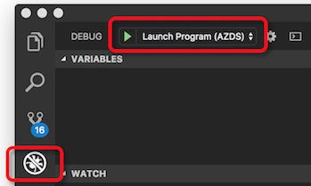

# How remote debugging your code with Azure Dev Spaces works

Azure Dev Spaces provides you with multiple ways to rapidly iterate and debug Kubernetes applications and collaborate with your team on an Azure Kubernetes Service (AKS) cluster. Once your project is running in a dev space, Azure Dev Spaces provides a way to attach to and debug a running application in AKS.

This article describes how remote debugging with Dev Spaces works.

## Debug your code

For Java, .NET Core, and Node.js applications, you can debug your application running directly in your dev space using Visual Studio Code or Visual Studio. Visual Studio Code and Visual Studio provide tooling to connect to your dev space, launch your application, and attach a debugger. After running `azds prep`, you can open your project in Visual Studio Code or Visual Studio. Visual Studio Code or Visual Studio will generate their own configuration files for connecting which is separate from running `azds prep`. From within Visual Studio Code or Visual Studio, you can set breakpoints and launch your application to your dev space.

When you launch your application using Visual Studio Code or Visual Studio for debugging, they handle launching and connecting to your dev space in the same way as running `azds up`. Also, the client-side tooling in Visual Studio Code and Visual Studio each provide an additional parameter with specific information for debugging. The parameter contains the name of debugger image, the location of the debugger within in the debugger's image, and the destination location within the application's container to mount the debugger folder.

The debugger image is automatically determined by the client-side tooling. It uses a method similar to the one used during Dockerfile and Helm chart generate when running `azds prep`. After the debugger is mounted in the application's image, it is run using `azds exec`.

## Next steps

To get started using Azure Dev Spaces to for remote debugging your project, see the following quickstarts:

* [Rapidly iterate and debug with Visual Studio Code and Java][quickstart-java]
* [Rapidly iterate and debug with Visual Studio Code and .NET][quickstart-netcore]
* [Rapidly iterate and debug with Visual Studio Code and Node.js][quickstart-node]
* [Rapidly iterate and debug with Visual Studio and .NET Core][quickstart-vs]

[quickstart-java]: quickstart-java.md
[quickstart-netcore]: quickstart-netcore.md
[quickstart-node]: quickstart-nodejs.md
[quickstart-vs]: quickstart-netcore-visualstudio.md
