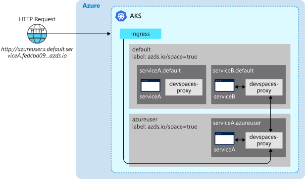

# How routing works with Azure Dev Spaces

Azure Dev Spaces provides you with multiple ways to rapidly iterate and debug Kubernetes applications and collaborate with your team on an Azure Kubernetes Service (AKS) cluster. Once your project is running in a dev space, Azure Dev Spaces provides additional networking and routing capabilities for your project.

This article describes how routing works with Dev Spaces.

## How routing works

A dev space is built on top of AKS and uses the same [networking concepts](../aks/concepts-network.md). Azure Dev Spaces also has a centralized *ingressmanager* service and deploys its own Ingress Controller to the AKS cluster. The *ingressmanager* service monitors AKS clusters with dev spaces and augments the Azure Dev Spaces Ingress Controller in the cluster with Ingress objects for routing to application pods. The devspaces-proxy container in each pod adds an `azds-route-as` HTTP header for HTTP traffic to a dev space based on the URL. For example, a request to the URL *http://azureuser.s.default.serviceA.fedcba09...azds.io* would get an HTTP header with `azds-route-as: azureuser`. The devspaces-proxy container will not add an `azds-route-as` header if one is already present.

When an HTTP request is made to a service from outside the cluster, the request goes to the Ingress controller. The Ingress controller routes the request directly to the appropriate pod based on its Ingress objects and rules. The devspaces-proxy container in the pod receives the request, adds the `azds-route-as` header based on the URL, and then routes the request to the application container.

When an HTTP request is made to a service from another service within the cluster, the request first goes through the calling service's devspaces-proxy container. The devspaces-proxy container looks at the HTTP request and checks the `azds-route-as` header. Based on the header, the devspaces-proxy container will look up the IP address of the service associated with the header value. If an IP address is found, the devspaces-proxy container reroutes the request to that IP address. If an IP address is not found, the devspaces-proxy container routes the request to the parent application container.

For example, the applications *serviceA* and *serviceB* are deployed to a parent dev space called *default*. *serviceA* relies on *serviceB* and makes HTTP calls to it. Azure User creates a child dev space based on the *default* space called *azureuser*. Azure User also deploys their own version of *serviceA* to their child space. When a request is made to *http://azureuser.s.default.serviceA.fedcba09...azds.io*:

1. The Ingress controller looks up the IP for the pod associated with the URL, which is *serviceA.azureuser*.
1. The Ingress controller finds the IP for the pod in Azure User's dev space and routes the request to the *serviceA.azureuser* pod.
1. The devspaces-proxy container in the *serviceA.azureuser* pod receives the request and adds `azds-route-as: azureuser` as an HTTP header.
1. The devspaces-proxy container in the *serviceA.azureuser* pod routes the request to the *serviceA* application container in the *serviceA.azureuser* pod.
1. The *serviceA* application in the *serviceA.azureuser* pod makes a call to *serviceB*. The *serviceA* application also contains code to preserve the existing `azds-route-as` header, which in this case is `azds-route-as: azureuser`.
1. The devspaces-proxy container in the *serviceA.azureuser* pod receives the request and looks up the IP of *serviceB* based on the value of the `azds-route-as` header.
1. The devspaces-proxy container in the *serviceA.azureuser* pod does not find an IP for *serviceB.azureuser*.
1. The devspaces-proxy container in the *serviceA.azureuser* pod looks up the IP for *serviceB* in the parent space, which is *serviceB.default*.
1. The devspaces-proxy container in the *serviceA.azureuser* pod finds the IP for *serviceB.default* and routes the request to the *serviceB.default* pod.
1. The devspaces-proxy container in the *serviceB.default* pod receives the request and routes the request to the *serviceB* application container in the *serviceB.default* pod.
1. The *serviceB* application in the *serviceB.default* pod returns a response to the *serviceA.azureuser* pod.
1. The devspaces-proxy container in the *serviceA.azureuser* pod receives the response and routes the response to the *serviceA* application container in the *serviceA.azureuser* pod.
1. The *serviceA* application receives the response and then returns its own response.
1. The devspaces-proxy container in the *serviceA.azureuser* pod receives the response from the *serviceA* application container and routes the response to the original caller outside of the cluster.

All other TCP traffic that is not HTTP passes through the Ingress controller and devspaces-proxy containers unmodified.

## Sharing a dev space

When working with a team, you can [share a dev space across an entire team](how-to/share-dev-spaces.md) and create derived dev spaces. A dev space can be used by anyone with contributor access to the dev space's resource group.

You can also create a new dev space that is derived from another dev space. When you create a derived dev space, the *azds.io/parent-space=PARENT-SPACE-NAME* label is added to the derived dev space's namespace. Also, all applications from the parent dev space are shared with the derived dev space. If you deploy an updated version of an application to the derived dev space, it will only exist in the derived dev space and the parent dev space will remain unaffected. You can have a maximum of three levels of derived dev spaces or *grandparent* spaces.

The derived dev space will also intelligently route requests between its own applications and the applications shared from its parent. The routing works by attempting to route request to an application in the derived dev space and falling back to the shared application from the parent dev space. The routing will fall back to the shared application in the grandparent space if the application is not in the parent space.

For example:
* The dev space *default* has applications *serviceA* and *serviceB*.
* The dev space *azureuser* is derived from *default*.
* An updated version of *serviceA* is deployed to *azureuser*.

When using *azureuser*, all requests to *serviceA* will be routed to the updated version in *azureuser*. A request to *serviceB* will first try to be routed to the *azureuser* version of *serviceB*. Since it does not exist, it will be routed to the *default* version of *serviceB*. If the *azureuser* version of *serviceA* is removed, all requests to *serviceA* will fall back to using the *default* version of *serviceA*.

## Next steps

To see some examples of how Azure Dev Spaces uses routing to provide rapid iteration and development, see [How Local Process with Kubernetes works][how-it-works-local-process-kubernetes], [How remote debugging your code with Azure Dev Spaces works][how-it-works-remote-debugging], and [GitHub Actions & Azure Kubernetes Service][pr-flow].

To get started using routing with Azure Dev Spaces for team development, see the [team development in Azure Dev Spaces][quickstart-team] quickstart.

[helm-upgrade]: https://helm.sh/docs/intro/using_helm/#helm-upgrade-and-helm-rollback-upgrading-a-release-and-recovering-on-failure
[how-it-works-local-process-kubernetes]: how-dev-spaces-works-local-process-kubernetes.md
[how-it-works-remote-debugging]: how-dev-spaces-works-remote-debugging.md
[pr-flow]: how-to/github-actions.md
[quickstart-team]: quickstart-team-development.md
[troubleshooting]: troubleshooting.md